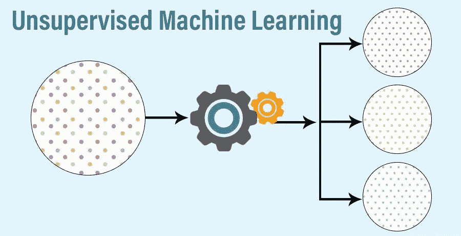
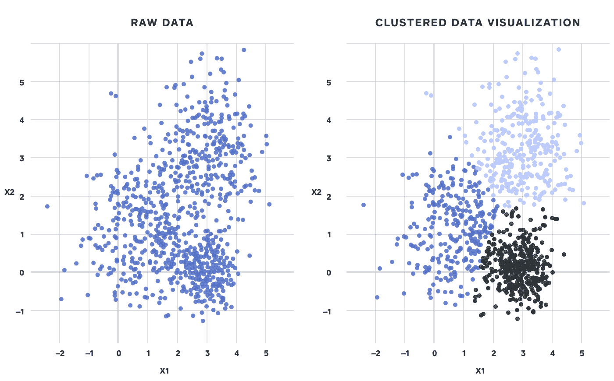
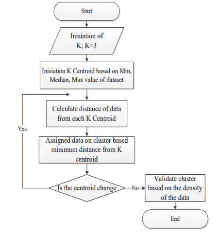
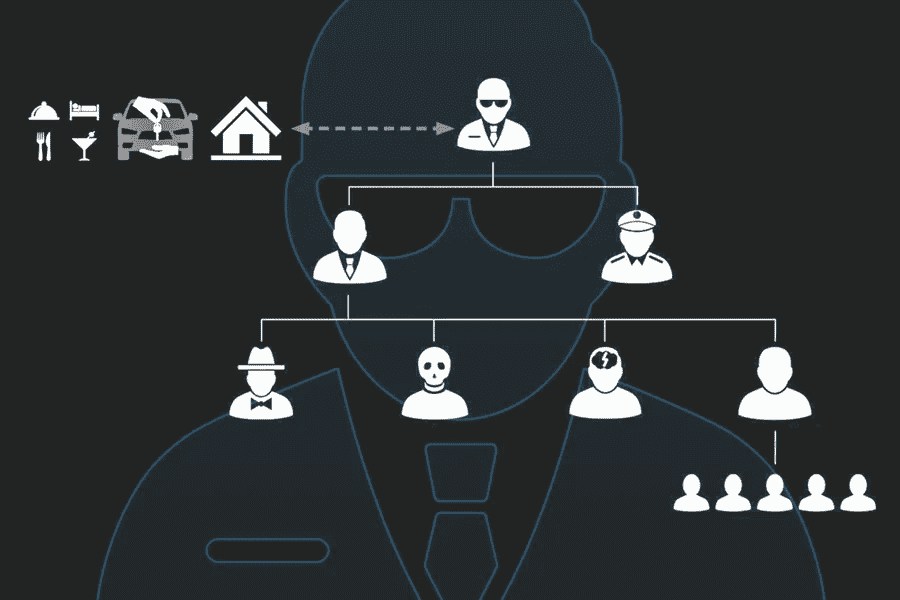
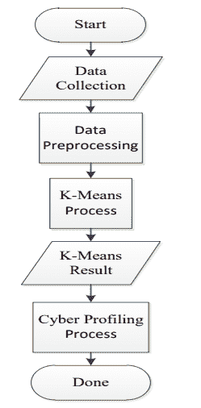
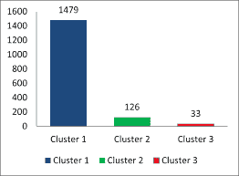

# K-均值聚类在安全领域的应用

> 原文：<https://medium.com/mlearning-ai/applications-of-k-means-clustering-in-security-domain-b3f416cf270?source=collection_archive---------2----------------------->

Created by Raktim

## 在许多不同的无监督机器学习中，最广为人知的是 K 均值聚类。但是问题出现了——K-Means 是如何在真实世界场景中实现的？请继续关注我的博客，了解更多关于 K-Means 聚类的知识&它在安全领域的应用。

# 什么是无监督机器学习？

无监督学习是一种处理未标记、未分类数据的机器学习技术。这种机器学习算法可以帮助我们在没有事先训练知识的情况下，对符合相似性、模式和差异的未排序信息进行分组。

Source : Google

在工业中，我们有很多没有任何历史数据的情况，但我们仍然需要对这些实时数据应用机器学习。例如，服务器日志是实时的&如果我们想从这些日志中发现任何不寻常的活动，那么我们需要在没有任何过去经验的情况下处理它。这里我们需要应用不同种类的无监督机器学习算法。

## 一些属于无监督机器学习的算法有:

*   *K-均值聚类*
*   *KNN (k 近邻)*
*   *层次聚类*
*   *异常检测*
*   *神经网络*
*   *主成分分析*
*   *独立成分分析*
*   *Apriori 算法*
*   *奇异值分解*

# 什么是集群？

聚类是一种探索性的数据分析技术，有助于理解未标记的数据。**聚类的基本原理是识别数据中的子组，使得同一子组(聚类)中的数据点非常相似，而不同聚类中的数据点非常不同。**

Source : Google

## 聚类的类型:

*   *层次聚类*
*   *划分聚类*

**层次聚类进一步细分为:**

*   ***凝聚聚类:*** 这是一种自下而上的方法，我们从每个元素作为一个单独的聚类开始，然后将它们合并成一个个更大的聚类。
*   ***分裂聚类:*** 这是一种自顶向下的方法，我们从整个集合开始，然后将它分成一个个更小的簇。

**划分聚类进一步细分为:**

*   ***K-Means 聚类:*** 在这种方法中，物体被分成由数字“K”提到的几个簇。我们可以为“K”提任何值&机器学习会在我们的数据中发现许多聚类。
*   ***模糊 C-Means 聚类:*** 它非常类似于 k-means，它将具有相似特征的对象聚类在一起。在 k-means 聚类中，一个对象不能属于两个不同的聚类。但是在 c-means 中，对象可以属于多个簇。

# 什么是 K-Means 聚类？

K-Means 聚类是一种无监督学习算法，它将未标记的数据集分组到不同的簇中。**这里 K 定义了流程中需要创建的预定义聚类的个数，就好像 K=2，会有两个聚类，对于 K=3，会有三个聚类，以此类推。**

Source : Google

## k-means 聚类算法主要执行两项任务:

*   通过迭代过程确定 K 个中心点或质心的最佳值。
*   将每个数据点分配到其最近的 k 中心。靠近特定 k 中心的那些数据点创建一个聚类。

## K 均值聚类遵循的过程如下所述:

*   首先，选择“K”的值，这意味着固定簇的数量。
*   第二步，随机选择 k 个点或质心组成聚类。在这一步中，我们可以选择任何数据点&不一定要选择属于数据集的数据点。
*   第三，现在我们需要将所有数据点分配到它们最近的聚类中。为此，我们可以使用基于欧几里得距离或基于相关性的距离方法。
*   第四，直到新的数据不断到来，我们继续重复第三步&将它们分配到最近的集群。
*   最后，通过取属于每个聚类的所有数据点的平均值来计算聚类的质心&我们的模型就创建好了。

Source : Google

## K 均值聚类的一个例子是:

比方说，我们有一个在线杂货配送服务，它也有超市网点的设施。现在，基于顾客的兴趣&大多数顾客订购的位置，他们将试图以这样一种方式建立商店，以便他们能够覆盖大部分地区。为此，他们将使用“K 均值聚类”。

1.  他们首先需要决定在那个地方可以开多少家店。
2.  接下来，他们将进行市场分析&试图了解哪些地区需求量大，或者客户从哪些确切的地点订购。对他们来说，每个客户的位置都是高需求区域的数据点。
3.  最后，他们将使用“K-Means 算法”&试图找到质心，根据他们想要设置的商店数量创建聚类。

# K-均值聚类在安全领域的应用；

Source : Google

如今，对于一个公司来说，最关键的东西是“数据”。因为对他们来说，数据就是生意。这就是为什么许多黑客总是试图窃取这些数据。对于公司来说，他们总是需要保护这些数据，并且需要安全地存储它们。

这就是许多不同算法的威力，这些算法被用来防止黑客攻击。让我们讨论一些公司使用“K-Means”聚类来检测可能的网络攻击的使用案例。

## 网络特征分析:

Source : Google

*   **剖析意味着试图对某个特定的个人或群体进行分类，即我们所知的&未知的。**网络特征分析的想法来自犯罪特征分析，犯罪特征分析提供了调查部门对犯罪现场的犯罪类型进行分类的信息。
*   在这个数十亿互联网用户拥有不同兴趣的时代，很难找到网络罪犯和普通用户之间的区别。**但是一些聪明的头脑试图分析人类行为&找出所有的模式。**接下来，他们试图持续分析可疑用户的互联网活动&使用许多不同的算法对这些活动进行分类。其中一种方法是“K-Means 聚类”。
*   **鉴于个人行为中的特权，归纳概括可能非常可靠，但也可能导致对行为分析的误解。因此，网络剖析过程是通过演绎和归纳方法的结合。**对于调查而言，网络特征分析过程提供了一个很好的、有助于计算机科学取证的领域。

## 下图显示了 K-Means 聚类在网络特征分析中的工作原理:

Source : Google

假设在对可疑用户的互联网流量应用 K-Means 算法后，我们发现下图:

Source : Google

*   聚类 1 意味着这些用户具有正常的网络活动。但是第二组有一点可疑的网络活动。而属于集群 3 的那些用户具有非常可疑的网络活动。

从这种分析中，我们可以得出结论，也可以预测哪些用户最有可能是网络罪犯。

## 犯罪模式分析:

K-Means 聚类的另一个用例可以是安全设备或安全程序。热门公司的服务器上每天都有数百万的客户流量。从这些流量中，很难跟踪是否有任何类型的攻击发生。大多数网络攻击的目标要么是给服务器造成压力，要么是从数据库中窃取数据。

使用 K-Means 聚类方法，这些公司一直在分析他们服务器上的数百万网络流量。现在，他们的目标是根据行为将网络流量分类到多个集群中&那些属于可能是网络攻击的集群的流量可以被阻止。有很多安全设备和软件在后端使用无监督学习技术来检测可能的网络攻击。

## 犯罪模式分析的另一个例子如下图所示:

Source : Google

# 最后的话:

*   这是安全领域中 K-Means 聚类的两个广为人知的使用案例。但是除了安全领域之外，还有很多使用 K-Means 和类似算法的例子。技术每天都在发展，但它们背后的核心概念或逻辑是相同的&这些算法是许多公司成功的关键。
*   我试图讨论一些关于聚类、无监督 ML、K-Means &一些现实世界的实现。如果你觉得这个博客信息丰富——点击那个按钮让我知道你喜欢它。
*   我一直在写关于机器学习、DevOps 自动化、云计算、大数据等方面的博客。所以，如果你想看我以后的博客，请在 Medium 上关注我。您也可以在 LinkedIn 上 ping 我，在下面查看我的 LinkedIn 个人资料…

 [## Raktim Midya -微软学生学习大使(测试版)-微软| LinkedIn

### ★我是一名技术爱好者，致力于更好地理解不同热门技术领域背后的核心概念…

www.linkedin.com](https://www.linkedin.com/in/raktimmidya/) 

**感谢大家的阅读。就这样…结束…😊**

