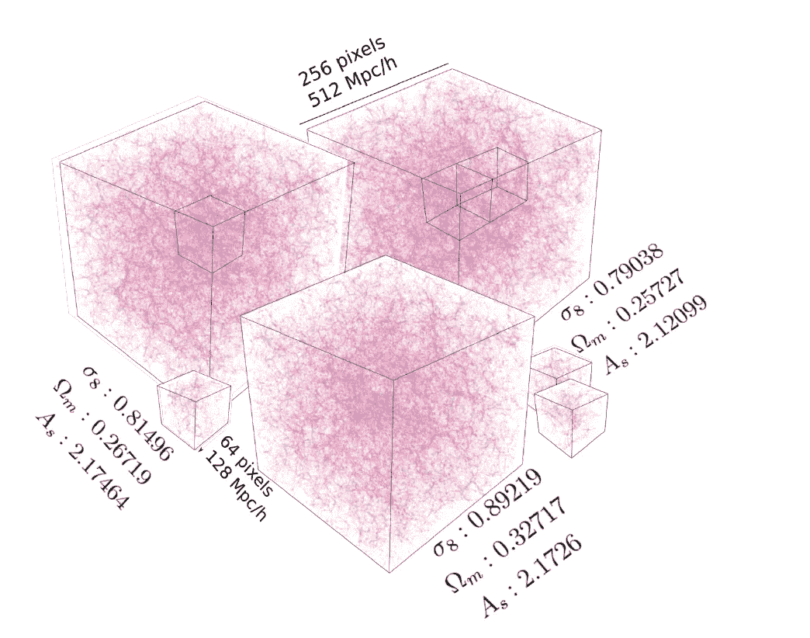

# 机器和深度学习在物理学中的应用

> 原文：<https://medium.com/mlearning-ai/applications-of-machine-and-deep-learnings-in-physics-832c553a1ec8?source=collection_archive---------2----------------------->

Typical simulation of dark matter distribution in Cosmology by using modern ML/DL techniques. Image credit from [**Ravanbakhsh et al.**](https://arxiv.org/pdf/1711.02033.pdf) under the creative common license.

我在之前的[文章](https://towardsdatascience.com/three-statistical-physics-concepts-and-methods-used-in-machine-learning-f9cc9f732c4)中讨论过一些最重要的机器(ML)/深度学习(DL)概念和方法，它们实际上直接来自物理学。另一方面，有几种 ML/DL 方法也在物理学中使用。这些 ML/DL 概念通常来源于统计学习理论，而不是直接来自物理学。