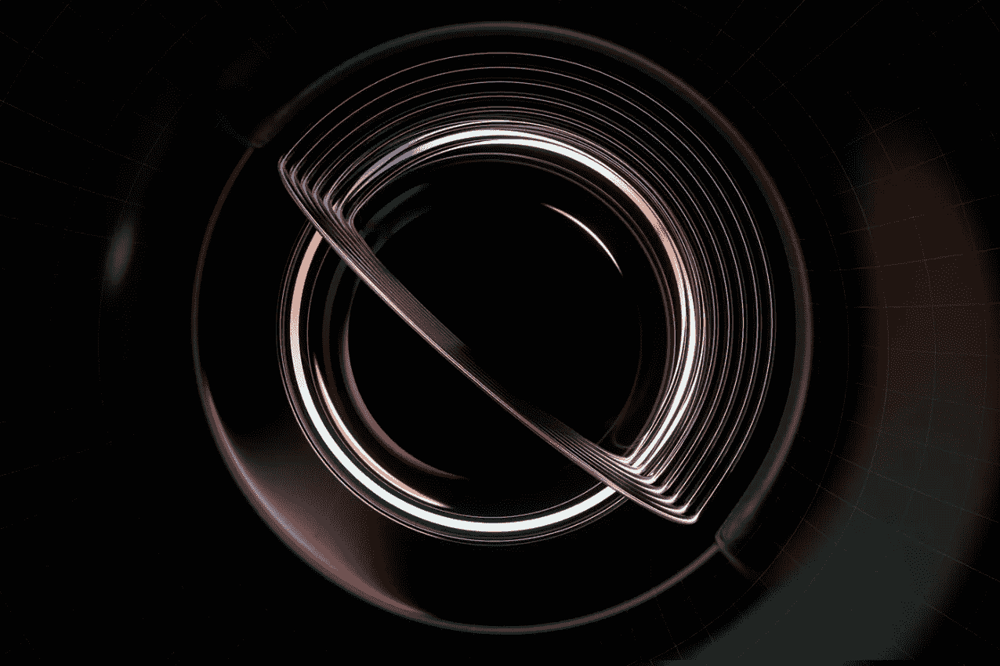
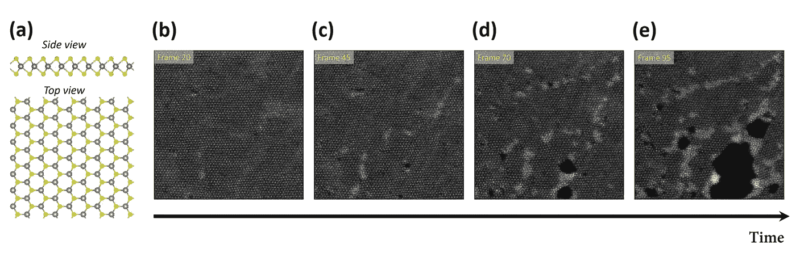
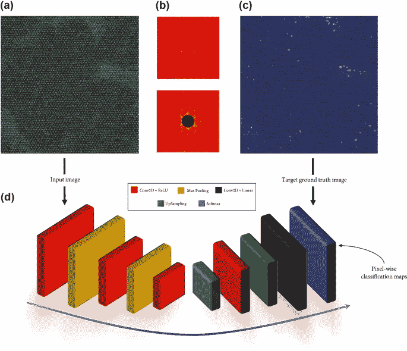
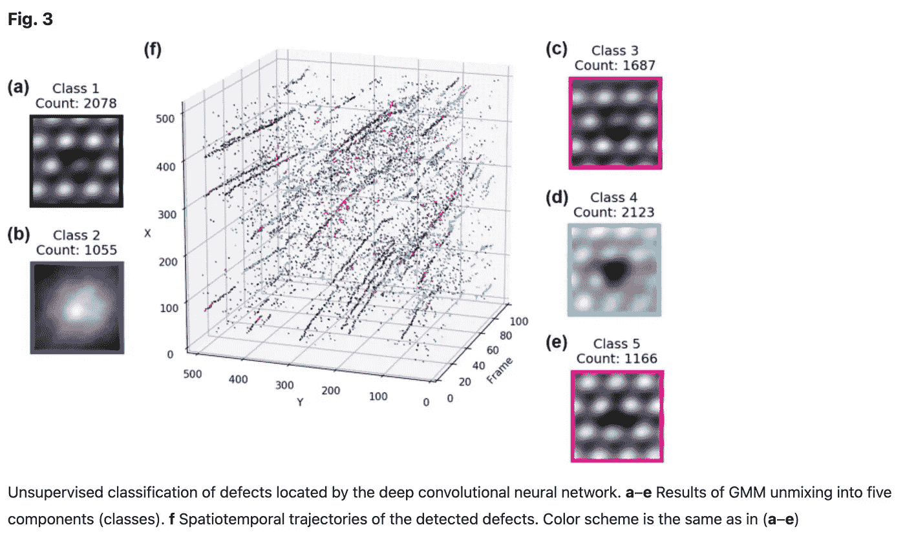
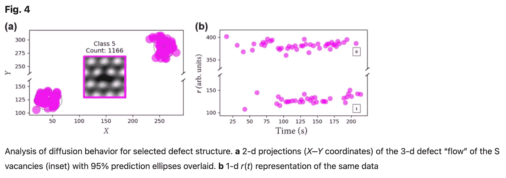
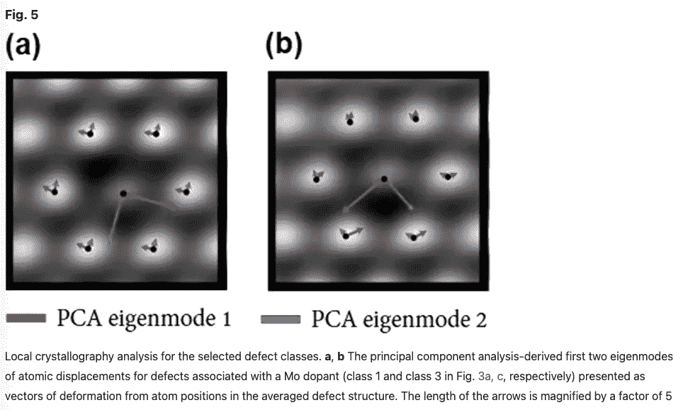
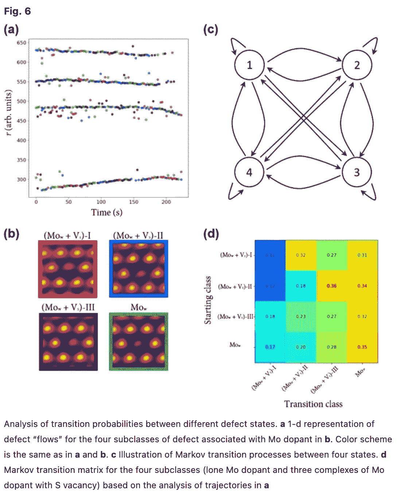

# 机器学习在材料科学与化学工程中的应用

> 原文：<https://medium.com/mlearning-ai/applications-of-machine-learning-in-material-science-chemical-engineering-9a4b9aae6a89?source=collection_archive---------3----------------------->

> 化学反应和相变是从宇宙过程、地球上生命的出现到现代技术等现象的基础，因此对基础科学和应用科学都有巨大的意义。

在这里，我提供了一个计算数学，材料科学和化学工程之间的交叉最近进展的评论。

#论文评论

# 概观

这项研究做出了许多显著的贡献:

## 1.自动化数据标记

快速傅立叶变换用于以自动和可靠的方式标记数据。

## 2.缺陷识别

深度学习被用来将晶格周期性中的缺陷映射到掺杂钼的 WS2 中的原子缺陷——有效地识别数据中的原子缺陷。

## 3.缺陷分类

然后，高斯混合模型被用于概率聚类缺陷。在检查中，这些集群很好地映射到理论解释。

## 4.将学到的抽象概念与理论物理进行对比

使用上述数据处理，研究人员能够:

1.  识别和描述重复缺陷类型的时空行为。
2.  仔细检查选择(S)空位缺陷的扩散。
3.  提供钼-硫复合物中跃迁动力学的详细研究。

> 通过这一应用，证明了端到端的机器学习可以用于发现通过传统物理/化学的透镜很好理解的模式。这项工作的一个可能的雄心勃勃的下一步是用物理学文献中理解的定律对各种具有转变动力学或相位演化特征的学习问题进行编码——目的是限制搜索空间，以回答我们当前理解范围之外的问题。

# WS2 电子束诱导相变过程中缺陷和相变的深度学习分析

[参考论文](https://www.nature.com/articles/s41524-019-0152-9#Fig6)

扫描透射电子显微镜(STEM)的现代进步使得能够在原子水平上直接可视化动态现象，一些技术甚至提供了通过晶格控制原子运动的方法。

这些成像和转换技术有可能解决一系列问题(从医疗诊断到航空航天工程，再到应对能源危机的智能燃料)，这样，材料科学可能会在我们这一代的许多科学、工程和医学挑战中发挥重要作用。

实现这一潜力并非没有工程挑战。其中之一(越来越重要)是这些丰富数据源的自治过程。

在这篇论文中，作者:

> "分析掺钼 WS2 在电子束辐照过程中的相演变."

目标是:

> “开发一个深度学习网络来快速分析这种动态数据，分析转化途径，创建缺陷库，并探索感兴趣的缺陷周围局部原子环境中的微小扭曲，最终建立一个探索点缺陷动力学和反应的完整框架。”

# 原始数据:STEM 成像

STEM(扫描透射电子显微镜)“电影”是在电子束照射期间拍摄的掺钼 WS2，如下所示:

Figure 1\. STEM data of e-beam irradiation in Mo-doped WS2\. **a.** provides a Ball-and-stick representation of WS2\. **b-to-e** capture 4 frames of a STEM movie in the data: showing the defects & lattice transformation over time.

现有的分析材料缺陷的方法是手工的&通常效率很低。

# 统计查询

建模过程由各种不同的步骤组成，每个步骤都伴随着技术和分析。

# 卷积神经网络

> 缺陷识别

为了开发自主工具，需要取代手工过程。众所周知，每种缺陷类型都与晶格结构中的周期性畸变相关联，因此可以使用 STEM 电影中的单个帧作为输入数据来预测每种缺陷种类。CNN (ConvNet)用于将输入帧映射到缺陷。还表明该网络可以检测出训练集中遗漏的缺陷。

**ConvNet**

在给定图像中每个像素属于某个缺陷类别的概率的情况下，训练 CNN 模型以将输入数据映射到相等大小的输出空间(图像)。

该网络能够:

1.  局域化原子尺度晶格无序。
2.  返回缺陷的位置。
3.  推广到看不见的缺陷结构。

# **快速傅立叶变换**

> 图像预处理

FFT(快速傅立叶变换)和逆 FFT 被用来标记 CNN 的数据。FFT 可以可靠地隔离缺陷区域，提供用于训练函数逼近器的像素标记。

**a.** Aframe from the STEM movie (input space). **b.** An illustration of the FFT applied to a frame. **c.** The labeled data after FFT processing. **d.** A description of the CNN architecture.

一旦经过训练，CNN 拥有许多超越 FFT 的优势:

*   CNN 在运行时效率要高得多。
*   CNN 更健壮——旋转和缩放不变。
*   CNN 对未知的缺陷类型(晶格畸变)有更好的概括。

# 高斯混合模型(GMM)

> 缺陷分类

既然原始视频数据可以通过 FFT → CNN 批量更新可靠地自主标记。在 Mo 掺杂的 WS2 上的动态 STEM 数据中可以识别原子缺陷。尽管这非常准确，但分析被进一步用于聚集缺陷，然后评估这是否符合我们当前的理论模型。

GMM 被用于概率性地将(未标记的)缺陷分成 5 类。

这种分类允许我们开始将学习到的表征映射到化学/物理文献中充分理解的理论模型。可以观察到:

*   第 1 类和第 3 类对应于 W 亚晶格中具有较低 *Z* 数的替位原子，我们将其解释为 Mo 掺杂剂(MOw)。
*   类别 4 和类别 5 分别与 W 子晶格(Vw)和 S 子晶格(Vs)中的空位相关联。

# 变异和扩散系数估计

> 分析个别缺陷

此外，可以使用 GMM 的分类输出来估计所选缺陷种类的扩散特性。研究了 S 空位的扩散特性。

然后，通过选择特定种类缺陷的“窗口”，将特定种类的缺陷从三维时空图投影到二维表示中(如图 4 所示)。

然后应用基于密度的聚类来估计每个分布的方差&一个二维随机游走模型框架内的扩散系数。

# 主成分分析

> 局部结晶学分析

进一步进行分析，对 1 类和 3 类进行局部结晶学分析。这是由以下人员完成的:

1.  钼掺杂缺陷，其中(GMM 1 级和 3 级提取)被选中。
2.  基于深度学习的“原子探测器”被用来从成千上万的噪声图像中提取原子位置。
3.  这些原子配置然后被聚集以产生平均缺陷配置的图像。平均图像提供了每个缺陷类别的中心 Mo 原子和六个 W 相邻原子。
4.  然后应用 PCA 提取平均图像的前两个本征模式，提取最大变化向量。

看起来似乎合理的是，中心的 Mo 原子相对于相邻的 W 原子的相对位置有显著的变化。这可能是由于钼掺杂剂旁边的硫空位的存在。

# 马尔可夫过程

> 过渡动力学

然后使用 PCA 分析和晶格对称性将 2 类(1 类和 3 类)分成 4 个子类。这些子类代表:

*   现在:不失真
*   (MOw + Vs): 3 MOw + Vs 复合体。

## 缺陷状态转移分析

如图 6a 所示，每个“流程”描述了在状态之间移动的缺陷。因此，我们可以将状态之间的转换分析为马尔可夫过程。

图 6.c 和 6.d 分别提供了转换动态模式和矩阵(描述了在缺陷状态之间移动的概率)。

从物理/化学理论的角度来看，可以认为状态之间的跃迁对应于 S 空位(单原子空位)的较低扩散势垒。看来这些化学结构是短暂的和不稳定的(这本身可能是一个显著的贡献)。

最后，数据表明，不同晶格方向的 S 空位供应的变化可以解释缺陷态跃迁概率。

# **总结**

本研究详细介绍了一种端到端的 ML 方法，用于模拟 WS2 中电子束诱导转变过程中的相演变和缺陷，方法如下:

> 1.自动数据标记(FFTs)
> 
> 2.缺陷识别(CNN)
> 
> 3.缺陷分类(GMM)
> 
> 4.将学到的抽象概念与理论物理进行对比(PCA 和马尔可夫模型分析)

[此处提供参考文件](https://www.nature.com/articles/s41524-019-0152-9#Fig6)。