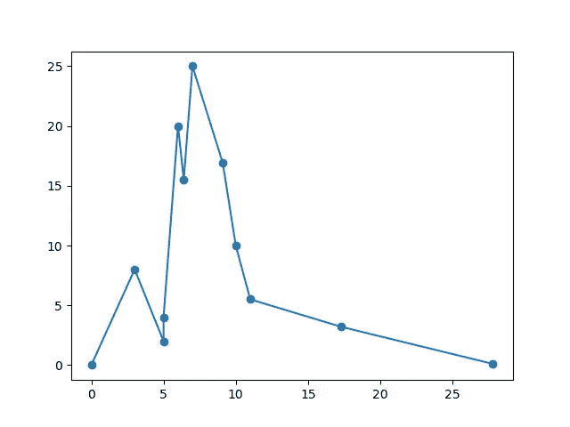
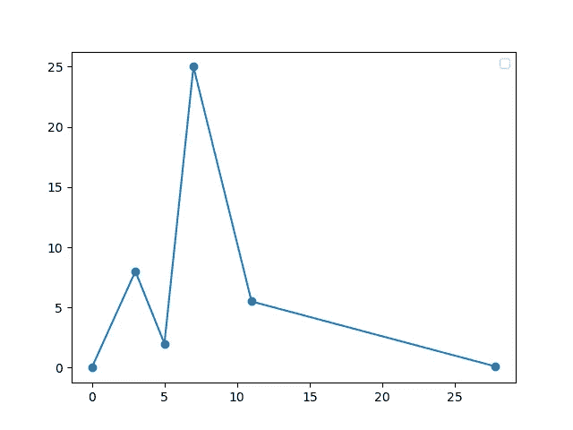
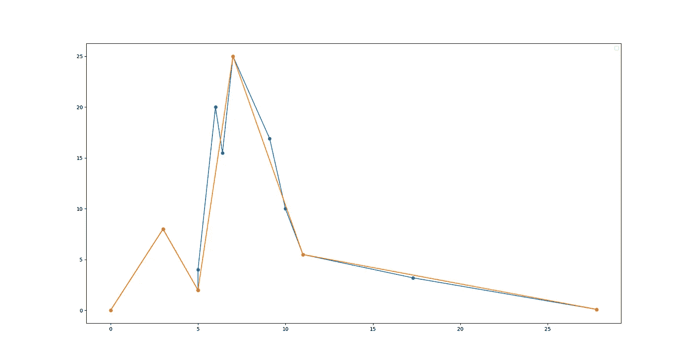
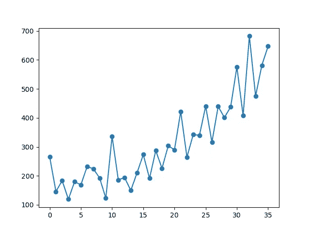
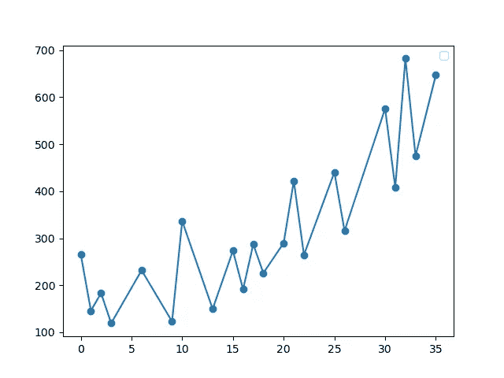
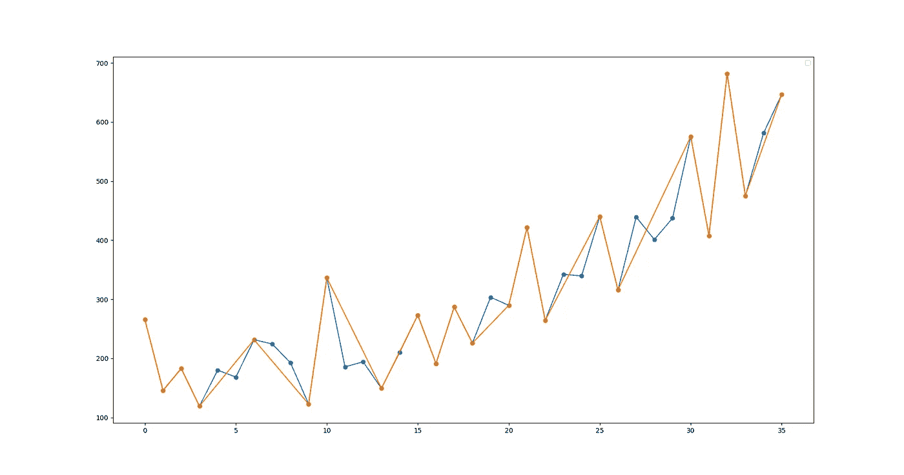

# Ramer-Douglas-Peucker 算法在你可能没听说过的机器学习中的应用。

> 原文：<https://medium.com/mlearning-ai/applications-of-ramer-douglas-peucker-algorithm-in-machine-learning-that-you-might-not-have-heard-63b0c4f15a43?source=collection_archive---------0----------------------->

# 介绍

Ramer-Douglas-Peucker 算法，又称**Douglas–peu cker 算法**和**迭代端点拟合算法，**是一种制图/线综合算法。它基本上减少了曲线/直线中的点的数量，而不损失曲线/直线的形状，基于一些公差参数‘ε’(ε)。这有广泛的应用，从机器人到矢量图形。这与 GPS 和地图应用中用于航路点简化的算法相同。虽然现在已经有了相当大的改进，并且使用了新的东西，但是这已经超出了本文的范围。

# RDP 和机器学习

这种算法在制图综合领域非常流行，但是它的潜力已经被 ML 社区回避太久了。这就是为什么我决定写这篇文章来展示这个算法在需要有限的坐标/点的应用中是多么有用。因此，主要是它的应用可以在物联网行业中看到，由于资源(计算和内存)有限，我们只能向设备发送有限的数据。然后，我们将看到这也可以用来平滑时间序列数据，而不会丢失太多的信息。但是它也有许多其他的应用。我会在最后提到他们所有人。

# RDP 算法是如何工作的？

这里简单介绍一下算法本身。这是一个简单的迭代算法。它首先绘制一条连接曲线的第一个和最后一个点的线，然后检查这两个点之间哪个点离线最远(它使用“垂直距离”来计算点到线的距离)。如果该点比阈值(ε)更近，则该点被移除，如果不是，则曲线被分成两部分:

1.  从第一个点一直到异常值，包括异常值。
2.  异常值和剩余点。

这在两条曲线上递归地进行，直到具有低阈值的所有点都被移除。


Source: [https://karthaus.nl/rdp/](https://karthaus.nl/rdp/)

## 来自维基百科的伪代码:

```
**function** DouglasPeucker(PointList[], epsilon)
    // Find the point with the maximum distance
    dmax = 0
    index = 0
    end = length(PointList)
    **for** i = 2 to (end - 1) {
        d = perpendicularDistance(PointList[i], Line(PointList[1], PointList[end])) 
        **if** (d > dmax) {
            index = i
            dmax = d
        }
    }

    ResultList[] = empty;

    // If max distance is greater than epsilon, recursively simplify
    **if** (dmax > epsilon) {
        // Recursive call
        recResults1[] = DouglasPeucker(PointList[1...index], epsilon)
        recResults2[] = DouglasPeucker(PointList[index...end], epsilon)

        // Build the result list
        ResultList[] = {recResults1[1...length(recResults1) - 1], recResults2[1...length(recResults2)]}
    } **else** {
        ResultList[] = {PointList[1], PointList[end]}
    }
    // Return the result
    **return** ResultList[]
**end**
```

## 粗略的实现:

# RDP 在实际机器学习中的应用

在现实世界的使用案例中有许多场景，您只能将“n”个点或坐标部署到一个设备，无论是因为低计算、内存还是带宽。对于需要根据一些数字来计算东西的物联网设备来说尤其如此。近年来，带 ML 的物联网越来越流行，主要障碍是小型控制器/设备可以保存的数据。

例如，基于 ML 的传感器校准系统无法在其低内存中存储训练好的模型，但您可以将模型的坐标发送给它，它可以基于线性插值或任何其他首选技术进行预测。在这种情况下，发送大量的坐标是对资源的浪费，这就是 RDP 的用武之地，它平滑了曲线/直线而又不失去它的形状。

我们在这里举一个小例子，用一个小的合成坐标集。

```
coords = [
          [0.0, 0.0],[3.0, 8.0],[5.0, 2.0],
          [5.0, 4.0],[6.0, 20.0],[6.4, 15.5],
          [7.0, 25.0],[9.1, 16.9],[10.0, 10.0],
          [11.0, 5.5], [17.3, 3.2], [27.8, 0.1]
         ]
```

在应用ε为 1 的 RDP 前后看起来是这样的。



Plot of original Coordinates



Plot of reduced coordinates

下面是曲线相似程度的比较:



Comparison on How close the Curves are in terms of its shape.

简化的坐标:

```
coords = [
          [0.0, 0.0],[3.0, 8.0],[5.0, 2.0],
          [7.0, 25.0],[11.0, 5.5],[27.8, 0.1]
         ]
```

再举一个**时间序列**数据的例子:

我们将使用洗发水销售数据，你可以在这里下载:[数据](https://raw.githubusercontent.com/jbrownlee/Datasets/master/shampoo.csv)

让我们看看类似于上面比较的图。这里ε值是 1.5



Original Time series Data



Smoothed Time series data



Side by Side Comparison

# 其他应用

这种算法的应用还有很多，这也催生了这个领域更多成功的算法。下面列出了其中的一些，包括我们用代码展示的那些:

1.  处理矢量图形。
2.  制图综合/航路点简化。
3.  用于机器人技术中，对旋转距离扫描仪采集的距离数据进行简化和去噪。
4.  平滑时间序列数据(汇总)，主要是在金融技术用例中，这比**宁滨**表现更好。
5.  这也可用于找到图形或曲线的转折点。给定足够的ε。
6.  为了可视化的目的，在降维之后简化坐标的绘制。(如果坐标有很多边，就太麻烦了，没有任何意义)。

# **结论**

我想说的是，这是机器学习中非常容易被忽视的算法，它在现实世界中有很好的用途。我最近开始了解它，它在我的用例中帮助了我很多。想把它放在那里给那些可能不知道它的人。虽然这很好，但它有几个缺点，这导致了更好算法的发现。此外，找到最短的距离可能会比找到垂直距离得到更好的结果(这也是我们在代码中所做的)。如果你喜欢这篇文章，并有任何疑问或事情要分享，请在下面的评论中联系我。

# 参考

*   [维基百科](https://en.wikipedia.org/wiki/Ramer%E2%80%93Douglas%E2%80%93Peucker_algorithm)
*   [Urs Ramer: *平面曲线多边形逼近的迭代程序。计算机图形和图像处理。第 1 卷，第 3 期，第 244–256 页*，1972 年](https://www.sciencedirect.com/science/article/pii/S0146664X72800170?via%3Dihub)
*   大卫·道格拉斯，托马斯·普克:*减少表示一条数字化线或其漫画所需点数的算法。国际地理信息和地理可视化杂志。第 10 卷，第 2 期，第 112-122 页*，1973 年
*   [卡特乌斯](https://karthaus.nl/rdp/)