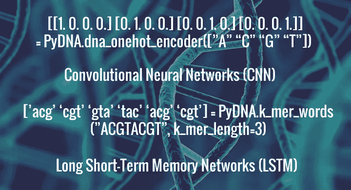
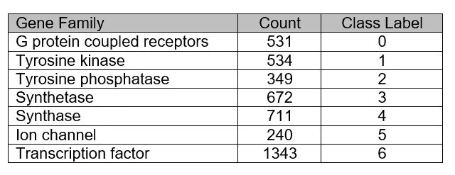
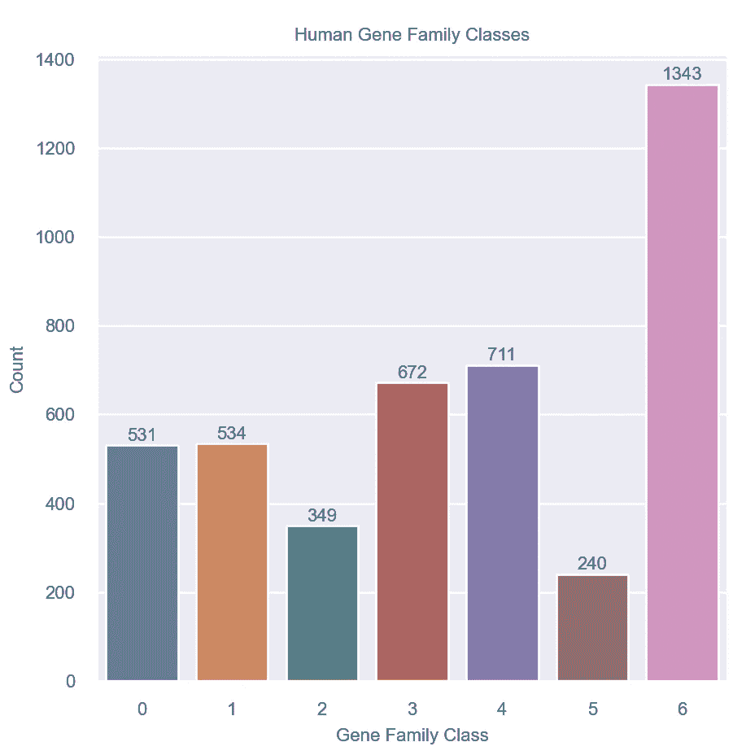
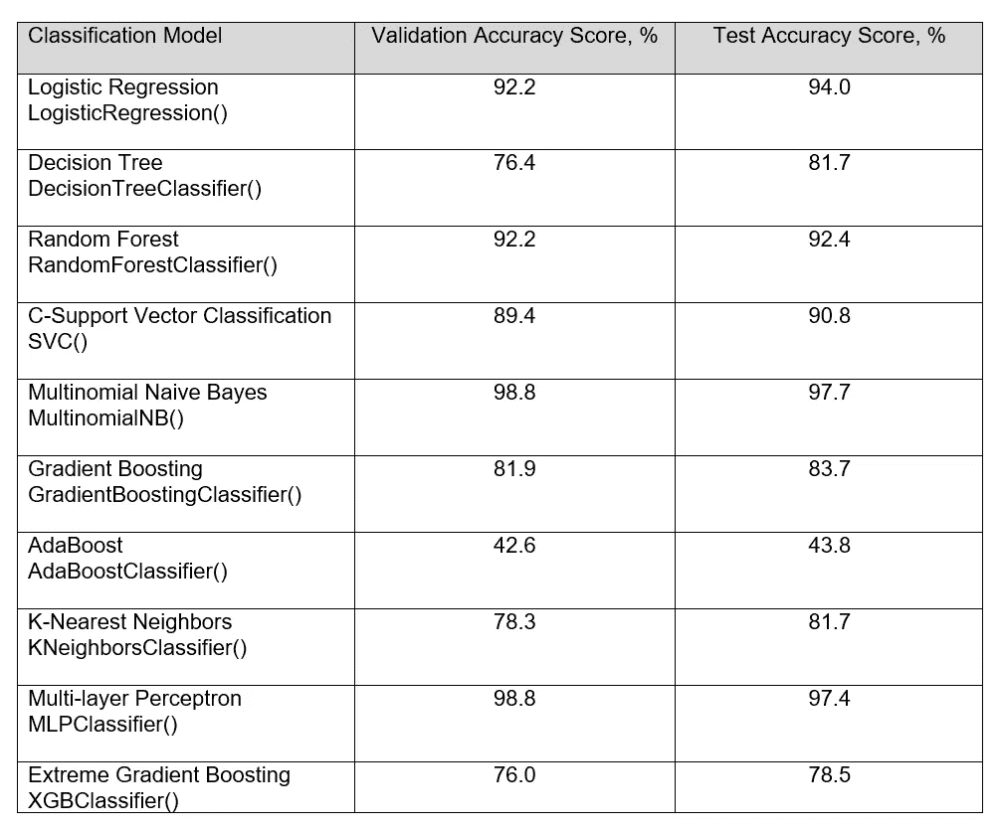
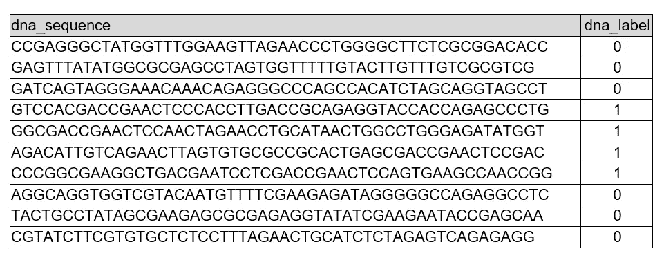
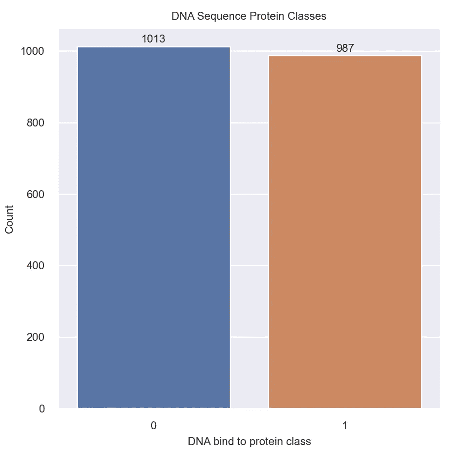
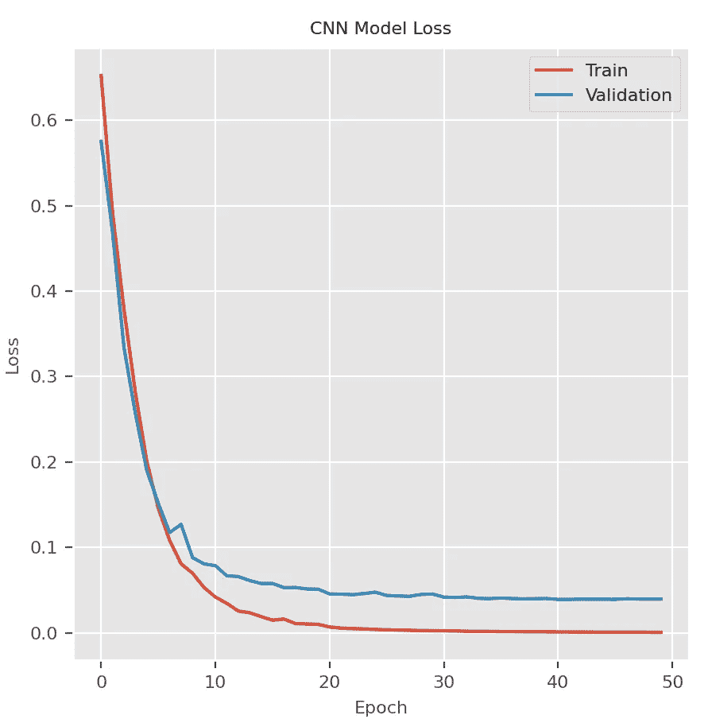
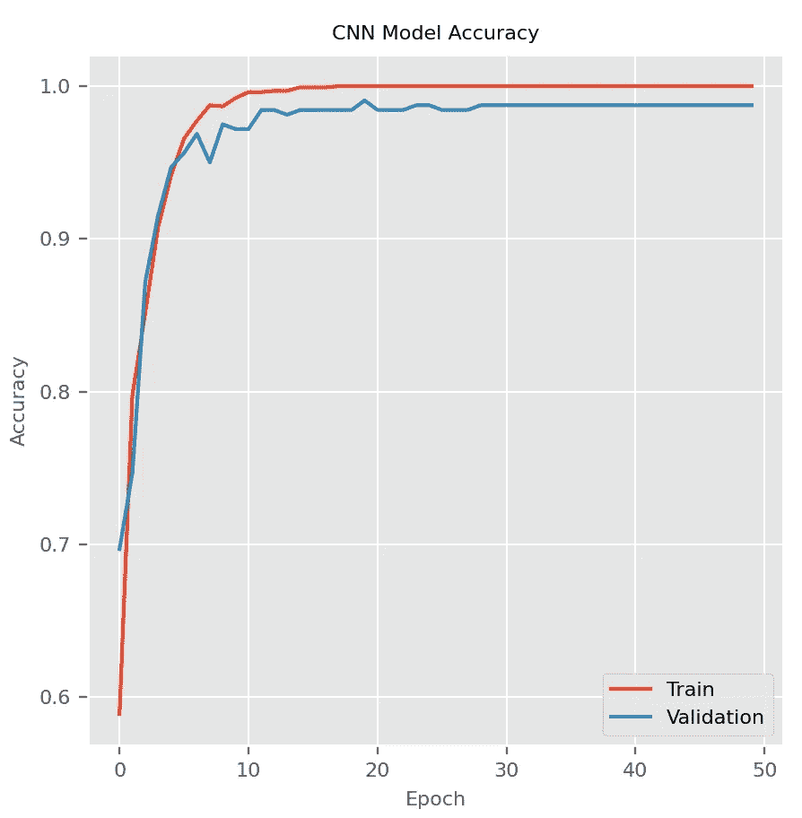
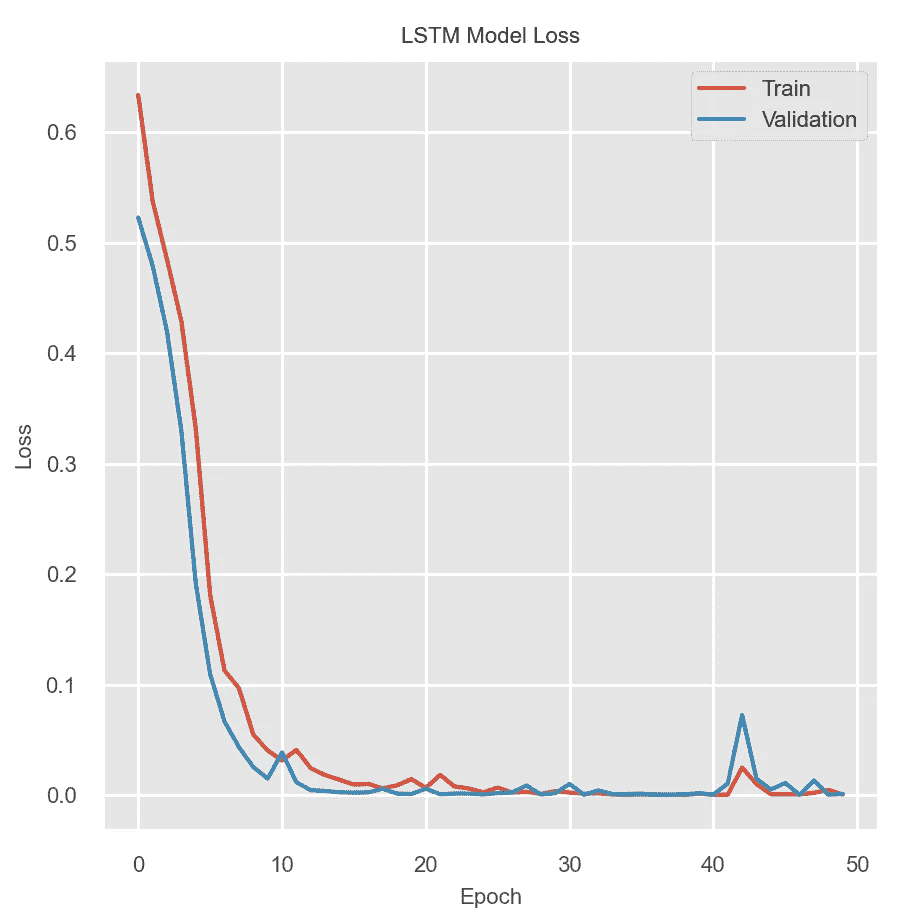
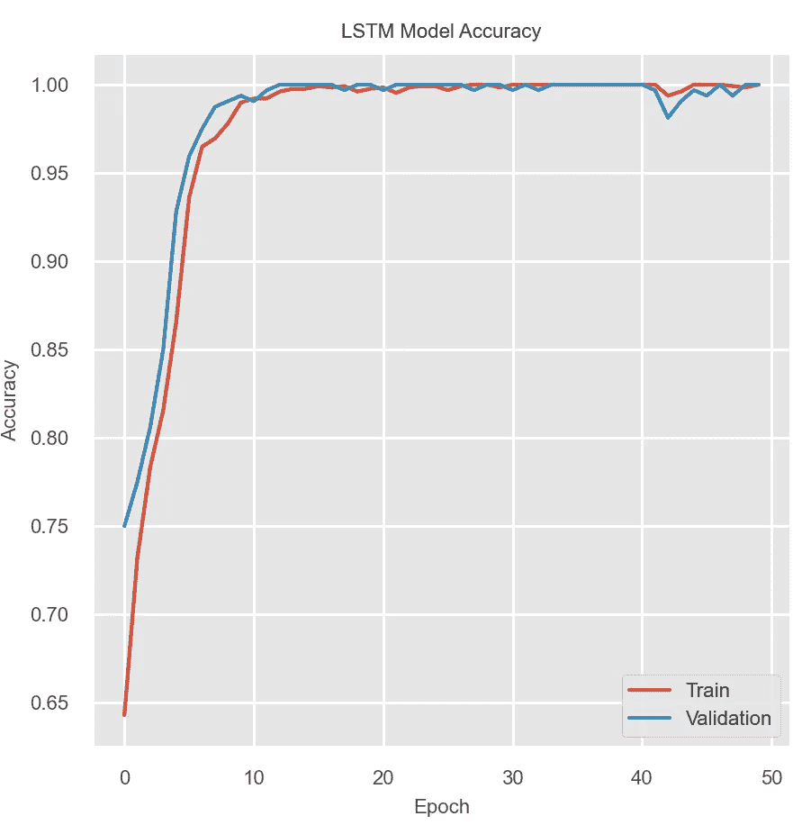

# 将机器学习算法应用于基因组数据分类

> 原文：<https://medium.com/mlearning-ai/apply-machine-learning-algorithms-for-genomics-data-classification-132972933723?source=collection_archive---------0----------------------->



Ernest Bonat 博士，Bishes Rayamajhi 硕士

(更新日期:2021 年 9 月 11 日)

1.[概述](#c401)
2。 [DNA 序列](#9a28)
3。[验证 DNA 序列字符串](#7c00)
4。[计数 DNA 序列串中的碱基核苷酸](#9431)
5。[反转一个 DNA 序列串](#d2e8)
6。[互补 DNA 序列串](#4536)
7。[反向互补一个 DNA 序列串](#7cc6)
8。[计算 DNA 序列串中 CG 含量](#c97e)
9。[将 DNA 序列串转换成 NumPy 数组](#9f89)
10。[搜索 DNA 序列模式](#f04f)
11。 [DNA 序列串翻译成蛋白质](#0127)
12。 [DNA 序列串转录成 RNA 序列串](#7e3e)
13。[编码 DNA 序列的第 14 串](#3330)
。[包字为一个 DNA 序列串](#caba)
15。 [RNA 序列](#7c74)
16。[验证 RNA 序列字符串](#563b)
17。[对 RNA 序列串中的碱基核苷酸进行计数](#96cd)
18。 [RNA 序列串翻译成蛋白质](#df0a)
19。 [DNA、RNA 和蛋白质序列比对](#3b3c)
20。 [Biopython 库概述](#7f51)
21。[自定义 PyDNA 库](#197c)
22。[利用机器学习算法进行 DNA 序列分类](#0f4e)
23。[应用卷积神经网络(CNN)进行 DNA 序列分类](#b8c2)
24。[应用长短期记忆网络(LSTM)进行 DNA 序列分类](#7c36)
25。[结论](#56e1)

## 1.概观

在分子生物学和遗传学领域，基因组是生物体的所有遗传物质。它由 DNA(或 RNA 病毒中的 RNA)组成。基因组包括基因(编码区)和非编码 DNA，以及线粒体 DNA 和叶绿体 DNA。对基因组的研究被称为基因组学。它包括基因之间的相互作用以及与人的环境的相互作用。基因组数据用于生物信息学领域，用于收集、存储和处理生物基因组。基因组数据处理需要大量的数据存储和用于统计分析的高性能硬件和软件。

机器学习(ML)是人工智能(AI)的一种应用，它能够根据经验进行自动学习和改进，而无需显式编程和学习环境的知识。最重要的目标是开发和部署一个可以在没有任何人为干预的情况下自动学习的计算机系统。根据定义，它必须能够根据先前的结果调整自己的行动。

机器学习已经成为当今许多基因组学研究任务的主要方法之一，包括:

1.大规模基因组数据集的描述和解释。
2。各种基因组序列元素的注释。
3。预测遗传变异对 DNA/RNA 序列的影响。
4。确定患某种疾病的可能性，并确定遗传性。
5。识别模式，进行预测，并对特定疾病的进展或治疗进行建模。

ML 在基因组学中的未来应用可能是:药物基因组学、新生儿基因筛选工具、农业等。基于 ML 项目类型，我们可以定义特定的应用。对于分类(监督学习):将较短的序列分类成类(门、属、种等)。);序列的系统发育推断；质粒和染色体的检测；寻找编码区；人类基因组学中的染色体预测；等等。对于聚类(无监督学习):宏基因组重叠群的宁滨；质粒和染色体的鉴定；聚类读入染色体，以便更好的组装；作为读取集合的预处理器的读取聚类，[等](https://towardsdatascience.com/machine-learning-for-genomics-c02270a51795)。

在这篇博客文章中，我们将理解 DNA/RNA/蛋白质序列的结构，以及它们使用 Python 数据生态系统库的操作。它将展示 ML 算法如何用于 DNA/RNA/蛋白质序列的分类和预测。将提供基因组数据集的传统和现代 ML 分类算法的比较表。将介绍一个简单的 Python 库 PyDNA，用于 DNA/RNA/蛋白质序列字符串处理和 ML 分类算法。

## 2.DNA 序列

根据国家人类基因组研究所的研究，[脱氧核糖核酸](https://www.genome.gov/genetics-glossary/Deoxyribonucleic-Acid) (DNA)是一种化合物，它由开发和指导几乎所有生命体的活动所需的指令组成。DNA 分子是一种双螺旋结构，由两条扭绞成对的链组成。DNA 由四种碱基组成，分别是腺嘌呤[A]、胞嘧啶[C]、鸟嘌呤[G]或胸腺嘧啶[T]。DNA 测序是确定 DNA 分子中这四种碱基序列的实验室过程。关于 DNA 测序的更多信息可以在“[DNA 测序简介](https://www.illumina.com/techniques/sequencing/dna-sequencing.html)中找到。

让我们看看使用 Python 数据生态系统库的 DNA 序列字符串操作。所有提供的函数调用都在名为 PyDNA 的 Python 定制 DNA 库中实现。关于这个库的进一步解释可以在这篇博客文章的后面找到。

## 3.验证 DNA 序列字符串

DNA 序列字符串必须包含四个碱基核苷酸[“A”、“C”、“G”、“T”]。该功能允许使用任何已定义的自定义核苷酸碱基来验证 DNA 序列。

示例:

```
dna_sequence_string = “ATATATCCCGGGAATTTTCGTAGTTAGGCTGATTTTATTGGCGCGAAAATTT”
is_dna_result = PyDNA.is_dna(dna_sequence_string)
print(“DNA sequence string:\n{}”.format(dna_sequence_string))
print(“Is DNA:\n{}”.format(is_dna_result))
```

结果:

```
DNA sequence string:
ATATATCCCGGGAATTTTCGTAGTTAGGCTGATTTTATTGGCGCGAAAATTT
Is DNA:
True
```

示例:

```
dna_sequence_string = “ATATATCCCGGGAATTTTCGTAGTTAGGCTGATTTTATTGGCGCGAAAATTF”
is_dna_result = PyDNA.is_dna(dna_sequence_string)
print(“DNA sequence string:\n{}”.format(dna_sequence_string))
print(“Is DNA:\n{}”.format(is_dna_result))
```

结果:

```
DNA sequence string:
ATATATCCCGGGAATTTTCGTAGTTAGGCTGATTTTATTGGCGCGAAAATTF
Is DNA:
False
```

## 4.计数 DNA 序列串中的碱基核苷酸

下面的函数允许用任何定义的自定义碱基计数 DNA 序列核苷酸。DNA 序列的长度也将被返回。

示例:

```
dna_sequence_string = “ATATATCCCGGGAATTTTCGTAGTTAGGCTGATTTTATTGGCGCGAAAATTTTTT”
base_sequence_count, dna_sequence_length = PyDNA.dna_count_nucleotide(dna_sequence_string, base_sequence=[“A”,”C”,”G”,”T”], is_length=True)
print(“DNA sequence string:\n{}”.format(dna_sequence_string))
print(“DNA nucleotides count:\n{}”.format(base_sequence_count))
print(“DNA length:\n{}”.format(dna_sequence_length))
```

结果:

```
DNA sequence string:
ATATATCCCGGGAATTTTCGTAGTTAGGCTGATTTTATTGGCGCGAAAATTTTTT
DNA nucleotides count:
{‘A’: 13, ‘C’: 7, ‘G’: 12, ‘T’: 23}
DNA length:
55
```

示例:

```
dna_sequence_string = “ATYTRTCCYGGYAATRYTCGTAGTTAGRCTGATYTTATTGGYGCGAARATTYYTR”base_sequence_count, dna_sequence_length = PyDNA.dna_count_nucleotide(dna_sequence_string, base_sequence=[“A”,”C”,”G”,”T”,”R”,”Y”], is_length=True)print(“DNA Nucleotide Count:\n{}”.format(base_sequence_count))print(“DNA length:\n{}”.format(dna_sequence_length))
```

结果:

```
DNA Nucleotide Count:
{‘A’: 10, ‘C’: 5, ‘G’: 10, ‘T’: 17, ‘R’: 5, ‘Y’: 8}
DNA length:
55
```

## 5.逆转 DNA 序列串

下面的函数反转一个 DNA 序列字符串。

示例:

```
dna_sequence_string = “ATATATCCCGGGAATTTTCGTAGTTAGGCTGATTTTATTGGCGCGAAAATTTTTT”
dna_reverse_sequence = PyDNA.dna_sequence_reverse(dna_sequence_string)
print(“DNA Sequence String:\n{}”.format(dna_sequence_string))
print(“Reverse DNA sequence:\n{}”.format(dna_reverse_sequence))
```

结果:

```
DNA Sequence String:
ATATATCCCGGGAATTTTCGTAGTTAGGCTGATTTTATTGGCGCGAAAATTTTTT
Reverse DNA sequence:
TTTTTTAAAAGCGCGGTTATTTTAGTCGGATTGATGCTTTTAAGGGCCCTATATA
```

## 6.互补 DNA 序列串

DNS 序列的互补基于 IUPAC 简并转换(【https://www.bioinformatics.org/sms/iupac.html】T4)。

示例:

```
dna_sequence_test = “ATATATCCCGGGAATTTTCGTAGTTAGGCTGATTTTATTGGCGCGAAAATTTTTT”
dna_complement_sequence = PyDNA.dna_sequence_complement(dna_sequence_test)
print(“DNA sequence string:\n{}”.format(dna_sequence_test))
print(“Complement DNA sequence:\n{}”.format(dna_complement_sequence))
```

结果:

```
DNA sequence string:
ATATATCCCGGGAATTTTCGTAGTTAGGCTGATTTTATTGGCGCGAAAATTTTTT
Complement DNA sequence:
TATATAGGGCCCTTAAAAGCATCAATCCGACTAAAATAACCGCGCTTTTAAAAAA
```

## 7.反向-互补 DNA 序列串

DNS 序列字符串的反向补码是通过使用 dna_sequence_reverse()和 dna_sequence_complement()函数实现的。

示例:

```
dna_sequence_string = “ATATATCCCGGGAATTTTCGTAGTTAGGCTGATTTTATTGGCGCGAAAATTT”
dna_reverse_complement_sequence = PyDNA.dna_sequence_reverse_complement(dna_sequence_string)
print(“DNA sequence string:\n{}”.format(dna_sequence_string))
print(“Reverse-Complement DNA sequence:\n{}”.format(dna_reverse_complement_sequence))
```

结果:

```
ATATATCCCGGGAATTTTCGTAGTTAGGCTGATTTTATTGGCGCGAAAATTT
AAATTTTCGCGCCAATAAAATCAGCCTAACTACGAAAATTCCCGGGATATAT
```

## 8.对 DNA 序列串中的 GC 含量进行计数

GC 含量代表 DNA 或 RNA 序列中含氮碱基的百分比。

示例:

```
dna_sequence_string = “ATATATCCCGGGAATTTTCGTAGTTAGGCTGATTTTATTGGCGCGAAAATTT”
gc_content = PyDNA.dna_count_gc_content(dna_sequence_string)
print(“DNA sequence string:\n{}”.format(dna_sequence_string))
print(“GC-content:\n{}”.format(gc_content))
```

结果:

```
DNA sequence string:
ATATATCCCGGGAATTTTCGTAGTTAGGCTGATTTTATTGGCGCGAAAATTT
GC-content:
36.5%
```

## 9.将 DNA 序列串转换成 NumPy 数组

Numerical Python ( [NumPy](https://numpy.org/) )是 Python 编程语言的主要库，增加了对大型多维数组和矩阵的支持，以及对这些数组进行操作的大量高级数学函数。这个库是目前 Python 数据生态系统中最快的库之一。

NumPy 核心程序是经过编译和优化的 C 代码。因此，强烈建议将其用于计算生物学和生物信息学中的字符串高性能处理和机器学习算法。仍然有许多数据科学家在 Python 中使用列表/集合/字典对象进行字符串操作。他们中的一些人在日常工作中编写糟糕的编程代码时抱怨 Python 非常慢。我总是建议我的数据科学家/工程师朋友在编写一行 Python 代码之前先学习高级 Python 编程课程。当你有机会的时候，我想让你读一读下面这篇有趣的博客文章:“[为机器学习项目重构 Python 代码。Python“意大利面条代码”无处不在！](/@ernest.bonat/refactoring-python-code-for-machine-learning-projects-python-spaghetti-code-everywhere-daaa6c116bd1)

下面是将 DNA 序列字符串转换为 NumPy 一维数组的 PyDNA 函数代码。

```
[@staticmethod](http://twitter.com/staticmethod)
def dna_sequence_np_array(dna_sequence_string):
    dna_sequence_array = None
    try:
        dna_sequence_string = dna_sequence_string.lower()   
        regex_acgt = re.compile('[^acgt]') 
        if (regex_acgt.search(dna_sequence_string) == None):           
            dna_sequence_array = np.array(list(dna_sequence_string))
        else:       
            dna_sequence_array = None    
    except:               
        print(PyDNA.get_exception_info())
        if PyDNA._app_is_log: PyDNA.write_log_file("error",   PyDNA.get_exception_info())  
    return dna_sequence_array
```

示例:

```
dna_sequence_string = “ATATATCCCGGGAATTTTCGTAGTTAGGCTGATTTTATTGGCGCGAAAATTTTTT”
dna_np_array = PyDNA.dna_sequence_np_array(dna_sequence_string) 
print(“DNA sequence string:\n{}”.format(dna_sequence_string))
print(“DNA NumPy array:\n{}”.format(dna_np_array))
```

结果:

```
DNA sequence string:
ATATATCCCGGGAATTTTCGTAGTTAGGCTGATTTTATTGGCGCGAAAATTTTTT
DNA NumPy array:
['a' 't' 'a' 't' 'a' 't' 'c' 'c' 'c' 'g' 'g' 'g' 'a' 'a' 't' 't' 't' 't' 'c' 'g' 't' 'a' 'g' 't' 't' 'a' 'g' 'g' 'c' 't' 'g' 'a' 't' 't' 't' 't' 'a' 't' 't' 'g' 'g' 'c' 'g' 'c' 'g' 'a' 'a' 'a' 'a' 't' 't' 't' 't' 't' 't']
```

## 10.搜索 DNA 序列模式

搜索 DNA 序列模式是当今生物信息学中的一项标准任务，包括蛋白质结构域、DNA 转录因子结合基序、限制性酶切位点、简并 PCR 引物位点、单核苷酸序列等等。PyDNA 库包含一个简单的 dna_sequence_pattern()方法，用于在 DNA 序列字符串中查找模式。

```
[@staticmethod](http://twitter.com/staticmethod)
def dna_sequence_pattern(dna_sequence_string, dna_sequence_pattern):
    search_result = False
    try:
        search_pattern = re.search(dna_sequence_pattern.lower(), dna_sequence_string.lower())
        if search_pattern: search_result = True       
    except:               
        print(PyDNA.get_exception_info())
        if PyDNA._app_is_log: PyDNA.write_log_file("error", PyDNA.get_exception_info())  
    return search_result
```

让我们看一些例子。

例 1。

```
dna_sequence_string = “ATATATCCCGGGAATTTTCGTAGTTAGGCTGATTTTATTGGCGCGAAAATTTTTT”
dna_sequence_pattern = “AATTTT”
result = PyDNA.dna_sequence_pattern(dna_sequence_string, dna_sequence_pattern)
print(result)
True
```

例 2。

```
dna_sequence_string = “ATATATCCCGGGAATTTTCGTAGTTAGGCTGATTTTATTGGCGCGAAAATTTTTT”
dna_sequence_pattern = “AATTTTAA”
result = PyDNA.dna_sequence_pattern(dna_sequence_string, dna_sequence_pattern)
print(result)
False
```

## 11.DNA 序列串翻译成蛋白质

为了将 DNA 序列翻译成蛋白质，使用了 [DNA 遗传密码图](https://en.wikipedia.org/wiki/DNA_and_RNA_codon_tables)。

示例:

```
dna_sequence_string = “ATGGAAGTATTTAAAGCGCCACCTATTGGGATATAAG” 
protein_translation = PyDNA.dna_protein_translation(dna_sequence_string)
print(“DNA sequence string:\n{}”.format(dna_sequence_string))
print(“Protein translation:\n{}”.format(protein_translation))
```

结果:

```
DNA sequence string:
ATGGAAGTATTTAAAGCGCCACCTATTGGGATATAAG
Protein translation:
MEVFKAPPIGI
```

## 12.DNA 序列串转录成 RNA 序列串

下面的函数将 DNA 序列串转录成 RNA 序列串。

示例:

```
dna_sequence_string = “ATGGAAGTATTTAAAGCGCCACCTATTGGGATATAAG” 
rna_transcription = PyDNA.dna_rna_transcription(dna_sequence_string)
print(“DNA sequence string:\n{}”.format(dna_sequence_string))
print(“RNA transcription:\n{}”.format(rna_transcription))
```

结果:

```
DNA sequence string:
ATGGAAGTATTTAAAGCGCCACCTATTGGGATATAAG
RNA transcription:
AUGGAAGUAUUUAAAGCGCCACCUAUUGGGAUAUAAG
```

## 13.编码 DNA 序列串

要在 ML 项目中使用 DNA 序列字符串，首先需要对其进行编码。ML 数学算法不适用于文本分类数据。根据所选的 ML 算法，有三种主要类型的 DNA 序列字符串编码:

1.**标签编码** —该标签(普通)编码将每个碱基核苷酸编码为自定义数值。一般来说，为了使最大似然算法更加精确，使用了浮点(十进制)数。在应用这种编码之前，需要将 DNA 序列字符串转换成 NumPy 一维数组。这种类型的编码在使用 [scikit-learn](https://scikit-learn.org/stable/) 库的监督学习中非常流行。在下面的例子中，“ACGT”序列字符串将被编码为[0.25，0.5，0.75，1.0]。

示例:

```
dna_sequence_string = “ATATATCCCGGGAATTTTCGTAGTTAGGCTGATTTTATTGGCGCGAAAATTTTTT”
dna_np_array = PyDNA.dna_sequence_np_array(dna_sequence_string) 
dna_label_encoder = PyDNA.dna_label_encoder(dna_np_array) 
print(“DNA sequence string:\n{}”.format(dna_sequence_string))
print(“DNA NumPy array:\n{}”.format(dna_np_array))
print(“Custom Label Encoding:\n{}”.format(dna_label_encoder))
```

结果:

```
DNA sequence string:
ATATATCCCGGGAATTTTCGTAGTTAGGCTGATTTTATTGGCGCGAAAATTTTTT
DNA NumPy array:
[‘a’ ‘t’ ‘a’ ‘t’ ‘a’ ‘t’ ‘c’ ‘c’ ‘c’ ‘g’ ‘g’ ‘g’ ‘a’ ‘a’ ‘t’ ‘t’ ‘t’ ‘t’ ‘c’ ‘g’ ‘t’ ‘a’ ‘g’ ‘t’ ‘t’ ‘a’ ‘g’ ‘g’ ‘c’ ‘t’ ‘g’ ‘a’ ‘t’ ‘t’ ‘t’ ‘t’ ‘a’ ‘t’ ‘t’ ‘g’ ‘g’ ‘c’ ‘g’ ‘c’ ‘g’ ‘a’ ‘a’ ‘a’ ‘a’ ‘t’ ‘t’ ‘t’ ‘t’ ‘t’ ‘t’]
Custom Label Encoding:
[0.25 1\. 0.25 1\. 0.25 1\. 0.5 0.5 0.5 0.75 0.75 0.75 0.25 0.25 1\. 1\. 1\. 1\. 0.5 0.75 1\. 0.25 0.75 1\. 1\. 0.25 0.75 0.75 0.5 1\. 0.75 0.25 1\. 1\. 1\. 1\. 0.25 1\. 1\. 0.75 0.75 0.5 0.75 0.5 0.75 0.25 0.25 0.25 0.25 1\. 1\. 1\. 1\. 1\. 1\. ]
```

2.**一键编码** —这种编码常用于人工神经网络(ANN)。很多时候，ANN 都被称为深度学习。深度学习(也称为深度结构化学习)是基于具有表示学习的 ANN 的更广泛的 ML 方法家族的一部分。包括以下主要架构:深度神经网络(DNN)、深度信念网络(DBN)、递归神经网络(RNN)和[卷积神经网络](https://en.wikipedia.org/wiki/Deep_learning) (CNN)。scikit-learn 和 [Keras](https://keras.io/) 库可以提供这种一键编码实现。对于核苷酸的标准碱基,“ACGT”序列串将被一次性编码为[[1。0.0.0.] [0.1.0.0.] [0.0.1.0.] [0.0.0.1.]]使用 NumPy 数组['a' 'c' 'g' 't']。

示例:

```
dna_sequence_string = “ATATATCCCGGGAATTTTCGTAGTTAGGCTGATTTTATTGGCGCGAAAATTTTTT”
dna_np_array = PyDNA.dna_sequence_np_array(dna_sequence_string) 
dna_one_hot = PyDNA.dna_onehot_encoder(dna_np_array) 
print(“DNA sequence string:\n{}”.format(dna_sequence_string))
print(“DNA NumPy array:\n{}”.format(dna_np_array))
print(“DNA One-Hot Encoding with Scikit-Learn framework:\n{}”.format(dna_one_hot))
```

结果:

```
DNA sequence string:
ATATATCCCGGGAATTTTCGTAGTTAGGCTGATTTTATTGGCGCGAAAATTTTTT 
DNA NumPy array:
[‘a’ ‘t’ ‘a’ ‘t’ ‘a’ ‘t’ ‘c’ ‘c’ ‘c’ ‘g’ ‘g’ ‘g’ ‘a’ ‘a’ ‘t’ ‘t’ ‘t’ ‘t’ ‘c’ ‘g’ ‘t’ ‘a’ ‘g’ ‘t’ ‘t’ ‘a’ ‘g’ ‘g’ ‘c’ ‘t’ ‘g’ ‘a’ ‘t’ ‘t’ ‘t’ ‘t’ ‘a’ ‘t’ ‘t’ ‘g’ ‘g’ ‘c’ ‘g’ ‘c’ ‘g’ ‘a’ ‘a’ ‘a’ ‘a’ ‘t’ ‘t’ ‘t’ ‘t’ ‘t’ ‘t’]
DNA One-Hot Encoding with Scikit-Learn framework:
[[1\. 0\. 0\. 0.] [0\. 0\. 0\. 1.] [1\. 0\. 0\. 0.] [0\. 0\. 0\. 1.] [1\. 0\. 0\. 0.] [0\. 0\. 0\. 1.] [0\. 1\. 0\. 0.] [0\. 1\. 0\. 0.] [0\. 1\. 0\. 0.] [0\. 0\. 1\. 0.] [0\. 0\. 1\. 0.] [0\. 0\. 1\. 0.] [1\. 0\. 0\. 0.] [1\. 0\. 0\. 0.] [0\. 0\. 0\. 1.] [0\. 0\. 0\. 1.] [0\. 0\. 0\. 1.] [0\. 0\. 0\. 1.] [0\. 1\. 0\. 0.] [0\. 0\. 1\. 0.] [0\. 0\. 0\. 1.] [1\. 0\. 0\. 0.] [0\. 0\. 1\. 0.] [0\. 0\. 0\. 1.] [0\. 0\. 0\. 1.] [1\. 0\. 0\. 0.] [0\. 0\. 1\. 0.] [0\. 0\. 1\. 0.] [0\. 1\. 0\. 0.] [0\. 0\. 0\. 1.] [0\. 0\. 1\. 0.] [1\. 0\. 0\. 0.] [0\. 0\. 0\. 1.] [0\. 0\. 0\. 1.] [0\. 0\. 0\. 1.] [0\. 0\. 0\. 1.] [1\. 0\. 0\. 0.] [0\. 0\. 0\. 1.] [0\. 0\. 0\. 1.] [0\. 0\. 1\. 0.] [0\. 0\. 1\. 0.] [0\. 1\. 0\. 0.] [0\. 0\. 1\. 0.] [0\. 1\. 0\. 0.] [0\. 0\. 1\. 0.] [1\. 0\. 0\. 0.] [1\. 0\. 0\. 0.] [1\. 0\. 0\. 0.] [1\. 0\. 0\. 0.] [0\. 0\. 0\. 1.] [0\. 0\. 0\. 1.] [0\. 0\. 0\. 1.] [0\. 0\. 0\. 1.] [0\. 0\. 0\. 1.] [0\. 0\. 0\. 1.]]
```

使用 Keras 库可以得到相同的结果。

```
dna_sequence_string = “ATATATCCCGGGAATTTTCGTAGTTAGGCTGATTTTATTGGCGCGAAAATTTTTT”
dna_np_array = PyDNA.dna_sequence_np_array(dna_sequence_string) 
dna_one_hot = PyDNA.dna_onehot_encoder_keras(dna_np_array) 
print(“DNA sequence string:\n{}”.format(dna_sequence_string))
print(“DNA NumPy array:\n{}”.format(dna_np_array))
print(“DNA One-Hot Encoding with Scikit-Learn framework:\n{}”.format(dna_one_hot))
```

3. **K-mer 计数** —在生物信息学中，[K-mer](https://en.wikipedia.org/wiki/K-mer)是生物序列中包含的长度子序列。通常，术语 k-mer 是指长度为 k 的序列的所有子序列，这样序列 AGat 将具有四个单体(A、G、A 和 T)、三个二聚体(AG、GA、AT)、两个三聚体(AGA 和 GAT)和一个四聚体(AGAT)——来自 [k-mer](https://en.wikipedia.org/wiki/K-mer) 定义。一般来说，将一个序列分解成 k-mers 固定大小的块允许快速和容易的字符串操作。这被明智地应用于 ML 算法的自然语言处理(NLP)单词包方法中。这个方法将在下一个主题中讨论。

示例:

```
dna_sequence_string = “ATATATCCCGGGAATTTTCGTAGTTAGGCTGATTTTATTGGCGCGAAAATTT”
k_mer_list, k_mer_numpy_array = PyDNA.k_mer_words(dna_sequence_string, k_mer_length=6)
print(“DNA sequence string:\n{}”.format(dna_sequence_string))
print(“K-mer list:\n{}”.format(k_mer_list))
print(“K-mer array:\n{}”.format(k_mer_numpy_array))
```

结果:

```
DNA sequence string:
ATATATCCCGGGAATTTTCGTAGTTAGGCTGATTTTATTGGCGCGAAAATTT
K-mer list:
[‘atatat’, ‘tatatc’, ‘atatcc’, ‘tatccc’, ‘atcccg’, ‘tcccgg’, ‘cccggg’, ‘ccggga’, ‘cgggaa’, ‘gggaat’, ‘ggaatt’, ‘gaattt’, ‘aatttt’, ‘attttc’, ‘ttttcg’, ‘tttcgt’, ‘ttcgta’, ‘tcgtag’, ‘cgtagt’, ‘gtagtt’, ‘tagtta’, ‘agttag’, ‘gttagg’, ‘ttaggc’, ‘taggct’, ‘aggctg’, ‘ggctga’, ‘gctgat’, ‘ctgatt’, ‘tgattt’, ‘gatttt’, ‘atttta’, ‘ttttat’, ‘tttatt’, ‘ttattg’, ‘tattgg’, ‘attggc’, ‘ttggcg’, ‘tggcgc’, ‘ggcgcg’, ‘gcgcga’, ‘cgcgaa’, ‘gcgaaa’, ‘cgaaaa’, ‘gaaaat’, ‘aaaatt’, ‘aaattt’]
K-mer array:
[‘atatat’ ‘tatatc’ ‘atatcc’ ‘tatccc’ ‘atcccg’ ‘tcccgg’ ‘cccggg’ ‘ccggga’ ‘cgggaa’ ‘gggaat’ ‘ggaatt’ ‘gaattt’ ‘aatttt’ ‘attttc’ ‘ttttcg’ ‘tttcgt’ ‘ttcgta’ ‘tcgtag’ ‘cgtagt’ ‘gtagtt’ ‘tagtta’ ‘agttag’ ‘gttagg’ ‘ttaggc’ ‘taggct’ ‘aggctg’ ‘ggctga’ ‘gctgat’ ‘ctgatt’ ‘tgattt’ ‘gatttt’ ‘atttta’ ‘ttttat’ ‘tttatt’ ‘ttattg’ ‘tattgg’ ‘attggc’ ‘ttggcg’ ‘tggcgc’ ‘ggcgcg’ ‘gcgcga’ ‘cgcgaa’ ‘gcgaaa’ ‘cgaaaa’ ‘gaaaat’ ‘aaaatt’ ‘aaattt’]
```

## 14.DNA 序列字符串的单词包

DNA 序列是简单的非结构化文本数据。因此，NLP 应该是一个很好的工具。使用 NLP 的主要思想是让计算机理解非结构化文本，并从中检索有意义的信息片段，以做出商业决策。NLP 是人工智能生态系统的一部分。

词袋是自然语言处理中的一种方法。它的主要功能是将原始文本数据转换成单词，并统计它们在文本中的出现频率。这些词在文中的顺序无关紧要。对于文本文档，生成令牌计数矩阵。一般来说，这个矩阵表示将在 ML 算法中应用的最终特征向量。在我们下面的例子中，DNA 子序列的 k-mers 列表是为它生成单词包的输入参数。

示例:

```
k_mer_list = [‘atatat’, ‘tatatc’, ‘atatcc’, ‘tatccc’, ‘atcccg’, ‘tcccgg’, ‘cccggg’, ‘ccggga’, ‘cgggaa’, ‘gggaat’]
word_ngram = 1
k_mer_token_count = PyDNA.bag_of_word_list(k_mer_list, word_ngram)
print(“K-mer list:\n{}”.format(k_mer_list))
print(“Word ngram:\n{}”.format(word_ngram))
print(“K-mer matrix token counts:\n{}”.format(k_mer_token_count.toarray()))
```

结果:

```
K-mer list:
[‘atatat’, ‘tatatc’, ‘atatcc’, ‘tatccc’, ‘atcccg’, ‘tcccgg’, ‘cccggg’, ‘ccggga’, ‘cgggaa’, ‘gggaat’]
Word ngram:
1
K-mer matrix of token counts:
[[1 0 0 0 0 0 0 0 0 0]
 [0 0 0 0 0 0 0 1 0 0]
 [0 1 0 0 0 0 0 0 0 0]
 [0 0 0 0 0 0 0 0 1 0]
 [0 0 1 0 0 0 0 0 0 0]
 [0 0 0 0 0 0 0 0 0 1]
 [0 0 0 1 0 0 0 0 0 0]
 [0 0 0 0 1 0 0 0 0 0]
 [0 0 0 0 0 1 0 0 0 0]
 [0 0 0 0 0 0 1 0 0 0]]
```

## 15.RNA 序列

基于国家人类基因组研究所，[核糖核酸](https://www.genome.gov/genetics-glossary/RNA-Ribonucleic-Acid) (RNA)是一种与 DNA 结构相似，但在细微方面有所不同的核酸。细胞使用 RNA 完成许多不同的任务，其中一种叫做信使 RNA，或 mRNA。这是核酸信息分子，通过翻译将信息从基因组转移到蛋白质中。RNA 的另一种形式是 tRNA，或转移 RNA，它们是非蛋白质编码的 RNA 分子，将氨基酸物理携带到翻译位点，使它们在翻译过程中装配成蛋白质链。

RNA 测序使用[下一代测序](https://www.ncbi.nlm.nih.gov/pmc/articles/PMC3841808/) (NGS)技术分析不断变化的细胞转录组。NGS 是一个大规模的自动化过程，可以完成 DNA 或 RNA 样品中碱基对的快速测序。NGS 使研究人员能够进行多项生物学研究，并能在一天内对整个人类基因组进行测序。NGS 应用广泛用于各种现代技术，如高通量完整病毒基因组测序、病毒基因组变异检测和宿主进化。

让我们看一些 PyDNA 函数来支持 RNA 序列字符串操作。

## 16.验证 RNA 序列字符串

RNA 序列字符串必须包含四个碱基核苷酸[“A”、“C”、“G”、“U”]。该功能允许用任何定义的定制碱基核苷酸验证 RNA 序列。

示例:

```
rna_sequence_string = “AUGGCCAUGGCGCCCAGAACUGAGAUCAAUAGUACCCGUAUUAACGGGUGA”
is_rna_result = PyDNA.is_rna(rna_sequence_string, base_sequence=[“A”,”C”,”G”,”U”])
print(“RNA sequence string:\n{}”.format(rna_sequence_string))
print(“Is RNA:\n{}”.format(is_rna_result))
```

结果:

```
RNA sequence string:
AUGGCCAUGGCGCCCAGAACUGAGAUCAAUAGUACCCGUAUUAACGGGUGA
Is RNA:
True
```

示例:

```
rna_sequence_string = “AUGGCCTUGGCGCCCAGAACUGAGAUCTAUAGUACCCGUAUUAACTGGUGA”
is_rna_result = PyDNA.is_rna(rna_sequence_string, base_sequence=[“A”,”C”,”G”,”U”])
print(“RNA sequence string:\n{}”.format(rna_sequence_string))
print(“Is RNA:\n{}”.format(is_rna_result))
```

结果:

```
RNA sequence string:
AUGGCCTUGGCGCCCAGAACUGAGAUCTAUAGUACCCGUAUUAACTGGUGA
Is RNA:
False
```

## 17.计数 RNA 序列串中的碱基核苷酸

下面的函数允许用任何定义的自定义碱基计数 RNA 序列核苷酸。RNA 序列的长度也被返回。

示例:

```
rna_sequence_string = “AUGGCCAUGGCGCCCAGAACUGAGAUCAAUAGUACCCGUAUUAACGGGUGA”
base_sequence_count, rna_sequence_length = PyDNA.rna_count_nucleotide(rna_sequence_string, base_sequence=[“A”,”C”,”G”,”U”], is_length=True)
print(“RNA sequence string:\n{}”.format(rna_sequence_string))
print(“RNA nucleotides count:\n{}”.format(base_sequence_count))
print(“RNA length:\n{}”.format(rna_sequence_length))
```

结果:

```
RNA sequence string:
AUGGCCAUGGCGCCCAGAACUGAGAUCAAUAGUACCCGUAUUAACGGGUGA
RNA nucleotides count:
{‘A’: 15, ‘C’: 12, ‘G’: 14, ‘U’: 10}
RNA le
```

## 18.RNA 序列串翻译成蛋白质

为了将 RNA 序列翻译成蛋白质，使用了 [RNA 遗传密码图](https://en.wikipedia.org/wiki/DNA_and_RNA_codon_tables)。

示例:

```
rna_sequence_string = “AUGGCCAUGGCGCCCAGAACUGAGAUCAAUAGUACCCGUAUUAACGGGUGA”
protein_translation = PyDNA. rna_protein_translation(rna_sequence_string)
print(“RNA sequence string:\n{}”.format(rna_sequence_string))
print(“Protein translation:\n{}”.format(protein_translation))
```

结果:

```
RNA sequence string:
AUGGCCAUGGCGCCCAGAACUGAGAUCAAUAGUACCCGUAUUAACGGGUGA
Protein translation:
MAMAPRTEINSTRING
```

## 19.DNA、RNA 和蛋白质序列比对

[序列比对](https://en.wikipedia.org/wiki/Sequence_alignment)是一种排列 DNA、RNA 或蛋白质序列的方法，以识别相似区域，这可能是序列之间功能、结构或进化关系的结果。核苷酸或氨基酸残基的比对序列通常表示为矩阵中的行。在残基之间插入间隔，以便相同或相似的字符在连续的列中对齐。序列比对也用于非生物序列，例如计算自然语言或金融数据中字符串之间的距离成本。

今天用于更快序列比对的基本技术之一是[动态编程](https://en.wikipedia.org/wiki/Dynamic_programming) (DP)。DP 既是一种数学优化方法，也是一种计算机编程方法。在这两种情况下，它指的是通过以递归的方式将复杂的问题分解成更简单的子问题来简化它。虽然一些决策问题不能以这种方式分解，但是跨越几个时间点的决策经常会递归地分解。同样，在计算机科学中，如果一个问题可以通过将其分解为子问题，然后递归地找到子问题的最优解来最优地解决，那么它就被称为具有最优子结构。

序列比对可以有以下主要应用:给定一个新序列，根据与另一个序列的相似性预测其功能，发现重要的分子区域，确定起作用的进化约束，发现基因群体或家族中的突变，网络生物学为我们提供基因/蛋白质的功能信息，分析突变体未知基因与疾病的联系，等等。

如果我们比较两个序列，这就是所谓的成对序列比对。如果我们比较两个以上的序列，这就是所谓的多序列比对。一般来说，有两种类型的序列比对:全局比对和局部比对。全局比对试图比对每个序列中的每个残基，当查询集中的序列相似且大小大致相等时，全局比对最有用。(这并不意味着全局比对不能以间隙开始和/或结束。)一种通用的全局比对技术是基于动态编程的 [Needleman-Wunsch](https://en.wikipedia.org/wiki/Sequence_alignment) 算法。局部比对对于怀疑在其较大的序列范围内包含相似区域或相似序列基序的不相似序列更有用。 [Smith-Waterman](https://en.wikipedia.org/wiki/Sequence_alignment) 算法是一种通用的局部对齐方法，基于相同的动态规划方案，但具有在任何地方开始和结束的额外选择。

下面是使用 PyDNA 库的全局和局部算法比较两个序列的代码。

```
sequence_1 = “ACGGGT”
sequence_2 = “ACG”
print(“Needleman-Wunsch Global Algorithm”)
PyDNA..needleman_wunsch_global(sequence_1, sequence_2)
print(“Smith-Waterman Local Algorithm”)
PyDNA.smith_waterman_local(sequence_1, sequence_2)
```

结果:

```
Needleman-Wunsch Global Algorithm
score: 15
ACGGGT
AC G
AC — G-Smith-Waterman Local Algorithm
score: 30
ACG
```

## 20.Biopython 库概述

计算生物学和生物信息学中最流行的 Python 库是 [Biopython](https://biopython.org) 。Biopython 项目是一个用于计算生物学和生物信息学的非商业 python 工具的开源集合，由一个国际开发者协会创建。它包含表示生物序列和序列注释的类，并且能够读写各种文件格式。它还允许以编程方式访问在线生物信息数据库，如 NCBI 的数据库。独立的模块将 Biopython 的能力扩展到序列比对、蛋白质结构、群体遗传学、系统发育学、序列基序和机器学习。Biopython 是许多旨在减少计算生物学中代码重复的 Bio*项目之一。

为了比较，让我们用这个库来比对上面显示的序列。正如你在下面的程序中看到的，生物库已经被导入。

```
from Bio import pairwise2
from Bio.pairwise2 import format_alignmentsequence_1 = "ACGGGT"
sequence_2 = "ACG"
print("Needleman-Wunsch Global Algorithm")
alignments = pairwise2.align.globalxx(sequence_1, sequence_2)
for item in alignments:
    print(format_alignment(*item))
print("Smith-Waterman Local Algorithm")
alignments = pairwise2.align.localxx(sequence_1, sequence_2)
for item in alignments:
    print(format_alignment(*item))
```

结果:

```
Needleman-Wunsch Global Algorithm
ACGGGT
||  |
AC--G-
  Score=3
ACGGGT
|| |
AC-G--
  Score=3
ACGGGT
|||
ACG---
  Score=3Smith-Waterman Local Algorithm
1 ACGGG
  ||  |
1 AC--G
  Score=3
1 ACGG
  || |
1 AC-G
  Score=3
1 ACG
  |||
1 ACG
  Score=3
```

两个库产生相同的结果。对于我们的情况，最好的全局和局部比对是 AC-G-和 ACG。

## 21.自定义 PyDNA 库

During researching the applications of ML algorithms for genomics data I found many standard and generic programming procedures and sequence data preprocessing were unavailable. The Biopython library does not provide the required modern ANN and Boosting Gradient models like Convolutional Neural Networks (CNN), Recurrent Neural Networks (RNN), Extreme Gradient Boosting (XGBoost), etc. Because of this, I decided to build a simple Python library so I could reuse it in my daily ML bioinformatics work. After a couple of months of work, this library became simple, good and large. The setup packaging for it may be available in the future. Below are the main design basics.

1\. Easy to use by copying and pasting the files pydna.py and ipydna.py into any Python project.
2\. Generic ML methods and logic procedures for the whole project work flow.
3\. Error handling, configuration file and log messages implementation.
4\. Simple maintenance and future upgrades.
5\. Unit tests project implementation.

Here is an example code of the PyDNA library public interface file.

```
from zope.interface import Interface
class IPyDNA(Interface):   
    def dna_sequence_np_array(dna_sequence_string):
        """
        convert a dna sequence string to numpy one-dimensional array
        dna_sequence_string: dna sequence string
        return: numpy one-dimensional array
        """
        pass
```

## 22\. DNA Sequence Classification using Machine Learning Algorithms

There is a huge demand of applying ML to genomics dataset analytics today. Many questions about it are still not very clear at all. Let me mentions some of them:

*   What DNA sequence encoder to use based on the selected ML model?
*   What ML models to use for generic genomics datasets and how to interpret it?
*   How to optimize the ML model hyperparameters?
*   How to apply Natural Language processing to DNA sequence as an unstructured text dataset?
*   How to handle high dimensional and unlabeled gene expression datasets?
*   What method to use to handle genomic datasets with imbalanced classes?
*   What metrics to use to validate the ML model with genomics datasets?
*   How to expose and consume the ML model using web services API’s call?
*   How to design and build a client side and/or desktop application to use these ML models in real research and/or production business environments?

Selection of the ML model and its hyperparameters optimization is part of the ML project flow from the steps shown below:

*   Project description and specifications.
*   Data loading.
*   Data preprocessing.
*   Data exploration and visualization.
*   Features engineering and reduction.
*   Features and labels encoding.
*   Features and labels data splitting.
*   Features and labels scaling.
*   Model selection and hyperparameters optimization.
*   Model cross validation.
*   Model prediction.
*   Model performance metrics analysis.
*   Model production deployment using Web APIs IT application integration.
*   Model retraining schedule and redeployment business intelligence and decisions making.

对于生物信息学家、生物学家和临床医生来说，为特定的基因组数据集定义这个模型是一个重要的决定。在许多用例中，这种选择是根据数据集 DNA 序列长度的一致性来定义的。传统的 ML 算法(线性和逻辑回归、决策树、支持向量机、随机森林、Boosting 算法、贝叶斯网络等。)可以用于任何长度的 DNA 序列。像 CNN 和 RNN 这样的现代人工神经网络算法要求整个数据集列中的 DNA 序列长度一致。PyDNA 库提供了一个简单的函数来确定所选的 DNA 序列字符串是否包含统一的长度。

```
dna_is_same_length = PyDNA.dna_sequence_is_equal_length(X)   
if dna_is_same_length == False:
    print("DNA sequence length validation")
```

让我们看看第一个用例。假设我们需要建立一个分类模型，该模型可以基于人类 DNA 序列数据集预测一个基因家族。基于共享的核苷酸或蛋白质序列，基因被分类成家族。[基因家族](https://en.wikipedia.org/wiki/Gene_family)是几个相似基因的集合，由单个原始基因复制而成，一般具有相似的生化功能。这个案例将使用一个可以从 GitHub 网站下载的“human_data.txt”文件([https://GitHub . com/nageshsinghc 4/DNA-Sequence-Machine-learning/blob/master/human _ data . txt](https://github.com/nageshsinghc4/DNA-Sequence-Machine-learning/blob/master/human_data.txt)

熊猫数据框架的信息方法将为我们提供一个完整的数据集描述。它包含“序列”和“类”两列，共 4380 行。

```
<class 'pandas.core.frame.DataFrame'>
RangeIndex: 4380 entries, 0 to 4379
Data columns (total 2 columns):
 #   Column    Non-Null Count  Dtype
---  ------    --------------  -----
 0   sequence  4380 non-null   object
 1   class     4380 non-null   int64
dtypes: int64(1), object(1)
memory usage: 68.6+ KB
None
```

数据集示例:

```
sequence   class
0     ATGCCCCAACTAAATACTACCGTATGGCCCACCATAATTACCCCCA...      4
1     ATGAACGAAAATCTGTTCGCTTCATTCATTGCCCCCACAATCCTAG...      4
2     ATGTGTGGCATTTGGGCGCTGTTTGGCAGTGATGATTGCCTTTCTG...      3
3     ATGTGTGGCATTTGGGCGCTGTTTGGCAGTGATGATTGCCTTTCTG...      3
[4380 rows x 2 columns]
```

如您所见，该数据集包含两个数据列。“序列”列是 DNA 序列字符串和“类别”列，包含 7 个可能的基因家族标签，如下表 1 所示。



表 1。基因家族名称和计数。

图 1 显示了类标签的聊天记录。我们得到了这个数据集的[不平衡类](https://www.analyticsvidhya.com/blog/2017/03/imbalanced-data-classification/)情况。一般来说，在应用 ML 算法之前，这些类需要过采样或欠采样。让我们看看我们是否需要为我们的分类模型应用这些技术。



图一。人类类标签蝙蝠图。

以下是 y 级标签示例。

```
y     class
0       4
1       4
2       3
3       3
```

这是最终的 X 特性包的单词和类列示例。

```
 X           class
(0, 52803)     1
(0, 207969)    1
(0, 136621)    1
(0, 79202)     1
```

让我们检查 DNA 序列的长度是否一致。

```
X = PyDNA.select_df_column(df_dna, “sequence”)
dna_is_same_length = PyDNA.dna_sequence_is_equal_length(X) 
print(dna_is_same_length)
False
```

结果为“假”，因此 DNA 序列长度在整个柱上是不一致的。在这种情况下，将使用传统的 ML 算法。

基于 PyDNA 库，ML 算法的完整代码如下所示。我对每一行代码都做了注释，让任何人都能理解这个程序是如何工作的。

```
import sys
import time
import os
os.system("cls")import numpy as np
import pandas as pd
import matplotlib.pyplot as plt
import seaborn as sns
import xgboost as xgbfrom sklearn.feature_extraction.text import CountVectorizer
from sklearn.model_selection import train_test_split
from sklearn.metrics import classification_report, confusion_matrix, accuracy_score
from sklearn.metrics import roc_auc_score, precision_score, recall_score, f1_score
from sklearn.naive_bayes import MultinomialNB
from sklearn.neural_network import MLPClassifier 
from sklearn.ensemble import RandomForestClassifier
from sklearn.preprocessing import StandardScaler, MinMaxScaler, RobustScaler, MaxAbsScaler
from pydna import PyDNAimport warnings                                  
warnings.filterwarnings('ignore')def get_program_running(start_time):
    end_time = time. process_time()
    diff_time = end_time - start_time
    result = time.strftime("%H:%M:%S", time.gmtime(diff_time)) 
    print("program runtime: {}".format(result))def main():
    # text file path and name. this path to be defined in the project config file
    human_data_txt = r"folder_path\human_data.txt"

    # data load
    df_dna = PyDNA.pandas_read_data("TXT", human_data_txt, None)# select y label
    y = PyDNA.select_y_label(df_dna, "class")

    # generate a k-mer of words data frame column
    df_dna = PyDNA.create_dataframe_column_words(df_dna, "sequence", "words") 

    # show y label imbalanced classes plot
    PyDNA.imbalanced_classes_plot(y, True, "class", "Gene Family Class", "Count", "Human Gene Family Classes")

    # generate X feature bag of works 
    X = PyDNA.bag_of_word_series(df_dna["words"], 4)   

    # data split in train, valid and test (80%/10%/10%)
    X_train, y_train, X_valid, y_valid, X_test, y_test = PyDNA.train_validation_test_split(X, y, True, test_size=0.2, valid_size=0.5)

    # create machine learning model and optimize it's hyperparameters 
    ml_model, ml_model_hyperparameter = PyDNA.create_ml_model("MultinomialNB", X_train, y_train)
    print(ml_model_hyperparameter)

    # get y predicted valid
    y_predicted_valid = PyDNA.ml_model_predict(ml_model, X_valid)

    # calculate valid classification metrics
    accuracy_score_value, precision_value, recall_value,    f1_score_value, confusion_matrix_value, classification_report_value = PyDNA.calculate_classification_metrics(y_valid, y_predicted_valid)
    print("valid accuracy score:\n{}\n".format(accuracy_score_value))        
    print("valid precision:\n{}\n".format(precision_value)) 
    print("valid recall:\n{}\n".format(recall_value)) 
    print("valid f1 score:\n{}\n".format(f1_score_value)) 
    print("valid confusion matrix:\n{}\n".format(confusion_matrix_value))  
    print("valid classification report:\n{}\n".format(classification_report_value))  

    # get y predicted test
    y_predicted_test = PyDNA.ml_model_predict(ml_model, X_test)

    # calculate test classification metrics
    accuracy_score_value, precision_value, recall_value, f1_score_value, confusion_matrix_value, classification_report_value = PyDNA.calculate_classification_metrics(y_test, y_predicted_test)
    print("test accuracy score:\n{}\n".format(accuracy_score_value))        
    print("test precision:\n{}\n".format(precision_value)) 
    print("test recall:\n{}\n".format(recall_value)) 
    print("test f1 score:\n{}\n".format(f1_score_value)) 
    print("test confusion matrix:\n{}\n".format(confusion_matrix_value))  
    print("test classification report:\n{}\n".format(classification_report_value))if __name__ == '__main__':
    start_time = time. process_time()
    main()
    get_program_running(start_time)
```

以下是使用多项式朴素贝叶斯分类器模型的程序结果。结果显示了分类模型验证中使用的六个主要计算指标:准确度分数、精确度、召回率、f1 分数、混淆矩阵和分类报告。对于我们的基因组数据集，97.7%的测试准确度分数是一个极好的结果。查看验证和测试准确度分值，我们可以确保模型过拟合/欠拟合问题不是我们的情况。由于这些原因，没有必要对我们的数据集应用任何不平衡的类方法。

```
validation accuracy score:
98.858validation precision:
98.872validation recall:
98.858validation f1 score:
98.86validation confusion matrix:
[[ 53   0   0   0   0   0   0]
 [  0  52   0   0   0   1   0]
 [  0   0  35   0   0   0   0]
 [  0   0   0  66   1   0   0]
 [  1   0   0   0  69   0   1]
 [  0   0   0   0   0  24   0]
 [  0   0   0   0   1   0 134]]validation classification report:
              precision    recall  f1-score   support0       0.98      1.00      0.99        53
           1      1.00      0.98      0.99        53
           2      1.00      1.00      1.00        35
           3      1.00      0.99      0.99        67
           4      0.97      0.97      0.97        71
           5      0.96      1.00      0.98        24
           6      0.99      0.99      0.99       135 accuracy                           0.99       438
   macro avg      0.99      0.99       0.99       438
weighted avg      0.99      0.99       0.99       438test accuracy score:
97.717test precision:
97.8test recall:
97.717test f1 score:
97.732test confusion matrix:
[[ 50   0   0   0   3   0   0]
 [  0  53   0   0   0   0   1]
 [  0   0  35   0   0   0   0]
 [  0   0   0  67   0   0   0]
 [  0   1   0   0  70   0   0]
 [  0   0   0   0   0  23   1]
 [  0   0   0   0   1   3 130]]test classification report:
              precision    recall  f1-score   support0       1.00       0.94      0.97        53
           1       0.98      0.98      0.98        54
           2       1.00      1.00      1.00        35
           3       1.00      1.00      1.00        67
           4       0.95      0.99      0.97        71
           5       0.88      0.96      0.92        24
           6       0.98      0.97      0.98       134 accuracy                           0.98       438
   macro avg       0.97      0.98      0.97       438
weighted avg       0.98      0.98      0.98       438
```

表 2 显示了应用不同类型的 ML 分类模型的结果。使用多项式朴素贝叶斯和多层感知器分类器模型获得了最好的结果，具有超过 97%的测试准确度分数。逻辑回归和随机森林模型提供了大约 92%的测试准确度分数。通常，随机森林模型实际上为许多可能的数据集提供了良好的结果。我建议任何 ML 回归和分类项目都从随机森林模型开始。梯度推进模型对我们的数据集不起作用。也许，总的来说，这些模型对于基因组数据集的分类还不够好。在接下来的博客文章中，我会提供更多的信息和新的结果。



表二。ML 分类器用基因家族数据集模拟结果。

## 23.卷积神经网络在 DNA 序列分类中的应用

在我们的第二个用例中，我们将预测 DNA 序列是否能与蛋白质结合。 [DNA 结合蛋白质](https://en.wikipedia.org/wiki/DNA-binding_protein)是具有 DNA 结合结构域的蛋白质，因此对单链或双链 DNA 具有特异性或一般性亲和力。DNA 结合结构域是一个独立折叠的蛋白质结构域，包含至少一个识别双链或单链 DNA 的结构基序。这是一个检测 DNA 序列中转录因子结合位点的标准功能基因组问题。

[卷积神经网络](https://en.wikipedia.org/wiki/Convolutional_neural_network) (CNN)是一类深度神经网络(DLN)，最常用于分析视觉图像。基于它们的共享权重架构和平移不变性特征，它们也被称为移位不变或空间不变人工神经网络(SIANN)。它们在图像和视频识别、推荐系统、图像分类、医学图像分析、自然语言处理、脑-机接口、金融时间序列等方面有应用。

众所周知，CNN 通常用于二维(2D)和三维(3D)图像卷积分析。对于我们的基因组数据集，将应用简单的 1D CNN 模型和 Keras 库。DNA 序列和标签文本数据的例子可以从以下 URL 链接下载:

```
dna_sequence = “[https://raw.githubusercontent.com/abidlabs/deep-learning-genomics](https://raw.githubusercontent.com/abidlabs/deep-learning-genomics)
-primer/master/sequences.txt”
dna_label = “[https://raw.githubusercontent.com/abidlabs/deep-learning-genomics-primer/master/labels.txt](https://raw.githubusercontent.com/abidlabs/deep-learning-genomics-primer/master/labels.txt)"
```

例如，在使用 Jupyter 笔记本的 ML 交互式项目中，将这些数据加载到 pandas 数据框架中需要一些程序运行时间。为了避免这种情况，PyDNA 库中开发了一个简单的通用函数。该函数并行加载这两个链接，并创建一个包含 DNA 序列字符串和标签编号列的最终 CSV 文件。第三个参数“dna_sequence_protein”是 CSV 文件的定义名称。调用函数如下所示。

```
PyDNA.GenerateCSVFileParallel(dna_sequence, dna_label, ‘’dna_sequence_protein’’)
```

ML 项目中的数据加载是一项备受关注的任务，尤其是在大数据领域。即使是一个有数百万行的简单数据集也会减慢加载熊猫数据帧的过程。应用像 Python 异步和多处理编程这样的技术将大大改进这个过程。以后我会为这个问题准备一篇好的博客论文。

表 3 显示了最终“dna_sequence_protein.csv”文件的十行。“dna_label”列包含两个二进制值:0-DNA 序列不能与蛋白质结合，1-可以与蛋白质结合。这是一个简单的二元分类 ML 任务。



表 3。dna_sequence_protein.csv '数据行。

为了查看数据集描述**，**，应用了熊猫数据帧信息方法。该数据集包含 2，000 行，具有两列“dna_sequence”字符串和“dna_label”二进制数 0 和 1。

```
<class 'pandas.core.frame.DataFrame'>
Int64Index: 2000 entries, 0 to 1999
Data columns (total 2 columns):
 #   Column        Non-Null Count  Dtype
---  ------        --------------  -----
 0   dna_sequence  2000 non-null   object
 1   dna_label     2000 non-null   int64
dtypes: int64(1), object(1)
memory usage: 46.9+ KB
None
```

在应用任何人工神经网络模型之前，需要检查 DNA 序列长度的一致性。下面代码的结果是“真”，因此 CNN 和 RNN 模型可以应用于这个基因组数据集。

```
X = PyDNA.select_df_column(df_genomics, “dna_sequence”)
dna_is_same_length = PyDNA.dna_sequence_is_equal_length(X) 
print(dna_is_same_length)
```

DNA 序列和类别标签已经使用一键编码进行了编码。如前所述，这是 CNN 和 RNN 模型中主要的标准编码之一。一键编码(X 特征)的 DNA 序列的例子如下所示。

```
[[[0\. 1\. 0\. 0.] 
  [0\. 1\. 0\. 0.] 
  [0\. 0\. 1\. 0.] 
  ...
  [1\. 0\. 0\. 0.] 
  [0\. 1\. 0\. 0.] 
  [0\. 1\. 0\. 0.]][[0\. 0\. 1\. 0.] 
  [1\. 0\. 0\. 0.] 
  [0\. 0\. 1\. 0.] 
  ...
  [0\. 0\. 0\. 1.] 
  [0\. 1\. 0\. 0.] 
  [0\. 0\. 1\. 0.]][[0\. 0\. 1\. 0.] 
  [1\. 0\. 0\. 0.] 
  [0\. 0\. 0\. 1.] 
  ...
  [0\. 1\. 0\. 0.] 
  [0\. 1\. 0\. 0.] 
  [0\. 0\. 0\. 1.]]]
```

这里是类标签 one-hot 编码(y 标签)。

```
[[1\. 0.]
 [1\. 0.]
 [1\. 0.]
 ...
 [1\. 0.]
 [0\. 1.]
 [0\. 1.]]
```

下面是使用 PyDNA 自定义库实现该基因组数据集的 CNN 模型的完整程序代码。

```
import sys
import time
import os
os.system("cls")
os.environ['TF_CPP_MIN_LOG_LEVEL'] = '2'import tensorflow as tf
tf.random.set_seed(10)import tensorflow.keras.backend as K
from tensorflow.keras.models import load_model
import numpy as np
import pandas as pd
import matplotlib.pyplot as plt
import seaborn as sns
import requests
from sklearn.preprocessing import LabelEncoder, OneHotEncoder
from sklearn.model_selection import train_test_split
from sklearn.metrics import classification_report, confusion_matrix, accuracy_score
from sklearn.metrics import roc_auc_score, precision_score, recall_score, f1_score
from pydna import PyDNAimport warnings
warnings.filterwarnings("ignore")def get_program_running(start_time):
    end_time = time.process_time()
    diff_time = end_time - start_time
    result = time.strftime("%H:%M:%S", time.gmtime(diff_time)) 
    print("program runtime: {}".format(result))

def main():
    # csv file path and name
    csv_path_file = r"csv_file_path/name.csv"# data frame load
    df_genomics = PyDNA.pandas_read_data("CSV", csv_path_file, None)# remove rows and columns with missing values.
    df_genomics.dropna(how="all", inplace=True)# select X features
    X = PyDNA.select_df_column(df_genomics, "dna_sequence")# check if dna sequences have the same legnth - part of dna sequence preprocessing!  
    dna_is_same_length = PyDNA.dna_sequence_is_equal_length(X)   
    if dna_is_same_length == False:
        exit()# X features one-hot encoder
    X = PyDNA.cnn_X_onehot_encoder(X)# select y label
    y = PyDNA.select_df_column(df_genomics, "dna_label")# show y label imbalanced classes plot
    PyDNA.imbalanced_classes_plot(y, True, "dna_label", "DNA bind to protein class", "Count", "DNA Sequence Protein Classes")# y label one-hot encoder
    y = PyDNA.cnn_y_onehot_encoder(y)# data split in train, valid and test (80%/10%/10%)
    X_train, y_train, X_valid, y_valid, X_test, y_test = PyDNA.train_validation_test_split(X, y, test_size=0.2, valid_size=0.5)# create cnn model and get loss/metrics values history
    epochs = 50
    data_split = 0.2    
    cnn_model, cnn_history = PyDNA.create_cnn_model(y_train, X_train, epochs, data_split)# plot cnn model loss
    font_size = 8
    PyDNA.cnn_model_loss_plot(cnn_history, font_size, "CNN Model Loss", "Epoch", "Loss", ["Train", "Validation"])# plot cnn model accuracy
    PyDNA.cnn_model_accuracy_plot(cnn_history, font_size, "CNN Model Accuracy", "Epoch", "Accuracy", ["Train", "Validation"])print("Model Validation")
    # get y_predicted valid
    y_predicted = cnn_model.predict(X_valid)# get max indices of the maximum values along an axis
    y_val_max = PyDNA.get_max_nparray(y_valid)
    y_predicted_max = PyDNA.get_max_nparray(y_predicted)# calculate valid classification metrics
    accuracy_score_value, precision_value, recall_value, f1_score_value, confusion_matrix_value, classification_report_value = PyDNA.calculate_classification_metrics(y_val_max, y_predicted_max)
    print("valid accuracy score:\n{}\n".format(accuracy_score_value))        
    print("valid precision:\n{}\n".format(precision_value)) 
    print("valid recall:\n{}\n".format(recall_value)) 
    print("valid f1 score:\n{}\n".format(f1_score_value)) 
    print("valid confusion matrix:\n{}\n".format(confusion_matrix_value))  
    print("valid classification report:\n{}\n".format(classification_report_value))print("Model Test")
    # get y_predicted test
    y_predicted = cnn_model.predict(X_test)

    # get max indices of the maximum values along an axis
    y_test_max = PyDNA.get_max_nparray(y_test)    
    y_predicted_max = PyDNA.get_max_nparray(y_predicted)# calculate test classification metrics
    accuracy_score_value, precision_value, recall_value, f1_score_value, confusion_matrix_value, classification_report_value = PyDNA.calculate_classification_metrics(y_test_max, y_predicted_max)
    print("test accuracy score:\n{}\n".format(accuracy_score_value))        
    print("test precision:\n{}\n".format(precision_value)) 
    print("test recall:\n{}\n".format(recall_value)) 
    print("test f1 score:\n{}\n".format(f1_score_value)) 
    print("test confusion matrix:\n{}\n".format(confusion_matrix_value))  
    print("test classification report:\n{}\n".format(classification_report_value))   

    # save cnn model h5
    cnn_model_path = r"cnn_model_path  "
    cnn_model_name = "cnn_model_name"    
    PyDNA.cnn_model_save_h5(cnn_model, cnn_model_path, cnn_model_name)

    # load cnn model h5
    cnn_model = PyDNA.cnn_model_load_h5(cnn_model_path, cnn_model_name)
    print(cnn_model)if __name__ == '__main__':
    start_time = time.process_time()
    main()
    get_program_running(start_time)
```

在 ML 分类项目中首先要做的事情之一是检查不平衡的类，就像我们对以前的基因家族数据集所做的那样。图 2 显示了 DNA 二进制类标签的聊天记录。很明显，这两个类别的标签都处于良好的平衡状态。



图二。DNA 二元分类标签条形图。

该计划的结果如下所示。97.0 %的测试准确度分数是非常好的分数。这种 CNN 模型可以用于对 DNA 序列进行分类，该 DNA 序列可以与蛋白质结合，也可以不与蛋白质结合。

```
Layer (type)                 Output Shape              Param #   
=================================================================
conv1d_1 (Conv1D)            (None, 39, 32)             1568      
_________________________________________________________________
max_pooling1d_1 (MaxPooling1 (None, 9, 32)              0
_________________________________________________________________
flatten_1 (Flatten)          (None, 288)                0
_________________________________________________________________
dense_1 (Dense)              (None, 16)                 4624      
_________________________________________________________________
dense_2 (Dense)              (None, 2)                  34        
=================================================================
Total params: 6,226
Trainable params: 6,226
Non-trainable params: 0
_________________________________________________________________validation accuracy score:
97.5validation precision:
97.544validation recall:
97.5validation f1 score:
97.5validation confusion matrix:
[[98  4]
 [ 1 97]]validation classification report:
              precision    recall  f1-score   support 0      0.99      0.96      0.98       102
           1      0.96      0.99      0.97        98 accuracy                           0.97       200
   macro avg      0.98      0.98       0.97       200
weighted avg      0.98      0.97       0.98       200test accuracy score:
97.0test precision:
97.019test recall:
97.0test f1 score:
97.0test confusion matrix:
[[97  4]
 [ 2 97]]test classification report:
              precision    recall  f1-score   support 0      0.98      0.96      0.97       101
           1      0.96      0.98      0.97        99 accuracy                           0.97       200
   macro avg      0.97      0.97       0.97       200
weighted avg      0.97      0.97       0.97       200
```

在 ML 中使用 CNN 来可视化和验证基于历元迭代的训练/验证集的损失和准确度图是一个很好的实践。历元数是一个模型超参数，它定义了学习算法在整个训练数据集中工作的次数。图 3 示出了 CNN 模型训练/验证损失图(曲线)。一旦验证集的损失在整个学习周期中停止改善或变得更糟，就应该停止训练，因为模型已经收敛，可能只是[过度拟合](https://datascience.foundation/sciencewhitepaper/underfitting-and-overfitting-in-machine-learning)。在我们的例子中，历元的数量应该在 40 和 50 之间。这个数字不应该小于 40，以防止模型欠拟合。因此，历元数的选择对于保证 CNN 模型的准确率非常重要。



图 3。CNN 模型训练/验证损失图。

图 4 显示了 CNN 模型训练/验证准确度图。如您所见，经过 30 个时期后，验证集的准确性保持稳定。因此，结合这两个图，我们可以得出结论，对于这个特定的基因组数据集，选择 40 到 50 之间的代数是一个好的解决方案。



图 4。CNN 模型训练/验证准确度图。

## 24.应用长短期记忆网络(LSTM)进行 DNA 序列分类

[递归神经网络](https://en.wikipedia.org/wiki/Recurrent_neural_network) (RNN)是一类人工神经网络(ANN)，其中节点之间的连接沿着时间序列形成有向图。这允许它展示时间动态行为。源自前馈神经网络的 rnn 可以使用其内部状态(记忆)来处理可变长度的输入序列。这使得它们适用于诸如未分段的、连接的手写识别或语音识别之类的任务。

[长短期记忆](https://en.wikipedia.org/wiki/Long_short-term_memory) (LSTM)是 RNN 架构在深度学习领域的运用。与标准的前馈神经网络不同，LSTM 有反馈连接。它不仅可以处理单个数据点(如图像)，还可以处理整个数据序列(如语音或视频)。例如，LSTM 适用于诸如未分段的、连接的手写识别、语音识别和网络流量或 IDSs 中的异常检测等任务。

假设有足够的数据可用，LSTMs 能够通过记忆序列中的许多先前步骤来学习长期依赖性。LSTM 为任何可能存在层次分解的顺序处理任务提供了希望，但他事先并不知道这种分解是什么。如果我们将 DNA 定义为具有长记忆性的序列，这种长记忆性是通过序列的长程相关性表现出来的，那么为什么不将 LSTM 算法应用于 DNA 序列分类呢？

要运行 LSTM 算法，需要对前面使用 CNN 的程序进行以下更改。

```
# create lstm model and get loss/metrics values history
epoch = 50
data_split = 0.2    
lstm_model, lstm_history = PyDNA.create_lstm_model(y_train, X_train, epoch, data_split)# plot lstm model loss
font_size = 8
PyDNA. lstm_model_loss_plot(lstm_history, font_size, "LSTM Model Loss", "Epoch", "Loss", ["Train", "Validation"])# plot lstm model accuracy
PyDNA.lstm_model_accuracy_plot(lstm_history, font_size, "LSTM Model Accuracy", "Epoch", "Accuracy", ["Train", "Validation"])
```

对于同一个“dna_sequence_protein.csv”文件，结果如下所示。

```
_________________________________________________________________
Layer (type)                 Output Shape              Param #   
=================================================================
conv1d_1 (Conv1D)            (None, 39, 32)            1568      
_________________________________________________________________
lstm_1 (LSTM)                (None, 39, 64)            24832     
_________________________________________________________________
max_pooling1d_1 (MaxPooling1 (None, 9, 64)             0
_________________________________________________________________
flatten_1 (Flatten)          (None, 576)               0
_________________________________________________________________
masking_1 (Masking)          (None, 576)               0
_________________________________________________________________
dense_1 (Dense)              (None, 64)                36928     
_________________________________________________________________
dropout_1 (Dropout)          (None, 64)                0
_________________________________________________________________
dense_2 (Dense)              (None, 2)                 130
=================================================================
Total params: 63,458
Trainable params: 63,458
Non-trainable params: 0
_________________________________________________________________

validation accuracy score:
98.5validation precision:
98.545validation recall:
98.5validation f1 score:
98.5validation confusion matrix:
[[99  3]
 [ 0 98]]validation classification report:
              precision    recall  f1-score   support 0      1.00      0.97      0.99       102
           1      0.97      1.00      0.98        98 accuracy                           0.98       200
   macro avg      0.99      0.99       0.98       200
weighted avg      0.99      0.98       0.99       200test accuracy score:
99.5test precision:
99.505test recall:
99.5test f1 score:
99.5test confusion matrix:
[[100   1]
 [  0  99]]test classification report:
              precision    recall  f1-score   support 0      1.00      0.99      1.00       101
           1      0.99      1.00      0.99        99 accuracy                           0.99       200
   macro avg      0.99      1.00       0.99       200
weighted avg      1.00      0.99       1.00       200
```

在测试数据上评估模型性能时，获得的准确度分数为 99.5%。我运行了几个基因组数据集，LSTM 算法提供了迄今为止最好的 DNA 序列分类结果。如果我们应用多层感知器分类器算法 MLPClassifier()，最终结果可以如下所示。测试准确率评分非常好，达到 98.0%。LSTM 算法性能更好。

```
validation accuracy score:
96.0validation precision:
96.299validation recall:
96.0validation f1 score:
95.995validation confusion matrix:
[[93  8]
 [ 0 99]]validation classification report:
              precision    recall  f1-score   support 0      1.00      0.92      0.96       101
           1      0.93      1.00      0.96        99 accuracy                           0.96       200
   macro avg      0.96      0.96       0.96       200
weighted avg      0.96      0.96       0.96       200test accuracy score:
98.0test precision:
98.078test recall:
98.0test f1 score:
98.0test confusion matrix:
[[98  4]
 [ 0 98]]test classification report:
              precision    recall  f1-score   support 0      1.00      0.96      0.98       102
           1      0.96      1.00      0.98        98 accuracy                           0.98       200
   macro avg      0.98      0.98       0.98       200
weighted avg      0.98      0.98       0.98       200
```

图 5 和图 6 显示了 LSTM 模型训练/验证损失和准确度图。正如我们可以看到的**，**选择 30 到 40 之间的历元数可以保证良好的 LSTM 模型性能。



图 5。LSTM 模型火车/验证损失图。



图 6。LSTM 模型训练/验证精度图。

以下结果是使用多项式朴素贝叶斯分类器模型 MultinomialNB()获得的。正如你所看到的，这个分类器在这个特定的基因组数据集上表现得不是很好。这是一个很好的实践例子，证明每个基因组数据集都是唯一的，任何数据科学家的最佳实践是对每个数据集应用所有传统和现代的 ML 算法。许多数据科学家认为深度学习可以为他们做 ML 中的一切事情。这是非常简单和容易证明的，即使是随机森林和极端梯度提升算法在许多情况下也比包括 CNN 和 LSTM 在内的深度学习算法表现得更好。因此，始终对每个特定的基因组数据集应用所有这些指标，并使用指标性能更好的指标。我知道这可能需要一些时间，但这是获得最佳模型的必要条件。

```
validation accuracy score:
80.5validation precision:
86.011validation recall:
80.5validation f1 score:
79.772validation confusion matrix:
[[62 39]
 [ 0 99]]validation classification report:
              precision    recall  f1-score   support 0      1.00      0.61      0.76       101
           1      0.72      1.00      0.84        99 accuracy                           0.81       200
   macro avg      0.86      0.81       0.80       200
weighted avg      0.86      0.81       0.80       200test accuracy score:
79.5test precision:
85.547test recall:
79.5test f1 score:
78.695test confusion matrix:
[[61 41]
 [ 0 98]]test classification report:
              precision    recall  f1-score   support 0      1.00      0.60      0.75       102
           1      0.71      1.00      0.83        98 accuracy                           0.80       200
   macro avg      0.85      0.80       0.79       200
weighted avg      0.86      0.80       0.79       200
```

## 25.结论

*   为 DNA/RNA/蛋白质序列字符串处理和 ML 分类基因组数据集开发了自定义 Python 库 PyDNA。
*   为了提高大型 DNA 序列字符串处理的性能，建议尽可能使用 NumPy ndarrys。
*   介绍并分析了以下几种主要的 DNA 序列编码:标签编码、一键编码和 K-mer 计数。
*   实现了自然语言处理单词包算法，用于 DNA 序列串的处理。
*   整个数据集中 DNA 序列长度的一致性可以决定使用正确的 ML 算法。
*   多项式朴素和多层感知器分类器模型在 DNA 多类数据集和无统一字符串长度的情况下提供了超过 97%的分类准确度分数。
*   卷积神经网络模型在 DNA 序列串长度一致的情况下可以提供 97%的分类精度。
*   长短期记忆模型提供了最好的结果，在 DNA 均匀序列串长度的情况下具有 99.5%的分类准确度分数。
*   强烈建议将所有传统和现代 ML 分类算法应用于任何基因组数据集，并找出哪个模型提供最佳预测结果。