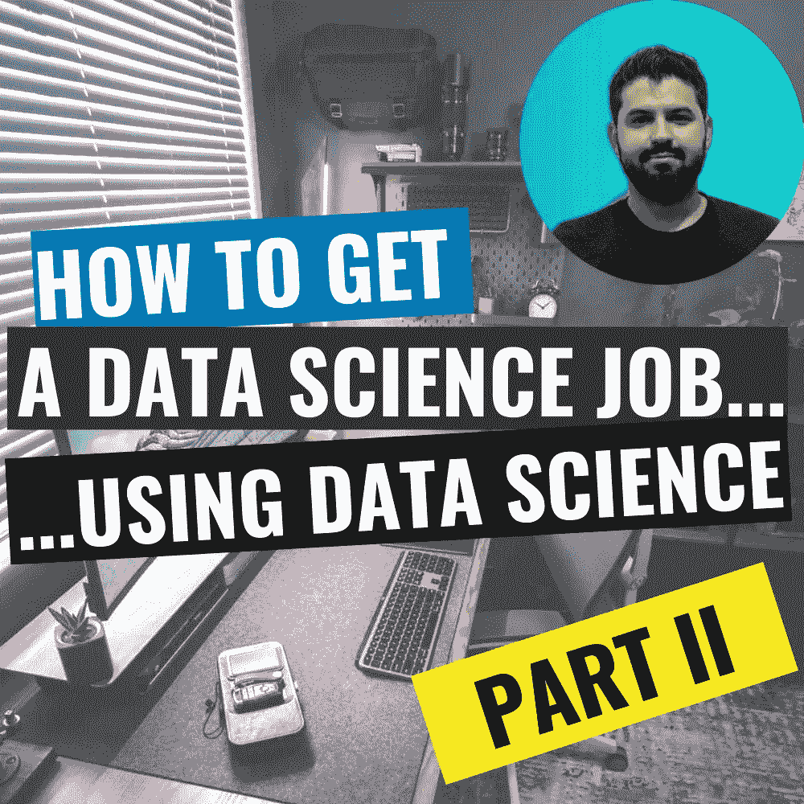
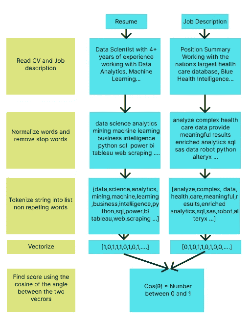
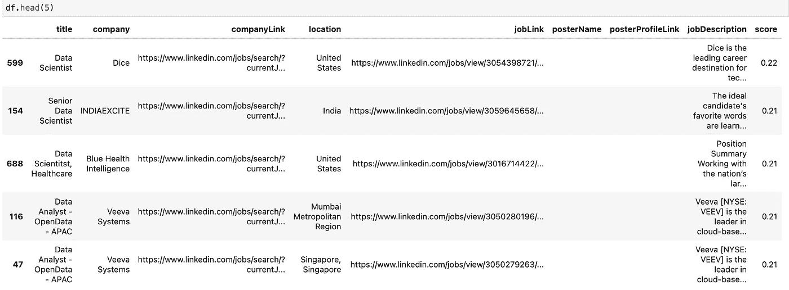

# 如何获得一份数据科学工作…使用数据科学-第二部分

> 原文：<https://medium.com/mlearning-ai/applying-data-science-and-web-scraping-to-find-a-job-on-linkedin-part-ii-f5f5caabd371?source=collection_archive---------0----------------------->



此处第一部分:[https://medium . com/@ erichhohenstein/applying-data-science-and-web-scraping-to-find-a-job-on-LinkedIn-part-I-7192 cf6 d 05 b？source = friends _ link&sk = b 30 bcdc 56994936 ecacc 0 baad 52 bcad 0](/@erichhohenstein/applying-data-science-and-web-scraping-to-find-a-job-on-linkedin-part-i-7192cff6d05b?source=friends_link&sk=b30bcdc56994936ecacc0baad52bcad0)

# 我们说到哪了？

在这个关于应用数据科学寻找数据科学工作的**系列的第一部分**中，我们学习了使用 Selenium 和 Python 的 Web 抓取技术。我们构建了几个 **Python 函数来登录 LinkedIn，进行工作搜索，进行网页抓取，提取所有的工作发布信息**，并最终将其放入熊猫数据框架。运行代码，我们搜索了**远程数据科学职位**，得到了 **1000 个职位发布**，如下所示:


LinkedIn Data Science jobs Scraped Data

我们在上一篇博文中留下的问题是:**手头有 1000 个工作，我应该先申请哪一个？**

# 寻找最佳匹配

正如我们在上一篇文章末尾提到的，我们希望**找到一种方法来评估一个职位与我们简历的匹配程度。**所以手头的首要任务是用 Python 读取我们的简历。

## 使用 Python 阅读 PDF

你的简历可能是 PDF 格式的(请不要用 word 发送你的简历……)，所以为了用 Python 阅读，我们将使用 **textract 库。**我们可以使用以下工具轻松安装该库:

```
pip install textract
```

那么我们将 PDF 读入字符串的 Python 函数如下:

```
def resumeReader(pdf):
    # Read Resume
    with open(pdf, "rb") as pdf_file:
        resume = textract.process(pdf).decode("utf-8").replace('\n',' ')
    return resume
```

其中参数“pdf”是我们的。pdf 文件

## 文本对比:简历与职位

自然语言处理是数据科学中一个不断发展的领域，每天都在寻找新的应用。在理解人类语言的本质方面，新的更强大的算法已经取得了很大进展。一个很好的例子是在这个**cold fusion**视频:[https://www.youtube.com/watch?v=Te5rOTcE4J4](https://www.youtube.com/watch?v=Te5rOTcE4J4)中，GPT-3 做了很好的解释

我们不会使用 GPT-3，因为我们想让事情变得简单。根据我作为数据科学家的经验，我认为**从简单易懂的模型开始，然后对其进行改进总是更好。**通过这种方式，我们可以将基本模型用作基准，然后与更加个性化的模型进行比较。**如果我们在一个更复杂的模型中看不到太多的改善，那就意味着我们的数据有问题。**它可能需要更多或更少的属性，或者我们需要更多的记录，或者我们甚至需要更好地清理训练数据。

我们处理简历和职位问题的方式将是 NLP 的一个很好的开端。我们将采取**的方法，将简历中的单词以及每个职位中的单词矢量化。**一旦我们将文本转换成单词向量空间中的向量，那么我们就可以**应用传统的余弦函数来比较这两个向量。这意味着找到两个向量之间角度的余弦值。我们用 Cos(θ)是因为，如果你还记得你的三角学课， **Cos(θ)在 0 和 1 之间，我们可以解释为概率或分数。**简单来说，如果简历和职位**向量完全相同**，这意味着它们有相同的精确单词，那么它们之间的角度为 0，Cos(0)=1** 。在相反的情况下，**如果它们完全不同**，即它们没有任何共同的单词，它们之间的角度将是 90 度，它们将是正交的，并且 **Cos(90)=0。**

我制作了下面的图表来解释我们应该遵循的流程:



## 数据清理

因为我们已经有了我们的简历和职位信息，图表中的下一步是清洁。这意味着一切都要小写，去掉标点符号和停用词。**停用词是不添加任何意义的词，如“一个”、“这个”、“他”、“但是”等。**清洗功能的代码如下:

```
def cleanText(text):
    # Lower case string
    text = text.lower() #lowercase string
    # Remove punctuation   
    text = text.translate(str.maketrans('', '', string.punctuation)) 
    # Tokenize string
    text_tokens = word_tokenize(text)
    # Remove Stop words
    tokens_without_sw= [word for word in text_tokens if not word in all_stopwords]
    text = ' '.join(tokens_without_sw)
    return text
```

我们从 **NLTK 库**中获得了标记化函数和停用词列表。一个非常常用的 NLP 库。我们可以简单地安装这个库

```
pip install nltk
```

## 评分功能

最后，我们可以很好地对每个职位和我们的简历进行评分。评分函数的代码如下

```
def score(resume,jobDescription):
    cv = CountVectorizer()
    resume = ' '.join(set(cleanText(resume).split(' ')))
    jobDescription = ' '.join(set(cleanText(jobDescription).split(' ')))
    text = [resume,jobDescription]
    count_matrix = cv.fit_transform(text)
    return round(cosine_similarity(count_matrix)[0][1],2)
```

细分一下，我们有**两个输入:**一个字符串包含我们的**简历**信息，一个字符串包含**的工作描述。**我们创建一个 CountVectorizer 实例。这是我们从另一个非常重要的数据科学库 **Scikit-Learn 库**导入的一个有用的函数。这个函数将帮助我们建立每个字符串的向量。我们还从这个库中导入了 cosine_similarity()函数来计算两个向量之间的余弦。我们通过以下方式导入这些函数:

```
from sklearn.feature_extraction.text import CountVectorizer 
from sklearn.metrics.pairwise import cosine_similarity
```

接下来，在我们的 score 函数中，使用。split(" ")方法。然后，我们对形成的列表应用 set()，以确保每个单词都是唯一的。然后我们使用。join()函数。接下来，我们使用之前讨论过的**计数矢量器**构建一个矩阵，然后**余弦相似度**函数可以最终生成我们的分数。

使用 **pandas，我们可以将这个评分函数**应用于所有的职位，并且**对数据框进行排序**。

```
pdf = "./Erich Hohenstein - Resume.pdf"
resume = resumeReader(pdf)
df['score'] = df['jobDescription'].apply(lambda x: score(resume,x))
df.sort_values(by=['score'],ascending=False,inplace=True)
```

然后，带有分数的结果数据框如下所示



Data frame with score for each Job post

## 最后的想法

通过这个 **2 部分的帖子系列**，我们已经涵盖了解决**现实生活中找工作问题的计划中的许多重要主题。我们讨论了**网页抓取技术**和良好实践。我们学习使用**硒**以及如何使用它**抓取一个网站**。我们还讨论了如何**用数据科学思维**解决问题，并应用一些数据科学概念，如 **NLP、标记化、在向量空间中工作等。****

我们开始自动收集工作职位，生成数据库，并为我们的最佳工作打分。即使分数可能没有人们想象的那么高，比如 0.8，0.9。我们明白，要做到这一点，我们的简历需要与招聘信息中的用词完全相同。所以我们在这里得到的是**优先级**的顺序，所以我们可以从高分到低分开始对每个工作应用**。**

在结束这篇文章之前，我想提到的第二件重要的事情是，既然我们有了一个数据库，我们现在可以对就业市场进行分析。我们可以**找到最需要的技术**和框架。这肯定能告诉你哪里有知识缺口，你可以填补，并有更好的工作机会。你也可以利用这些数据来**找到写简历的最佳“语言”。**找出**招聘人员**在工作岗位上写的东西，然后**在你的简历中使用完全相同的词语**，这样他们就能更好地让你合格，因为我可以向你保证，他们使用的方法与我们刚刚建立的方法非常相似。

此处第一部分:[https://medium . com/@ erichhohenstein/applying-data-science-and-web-scraping-to-find-a-job-on-LinkedIn-part-I-7192 cf 6d 05b？source = friends _ link&sk = b 30 bcdc 56994936 ecacc 0 baad 52 bcad 0](/@erichhohenstein/applying-data-science-and-web-scraping-to-find-a-job-on-linkedin-part-i-7192cff6d05b?source=friends_link&sk=b30bcdc56994936ecacc0baad52bcad0)

代码:[https://github.com/erichho/LinkedIn-Job-Webscraper](https://github.com/erichho/LinkedIn-Job-Webscraper)

[](/mlearning-ai/mlearning-ai-submission-suggestions-b51e2b130bfb) [## Mlearning.ai 提交建议

### 如何成为 Mlearning.ai 上的作家

medium.com](/mlearning-ai/mlearning-ai-submission-suggestions-b51e2b130bfb)