# 应用机器学习进行 A/B 假设检验

> 原文：<https://medium.com/mlearning-ai/applying-machine-learning-for-a-b-hypothesis-testing-d7cf57720bbf?source=collection_archive---------5----------------------->

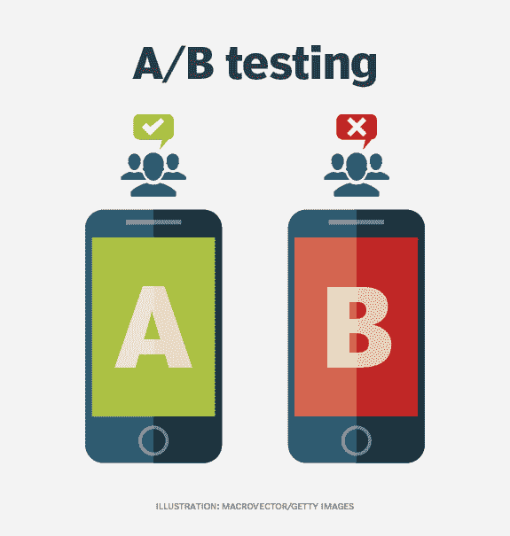

# **什么是 A/B 测试？**

A/B 测试是一种比较某个东西的两个版本，以找出哪个版本性能更好的方法。虽然它最常与网站和应用程序联系在一起，但这种方法已有近 100 年的历史，是随机控制实验的最简单形式之一。

本质上，A/B 测试消除了网站优化中的所有猜测，让有经验的优化者做出数据驱动的判断。

要测试的两个版本可分为:对照组，那些被展示产品或服务当前状态的人和治疗组，那些被展示测试产品或服务的人。

然后监控每组的转化率，以确定哪一组更好。A/B 测试中的随机性是隔离变更影响和减少混杂变量潜在影响的关键。

# **什么是假设检验？**

假设检验是一种统计推断方法，用于确定手头的数据是否足以支持特定的假设。

假设检验是循证决策的基石。A/B 测试框架是最常用的统计框架，用于在当今商业的各个方面进行渐进但重要的变革。

在这个项目中，我们使用了三种方法来进行 A/B 假设检验。

*   传统(经典)A/B 测试
*   顺序 A/B 测试
*   使用 ML 算法的 A/B 测试

在这里，我尝试对每种方法及其优点和局限性做一个预演。但是首先让我们了解一下我们使用的数据。

**数据**

随机抽样用于生成该项目的数据。生物数据是在线用户对以下问题的“是”和“否”的回答。

***问:*** *你知道力士这个品牌吗？*

*   是
*   不

这是一次测试，主要目的是验证您构建的假设算法。SmartAd 于 2020 年 7 月 3 日至 10 日开展了这项活动。根据以下规则选择向其提供上述问卷的用户:

*   **控制**:显示虚假广告的用户
*   **Exposed** :向用户展示 SmartAd 为客户设计的创意(广告)。

数据可以在这里[找到。它包含以下几列。](https://drive.google.com/file/d/1taCPRDAy4w_nrp33YvFRWpzlDe_JGXxY/view?usp=sharing)

*   **auction_id** :在线用户的唯一 id。在标准术语中，这被称为印象 id。用户可能会看到简历问卷，但选择不回答。在这种情况下,“是”和“否”列都为零。
*   **实验**:用户属于哪一组——控制还是暴露。
*   **日期**:YYYY-MM-DD 格式的日期
*   **小时**:HH 格式的一天中的小时。
*   **device_make** :用户拥有的设备类型名称，如三星
*   **platform_os** :用户拥有的操作系统的 id。
*   **浏览器**:用户用来查看简历问卷的浏览器名称。
*   **是** : 1 如果用户为生物问卷选择“是”单选按钮。
*   **否** : 1 如果用户选择生物问卷的“否”单选按钮。

# **经典 A/B 测试**

它的原则非常简单:

1.  定义基线转换和最小可检测效应(MDE):

*   **基线转化率** n —定义您要测试的广告的当前转化率的百分比。
*   **最小可检测效应(MDE** ) —最小预期转换升程。

2.使用上述变量和统计功效以及显著性水平，计算有意义实验所需的样本量。

*   **统计功效** —检测到最小效应尺寸的时间百分比，假设其存在。通常，80%是一个最佳的统计功效。
*   **显著性水平** —差异(MDE)被检测到的时间百分比，假设差异不存在。简单地说，它是一个测试证明你的假设的时间百分比，而实际上这个假设是错误的。在 SmartAd A/B 测试中使用了 5% ( 𝛼=0.05)的显著性水平。

3.驱动流量到你的变化，直到你达到每个变化的目标样本。

4.最后，评估你的 A/B 测试结果。

如果变体之间的性能差异达到或超过 MDE，则证明您的实验的假设是正确的，否则，有必要从头开始测试。

**选择的指标**

正如我们在数据上看到的，它有两列包含对问卷的选择。我们为这个项目选择的衡量标准是转化率，也就是说，回答“是”的人数除以回答总数。

**陈述假设**

我们想要测试的假设是，我们给控制组的假广告和有创意的智能广告之间的表现是否有差异。为此，我们对其转换率的统计显著差异感兴趣。

*   **零假设**:说明控制组和暴露组的敬业度得分没有统计学意义。
*   **替代假设**:说明控制组和变异组敬业度得分有不同的结果，其中一个具有统计学意义。

我们想拒绝零假设，这样我们就可以说实验是成功的，不是偶然发生的。这将使我们的实验具有可重复性。

**基线转化率**

BCR 的计算方法是用回答“是”的人数除以总人数。即 *bcr=num。是/总人数*。这是我们得到的数据结果。

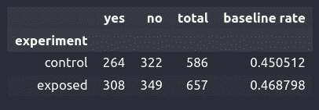

**所需样本量**

我们计算了进行有意义实验所需的样本量，结果是每个实验组有 **38932** 个样本。但是我们每个对照组和暴露组分别有 586 个和 657 个。可以得出结论，我们的样本量太小了。

**计算 p 值和 z 值**

*p 值*是一种统计测量值，用于根据观测数据验证假设。它帮助我们确定当假设零假设为真时，得到特定结果的可能性有多大。

p 值是使用零假设下的检验统计的抽样分布、样本数据和所做的检验类型(下尾检验、上尾检验或双边检验)来计算的。

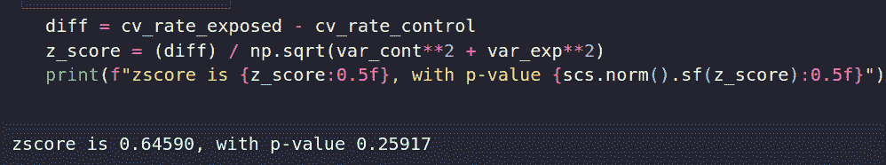

*   p 值或概率值告诉您数据在零假设下出现的可能性有多大。如果假设零假设是真的，p 值给我们一个样本有多奇怪的估计。
*   如果 p 值非常小(<0.05) then we are likely to reject the null hypothesis. Here we can see the p-value we got is 0.25917, which is greater than the significance level (0.05).

Thus, we fail to reject the null hypothesis. So, we came to the conclusion that there is no statistically significant difference between the two campaigns that SmartAd ran.

**传统 A/B 测试的局限性**

*   运行 A/B 测试可能比其他测试方法需要更长的时间，并且会消耗资源和时间
*   它假设了一个不变的世界观，没有考虑到趋势和消费者行为的变化。

# **顺序 A/B 测试**

在序贯 AB 检验中，AB 检验停止时的最终样本量取决于我们在检验过程中观察到的数据。因此，如果我们在开始时观察到更多的极端结果，测试可以更早结束。

顺序 A/B 测试最棒的地方在于，它给用户一个更早完成实验的机会，而不会增加错误结果的可能性。听起来很棒，不是吗？现在让我们弄清楚这种类型的测试是如何工作的，以及是什么使得快速得到结果成为可能。

为了实现这一点，绘制了一对统计边界，例如基于我们希望在测试中获得的 I 类错误率。对于我们获得的每一个新数据点，我们的数据的对数似然比之和将与这些边界进行比较。

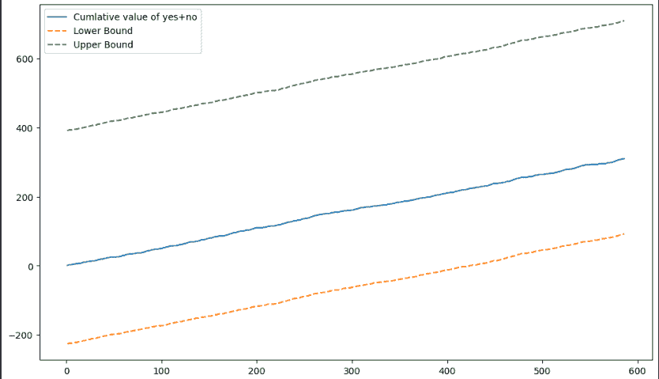

Sequential testing result

在上图中可以看到有 3 条线。顶部和底部的两条线描述了统计边界。中间一行是实验的累计值。

*   如果累计值线穿过或收敛于上限，我们拒绝零。
*   如果累计值线穿越或收敛于下限，我们接受零。即各组之间没有统计学上的显著差异。

可以看出该行不拒绝也不接受空值。我们需要继续测试，看看它是否收敛到上界，拒绝零。

**顺序测试的优势**

*   让您有机会在不增加错误结果可能性的情况下提前完成实验
*   优化必要的观察(样本大小)
*   降低出错的可能性

**顺序测试的缺点**

*   如果我们关心保留类型 I 错误，我们需要认识到我们正在做多重比较
*   允许在不增加错误结果风险的情况下提前完成研究。在三次数据分析后，我们有三种非独立的可能性产生第一类错误。
*   对于固定的样本大小和显著性水平，与等待所有数据进入相比，顺序测试最终会降低功耗。

# **使用机器学习的 A/B 测试**

机器学习是指系统在没有人类直接控制的情况下学习输入和输出数据之间的关系。该过程用于创建算法和模型，这些算法和模型能够理解数据，而无需由人类程序员直接编写模型。这些算法可用于决策、数据分类或执行复杂任务。

使用机器学习的 A/B 测试的主要优势是我们可以从两个以上的变量(控制/暴露)中收集洞察力。它允许我们从复杂的系统中获得洞察力。

使用算法，我们可以模拟复杂的系统，包括所有正在进行的事件、用户特征等等。

带有机器学习的 A/B 测试可以结合起来:

*   测试和改进新机器学习模型的部署。
*   自动化 A/B 测试，使流程更加高效和有效。
*   在开发或调整算法时，发现关于数据集和变量的有用信息。

为了使用 ML 测试假设，我们选择使用三种机器学习算法，并试图确定每个模型的准确性分数。

这些算法是:

*   逻辑回归
*   Xgboost
*   决策树

对于每个模型，我们将数据分为 70%的训练集、20%的验证集和 10%的测试集。

**用于使 ML 流程可重复且端到端的工具**

**Git/Github: *Git*** 是一个版本控制工具(软件)，用于跟踪源代码的变化。 ***GitHub*** 是一个基于网络的云服务，用来托管你的源代码(Git 仓库)。这是一个中央集权的系统。Git 不需要 GitHub，但是 GitHub 需要 Git

**DVC(数据版本控制)**——是一个类似 Git 的开源控制系统，用于单独处理和跟踪我们的数据。DVC 的一些用途是:

*   像捕获代码一样跟踪和保存数据和机器学习模型；
*   轻松创建数据版本和 ML 模型并在它们之间切换。
*   理解数据集和 ML 工件最初是如何构建的。
*   比较实验中的模型度量。

**MLflow:** 是一个开源工具，最初由 DataBricks 推出，它帮助管理 ML 生命周期的多个阶段。它让我们可以使用任何库来训练、重用和部署模型，并将它们打包成可重复的步骤，其他数据科学家可以将其用作“黑盒”，甚至不必知道您正在使用哪个库。一般来说，MLflow 有这些优点。MLflow 项目是打包可重用数据科学代码的标准格式。

**交叉验证(样本外测试)**

交叉验证是一种重采样方法，它使用数据的不同部分在不同的迭代中测试和训练模型

对于这个项目，我们使用 K-fold ( **k=5** )交叉验证重采样方法。我们使用 K-fold 是因为它确保了原始数据集中的每个观察值都有机会出现在训练和测试集中。将数据随机分成 5 个折叠，在 k-1 个折叠中训练模型，同时保留一个折叠来测试模型。在我们的例子中，数据首先被分成训练集和测试集。训练数据集用于交叉验证。

为了用 ML 方法测试我们的假设，我们通过按浏览器和 platform_os 分割干净数据来创建干净数据的版本，并将它们保存在 CSV 文件中。

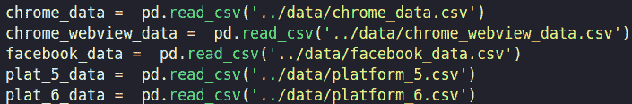

# **逻辑回归**

我们使用逻辑回归函数创建了一个线性回归模型。然后，我们使用之前保存的所有版本的数据来训练线性回归模型。为模型选择的参数使用 5 重交叉验证来确定，以防止过度拟合和欠拟合。然后，我们使用测试数据评估我们的模型。

下面是我们使用 5 重交叉和逻辑回归得到的一些准确性结果。

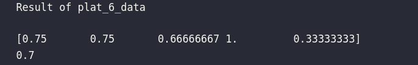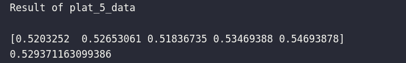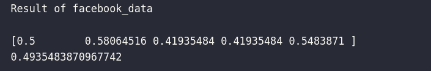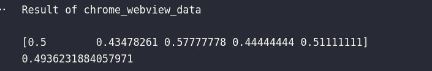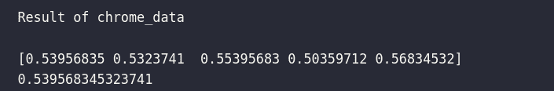

*   如果我们仔细观察，5 倍逻辑回归的最大准确度是 0.75。
*   这可能意味着数据不足或模型不是最适合的，因为精度小于 0.8，即 80%。

在训练了模型之后，我们试图将用于训练回归模型的特征的重要性可视化。

**特征重要性**指的是为给定模型的所有输入特征计算分数的技术——分数仅仅代表每个特征的“重要性”。较高的分数意味着特定特征将对用于预测某个变量的模型产生较大的影响。

下面是一些拆分数据的例子。

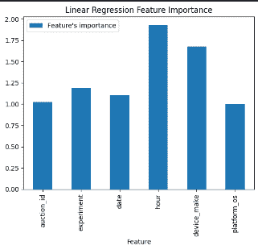

feature importance of chrome mobiledata

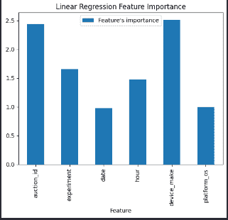

fig: feature importance of chrome webview data

# **XGboost**

XGBoost 是梯度提升机器的可扩展和精确的实现，它已经证明推动了提升树算法的计算能力的极限，因为它是为了模型性能和计算速度的唯一目的而构建和开发的。

这里是我们使用 xgboost 和 5 重交叉验证得到的一些结果。

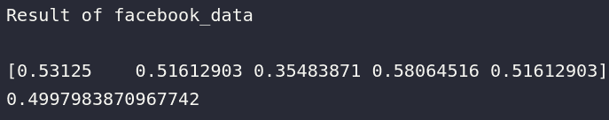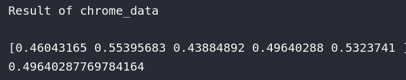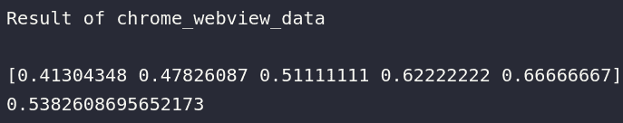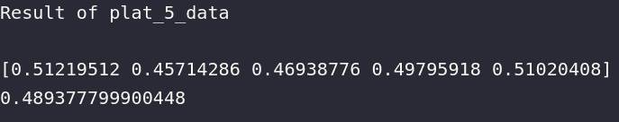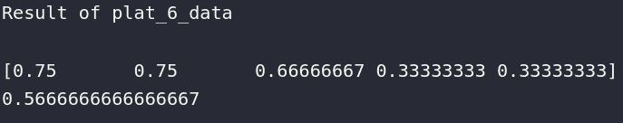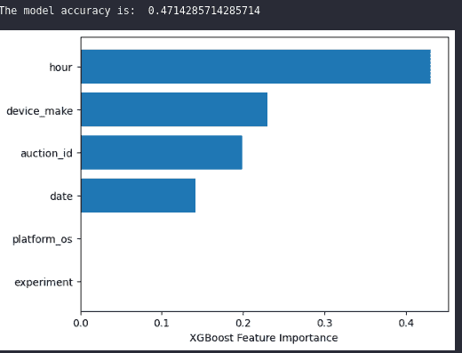

fig : feature importance of chrome data using xgboost

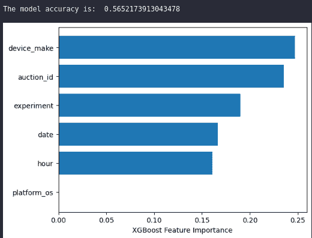

fig: feature importance of chrome webview data

# **决策树**

决策树是一种用于分类和回归的非参数监督学习方法。目标是创建一个模型，通过学习从数据特征推断的简单决策规则来预测目标变量的值。

我们使用标签编码器算法将特征转换成数字形式，以便使它们成为机器学习可读的形式。例如，标签“是”或“否”不是机器学习可读的，所以我们必须将它们转换成 ML 可读的形式。标签编码基本上将*‘是’***转换为 1，将*‘否’*转换为 0。**

**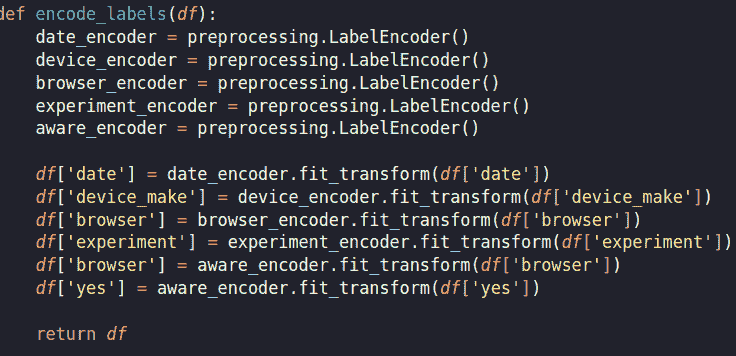**

**然后，我们为每个分割的数据选择特征来训练模型。**

**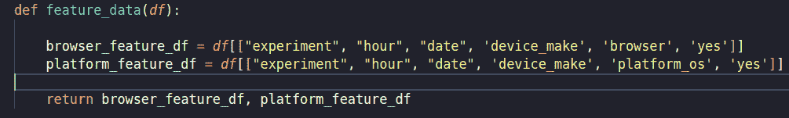**

**然后，我们将数据分成训练集和测试集。**

**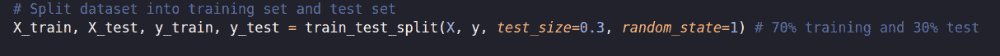**

**然后，我们创建了一个决策树分类器对象，然后训练集。之后，我们使用测试集来测试模型。**

**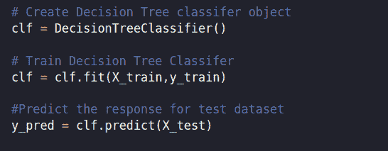**

**下面我们可以看到模型的准确率得分。**

**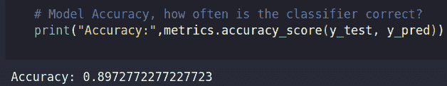**

****结论****

*   **逻辑回归和 Xgboost 模型准确性结果似乎几乎相同。这可能是数据太小的结果。**
*   **我们还发现决策树更准确。然而，数据太小，我们没有使用交叉验证来防止模型过拟合和欠拟合，所以我们可以说实验是成功的。**
*   **通过经典 A/B 测试，我们确定了品牌认知度是否有显著提升，这有助于 smartAd 采取下一步行动。我们在这种情况下没有发现，因为数据太小。**
*   **通过机器学习，我们发现其他特征，如一天中的时间和日期，决定了品牌意识的转变。这提供了一个更广泛的知识，即什么促成了广告活动的成功或无变化。**
*   **Github 代码可以在[这里](https://github.com/nahomHmichael/abtest-mlops/)找到。**

****参考文献****

*   **[https://hbr.org/2017/06/a-refresher-on-ab-testing](https://hbr.org/2017/06/a-refresher-on-ab-testing)**
*   **[https://splitmetrics.com/blog/sequential-a-b-testing](https://splitmetrics.com/blog/sequential-a-b-testing/)**
*   **[https://databricks . com/session _ eu20/data-versioning-and-reproducible-ml-with-DVC-and-ml flow](https://databricks.com/session_eu20/data-versioning-and-reproducible-ml-with-dvc-and-mlflow)**

** [## Mlearning.ai 提交建议

### 如何成为 Mlearning.ai 上的作家

medium.com](/mlearning-ai/mlearning-ai-submission-suggestions-b51e2b130bfb)**