# 将机器学习应用于 A/B 测试:广告活动绩效

> 原文：<https://medium.com/mlearning-ai/applying-machine-learning-for-a-b-testing-ad-campaign-performance-896e4fd4252b?source=collection_archive---------10----------------------->

# **概述**

一般来说，A/B 测试是一种比较两个模型以确定哪个表现更好的方法。

本博客涵盖以下几点:

*   A/B 测试基础
*   经典 A/B 测试的局限性和挑战
*   顺序 A/B 测试的利弊
*   机器学习环境下的 A/B 测试公式
*   数据审查和 ML A/B 测试结果
*   MLFlow 和 DVC 在 ML 实验中的优势

# **A/B 测试的基础及其用例**

A/B 测试，也称为桶测试，是一种随机向用户展示产品的两个变体，然后使用不同的统计分析方法来确定哪个变体推动更多的转化的实验。

这种分析是在不同的学科领域进行的。以下是一些使用案例，

*   重新设计网站
*   服务、功能或插件的变更
*   产品或服务价格的变化

从技术上讲，A/B 测试是一种统计和双样本假设测试。统计假设检验是一种 A/B 检验，将样本数据与总体数据进行比较。而双样本假设检验是对两个样本之间的差异是否具有统计显著性的衡量。

尽管 A/B 测试有各种各样的用例，但在这里，我们将讨论数据科学领域的应用，特别是一个广告活动项目。

该项目正在对从广告公司收集的关于用户对广告的反应的数据进行 A/B 假设检验。在项目中，我做了三种 A/B 测试，分别是:

*   经典 A/B 测试
*   顺序 A/B 测试
*   用于 A/B 测试的机器学习

# **经典 A/B 测试**

经典的 A/B 测试基本上是根据计算出的样本大小进行的测试。样本大小是根据我期望测试检测到的阈值效应来计算的。

**传统 A/B 测试的局限性和挑战**

经典 A/B 测试的主要限制是，它需要非常大的数据集才能得到好的结果，而用少量数据进行这种测试最终会得到不可靠的输出。

# 顺序 A/B 测试

序贯 A/B 测试是一种通过使用一小部分数据来测试我们的假设的测试。

顺序过程是这样工作的:

1.  首先，我选择一个样本大小的𝑁N.
2.  将受试者随机分配到治疗组和对照组，每组 50%的概率。
3.  跟踪来自治疗组的成功数量。打这个号码到𝑇T.
4.  跟踪从控制组传入的成功次数。打这个号码到𝐶C.
5.  如果𝑇−𝐶T−C 到达 2𝑁‾‾√2N，停止试验。宣布治疗为获胜者。
6.  如果𝑇+𝐶T+C 到达𝑁N，停止试验。宣布没有赢家。

**顺序 A/B 测试的利弊**

优点:

*   在实验上花更少的时间
*   减少交通费用
*   降低出错的可能性
*   减少所需的转换数量

骗局

*   由于使用小样本数据而丢失的信息
*   复杂性增加

# 机器学习环境下的 A/B 测试公式

与统计推断不同，机器学习算法使我们能够对包括所有正在发生的事件、用户特征等在内的复杂系统进行建模。有许多算法，每种算法都有优缺点。

在这个项目中，我通过四种不同的算法使用五重交叉验证来训练一个模型。这些是；

*   逻辑回归
*   决策图表
*   XGBoost
*   随机森林

# 数据审查和 ML A/B 测试结果

我使用的数据有 9 个特征和 8077 个实例，它是从一个公司的广告活动中收集的。

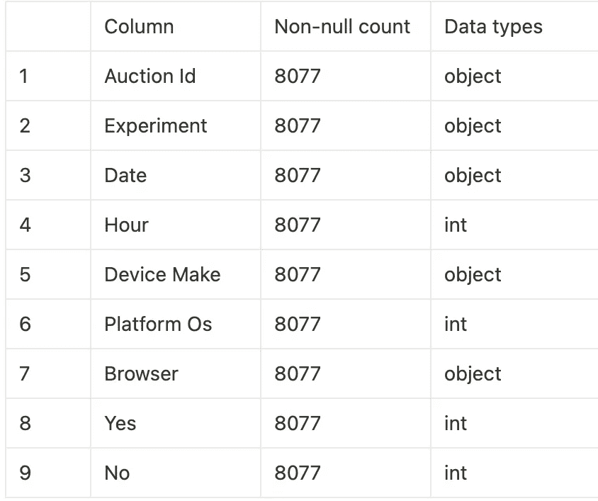

该数据具有零空值，并且具有分类数据，我需要将其转换为数字来训练模型。

数据快照如下所示:

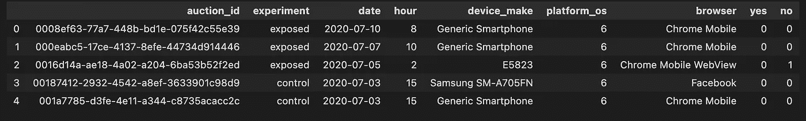

获得关于数据的基本信息后，我探索了每个特性所具有的独特值，并将其可视化为图表。

1.  实验

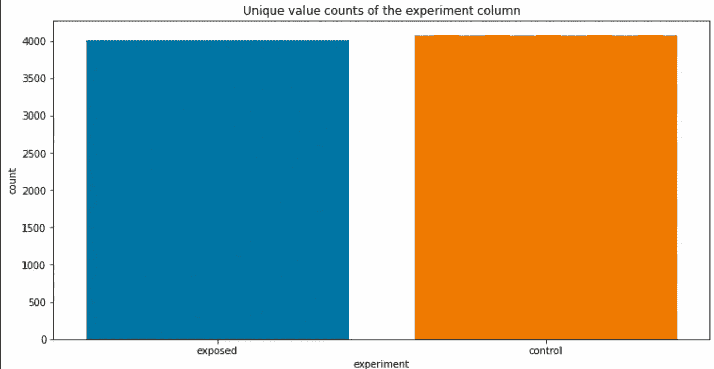

从这一形象化来看，暴露组和对照组的数值在数量上是平衡的。

2.日期

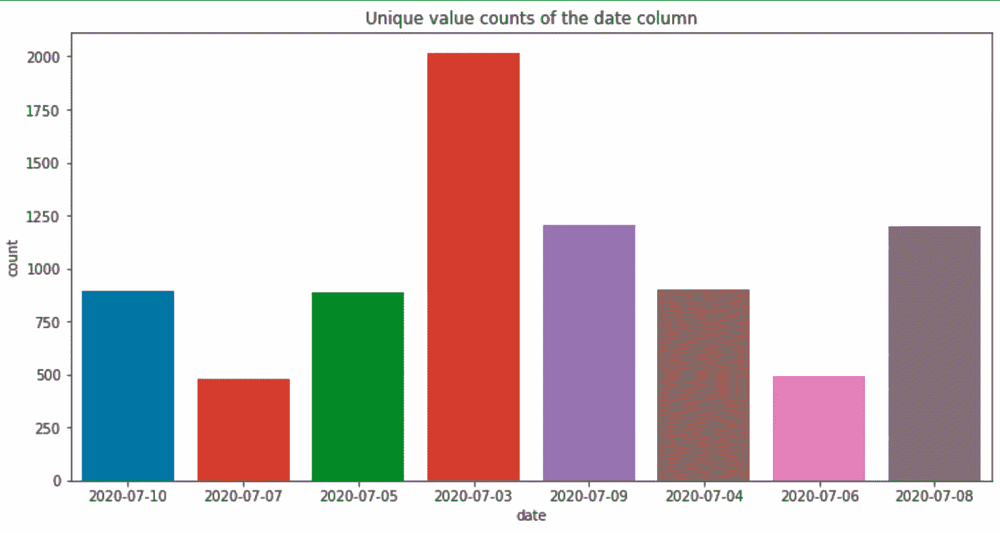

从图中我可以推断出第一天接待的游客数量是其余几天中最多的。

3.小时

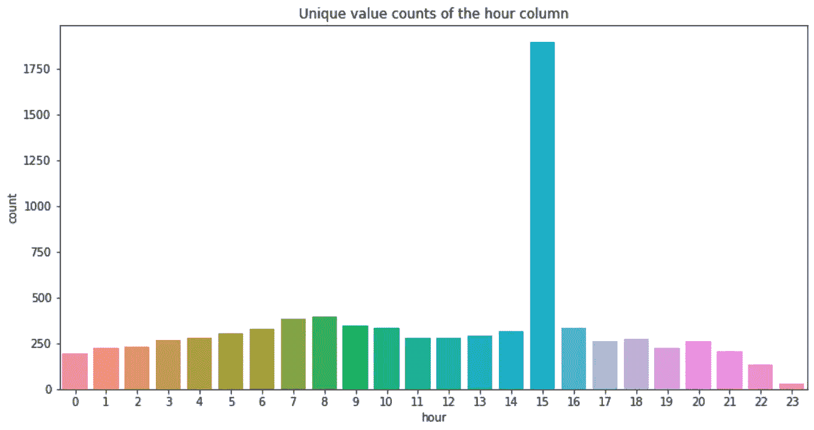

15 小时是最繁忙的，因为游客流量非常高，几乎是平均休息时间的 3 倍。

3.平台操作系统

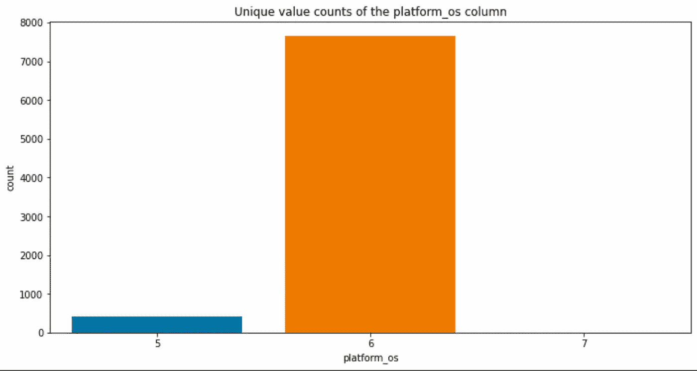

从数据来看，大多数用户都使用标记为“6”的操作系统。

4.浏览器

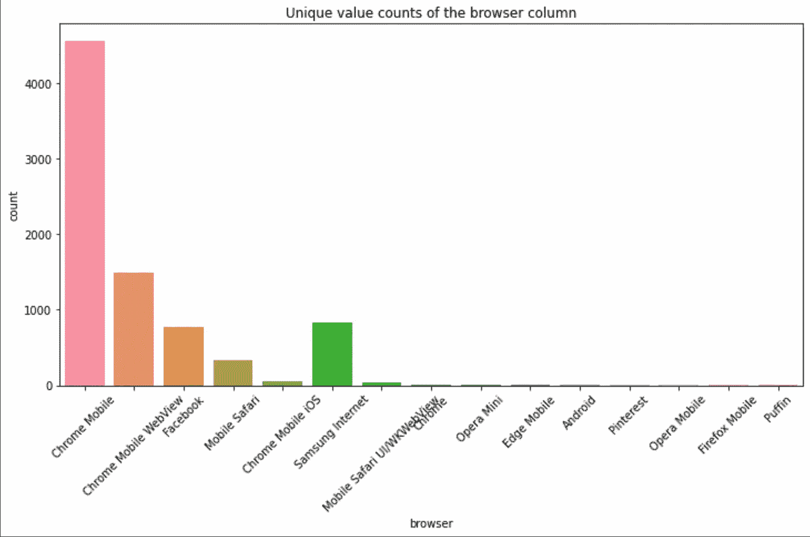

Chrome 浏览器是用户中使用最多的浏览器。

5.是

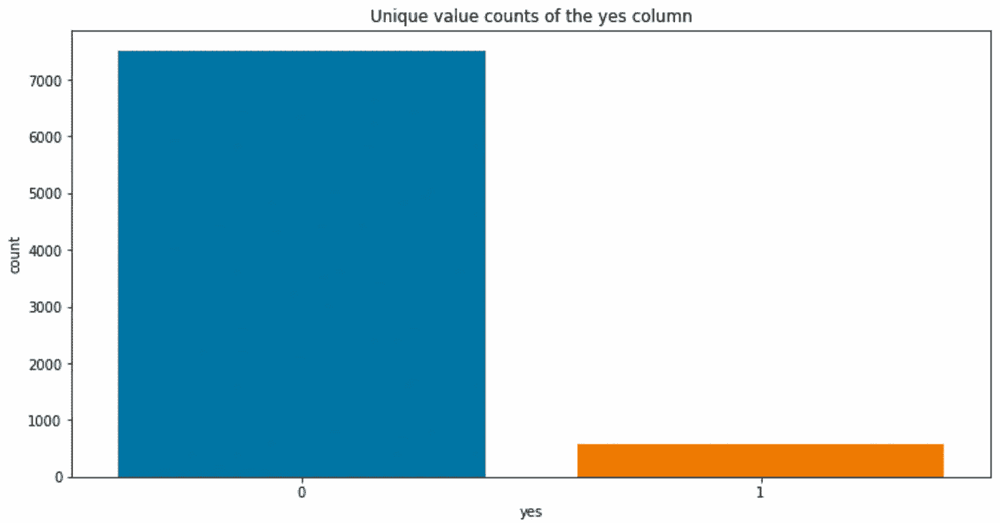

6.不

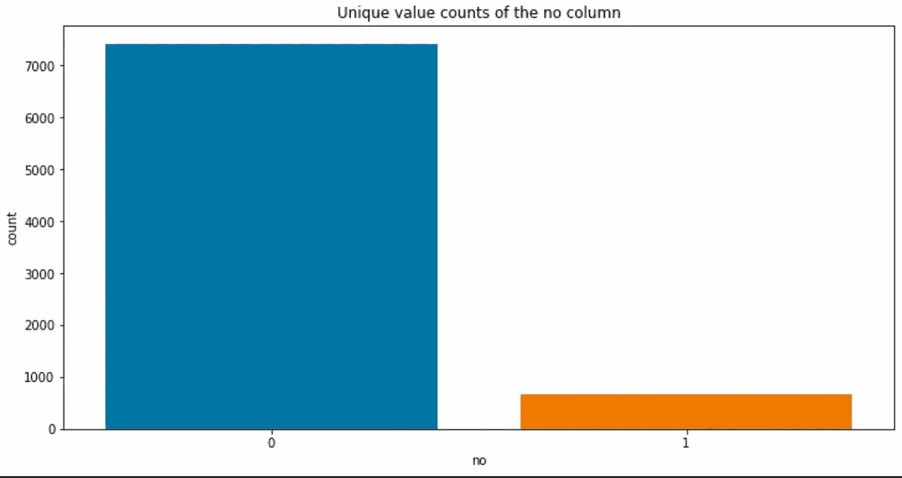

因为上面的数据有分类值(不是数字)，所以我用标签编码器把它们转换成数字。

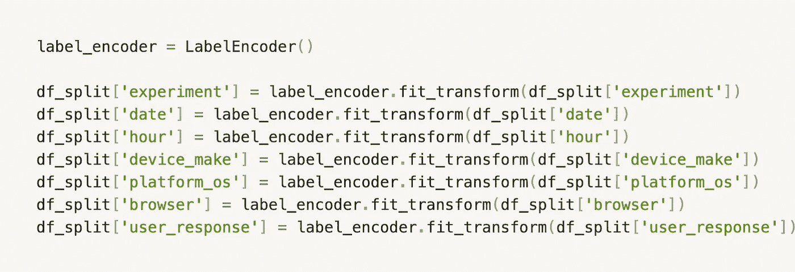

然后，我得到以下数据作为输出

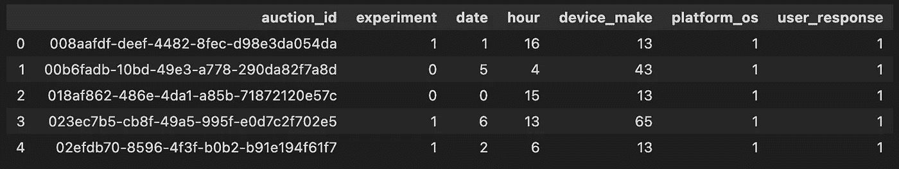

在标签编码之后，我将数据分割成训练、测试和验证数据集来进行训练。

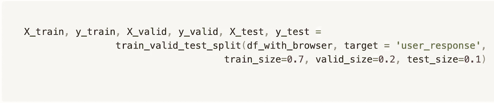

然后我用训练数据在我前面提到的四种算法中训练 model，得到如下输出精度。

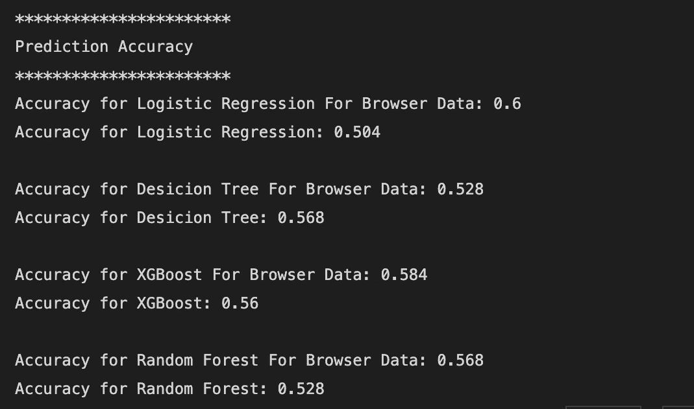

在训练模型时，我集成了 MLFlow 和 DVC。我用 MLFlow 来记录我的训练信息并跟踪它，用 DVC 来处理不同版本的数据。

# MLFlow 和 DVC 在 ML 实验中的优势

在对我们拥有的数据进行多重分析时，使用 MLFlow 和 DVC 非常重要。MLFlow 帮助我们注册模型，并跟踪实验中的差异和改进。而 DVC 帮助我们管理实验中使用的不同版本的数据。

在这个项目中，我使用了这两种工具，并帮助我轻松地管理上述困难，并随着时间的推移可视化我的培训。

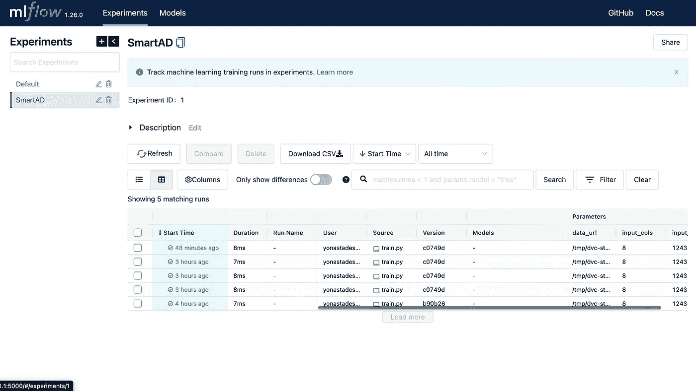

# 研究的局限性

这项研究的局限性在于它试图用非常少量的数据进行分析和测试。这阻碍了对需要大数据集的逻辑回归等算法得出可靠的结论。因此，对于更大的数据集，实验的输出可能会改变。

 [## Mlearning.ai 提交建议

### 如何成为 Mlearning.ai 上的作家

medium.com](/mlearning-ai/mlearning-ai-submission-suggestions-b51e2b130bfb)