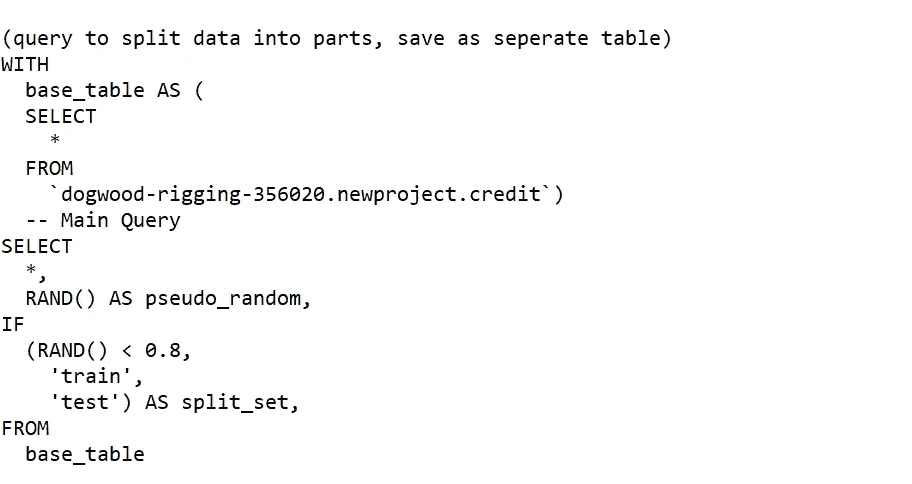
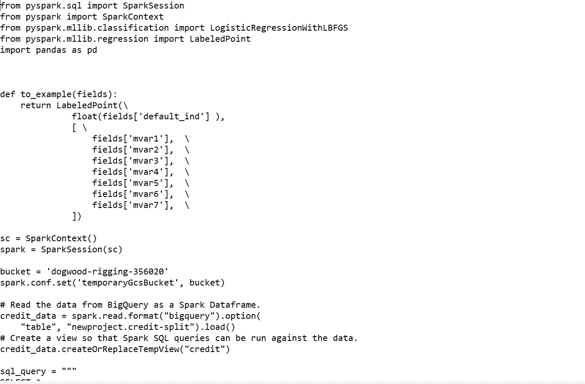
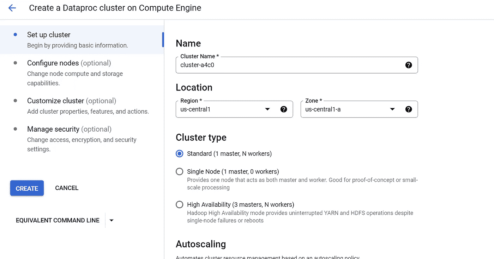
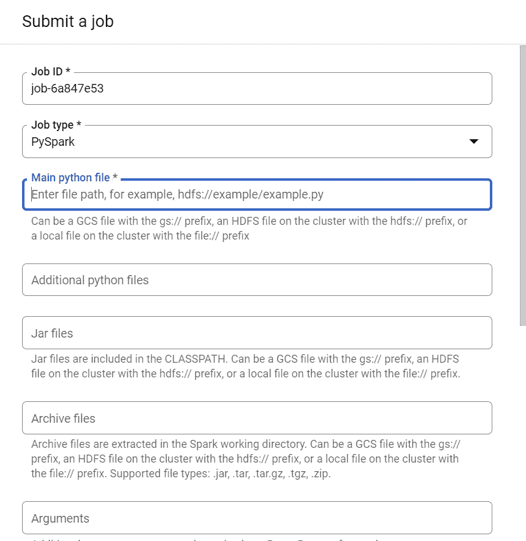

# 使用 Apache Spark 对 BigQuery 中的数据进行机器学习

> 原文：<https://medium.com/mlearning-ai/applying-machine-learning-on-data-in-bigquery-using-apache-spark-d52f0a5c1dc0?source=collection_archive---------5----------------------->

Photo by [Icons8 Team](https://unsplash.com/@icons8?utm_source=medium&utm_medium=referral) on [Unsplash](https://unsplash.com?utm_source=medium&utm_medium=referral)

谷歌云平台拥有一系列强大的大数据分析工具，可以从您的数据中获取最大价值。一个巨大的价值是能够使用运行在 Dataproc 集群上的机器学习工具从 BigQuery 存储平台中存储的数据中无缝提取洞察力。在本文中，我将简要描述我如何开发定制代码来从 BigQuery 读取数据，在 Dataproc 集群上运行机器学习算法，然后将结果与预测结果一起导出回 BigQuery。

***本次演习的目的***

***本练习的目标是使用在 GCP 平台上开发的机器算法，使用提供的数据预测给定申请的贷款违约可能性。***

1.  **完工资源**

a.一个关于信用数据的 CSV 文件，可以在[这里](https://github.com/damianohienmhen/MachineLearningwithApacheSpark.git)获得。

b.一个 GCP 项目。

CSV 文件包含几列反映各种特征的数据，这些特征决定了表示为“default_ind”的信用默认变量。在将文件上传到 BigQuery 之前，需要进行数据清理。这些包括用“0”值替换所有缺失和空单元格值，选择 mvar21-mvar27 列行并将其重命名为 mvar1-mvar7，以及删除除 application_key、mvar1-mvar7 和 default_ind 之外的所有其他列。这些将是您的机器学习模型的功能集和目标值。您可以使用 Excel 或 Google Cloud DataPrep 来进行数据清理。

**2。创建一个大查询数据集**

在 BigQuery 中，创建一个名为“newproject”的数据集和两个名为“credit”和“credit-test”的表。在创建“信用”表的过程中，指示您的模式包括 application_key、mvar1、mvar2、mvar3、mvar4、mvar5、mvar6、mvar7 和 default_ind。对“credit-test”表进行同样的操作，但是在模式中添加一个名为“pred”的列。

**3。将您的信用数据上传至“信用”表**

将您的 CSV 文件上传到“信用”表中。接下来，运行以下查询，将您的数据分成 2 批，用于训练和测试您的机器学习模型。将查询结果保存在一个名为“credit-split”的单独表中。

Query to Split Data for ML Model

**4。创建存储桶**

在 GCP 控制台中导航到云存储。创建 2 个存储桶，一个用您的项目 ID 名，另一个标题为**“temporaryGcsBucket”**。

**5。创建你的 SparkML Python 文件**

我提供了用 Python 编写并使用 SparkML 框架的机器学习代码片段，该框架从 BigQuery 表中加载信息，对其应用逻辑回归 ML 模型，并返回一个名为“pred”的列，该列表示“default_ind”列对带有“test”标签的行的模型预测。然后，这些结果被导出到您在前面的步骤中创建的表“credit-test”中。将 python 文件命名为 spark.py，并上传到以项目 ID 命名的存储桶中。

SparkML code for Machine Learning Project

**6。旋转 Dataproc 集群**

现在是有趣的部分！您已经准备好启动 Dataproc 集群并导入您的 python 模型来完成您的机器学习目标。我们希望为我们提供的数据生成一个可以预测“default_ind”列的模型。逻辑回归模型非常适合这项工作，因为它可以为任何要素集输入计算 2 个可能的值。我们希望计算的值是 0(意味着客户**不会**拖欠贷款)和 1(意味着客户**会**拖欠贷款)。我们的 python 文件将使用 BigQuery 表中的训练数据，生成一个逻辑回归模型，然后使用我们的测试数据来查看它在预测结果方面的准确性。

Dataproc Cluster on Google Cloud Platform

在导航菜单上导航到 Dataproc。选择顶部的“创建集群”,并在出现的弹出窗口中点击“计算引擎”。大多数设置都可以使用默认值。完成后点击“创建”。配置您的群集可能需要 5 分钟。

**7。提交您的工作**

既然您的集群已经启动并运行，现在您可以提交您的 ML 作业了。首先，单击您新配置的集群，并选择顶部的“提交作业”。以下表格出现在您的屏幕上。

Submit a Job Form

确保选择 PySpark 作为您的作业类型，因为您正在使用“Python-Spark”来描述您的机器语言流程。在主 python 文件框中，选择云存储中 python 文件的路径。在 Jar 文件中，添加名称 GS://spark-lib/big query/spark-big query-latest . Jar。将其他输入留空，然后点击提交。您的作业将需要几分钟时间(大约 5 分钟)才能完成，之后将报告作业已成功完成。

**8。在 BigQuery** 中导航到您的“信用测试”表

要查看导出的结果，请导航到 BigQuery 表，在该表中，您将看到 ML 工作流的结果。测试集的预测结果将出现在“pred”列中，与“default_ind”列中的预期值在一起。

现在你知道了！您已经成功地对存储在 BigQuery 数据仓库中的数据部署了机器学习算法，并将结果导出回 BigQuery 进行分析！

**9。删除未使用的资源。**

我建议您拆除并删除任何未使用的项目和 dataproc 集群，以及任何专门为此项目创建的存储。这是为了防止产生任何信用来保持这些资源的运行。

 [## Mlearning.ai 提交建议

### 如何成为 Mlearning.ai 上的作家

medium.com](/mlearning-ai/mlearning-ai-submission-suggestions-b51e2b130bfb)