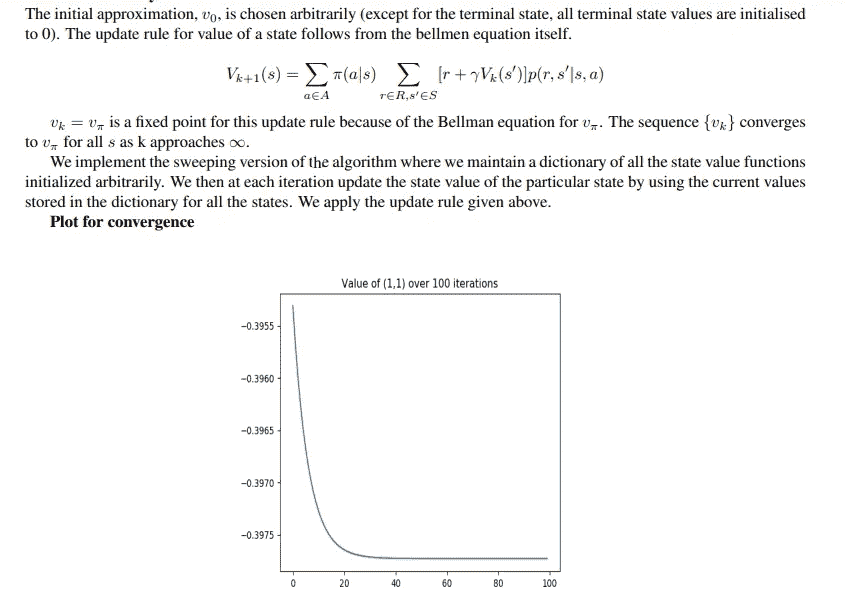
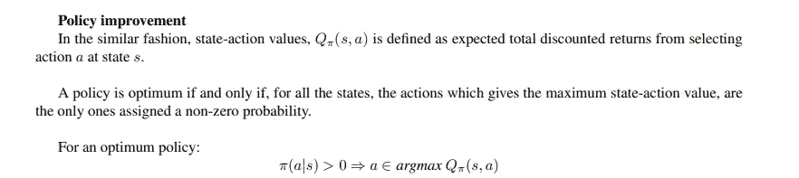
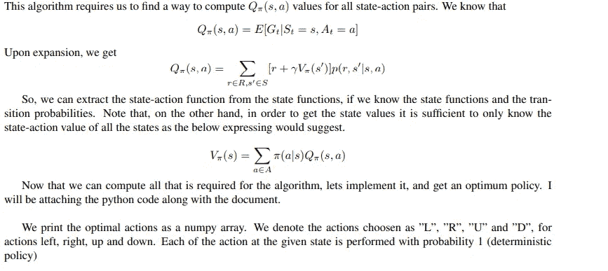
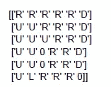
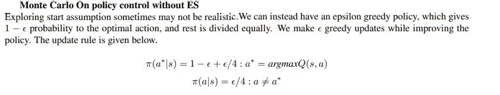

# 应用强化学习算法解决网格世界问题

> 原文：<https://medium.com/mlearning-ai/applying-reinforcement-learning-algorithms-to-solve-gridworld-problems-29998406dd75?source=collection_archive---------6----------------------->

1.**简介**
在一个网格世界问题中，一个智能体被放置在一个 **M X N** 矩形阵列上。网格的单元对应于环境的状态。在每个单元格中，有四种可能的操作:向上、向下、向左和向右。代理的目标是学习一个策略，在特定的状态下随机或确定地选择一个动作。环境
通过将代理带到下一个状态并立即给予代理奖励来做出响应。例如，如果代理位于(I，j)，第 I 行，第 j 列。通过选择“向左”动作，环境可以通过将代理带到(I，J1)单元来做出响应。我们的目标是训练智能体从一个任意状态旅行到终点状态，这样它就学会了最大化长期收益。为了实现强化学习技术，代理-环境交互被设置为马尔可夫决策过程。

在每个时间步 t，智能体处于环境的状态之一 St ∈ S，其中 S 是可能状态的集合，
并在此基础上选择一个动作，At ∈ A，其中 A 是动作的集合。一个时间步之后，作为其
动作的结果，代理收到奖励 Rt+1，并进入新状态 St+1。假设状态 St 和动作 At 被称为**马尔可夫属性，则到达新状态 St+1 并获得奖励 Rt+1 的概率独立于过去的转换。**

**2。问题陈述**

考虑状态为(I，j)的 6×6 网格，1≤I；j ≤ 6。假设状态(4，3)和(5，3)被移除(你可以把这些想象成空穴
)。在每个方格中，您可以进行以下动作:向左尝试、向右尝试、向上尝试和
向下尝试。当你尝试一个动作时，有 0.8 的概率可以成功。有 0.1 的概率，你留在
你在的地方。概率为 0.05 时，向尝试方向+90 度(顺时针)移动，向尝试方向 90 度
(逆时针)移动。如果有人试图将你带出格子或带你进入一个
洞，你就留在原地。此外，还有一个代理应该学会避开的受限单元格(6，3)。(6，6)是一个
终端状态，一旦你访问了那个状态，剧集就结束了。图 2:网格世界的设置。绿点代表终端状态。红色代表要避免
的状态，灰色点是洞。

**3。设置奖励**
如果代理的行为导致访问(6，3)它得到 15 的奖励，如果行为导致访问(6，6)它得到
15 的奖励。其余的转换返回零回报。

4.**动态编程方法**

值 p(r，s' |s，a)是转移概率。它是在 At = a，St = s 时，代理到达状态 St+1 = s 并收到奖励 Rt+1 = r 的概率。当转移概率未知时，我们必须依赖蒙特卡罗方法。稍后我们将看到蒙特卡罗和其他基于模拟的算法。

**迭代策略评估**

**政策完善**

为了得到最优策略，我们实现了策略改进算法。

政策改进定理表明，我们可以通过将非最优行动的非零概率转移到任何最优行动来改进给定的政策(如果不是最优的)。它为我们提供了一个迭代算法，在给定的迭代中为所有状态确定性地选择一个更好的动作。然后，我们使用策略评估来更新价值函数并重复该过程，直到我们收敛到最优策略。

The deterministic optimal policy as a matrix. Where optimal action at cell (i,j) is the ith row jth entry.

如果我们把同样的问题交给一个人，很有可能，他们会想出同样的一套行动。注意代理如何学习避开受限的(6，3)单元格。如果我们将代理放在单元格(6，2)上，它不会采取行动，因为这样我们仍有 0.05 的概率进入受限的(6，3)单元格。通过选择 left，确保它不会跳到单元格(6，3)。

**5。蒙特卡洛模拟**

在这一节和下一节中，我们将研究学习最优策略的不同方法。当我们不知道转移概率时，动态规划算法是无用的。在这种情况下，我们依靠代理人过去的经验来估计状态-动作值。基于模拟的算法不需要转移概率的明确知识，但需要一种机制来根据转移概率生成情节(状态、动作和奖励的序列)。体验(收集样本)分为几集。无论选择什么动作，所有剧集最终都会终止。这里我们只有(6，6)作为终态。当代理达到(6，6)时，新的一集开始。只有在一集结束时，价值评估和政策才会改变。模拟并不局限于多次实际执行任务。这可能是过去经历的一个样本。

MC 算法有两种变体。即第一次访问和每次访问。我们希望估计 vπ(s ),给定通过遵循策略π获得的一组事件。在一个情节中，状态 s 的每次出现被称为对 s 的访问。在同一情节中，可以多次访问 s。首次访问 MC 方法将 vπ(s)估计为第一次访问 s 后的平均回报，而每次访问 MC 方法将所有访问 s 后的平均回报。我们首先编写一个代码，根据转移概率为任何给定的策略生成一集。

**蒙特卡洛 ES**

我们将研究第一次访问 MC 的方法。从理论上讲，如果我们生成无限数量的片段，并在第一次访问一个州之后保留折扣回报的记录，并且还保证每个州将在无限的片段中被访问无限次，那么在第一次访问一个州之后，所有片段的平均回报的样本均值将收敛于 vπ(s)。如果我们从一个特定的状态开始每一集，并且只对有限数量的集运行该算法，则这两个假设根本不能保证。我们可以接受有限的事件数，因为对于我们的目的来说，状态值的近似已经足够好了。即使在动态编程方法中，我们也收敛于值，而不是得到精确的状态值函数。为了处理所有状态都被访问足够多次的假设，我们实现了探索开始的思想。我们可以在一个任意的状态开始每一集，这样在开始时，选择任何特定的状态都是非零的。我们有一个类似的算法来估计所有状态-动作对的 Qπ(s，a)。我们做完全相同的事情，我们维护在状态 s 选择动作 a 后的退货记录。我们将对所有情节的退货进行平均，这将是我们的 Qπ(s，a)估计值。我们将在每集之后更新我们的政策，就像我们在政策改进中所做的那样，确定性地选择最大化给定状态的状态-行动值的行动。注意:有可能被一个坏的确定性策略卡住。在这种情况下，剧集可能需要很长时间来执行。因此，如果某一集花费的时间超过了某个固定的时间步长，我们就应该丢弃它。

 [## Mlearning.ai 提交建议

### 如何成为 Mlearning.ai 上的作家

medium.com](/mlearning-ai/mlearning-ai-submission-suggestions-b51e2b130bfb)