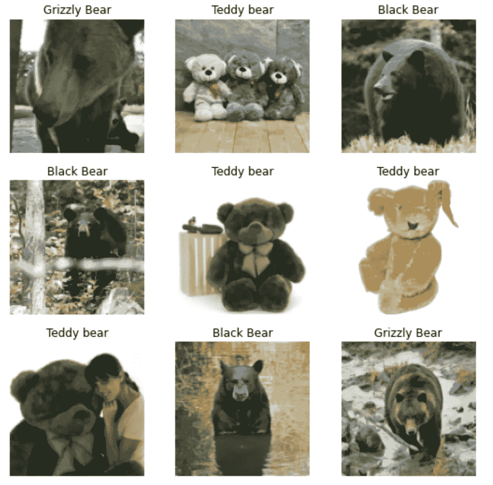
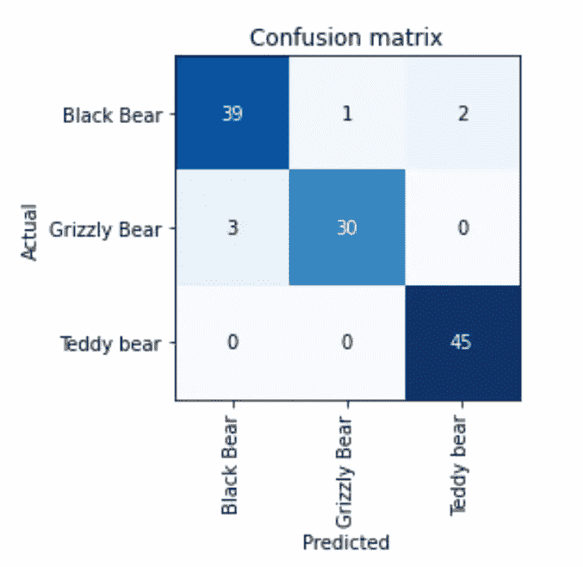

# 使用快速人工智能接近以数据为中心的人工智能

> 原文：<https://medium.com/mlearning-ai/approaching-data-centric-ai-using-fast-ai-6099c3d3e0e1?source=collection_archive---------2----------------------->

Photo by [Héctor J. Rivas](https://unsplash.com/@hjrc33?utm_source=unsplash&utm_medium=referral&utm_content=creditCopyText) on [Unsplash](https://unsplash.com/s/photos/images?utm_source=unsplash&utm_medium=referral&utm_content=creditCopyText)

这篇博文是为期 100 天的深度学习挑战的一部分。我已经通过阅读杰瑞米·霍华德和西尔维亚·古格的书 ***《使用 fastai 进行程序员的深度学习》&PyTorch***来开始这个挑战，以了解 fastai 库及其在深度学习中的应用。

Fastai 库是一个深度学习库，在 PyTorch 之上增加了更高级的功能。因此，这是在不同数据集上快速原型制作和模型构建以及利用 PyTorch 的灵活性和速度的库的完美选择。

在这篇博文中，让我们讨论一下以数据为中心的深层学习模式培训方法。以数据为中心的人工智能基于在模型开发过程中系统地增强数据集以改进模型度量的概念。这种方法通常被忽视，数据收集和清理并不是最受欢迎的任务。

> “许多应用程序的模型和代码基本上是一个已解决的问题。既然模型已经发展到一定程度，我们就必须让数据也发挥作用”——吴恩达

让我们从头开始训练图像分类器管道，即从收集数据到使用 fastai 库训练模型，从而探索以数据为中心的模型训练方法的潜力。

# 收集数据

让我们训练一个熊探测器，即它将区分三种类型的熊:灰熊，黑色和泰迪熊。为了获得数据集，我们使用**jmd _ image 刮板**库。这是一个用于创建数据集的图像抓取库。它使用 DuckDuckGo 进行图像抓取，因此您可以通过搜索 DuckDuckGo 来验证正在下载的图像。

让我们安装所需的库，

现在让我们导入 fastai 和 jmd _ 刮板库，

我们必须下载对应于 3 个类别的图片，即灰熊，黑色和泰迪熊。要下载数据集，我们必须将`path to download, name of the folder, search string and number of results to be downloaded`作为参数来下载数据集。

您可以查看`Data`文件夹中下载的图像。因为我们已经从互联网上下载了数据，所以有可能它已经被破坏了，所以让我们验证并删除被破坏的数据。

Fastai 提供了各种 util 函数，使其易于使用。`get_image_files`是一个快速返回包含所有图像路径的`L`对象的函数。`verify_images`功能用于检查列表中是否有损坏的图像文件。

既然我们已经准备好了数据集，让我们开始为模型训练准备数据。

# 从数据到数据加载器

在 PyTorch 中，DataLoader 是一个获取数据集并返回 iterable 的类，iterable 可以传递给模型进行批量训练。类似地，fastai 中的 DataLoaders 类接受我们传递的 DataLoader 对象，并使它们可用于训练和验证。

要将我们下载的数据转换成 fastai 中的数据加载器，最有效的方法是使用 DataBlock API。使用这个 API，我们可以轻松地定制和控制准备数据加载器的每个阶段。让我们为上述数据集定义 DataBlock 对象。

让我们看看每一个论点，以及它是如何使用的，

*   **块**:这定义了我们提供给模型的自变量和因变量的类型，即在我们的例子中，我们提供一个图像和一个类别，因此有`*ImageBlock*`和`*CategoryBlock*`。
*   **get_items** :定义如何获取项目列表。`*get_image_files*`是一个 fastai 函数，它接受路径作为参数，并递归返回该路径中所有图像的列表。
*   **get_y** :定义如何从使用 *get_items* 函数*检索的项目中识别因变量/标签。* `*parent_label*` 是一个 fastai 函数，它只返回文件所在文件夹的名称。
*   **splitter** :既然我们已经得到了数据和标签，我们需要使用这个参数指定如何拆分数据。`*RandomSplitter*`将数据集随机分为训练集和验证集，但使用种子来确保模型在每个时期获得相同的训练和验证数据。
*   由于我们一次成批提供多个图像样本，我们需要调整这些图像的大小。因此，我们在每个图像上使用`*Resize()*` 方法作为 item_tfms 的参数。

到目前为止，我们已经定义了基本的数据块对象。现在让我们用它从数据集创建数据加载器。

使用 *show_batch()* 方法，我们可以可视化数据集中的一些样本。我们可以预期类似的输出如下:

我们可以看到，使用 DataBlock API，我们可以轻松地从原始数据创建数据加载器。

现在，我们已经准备好了模型训练所需格式的数据。在我们深入研究培训之前，让我们探索一下模型管道数据增强的另一个重要部分。

# 数据扩充

数据扩充是指创建样本的随机变化，使它们看起来不同，但不改变图像的含义。这是确保模型不是记忆输入图像而是学习数据中的模式的方法之一。让我们看看一些最常用的增强技术。

*   使用`*RandomResizedCrop*`代替`*Resize*`作为项目变换，因为这不仅变换大小，而且随机变换图像的方向和比例。让我们看看它是如何做到的，

我们可以在现有的数据块上使用`*new*` 方法创建一个新的数据块对象，并传递新的项和批量转换。`RandomResizedCrop`方法接受`*min_scale*` 参数，该参数决定每次最少选择多少图像。最后，通过在`*show_batch*`函数中设置`unique=True`，我们可以用不同版本的`*RandomResizedCrop*` 变换*重复相同的图像。*

*   使用`*aug_transforms*` 功能对一批图像进行操作。这是一个 fastai 函数，应用多种增强功能，如翻转、改变亮度、对比度等。这可以应用于一批图像，因为所有图像的大小都相同。

您可以看到类似的输出，如下所示，

现在，我们已经看到了一些执行数据扩充的方法，让我们结合这些方法并获得最终的数据加载器。

让我们开始创建和训练模型…

# 训练您的模型

现在到了有趣的部分…由于我们没有这个问题的大量数据，在不遇到过拟合问题的情况下，训练一个高精度的模型将是困难的。除非我们使用一种叫做**迁移学习**的技术。

迁移学习是一种训练方法，在这种方法中，我们使用预先训练好的模型(即之前在不同任务中训练过的模型)，并根据我们的数据集进行微调。这种方法已经证明，即使使用较少的训练数据和较少的时间，也能取得惊人的效果。现在让我们看看 fastai 是怎么做的，

经过 4 个时期的训练后，我们可以看到模型的准确率接近 95%，这是非常令人印象深刻的。

现在让我们看看混淆矩阵，以便更好地理解模型性能。

从混淆矩阵中，我们可以观察到我们的模型能够正确地分类几乎所有的图像。

在下表中，我们可以看到模型以最大损失错误分类的图像。我们可以看到第一张图片属于黑熊类，但我们的模型预测它是灰熊。

但是如果我们观察熊的形象，它更像灰熊而不是黑熊。因此，在给图像加标签时，出现了一些混乱。(因为这些都是直接从 DuckDuckGo 下载的，没有我们的干涉)

# 通过模型进行数据清洗

既然我们的模型已经训练好了，现在让我们使用以数据为中心的方法来改进模型。这可以通过检查用于训练和验证的数据来完成，即检查图像是否被正确标记，然后用正确的标签更新它。

直观上，数据清洗是在模型训练之前完成的。但是正如我们在上面看到的，模型帮助我们识别数据中的问题。因此，为了执行数据清理，fastai 提供了一个方便的 GUI，允许我们选择一个类别或从训练和验证数据集中删除样本。

我们将得到上面的 GUI，它按顺序显示损失最大的图像(即哪个模型认为它不对)。现在，我们可以在下拉菜单中选择图像的类别，然后使用下面的代码执行更改。

现在，我们可以轻松地清理数据，并再次训练模型。我们将能够看到模型性能将有更好的提高(几乎 99~100%的准确率)。

以数据为中心的模型训练和迁移学习方法有助于我们在真实世界数据集上训练模型，并获得最先进的结果。因此，有必要将我们的重点从以模型为中心的人工智能转移到以数据为中心的人工智能，并探索 MLOps 的潜力。

谢谢大家！！