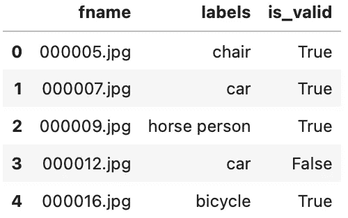
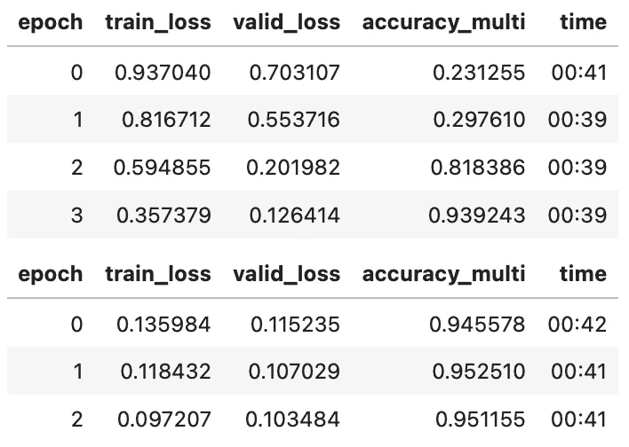
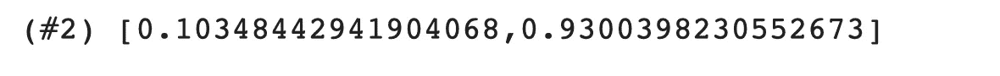
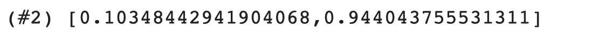

# 利用 fastai 实现多标签图像分类

> 原文：<https://medium.com/mlearning-ai/approaching-multi-label-image-classification-using-fastai-515a4fd52c8c?source=collection_archive---------0----------------------->

## 为什么应该使用多标签分类而不是传统的分类技术。

Photo by [Pavel Pjatakov](https://unsplash.com/@pjpavel?utm_source=unsplash&utm_medium=referral&utm_content=creditCopyText) on [Unsplash](https://unsplash.com/t/interiors?utm_source=unsplash&utm_medium=referral&utm_content=creditCopyText)

# 动机

我们已经看到了一些单标签分类器，即试图将单个标签分配给所提供的图像的模型。这可以是猫对狗分类器或手写数字分类器，但在一天结束时，单标签分类器会尝试为提供的图像分配一个标签。这种类型的分类器为给定的输入样本提供完美的输出标签。

但是，当我们在生产环境中使用上述模型时，这可能会成为一个问题，例如，我们已经部署了一个带有狗与猫分类器的 web 应用程序，它经过训练达到了很高的准确度。但如果一些用户开始上传建筑物的图像或任何非猫或非狗的图像，我们的模型就不理解输入的图像不是狗或猫。它基于被训练的标签的最大概率来提供图像的预测。所以模型只能分辨出图像**可能是一只狗或猫**，而不能告诉**它不是一只狗或猫**。

单标签分类器的另一个问题是它们只能给图像分配一个标签。但是，如果我们的图像由多个对象组成，则该模型将根据图像中存在的最主要的对象进行分类，并忽略其他对象。因此，这不会导致准确的分类。

这些问题的解决方案可以通过使用**多标签分类来解决。**

# 多标签分类简介

多标签分类可用于为每个输入样本(图像、文本、音频……)分配一个或多个标签。这以下列方式解决了单标签分类器的缺点:

*   我们可以训练多标签分类器来识别不属于任何类别的图像，只需要在训练数据中有一些没有任何标签的图像。通过这种方式，多标签分类器将正确地对任何域外数据进行分类。
*   多标签分类是一种用于将多个标签分配给给定输入样本的技术。数据可以是具有多种风格的故事/电影，或者是其中具有不同对象的单个图像。

让我们看看多标签数据集的实际情况，以及训练多标签分类器与训练单标签分类器有何不同。

# 浏览数据集

为了更好地理解，让我们使用 PASCAL 数据集，它的每张图片都有多种分类对象。首先，让我们安装并导入 fastai，

现在让我们使用`untar_data`函数下载数据集，

在下载的路径中，我们可以看到我们有包含图像的 train 和 test 文件夹，以及一个告诉我们每个图像使用什么标签的`train.csv`文件。让我们用熊猫来观察它，

在列车数据帧中，我们可以看到它有 3 列`filename, labels and is_valid.`

`labels`由一个或多个类别组成的列由空格分隔的字符串分隔。`is_valid`用于确定它是用于验证还是用于培训。

# 准备好数据

现在让我们创建一个数据块对象来加载数据并创建数据加载器。DataBlock 是一个高级 API，它使得数据预处理和加载更加容易。让我们看看如何为我们的应用程序构建一个。

好了，现在让我们研究一下传递给 datablock 对象的每个参数，看看它做了什么。

*   **块:**这定义了自变量和因变量/数据，或者更准确地说，是我们提供给模型的输入类型和目标。在这种情况下，我们有图像作为输入和多个相关的类别，因此有`ImageBlock`和`MultiCategoryBlock`。

fastai 库自动检测多个类别，并根据可用目标的数量执行一键编码。(但是当使用`CategoryBlock`时，对类别进行顺序编码，即用于单标签分类)

*   **get_x:** 这定义了如何获取输入，即我们例子中的图像。在上面的代码中，我们定义了一个函数 **get_x** ，它将 path 对象返回到相应的文件名。`ImageBlock`读取路径对象，然后执行必要的处理，将其转换为 PIL 图像对象。
*   **get_y:** 该定义了如何获取目标，即每幅图像的多个类别。在上面的 **get_y** 函数中，我们返回了通过拆分`labels`列获得的与特定图像相关联的标签列表。
*   **splitter:** 这定义了我们如何执行数据集的训练验证分割。在**拆分器**函数中，我们根据‘is _ valid’列拆分数据帧，然后返回所有索引的列表作为训练集和验证集。
*   **item_tfms:** 定义应该应用于数据集中每个样本的转换。这里我们使用的是`RandomResizedCrop`变换，它通过在每次应用变换时保留至少 35%的图像来随机地将图像的大小调整到 128。

现在让我们创建数据加载器并可视化我们的数据集，

既然现在我们已经准备好了数据加载器，我们现在可以创建一个模型。

# 模特培训

现在让我们使用 resnet50 预训练模型创建一个 cnn_learner 对象。但在此之前，让我们了解一下训练方法的重要区别。

## **损失函数**

首先，让我们讨论一下单标签分类的一些基础知识。在二进制分类模型中，任务是将任何给定的输入分类到两类中的一类。因此可以通过应用`sigmoid`激活函数并将其传递给`BinaryCrossEntropy`损失函数来找到损失。sigmoid 负责将所有值转换到范围[0–1]内。

因为我们有范围[0–1]中的所有逻辑，所以我们可以使用阈值 0.5 来确定输入样本的类别。

Source: Sigmoid Activation Function ([https://en.wikipedia.org/wiki/Sigmoid_function](https://en.wikipedia.org/wiki/Sigmoid_function))

类似地，在多标签分类模型中，任务是将给定的输入分类到三个或更多类别中的一个。这里，损耗是通过首先应用`softmax`激活函数，然后通过`CrossEntropy`损耗函数获得的。

但是在多标签分类模型中，任务是将给定的输入分类到一个以上的类别中，即分配多个标签。目标被表示为一个独热编码的数组。这看起来类似于二进制分类任务，但是唯一的区别是具有它的多个实例，即输入图像的二进制分类是针对每个可用标签进行的。

所以对于这个任务，我们使用了`BinaryCrossEntropy`损失函数和`sigmoid`激活函数。这是因为多标签分类类似于二进制分类，除了 PyTorch 使用其**基于元素的操作**将激活和丢失应用于独热编码的目标。

## 韵律学

Fastai 为多标签分类提供了一个名为`accuracy_multi`的度量。在我们收到来自模型的输出逻辑后，sigmoid 激活被应用来将所有值转换到[0–1]的范围内。然后，通过指定一个**阈值**值来应用`accuracy_multi`函数，即高于该阈值的所有概率将为真，否则将为假。这样，我们就得到了模型的预测。

准确性分数是通过将预测值与目标值进行比较来计算的，通常与正常的准确性计算进行比较。要记住的重要事情是正确地确定阈值的值。如果我们选择的阈值太高，我们将只选择模型非常有把握的对象。如果我们选择的阈值太低，我们将经常无法选择正确标记的对象。

现在让我们深入代码，看看如何训练模型。

## 创建学习者

让我们使用`cnn_learner`和 resnet50 模型创建一个学习者对象。

partial 函数接受一个函数和该函数的关键字参数，并返回一个带有更新后的关键字参数的新函数。在上面的例子中，我们使用`partial`将默认的 **accuracy_multi** 度量函数的 **thresh** 值从 0.5 更新为 0.2。

我们可以看到，当我们将阈值保持为 0.2 时，我们实现了高达 95 %的准确性。让我们看看如果改变 thresh 值会发生什么。

Loss, accuracy when thresh = 0.1

在上面的代码中，我们将模型的度量改为 accuracy_multi，thresh=0.1。当我们执行 **learn.validate()** 时，学习者对象计算验证数据的损失和准确性。因为我们只是改变了度量，所以不需要训练模型。从上面的输出中，我们可以看到，当 thresh=0.1 时，我们获得了 93%的精度，这比我们之前的结果要低。现在让我们检查更高的阈值。

Loss, accuracy when thresh=0.99

当阈值较高，即 thresh = 0.99 时，我们可以看到精度为 94%。因此，我们可以得出结论，选择一个阈值取决于我们使用的数据，而不是一个固定值。

因此，建议试验并检查不同的 thresh 值，并确定一个精度更高的值。

# 结论

因此，我们已经看到了多标签分类器是如何工作的，以及如何使用它来避免传统的单标签分类器所面临的一些问题。因此，即使对于正常/单标签分类任务，也总是建议训练多标签分类器，以获得更健壮的模型行为。

谢谢你

## **GitHub 链接为笔记本** [**此处**](https://github.com/JNK234/100-days-of-deep-learning/blob/main/Day%203/Multi_Label_classification.ipynb) **。领英简介** [**此处**](https://www.linkedin.com/in/narasimhakarthik/) **。**

 [## Mlearning.ai 提交建议

### 如何成为 Mlearning.ai 上的作家

medium.com](/mlearning-ai/mlearning-ai-submission-suggestions-b51e2b130bfb)