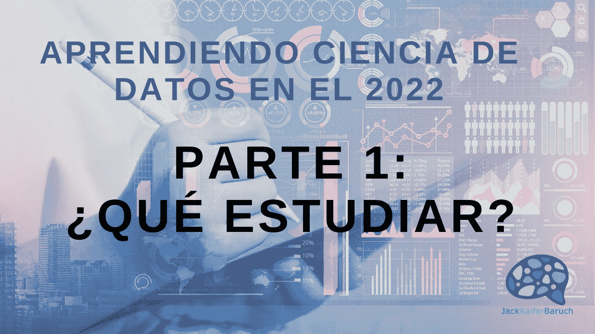

# 2022 年学习数据科学 第 1 部分:学习什么?

> 原文：<https://medium.com/mlearning-ai/aprendiendo-ciencia-de-datos-en-el-2022-parte-1-qu%C3%A9-estudiar-6da26754bccb?source=collection_archive---------10----------------------->

现在是 2022 年,我们仍然处于全球流行病之中,从产品物流到全球变暖,我们都沉浸在无数的全球性问题中,数据科学仍然是几乎所有行业中最热门的职业之一。

不仅如此,Dataverso 的角色,如[数据工程师](https://www.datahack.es/ingeniero-datos/)、[数据分析师](https://es.wikipedia.org/wiki/An%C3%A1lisis_de_datos)和其他新的角色,如[数据账户](https://rockcontent.com/es/blog/data-storytelling/),每天都变得越来越普遍。

这意味着开始与数据相关的职业生涯的兴趣从未如此之高,并且基于此类专业人员不断增长的供应和需求模式,教学供应也在增长。

在开始“数据科学之路”时,面对大量的资源并且不知道如何开始是非常可怕的 - 我们不仅有来自数学,编程,计算机科学和商业等各个学科的大量不同的科目要学习,而且还有数百种学习方式,从传统的大学形式到 YouTube 的无限资源。

在本系列文章中,我将尝试一般性地谈论如果我必须从头开始数据科学,我将学习什么以及如何学习。最重要的是,我将留下一些关于如何做到这一点的建议,并链接到不同的资源,无论预算如何,都可以学习。

让我们从学习什么开始。

8、学习什么?(T9 )

首先,让我们考虑一下我们需要发展成为数据科学从业者的科目和技能,其中一些是必要的,另一些是我个人的建议:

**编程(必需):**

你必须学会编程,好吧。虽然我们可以捍卫使用电子表格(如 Excel)构建模型的可能性,但有一点是,这将显着限制我们使用数据集的大小,以及我们可以使用的各种算法进行建模(更不用说我们必须等待多长时间才能训练最简单的模型)。它也是过程自动化的关键技能。关于学习哪种语言,Python 应该是你的首选,因为它是当今数据科学中最常用的语言,也是最容易学习的语言之一。虽然 SQL 本身不是一种编程语言,但它也被强烈推荐,因为当今世界上存在的大多数数据都驻留在结构化数据库中,因此您需要 SQL 来提取所需的信息。

你也可以从[R 开始,这对统计计算非常有用,但如果你只知道 R 而不懂 Python,你的工作机会就会受到限制。还有其他一些语言正在逐渐与数据科学相关,如](https://es.wikipedia.org/wiki/R_(lenguaje_de_programaci%C3%B3n))[Julia](https://es.wikipedia.org/wiki/Julia_(lenguaje_de_programaci%C3%B3n))和[Go](https://en.wikipedia.org/wiki/Go_(programming_language)),但目前只有少数公司在使用这些语言。

我的建议是学习 Python 和 SQL,然后如果你喜欢,你可以学习其他语言。

另一个提示是,学习如何使用 Python 编写完整的程序,不要仅仅依靠“数据科学的 Python”。了解软件是如何构建的会让你成为一个更好的数据科学家。

**数学:统计与概率(必修):**

数学是 Dataverso 的内在组成部分,最终,一切都基于将数学公式应用于数据。这就是我们如何构建分析模型。因此,你应该对统计学有很高的理解,包括[描述性](https://es.wikipedia.org/wiki/Estad%C3%ADstica_descriptiva)和[推理性](https://es.wikipedia.org/wiki/Estad%C3%ADstica_inferencial),以及[概率论](https://es.wikipedia.org/wiki/Teor%C3%ADa_de_la_probabilidad)。

一个非常重要的部分,往往不够深入,是假设检验(T7)。数据科学是关于将科学方法应用于数据,因此学习如何做好科学,换句话说,提出假设并对其进行测试,是关键部分。

另一方面,如果你也想了解机器学习和/或深度学习,或者走上数据科学研究者的道路,你需要更多的数学(见下文)。

(T8)3。基本数据可视化(必需):

沟通我们的发现的能力是数据科学中的一项重要技能。这意味着能够创建出色的可视化,使我们能够以尽可能简单的方式表达自己。虽然有很多工具可以做到这一点,比如 Python 中的[Matplotlib](https://en.wikipedia.org/wiki/Matplotlib)和[Seaborn](https://seaborn.pydata.org/),R 中的[Tidyverse](https://en.wikipedia.org/wiki/Tidyverse),[Power BI](https://en.wikipedia.org/wiki/Microsoft_Power_BI),[Tableu](https://en.wikipedia.org/wiki/Tableau_Software)甚至是[Excel](https://en.wikipedia.org/wiki/Microsoft_Excel),最重要的是能够使用我们可用的工具直观有效地传达我们的工作。

如果您正在寻找数据帐户的道路,您还应该学习高级数据可视化和可视化设计。

**机器学习(必需):**

对于许多人来说,机器学习是数据科学的一个子专业,现实情况是我们所做的大部分工作都是预测分析,换句话说,创建预测模型,机器学习是完成这项任务的最佳工具集。这里有很多东西需要学习,从[线性回归(T3)和](https://es.wikipedia.org/wiki/Regresi%C3%B3n_lineal)[物流(T5),](https://es.wikipedia.org/wiki/Regresi%C3%B3n_log%C3%ADstica)[决策树(T7),](https://es.wikipedia.org/wiki/%C3%81rbol_de_decisi%C3%B3n)[随机森林(T9),](https://es.wikipedia.org/wiki/Random_forest)[支持向量机(T11),这只是](https://en.wikipedia.org/wiki/Support-vector_machine)[监督学习(T13)的表面。另一方面,我们有](https://es.wikipedia.org/wiki/Aprendizaje_supervisado)[聚类](https://es.wikipedia.org/wiki/Algoritmo_de_agrupamiento),[主成分分析](https://es.wikipedia.org/wiki/An%C3%A1lisis_de_componentes_principales),[降维](https://es.wikipedia.org/wiki/Reducci%C3%B3n_de_dimensionalidad)以及更多在[无监督学习](https://es.wikipedia.org/wiki/Aprendizaje_no_supervisado)方面。

在这个 pine 中,线性代数和微积分的知识对于更好地理解工作非常有用。尽量不要只学习代码来实现模型,并确保您了解代码背后发生的事情。

**商业分析(强烈推荐):**

这一点往往被完全忽略,仅被标记为“领域知识”。然而,业务分析领域是广阔的,并且非常完善。这意味着,企业领导者和高级管理人员往往非常精通最常见的业务指标,以及这些指标倾向于如何呈现和用于决策。了解这一点有助于我们在与高管沟通时获得优势,并帮助我们更有效地销售我们的项目创意。

如果你想成为一名数据分析师,这些技能是必要的。

**6。线性代数和微积分(强烈推荐):**

如果你真的想了解机器学习,如果你想深入学习深度学习,那么这些模型背后的数学非常有用,特别是线性代数和微积分。成为一名优秀的数据科学家并在不深入了解模型背后的数学的情况下创建壮观的模型是可能的,但是,花时间学习这些模型将获得巨大的回报,使我们能够有意义地了解我们正在做的事情以及如何改进它。根据我的经验,这也使我们在各方面都做得更好。

如果你想走上数据科学研究者的道路,这些技能是必不可少的。

(T2) 7。计算机科学/计算机科学基础(推荐)

由于您将使用大型计算机系统中的计算机和大量数据集,因此对计算机科学有一定的基本了解并了解计算机是如何做他们所做的事情将有助于您更好地了解您正在做的事情。

(T4)8。视觉化设计 — 进阶视觉化 (建议部分使用):

再次,沟通在数据科学中至关重要。如果您喜欢这个主题,或者想要遵循数据帐户的道路,那么能够创建有趣的设计和高级可视化是必不可少的技能。

(T6)9。数据理解——领域知识(可能需要):

虽然我还没有找到数据理解课程,但除了统计学和概率之外,这是一个非常重要的技能。能够提出正确的问题,例如:这些数据来自哪里?他们是如何收集的?它们是如何被使用的?和其他类似的人,他们会让你成为一个伟大的数据科学家。

另一方面,领域知识在任何组织中都至关重要,因为了解您所从事的行业将帮助您产生更好的发现并设计更好的项目。然而,这可能会在正确的时间到来,除非你已经对某个特定行业有所了解,否则你现在不必担心。

然而,接下来的两个是非常重要的。

**10。英语(必修):**

欢迎来到全球化的世界,并以美国和欧洲为中心的科学发展。大多数与 Dataverso 有关的任何主题的所有类型的资源,主要是英文的。同样,大多数数据科学团队都用英语工作。

(T2) 11。学习如何学习(大写):

我认为数据科学是未来新职业的先驱之一,换句话说,它将结合许多学科和技能。它也是一门新的学科,充满了不确定性和快速增长。一旦你开始,你会不断发现新的工具,编程包,用例,算法,模型,应用程序,我们认为我们现在必须学习的新知识的源泉,以免落后。

深呼吸,放慢速度,不要紧张。您将有时间学习,随着时间的推移,我们设法提高和优化我们的学习能力。现在,一次只专注于一件事,最终你会到达那里。

没错,重要的是你要培养对学习的热爱,并培养不断学习的技能和习惯。这不仅是数据科学家的绝佳技能,而且适用于任何人,无论他们处于哪种道路或职业。

他们在那里,虽然我可以想到数百种他们可以学习并且非常有用的其他东西,但这不是一个详尽的清单,这个想法是,这是一个开始学习的初步指南,当我开始我的数据科学之路时,我会很高兴拥有它。

我在这里留下关于这个主题的 YouTube 视频:

请放心在[Twitter](https://twitter.com/JackRaifer)或[LinkedIn](https://www.linkedin.com/in/jackraifer)与我联系,如果您有任何问题或意见,请给我留言。您也可以订阅我的[YouTube 频道](https://www.youtube.com/channel/UC87srlfQBy6AcglQAvlHr3A)并在[Medium](https://jackraiferbaruch.medium.com)关注我。

杰克·雷弗·巴鲁克
scientifico de Datos
邮箱:[jackraiferbaruch@gmail.com](mailto:jackraiferbaruch@gmail.com)领英:[https://www.linkedin.com/in/jackraifer](https://www.linkedin.com/in/jackraifer)推特:[https://twitter.com/JackRaifer](https://twitter.com/JackRaifer)中:[https://jackraiferbaruch.medium.com](https://jackraiferbaruch.medium.com)YouTube:[https://www.youtube.com/channel/UC87srlfQBy6AcglQAvlHr3A](https://www.youtube.com/channel/UC87srlfQBy6AcglQAvlHr3A)

 [## Mlearning.ai 提交建议

### 如何成为 Mlearning.ai 上的作家

medium.com](/mlearning-ai/mlearning-ai-submission-suggestions-b51e2b130bfb)