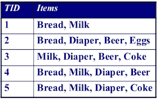
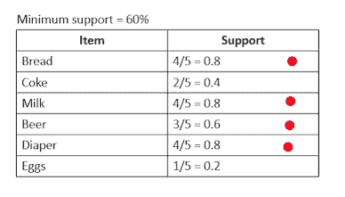
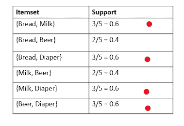
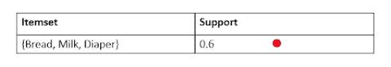
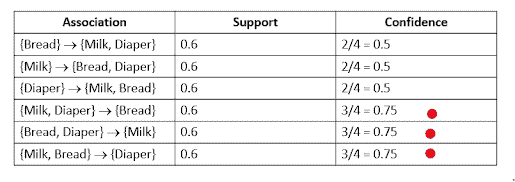

# Apriori 算法举例说明

> 原文：<https://medium.com/mlearning-ai/apriori-algorithm-explained-with-examples-861f9026e287?source=collection_archive---------3----------------------->

Photo by [Wicked Monday](https://unsplash.com/@wickedmonday?utm_source=unsplash&utm_medium=referral&utm_content=creditCopyText) on [Unsplash](https://unsplash.com/s/photos/amazon?utm_source=unsplash&utm_medium=referral&utm_content=creditCopyText)

你有没有想过亚马逊是如何推荐你可能喜欢的商品的？它如何将这些东西与您购物车中的商品或您的购物历史联系起来？因为 Apriori 算法，这一切都是可能的。

# 关联规则挖掘

关联规则挖掘是指根据其他项目的出现来发现预测交易中某个项目出现的规则。

上面的定义挺混乱的，不是吗？

让我们更深入地研究 Apriori 算法，让事情变得更简单。但是，在继续之前，下面是一些你需要熟悉的术语，以便顺利理解事情。

**项目集:**一个或多个项目的集合

**支持计数:**项目集出现的频率。它用σ表示。

**支持:**包含一个项集的事务部分。它用 s 表示。

**置信度:**衡量(A∪B)在包含 A 的事务中出现的频率，用 c 表示。

我知道这仍然令人困惑，但我向你保证，过一会儿你就会明白了。

让我们举一个网上杂货店的例子。我们被给予以下交易

现在我们来衡量一下{牛奶，尿布} →啤酒的支持度，支持数，信心

**支持计数**将识别包含面包、牛奶和啤酒的交易数量。事务 3 和事务 4 将这三者结合在一起。对吗？所以{牛奶，尿布} →啤酒的支持数是 2

记住**支持**是包含一个项目集的事务的一部分？我们这里的项目集是面包、牛奶和啤酒，分数是通过将某物(在我们的例子中是项目集)的比例除以总数得到的。面包、牛奶和啤酒在所有交易中一起出现两次，交易总数为 5。因此，我们的支持度是 2/5 = 0.4 或 40%。

对于**信心**，我们测量包含 A 的交易中(AUB)出现的频率。对我们来说，A 是牛奶和尿布，B 是啤酒，因此 AUB 是牛奶、尿布、啤酒。我们已经知道，AUB 在所有交易中出现两次。请注意，A(牛奶和尿布)同时出现在事务 3、4 和 5 中。因此，置信度为 2/3，因为在所有包含 A(牛奶和尿布)的事务中，AUB(牛奶、尿布和啤酒)出现了两次。因此，c=0.67。

但是支持和信心到底有什么用呢？

这些度量项目在交易中一起出现的概率。假设给你一个在线杂货店的关联规则挖掘任务，你被告知找出有超过 60%的概率一起出现的项目。你用 Apriori 算法得出结论，买鸡蛋的顾客也有 65%的时间买面包，买零食的顾客也有 70%的时间买冷饮。基于这些结论，你的网上杂货店购买鸡蛋和零食的顾客将被建议分别购买面包和冷饮。

# 该算法

**步骤 1:** 计算给定交易中每个项目的支持度，剔除支持度低于给定阈值的项目。

**第二步:**将支持度大于或等于给定阈值的项目配对。计算每对的支持度，并消除支持度小于阈值的支持度。

**第三步:**将选中的对做成三重项集。计算他们的支持度，排除那些支持度低于阈值的。

**第四步:**对选中的三元项集进行关联。计算每个关联的支持度和置信度，并选择置信度大于最小置信度阈值的关联。最终选择的关联很可能发生在你的交易中。

那些一起买牛奶和尿布的顾客很可能会买面包。一起买面包和尿布的顾客可能会买牛奶，而一起买牛奶和面包的顾客可能会买尿布。

*最初发表于*[*https://databinge.blogspot.com*](https://databinge.blogspot.com/2021/09/apriori-algorithm-explained-with.html)*。*

 [## Mlearning.ai 提交建议

### 如何成为 Mlearning.ai 上的作家

medium.com](/mlearning-ai/mlearning-ai-submission-suggestions-b51e2b130bfb)