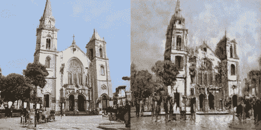

# 建筑变形

> 原文：<https://medium.com/mlearning-ai/architectural-morphing-ab99d0741117?source=collection_archive---------2----------------------->

## [机器学习艺术](https://mlearning.substack.com)

## 一种新的迁移学习策略|演示

[Machine Learning Art](https://mlearning.substack.com)

## 在建筑中，什么是变形？

**变形**是指一个物品逐渐改变形状，呈现出一个新的形状。变形的基本过程是选择两个对象并指定中间阶段的数目 n。分 n 个阶段…