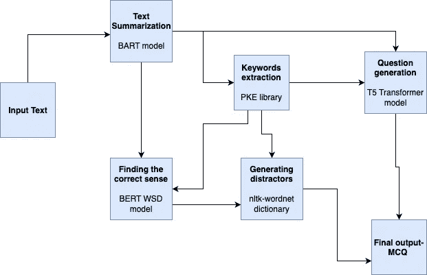
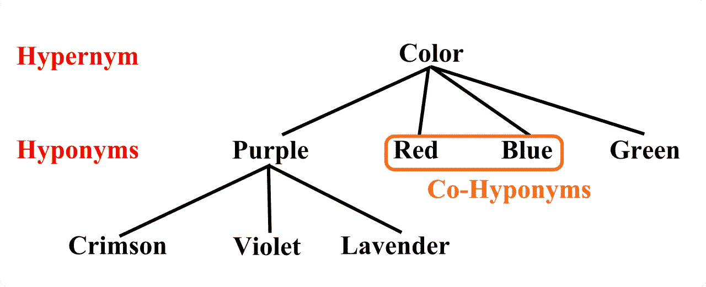

# 使用转换器从文本中提取 MCQ 问题的体系结构

> 原文：<https://medium.com/mlearning-ai/architecture-for-extracting-mcq-questions-from-text-using-transformers-5953e174b488?source=collection_archive---------0----------------------->

在开发变压器之后，与 RNN-LSTM 的早期方法相比，序列到序列(seq2seq)生成任务变得更加容易和准确。

在这篇文章中，我将展示一个架构，它可以使用基于转换器的模型，如 T5，BERT，BART，从自由文本中提取 MCQ 类型的问题

**部分变压器型号概述**:

1.  **T5** —代表“**文本到文本转换变压器**，其架构类似于原始变压器的架构，由编码器和解码器两部分组成。这是由谷歌建造的。
2.  **BERT** —代表“变压器的**双向编码器表示”，是原变压器的改进版本，仅由编码器部分组成。**
3.  **BART** —代表“**双向自回归变换器**”，是一种同时采用 BERT(编码器-双向)& GPT-2(解码器-自回归)的模型。它类似于 t5 架构。

这些是一些可以用来从文本中提取 MCQ 问题的模型。

**MCQ 问题提取架构:**

Proposed architecture

以下是对架构的简要描述:

# 1.文本摘要

第一步是总结段落，以消除复杂性和删除不必要的单词，但保持原始内容的意义。在这里，我们可以使用来自拥抱脸的任何基于摘要的模型，在这个架构中，我们使用了基于 BART 的预训练模型。

# 2.关键词提取

第二步是找到关键词，这些关键词将是我们将要提出的问题的真实答案。这里我们使用了 python 密钥提取器库。

# 3.干扰物的产生(错误的选择)

第三步是产生干扰物，即 MCQs 的错误答案。为此，使用了上下位词的概念。请参考下图，了解更多相关信息。我们已经使用了 **wordnet** 字典，但是 **conceptnet** 也可以用于这个用例。

Source:wikipedia

# 4.为干扰物寻找正确的意义句子

第四步是确定文章的正确干扰物。例如，如果提取的关键字 its 是'**亚马逊**，那么下位词可以是'**公司**或'**河流'**或'**古代** **女人** **战士'**。我们必须在这个特定的文本中确定我们指的是一家公司。这可以使用 BERT 词义消歧模型来完成。

# 5.从文本生成问题

最后一步是基于关键字(答案)和文本作为输入生成一个问题。这里，我们使用了来自拥抱人脸库的基于 T5 的预训练模型，因为 T5 使用了变压器的编码器和解码器架构。

感谢阅读！！干杯！！

 [## Mlearning.ai 提交建议

### 如何成为 Mlearning.ai 上的作家

medium.com](/mlearning-ai/mlearning-ai-submission-suggestions-b51e2b130bfb)