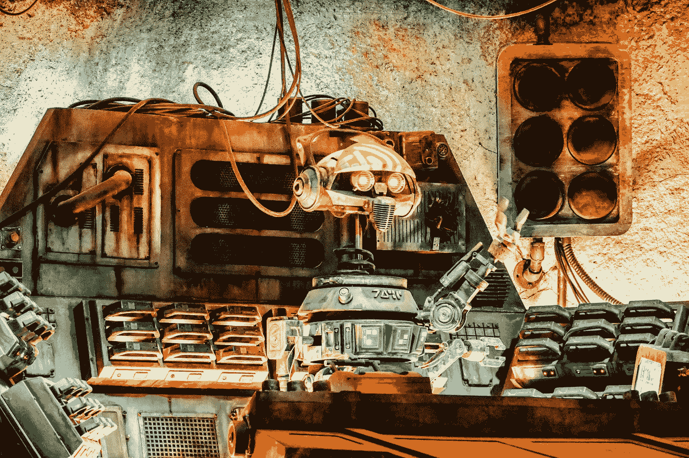

# 艺术和 AI 是永远不变的吗？达尔第二季

> 原文：<https://medium.com/mlearning-ai/are-art-and-ai-changing-forever-dall-e-2-52ee68dcc287?source=collection_archive---------1----------------------->

Photo by [Rod Long](https://unsplash.com/@rodlong?utm_source=medium&utm_medium=referral) on [Unsplash](https://unsplash.com?utm_source=medium&utm_medium=referral)

[**DALL E 2**](https://openai.com/dall-e-2/) 是一个开放的 AI，它完全基于 [**人工智能**](https://en.wikipedia.org/wiki/Artificial_intelligence) 通过使用自然语言编写的描述来生成逼真的图像和艺术。DALL E 2 能够进行简单的文本描述，并生成前所未有的令人惊叹的照片级逼真图像。它能够将概念、属性和风格结合起来，在几秒钟内制作出令人兴奋的照片。DALL E 2 也能够…