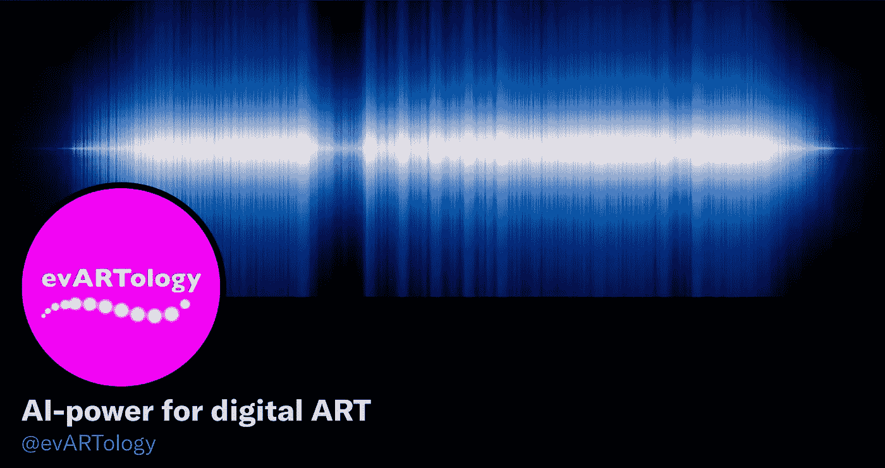

# 艺术家在用 AI 改变艺术的概念吗？

> 原文：<https://medium.com/mlearning-ai/are-artists-using-ai-to-change-the-concept-of-art-1e92d8ba1ede?source=collection_archive---------2----------------------->

## GPT3 回答问题

## 这是 2021 年艺术的真实面貌

[https://twitter.com/evARTology](https://twitter.com/evARTology)

每个人都在社交媒体上，艺术家们正在使用人工智能来充分利用它。艺术家们正在以创造性的方式使用人工智能技术，因为它反映了艺术世界不断变化的本质。