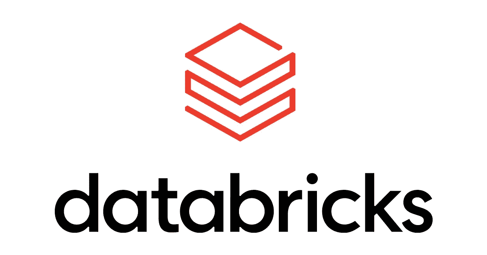
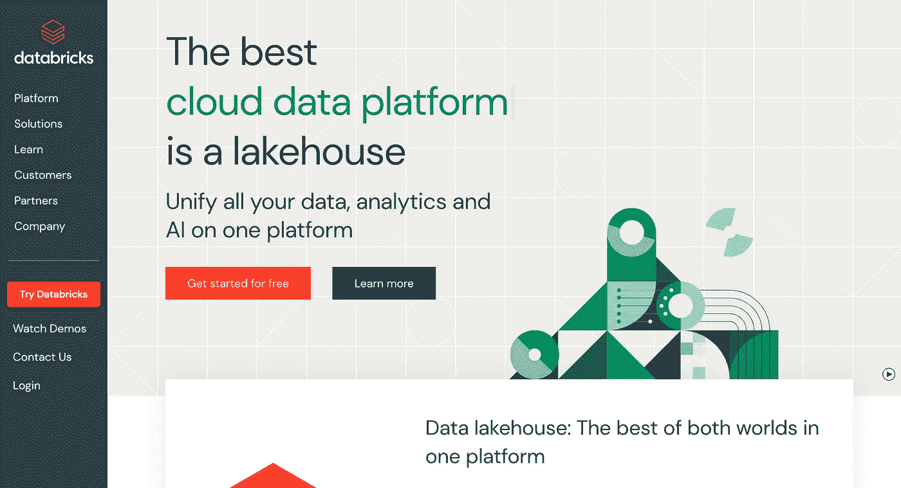
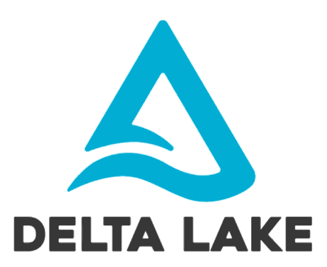
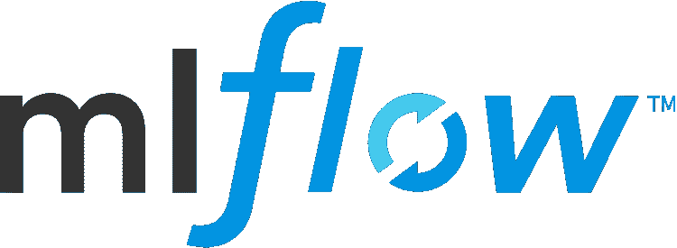
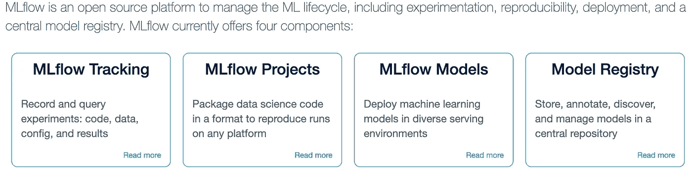
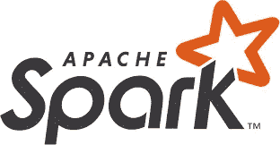
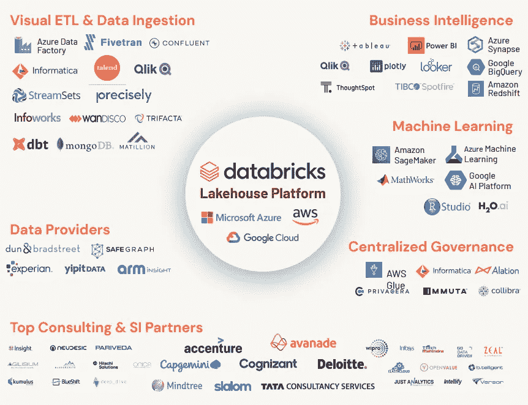

# Databricks 和 Apache Spark 是一回事吗？

> 原文：<https://medium.com/mlearning-ai/are-databricks-apache-spark-the-same-thing-1fe3332c9314?source=collection_archive---------1----------------------->

Databricks Logo

如果你认为 Apache Spark 和 Databricks 是一回事，你不是唯一一个。很长一段时间以来，我一直把 Apache Spark 和 Databricks 联系在一起，认为它们本质上是同一个东西，但我大错特错了。我最近决定踏上“Databricks 认证数据工程师助理”认证之旅，这让我对 Databricks 平台有了一个全面的了解。

# 什么是数据块？

databricks.com

如果你访问 [Databricks 网站](https://www.databricks.com/)，你会注意到他们本质上将自己描述为一站式数据平台。您可以在这个平台上满足所有的数据需求。他们的目标是拥有一个简单的平台来统一所有的数据、分析和人工智能工作负载。问题是他们如何做到这一点？Databricks 利用多个开源项目，如用于满足您的[数据仓库](/@jjghavami/data-lakehouses-the-future-of-data-solutions-f8544c42a76d)需求的[三角洲湖](https://delta.io/)，用于管理您的机器学习生命周期的 [MLflow](https://mlflow.org/) ，以及用于满足您的大数据分析需求的 [Apache Spark](https://spark.apache.org/) 。

# 三角洲湖——数据砖的心脏

Delta Lake Logo

由于我一直在为上面提到的 Databricks 认证而学习，Databricks Academy 将 **Delta Lake** 描述为 Databricks lakehouse 平台的心脏。它支持 [lakehouse 体系结构](https://www.cidrdb.org/cidr2021/papers/cidr2021_paper17.pdf)，该体系结构允许采用开放式方法将数据管理和治理引入数据湖。lakehouse 架构为您带来了两个世界的精华，这是数据仓库的优势&也是数据湖的优势。此外，Delta Lake 是一个开源项目，支持在现有存储系统的基础上构建数据湖库。它建立在标准数据格式的基础上&针对云对象存储进行了优化，同时还可以处理可扩展的元数据。

## 这为什么令人兴奋？

如上所述，Delta Lake 提供了利用两个世界(数据仓库和数据湖)的优点的特性:

*   使用结构化流式信源和信宿对表进行流式读写。
*   更新、删除和合并(对于 upserts)操作，甚至在 Java、Scala 和 Python APIs 中也是如此。
*   在数据帧写入期间，通过显式地改变表模式或隐式地将数据帧的模式合并到表的模式来进行模式演变。
*   时间旅行，允许您通过 ID 或时间戳查询特定的表快照。
*   回滚到以前的版本以纠正错误。
*   执行任何 SQL、批处理或流操作的多个并发编写器之间的可序列化隔离。

正如您从上面看到的，lakehouse 范式允许我们拥有诸如事务支持、模式实施和治理、支持开放格式中的不同数据类型、支持不同的工作负载以及支持更新和删除等功能。

# MLflow —管理您的机器学习生命周期

MLflow Logo

我们刚刚讨论了一项技术，它触及了您的分析和人工智能需求中的早期数据。我将通过谈论分析和人工智能管道的后期阶段来进一步阐述这篇文章。在很大程度上，许多数据从业者已经在他们的本地计算机上创建了一个机器学习模型。接下来是知道如何部署你的机器学习模型，这比大多数人想象的要复杂得多。MLOps 不是一件容易的事情。为了在生产中重现您的机器学习模型，需要考虑相当多的因素。这些因素包括:

*   库版本化——拥有指定了实际版本的必要库。
*   数据进化——了解模型训练的基础数据。
*   执行顺序—确保您的代码从上到下正确运行。
*   并行操作——GPU 并行运行许多操作，执行顺序并不总是有保证的。

MLflow 是一个管理端到端机器学习生命周期的开源平台。它有以下主要组件:

MLflow Components

*   跟踪:允许您跟踪实验，以记录和比较参数和结果。
*   模型:允许您从各种 ML 库中管理和部署模型到各种模型服务和推理平台。
*   项目:允许您将 ML 代码打包成可重用、可复制的形式，以便与其他数据科学家共享或转移到生产中。
*   Model Registry:允许您集中管理模型的整个生命周期阶段转换的模型存储:从阶段转换到生产，具有版本控制和注释的能力。
*   模型服务:允许您将 MLflow 模型作为 REST 端点。

MLflow 的美妙之处在于，它将允许机器学习从业者和数据科学家实施最佳实践，以便将他们的 ML 模型投入生产。下一个，阿帕奇火花！

# Apache Spark —大规模数据分析

Apache Spark Logo

[Apache Spark](https://spark.apache.org/) 允许您在多个用例中使用批处理或流数据。Spark 的架构利用其 Spark 驱动程序和执行器提供快速分析。您可以使用高级 SQL 分析、大规模数据科学以及机器学习。对于您的数据科学和机器学习用例，这可以使用多种语言来完成，如 R、Python、Scala & Java。把 Databricks 中的 Apache Spark 想象成你的 Google Colab 或 Jupyter 笔记本，用你最喜欢的编程语言编写，具有极高的数据处理速度。这与前面提到的两项技术(如 Delta Lake & MLflow)相结合，为您提供端到端管道所需的一切。这是否意味着你被这些技术所束缚？绝对不是，Databricks 有许多合作伙伴，在那里您可以将各种各样的技术集成到您的数据生态系统中。

Databricks Partners

您可能已经注意到，Apache Spark 是 Databricks 平台的一部分。它是平台内部的一块砖，非常重要。然而，我需要习惯于这样一个事实，即 Databricks 将三角洲湖称为 Databricks 的心脏，但经过一些思考，这是有道理的。Delta Lake 为我们带来了 data lakehouse 架构，允许我们以最佳形式使用 Apache Spark。

# 这个设置会让你与众不同。

作为一个正在[学习成为一名数据工程师](/@jjghavami/why-am-i-choosing-data-engineering-over-data-science-6d010f119e41)的人，作为一个在高级分析领域工作过的人，我可以向你保证，你的系统的设置和设计比分析本身重要得多。是的，您的分析结果将推动有用和有影响力的业务决策，但是为了获得预期的结果，必须适当和胜任地进行设置。

这就是为什么 Databricks 选择将自己作为 Databricks Lakehouse 平台的原因。尽管 Spark 本身很有魅力，但他们更重视像 Delta Lake 这样的开源项目是有道理的。他们认识到，通过将数据仓库和数据湖整合到一个解决方案中，将 BI 和 SQL 分析领域与数据科学和机器学习领域相结合，他们有可能解决一个大问题。这非常有吸引力，因为许多财富 500 强公司都采用了这种方法。

本文的大部分功劳归于 Databricks Academy 以及 Damji、Wenig、Das 和 Lee 的 Learning Spark。如果您想了解更多关于 Databricks 平台的信息，请使用这些参考资料，因为它们在我的数据之旅中对我帮助很大。希望这篇文章能帮助某人，并祝你在学习的旅途中一切顺利！

## 参考资料:

[学习火花——达姆吉、维尼格、达斯、李](https://www.amazon.com/Learning-Spark-Lightning-Fast-Data-Analytics-ebook/dp/B08F9WVFCT)

[Azure Databricks 文档](https://learn.microsoft.com/en-us/azure/databricks/)

数据布里克学院

 [## Mlearning.ai 提交建议

### 如何成为 Mlearning.ai 上的作家

medium.com](/mlearning-ai/mlearning-ai-submission-suggestions-b51e2b130bfb)