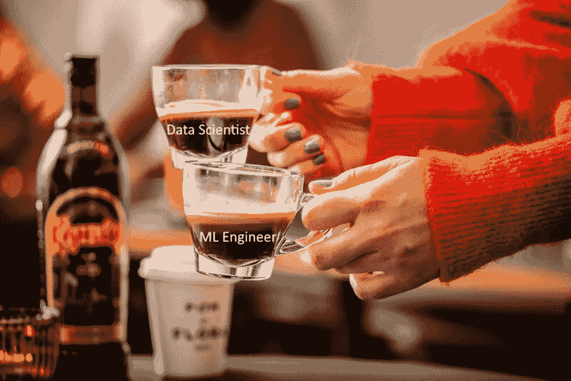

# 机器学习工程师真的有用吗？你的数据科学项目可以跳过 MLEs 吗？

> 原文：<https://medium.com/mlearning-ai/are-machine-learning-engineers-really-useful-can-you-skip-mles-in-your-data-science-project-fb7c14388cde?source=collection_archive---------5----------------------->

My initial thought on how it will be to build a data science program

我记得 18 个月前我第一次听说机器学习工程师(MLE)这个角色。我必须承认，我的第一个想法是“啊，又一个数据科学职位，它什么时候会结束…”。

两年前，我在世界第二大葡萄酒和烈酒公司保乐力加负责一个由大约 10 到 15 名数据科学家、工程师和项目经理组成的团队。当时，甚至向我的大多数非技术管理人员和同事解释一名数据科学家实际上能做什么和不能做什么已经是相当大的挑战了。当然，该公司的现在，当然还有它的未来，要更加技术先进和精明，但即使在当时，也需要更多的努力来让人们(和招聘人员)理解这样一个角色是谁，什么，在哪里，如何，当然还有为什么。

如果你最近几年一直生活在岩石下(我开玩笑，我开玩笑！)，机器学习工程师是一个技术精通的角色，他研究、构建和设计自运行人工智能系统，以自动化预测模型。这些模型利用庞大的数据集来生成和开发能够学习并最终做出预测的算法。这是一项需要大量评估、分析、组织数据、执行测试和优化学习过程的工作。mle 是编程奇才、数学和统计学大师、创造性的问题解决者，当然也是迭代过程的热情爱好者。最后但并非最不重要的是，MLE 与数据科学团队分享他们的技术专业知识，并从技术和数学的角度推动每个人在提供最佳机器学习模型方面取得卓越成就。

去年，我们的团队得到了显著发展，以满足赞助商的雄心。我们分配数据科学团队或三个不同的战略项目——A、B 和 C(我知道，命名原创没有奖)。项目 A 是关于帮助我们的收入增长团队提高我们促销活动的投资回报。项目 B 是帮助我们的现场销售代表找到合适的渠道，在合适的时间推出合适的品牌。最后，项目 C 是关于帮助我们的营销团队优化其附属机构的营销预算分配。

在团队 A 和 B 中，我们设法保持了一个机器学习工程师对四/五个数据科学家的比例。然而，在 C 组中，我们只有十个数据科学家中的一个。

# A & B 团队，又名“天堂的烦恼”

When things go right…

如果说 A & B 车队一开始就不顺利，那就太轻描淡写了。很艰难。随着数据科学家四处推动新功能，我们亲爱的 mle 正在努力解释他们应该如何做他们的工作——我们需要如何做一些事情，如提高代码质量和花更多时间在我们的配置中添加额外的参数。在一个黑暗的暴风雨之夜(或者看起来是这样)，团队中的一名高级数据科学家把我拉到一边，向我吐露说，“确实需要一些变革管理，因为在团队规模较小的时候，他们从来没有这样工作过”。简而言之，A & B 团队的第一个月是在战壕中的一个月，在内部讨论中不断受到攻击，高层，我们的项目发起人，真的质疑 MLEs 的使用。老实说，我真的不知道结果会怎样。

# C 队，又名“让我们跑一跑，看看我们能跑多远。”

Let’s have a fast convivial experience

相比之下，C 组的第一个月对我们的数据科学家来说是幸福的。他们推出了很多功能，我们的业务非常好。没有人带着关于 MLE 角色的问题或判断来找我——这是每个人的好时光。除了机器学习工程师以外的所有人。他们从来没有在团队中留下足够的足迹，并且根本没有足够的空间和发言权来推动他们的团队在最基本的基础上工作，这是他们正在构建的基础。他们对自己在这种工作环境中能取得的成就非常绝望。

# 我们的结果

Like cocktails there is not one fit for all-purpose team structure

如果你曾经从事过开发工作，那么你可能对这种情况很熟悉。虽然 A & B 团队有一个“缓慢”的开始，但他们设法保持低债务并克服了重大挑战，最终形成了一个从技术角度来说相当不错的计划。例如，他们能够减少计算时间，实施解决方案监控(这听起来很基本，但在数据科学中从来都不是！)，并致力于成熟的 KPI。我还观察到思维方式的重大转变。数据科学家经常使用 MLEs 进行同行编程，团队精神一周接一周地提高，交付的质量和数量都有所改善。现在，我们的赞助商对 MLE 工作有了很好的理解，并能够与他们(用人类语言)进行实际讨论，以获得有关我们技术挑战的更多细节。

还记得 C 队吗？他们取得了开门红，在几个月内就成功地在保乐力加的多个市场部署了他们的解决方案。然而，最初的设计对于我们最复杂的市场(如美国)来说不够可靠，我们必须为现有的应用程序创建一个新的副本，并使其与原始应用程序分开发展。正如你所猜测的，拥有两个独立的应用程序是一场噩梦，因为所有的更新都要做两次，有很多潜在的错误…

因此，为了合并这两个应用程序，我们添加了冻结新功能的实现一段时间，并分配一个专门的团队来开发可持续的代码库。遗憾的是，数据科学家和 MLE 未能很好地合作，我确实为被指派到 c 组的 MLE 感到难过。在这个团队中，我们还注意到在产业化可能性和现实方面与发起人的脱节。希望新的团队重新设计将重振旗鼓，我们也设法着手更多的 MLE，我觉得合作水平每天都在提高。

# 我个人的结论

Still expecting it would be this easy to scale programs…

在保乐力加，我们非常幸运地拥有一位首席数字官，他有着清晰的“在扩大成功的同时传递价值”的理念，并得到了 COMEX 的全力支持。

这意味着我们快速传递价值。这正是我们在项目 c 中所做的。但是，MLE 是确保我们实现第二部分目标的关键角色，即扩展。他们的角色对于任何有大范围野心的数据科学项目都是强制性的。

仍然难以平衡的是团队组成的完美融合，以完美匹配项目的性质和节奏。它需要同理心、适应力、耐心和从错误中快速学习的能力，因为是的，我们做了很多。

 [## Mlearning.ai 提交建议

### 如何成为 Mlearning.ai 上的作家

medium.com](/mlearning-ai/mlearning-ai-submission-suggestions-b51e2b130bfb)