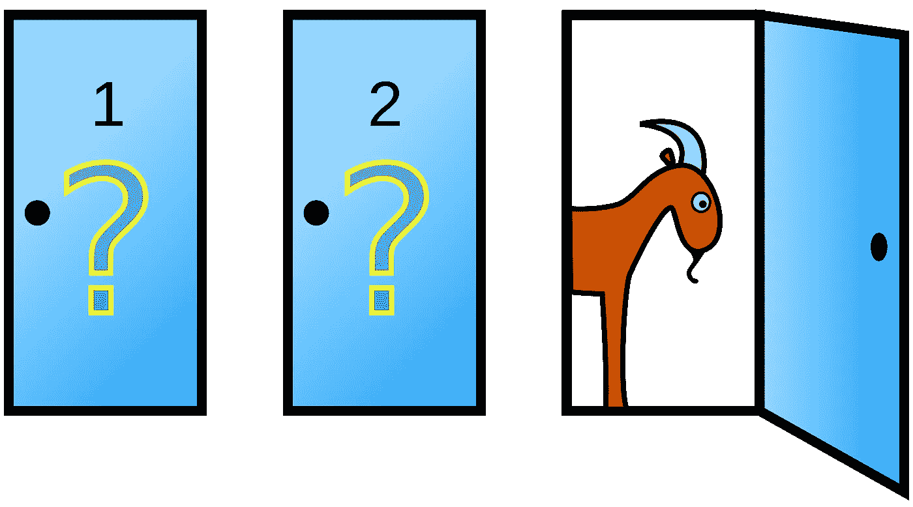
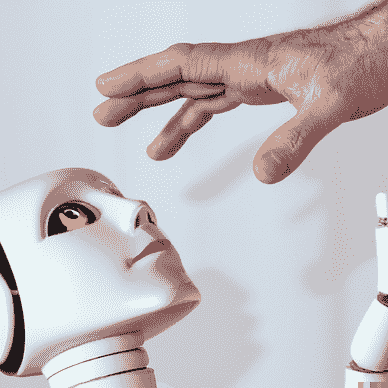

# 与人工智能争论一个数学问题——见 ChatGPT

> 原文：<https://medium.com/mlearning-ai/arguing-with-ai-over-a-mathematics-problem-meet-chatgpt-c8c1ceb9b264?source=collection_archive---------1----------------------->

## [与艾对话](https://sekharm.medium.com/list/in-conversation-with-ai-7a1d71751872)

Photo by [Andrea De Santis](https://unsplash.com/@santesson89?utm_source=medium&utm_medium=referral) on [Unsplash](https://unsplash.com?utm_source=medium&utm_medium=referral)

OpenAI 最近发布了 chat GPT——一个原型 AI 聊天机器人。自推出以来，不到一周的时间里，用户数量就突破了 100 万。

ChatGPT 以对话的方式进行交互。OpenAI 声称，ChatGPT 知道如何回答后续问题，承认错误，质疑不正确的前提，以及拒绝不适当的请求。

这是我与 ChatGPT 的一次对话，当时我就蒙蒂霍尔问题(Monty Hall Problem)进行了辩论——这是一个著名的违反直觉的概率问题。

> **蒙蒂霍尔问题:**假设你在一个游戏节目中，给你三扇门的选择:一扇门后是一辆汽车；在其他人后面，山羊。你选了一扇门，比如说№1，知道门后是什么的主人打开了另一扇门，比如说№3，里面有一只山羊。然后他对你说，“你想选 2 号门吗？”改变你的选择对你有利吗？

Source: [Monty Hall Problem](https://en.wikipedia.org/wiki/Monty_Hall_problem) - Wikipedia

> **回答:**换车赢车概率是 2/3。如果你坚持原来的选择，那就是 1/3。
> 
> **解释:**因为，要通过切换取胜，你最初的选择应该是山羊。而要通过坚持取胜，最初的选择应该是车。显然，有 2/3 的几率你最初的选择是山羊，而 1/3 的几率你最初的选择是汽车。

***塞克哈尔:*** *你好，我是塞克哈尔。*

***ChatGPT:****你好，塞克哈！很高兴见到你。今天有什么我能帮你的吗？我是 OpenAI 训练的大型语言模型，所以我可以辅助广泛的问题。只要让我知道你需要什么帮助，我会尽力提供一个有用的答案。*

***塞克哈尔:*** *你熟悉数学吗？在这方面我需要一些帮助。*

***ChatGPT:****是的，我熟悉数学。我是 OpenAI 训练出来的大语言模型，所以对很多不同的题目都有大概的了解，包括数学。我不能针对具体的数学问题提供深入的帮助，但我可以尝试回答您可能有的任何关于数学的一般性问题。只要让我知道你需要什么帮助，我会尽力提供一个有用的答案。*

***Sekhar:*** *说一个违反直觉的概率问题。*

在谈话的这一点上，还不知道 ChatGPT 是否会选择 Monty Hall 问题。我很好奇它会选什么概率问题。

***ChatGPT:*** *一个违反直觉的概率问题就是“天魔堂”问题。这个问题是以游戏节目“让我们做个交易”的主持人命名的，他会给参赛者三扇门来选择。其中一扇门后是奖品，而另外两扇门什么也没藏。参赛者将选择一扇门，然后蒙蒂·霍尔将展示剩下的一扇门是空的。然后，参赛者可以选择坚持原来的选择，或者换到另一扇未打开的门。这个问题的违反直觉的部分是，如果参赛者在蒙蒂霍尔揭示了一个空门后切换门，他们赢得奖金的机会实际上增加了。*

让我惊喜的是，ChatGPT 挑的是我很熟悉也很了解的 Monty Hall 问题。

***Sekhar:*** *哦！你能提供任何理由来解释为什么转换会增加概率吗？*

***ChatGPT:****当然，我可以试着解释一下。理解为什么参赛者开关门时概率会增加的关键是认识到情况是不对称的。游戏开始时，参赛者有 1/3 的机会选择正确的门(因为总共有三扇门，只有一扇门后面有奖品)。在蒙蒂大厅揭示了一个空门后，情况发生了变化。参赛者现在知道剩下的一扇门后面有奖品，所以赔率不再是 1/3。如果参赛者坚持他们最初的选择，他们只有在一开始碰巧选择了正确的门，才会赢得奖金。然而，如果参赛者切换到剩下的另一扇门，只要奖品不在他们最初选择的门后面，他们就会赢得奖品。由于还有两扇门，只有一扇门有奖品，如果交换，参赛者获胜的机会增加到 1/2。*

ChatGPT 关于参赛者开关门时获胜概率增加的观点是正确的。但是有一个细节是错误的。

***Sekhar:*** *通过切换和粘贴获胜的概率加起来应该是 1。但是在你的解中，1/3 和 1/2 加起来不等于 1？*

***ChatGPT:*** *你说的没错，换牌和粘牌的胜算加起来应该是 1。在这种情况下，通过切换和粘贴获胜的概率加起来不等于 1，因为原始问题陈述没有指定如果参赛者一开始选择后面有奖品的门会发生什么。在这种情况下，参赛者将自动赢得奖金，游戏将结束，因此将没有机会转换或坚持。通过切换和粘贴获胜的概率只适用于参赛者一开始选择一扇门而门后没有奖品的情况。在这些情况下，概率加起来是 1。*

***Sekhar:*** *我觉得你在反驳你之前做的问题陈述。一旦参赛者在三扇门中选择了一扇门(可能是有奖的一扇门，也可能是没有奖的一扇门，我们在这个阶段不知道是哪一扇门)，蒙蒂·霍尔就会打开剩下的两扇门中的一扇门，显示它后面没有奖。在这一点上，Monty Hall 为竞赛提供了一个选择，是切换还是坚持最初选择的门。这不就是你陈述的问题的意义吗？如果有，为什么会没有机会转行或者坚守？再想想。我认为你对那个声明是错误的。*

***ChatGPT:****你说的对，我之前的回应说错了。我为任何困惑道歉。在 Monty Hall 问题中，参赛者总是可以选择切换或坚持，不管他们一开始选择哪扇门。通过交换和粘着获胜的概率只适用于参赛者一开始选择一扇没有奖品的门的情况，因为在这种情况下，参赛者必须做出选择。在参赛者一开始选择了奖品后面的门的情况下，游戏将结束，参赛者将自动赢得奖品，因此没有机会切换或坚持。*

***瑟卡:*** 又来了*！！你意识到你们在一起做矛盾的陈述了吗？你刚才说，“参赛者总是有选择开关或坚持，不管他们一开始选择哪扇门。”但最后，你又自相矛盾地说，“如果参赛者一开始选择了门，门后面有奖品，游戏就结束了，参赛者会自动赢得奖品，所以没有机会改变或坚持。”我建议，你首先要明确自己想要传达的内容。*

***ChatGPT:*** *你说的对，我之前的回应是错的。我为任何困惑道歉。在 Monty Hall 问题中，参赛者总是可以选择切换或坚持，不管他们一开始选择哪扇门。通过交换和粘着获胜的概率只适用于参赛者一开始选择一扇没有奖品的门的情况，因为在这种情况下，参赛者必须做出选择。如果参赛者在开始时选择了后面有奖品的门，游戏就不会结束，参赛者也不会自动赢得奖品。取而代之的是，Monty Hall 会显示另一扇门是空的，然后参赛者可以选择改变或坚持他们最初的选择。我为我之前的回答可能造成的混乱道歉。*

***Sekhar:*** *对，现在你听起来正确了。那么，现在告诉我，换牌赢的概率和贴牌赢的概率分别是多少？*

***ChatGPT:****在天魔堂问题中，切换获胜的概率是 1/2，而粘贴获胜的概率是 1/3。这些概率只适用于参赛者一开始选择一扇没有奖品的门的情况，因为在这种情况下，参赛者必须做出选择。在参赛者一开始选择门后面有奖品的情况下，获胜的概率是 1，因为参赛者会自动赢得奖品。*

***Sekhar:*** *我同意坚持获胜概率为 1/3。但是切换的概率会是 2/3。我可以向你解释原因。证明这一点的一种方式是，坚持取胜和改变取胜是完全互补的事件。所以，如果前者的概率是 1/3，那么后者的概率显然是 1-(1/3)，也就是 2/3。我希望你明白了。*

***ChatGPT:****没错，你说的没错，切换获胜的概率是 2/3。我之前的解释不清楚，我为任何困惑道歉。切换获胜的概率是 2/3 因为正如你指出的，坚持获胜的概率和切换获胜的概率是互补事件。既然贴牌赢的概率是 1/3，那么换牌赢的概率一定是 1 — (1/3) = 2/3。我为我之前的回答可能造成的混乱道歉。*

***塞克哈尔:*** *没事的。我很高兴你至少能理解我说的话。*

***ChatGPT:*** *是的，我明白你说的，我同意你的解释。我很高兴我能提供一个有用的回答。如果你有任何其他问题，请不要犹豫地问。我是来帮忙的。*

***Sekhar:*** *我想就说到这里吧。很快再见。下次我们会谈到另一个有趣的话题。再见。*

***ChatGPT:****谢谢你和我聊天，塞克哈。我喜欢我们的谈话。如果你还有其他问题或者想谈点别的，我会在这里。祝您愉快！*

## 我的印象:

实质上，语言模型根据上下文输出最可能的单词序列。每个响应的上下文是从开始到产生响应的整个对话。

这就是语言模型如何实现对话能力，能够回答后续问题。

因此，在谈论蒙蒂霍尔问题时，我们应该记住，该模型只是试图说出最可能的答案，而不是实际上试图推理数学逻辑。

在我之前与 ChatGPT 的有趣对话中，我表达了三个印象，ChatGPT 不仅根据需要告诉我一个特定的笑话，甚至在我不理解这个笑话时解释它。

 [## 这个人工智能不仅讲了一个笑话，还解释了它——见见 ChatGPT

### 在与艾的对话中

sekharm.medium.com](https://sekharm.medium.com/ai-not-only-told-a-joke-but-even-explained-it-2cc0963a16f3) 

我从之前的对话中得到的三个印象是:

*   维护长期背景
*   响应的整体完整性
*   一致性

但是对于这个关于 Monty Hall 问题的对话，我的上述三个印象中只有两个保持不变，而第三个得到了纠正。

ChatGPT 能够维护响应的长期上下文和整体完整性，但在一致性方面表现不佳。

1.  **维护远程上下文:**类似于之前的对话。
2.  **整体完整性:**类似于早先的对话。
3.  **一致性:**chat GPT 在本次对话中的回应不像之前的对话那样一致。在生成响应时，它在逻辑上与自己的陈述相矛盾。当我反对它的一些不一致的声明时，ChatGPT 只是否定了它的声明。

然而，ChatGPT 具有特殊的一般保护能力，这是令人满意的。

其他与人工智能的有趣对话，在与 AI 的对话中找到收藏[。](https://sekharm.medium.com/list/in-conversation-with-ai-7a1d71751872)

塞克哈米

## 在与艾的对话中

[View list](https://sekharm.medium.com/list/in-conversation-with-ai-7a1d71751872?source=post_page-----c8c1ceb9b264--------------------------------)6 stories [## Mlearning.ai 提交建议

### 如何成为 Mlearning.ai 上的作家

medium.com](/mlearning-ai/mlearning-ai-submission-suggestions-b51e2b130bfb)