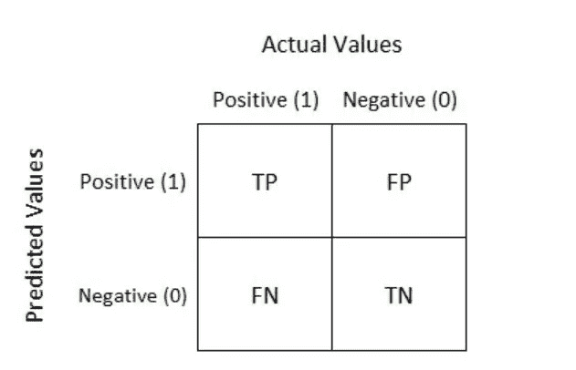
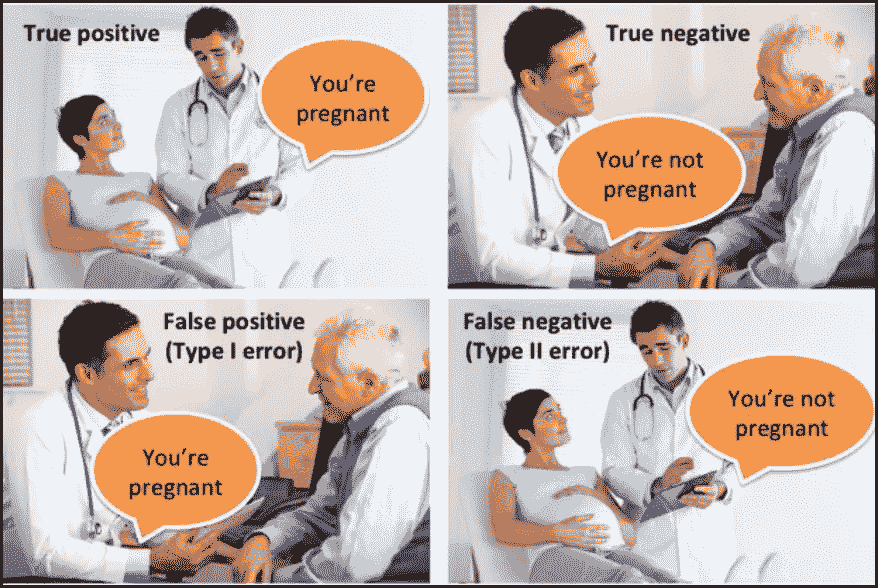
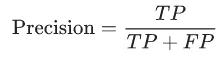
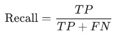

# 监督模型中选择度量标准的艺术第 2 部分

> 原文：<https://medium.com/mlearning-ai/art-of-choosing-metrics-in-supervised-models-part-2-f0956576e0e3?source=collection_archive---------9----------------------->

幸运的是，过了一段时间，我又在这里写作了。在之前的[帖子](https://towardsdatascience.com/art-of-choosing-metrics-in-supervised-models-part-1-f960ae46902e)中，我描述了一些回归问题最常用的评估指标。现在是分类问题的时候了。大家可能都知道，分类问题是处理离散数据的问题。

评估是在数据集上拟合模型的最后一部分。如果您处于这一步，这意味着您实际上已经完成了特征工程(选择或提取)、训练-测试分割、查找和拟合模型以及训练，做得很好。恭喜你。您处于最后一步，是时候根据测试数据评估您的模型的结果了。有多种评估指标可应用于分类算法，下面列出了最常用的评估指标:

***混淆矩阵
精确回忆
F1 评分
准确度
AUC — ROC 曲线***

这些是众所周知的评估机器学习算法性能的指标。让我们深入了解每一款产品的内幕。

# 混淆矩阵

混淆矩阵是分析分类模型性能的最强大也是最容易的度量之一，该分类模型的输出可能是两个或多个类。混淆矩阵本身不是一个度量标准；但是，我们可以从中提取一些有价值的指标:精度、召回率等。

让我们通过一个众所周知的通常用于描述混淆矩阵的二进制分类示例来更好地认识它，我指的是妊娠测试示例:

*1:患者怀孕
0:患者未怀孕*

因此，现在我们有一个表格，其中包含实际值和预测值的四种组合，作为混淆矩阵:

[Source](https://neeraj-kumar-vaid.medium.com/statistical-performance-measures-12bad66694b7)

好了，是时候搞清楚术语 TP，FP，TN，FN 是什么意思了:

**TP(真阳性):**表示*算法预测你怀孕了，你就是。*实际上，TP 意味着你的分类模型确实预测为阳性。在这个例子中，当模型预测妇女怀孕时，TP 发生。

**FP(假阳性):**表示*算法预测你怀孕了，而你没有。*在示例中，当模型预测该男子怀孕时发生 FP，这意味着模型错误地预测为阳性。

**TN(真阴性):**表示*算法预测你没有怀孕，实际上你也没有。* TN 表示分类模型预测的真实阴性。在这个例子中，当模型预测该男子没有怀孕时，TN 发生。

**FN(假阴性):**表示*算法预测你没有怀孕，但实际上你怀孕了。* FN 表示分类模型在预测负面时出错。在这个例子中，当模型预测妇女没有怀孕，但我们知道她怀孕了，FN 就出现了。

# 精确召回

精确度和召回率都是从混淆矩阵中建立的。通过考虑由混淆矩阵获得的真实肯定率，精确度和召回率的公式如下:

显而易见，精度是正确预测的阳性数据与所有阳性数据的比率(在一个类别中)，而召回是正确预测的阳性数据与正确预测的阳性数据和错误预测的阴性数据之和的比率(在一个类别中)。为了更清楚起见，让我们考虑一下之前的怀孕例子:

**精度:**这里的精度是指正确预测女方怀孕的数值与预测女方怀孕和男方怀孕的数值之和。

**回忆:**在这个例子中，回忆将把正确预测的妇女怀孕的值表示为正确预测的妇女怀孕和错误预测的妇女没有怀孕的总和。

# **精度**

根据经验，精确度可以立即告诉我们一个模型是否被正确地训练，以及它的一般表现如何，与应用于属于某个类的变量的精确度和召回相比，精确度告诉我们正确预测的变量与在两个类中完成的分类数量的比率。因此，我们可以通过这样说来理解这个例子中的意思:

这里，准确度等于所有预测的正确率(无论算法预测男人生病**还是女人怀孕**)。

然而，它没有给出关于其在该问题上的应用的详细信息。使用准确性作为你的主要性能指标的问题是，当你有一个严重不平衡的类时，它不会做得很好。

# AUC-ROC 曲线

这种方法也被称为 AUROC。当涉及到检查多类分类器的性能时，这种度量是一个明智的选择，因为它为您提供了模型性能的视觉感知。ROC ( **接收器操作特性**)是概率曲线，AUC ( **曲线下面积)**表示可分离性的程度或度量。AUC 越高，模型识别类别的能力越强。

**ROC**

ROC 曲线表示相对于假阳性率的真阳性率，因此它突出了分类器模型的敏感性。一个完美的分类器有一个 ROC，其中该图的真实阳性率为 1，并且没有假阳性。

[Source](/the-owl/evaluation-metrics-part-3-47c315e07222)

因此，ROC 曲线可用于确定分类器的阈值，最大化真阳性并进而最小化假阳性。ROC 曲线帮助您找出使用不同阈值度量的模型的真阳性率和假阳性率之间的权衡。

**AUC**

AUC 告诉我们，我们的分类器对随机选取的阳性样本的排序高于随机选取的阴性样本的排序的概率。曲线下的区域为分类器提供了区分类别的能力，并用作 ROC 曲线的汇总。AUC 越高，假定模型在区分阳性和阴性类别方面的性能越好。

在这篇文章中，我简要介绍了一些用于评估分类器(离散数据)的常用评估指标。还有许多其他指标(如对数损失等)，您可以根据您的模型和数据集的一些内在特征(分布、缺失值、有偏标签)来使用它们。

感谢您的阅读！

 [## Mlearning.ai 提交建议

### 如何成为 Mlearning.ai 上的作家

medium.com](/mlearning-ai/mlearning-ai-submission-suggestions-b51e2b130bfb)