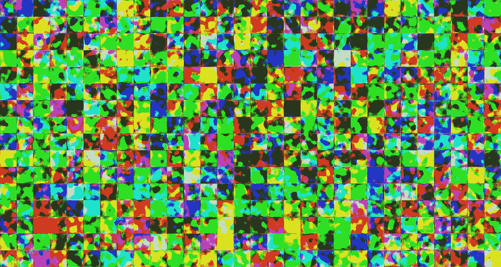
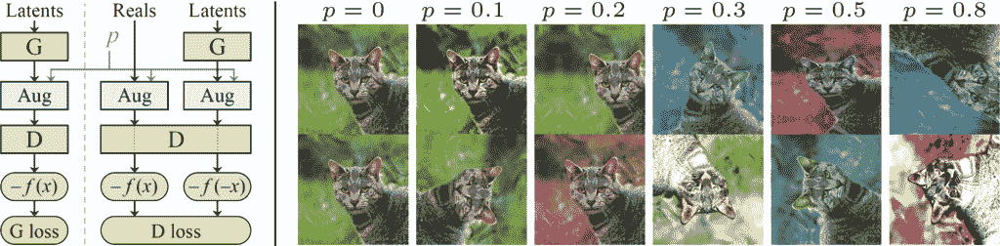
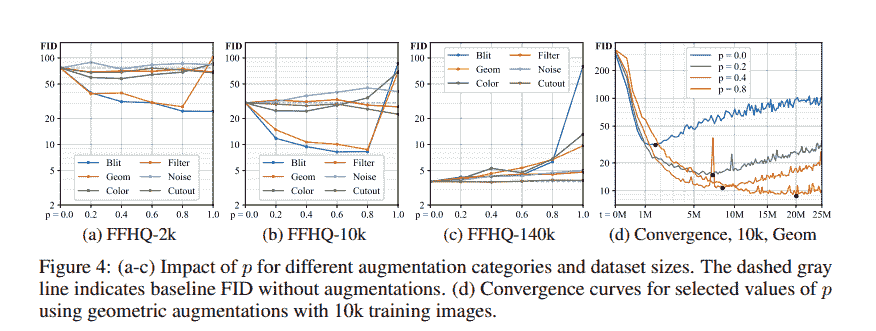
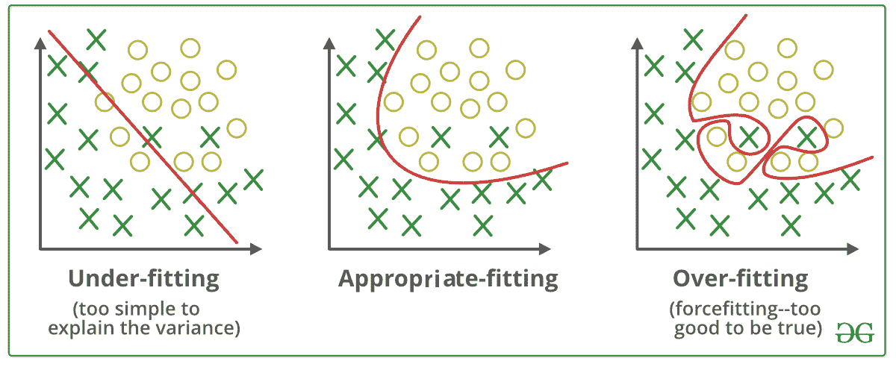
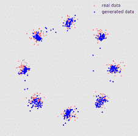
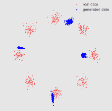
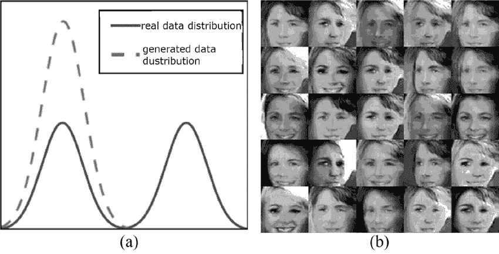

# 医疗保健中的人工智能第二部分

> 原文：<https://medium.com/mlearning-ai/artificial-intelligence-in-healthcare-part-ii-157301b51c0f?source=collection_archive---------1----------------------->

# **使用 PyTorch 生成人造皮肤损伤的教程**

*作者* [*桑德拉·卡拉斯科*](/@sandra.carrasco)*[*西尔维亚·马奇罗夫斯卡*](https://sylwia-majchrowska.medium.com/)*

**

*共享医疗数据是当今人工智能医疗保健行业的主要挑战之一。尽管有一些高质量数据集的倡议——如 [MIMC](https://mimic.mit.edu/) 或[国际标准行业分类](https://www.kaggle.com/c/siim-isic-melanoma-classification)数据集——我们需要更加多样化和复杂的数据集以便有效地学习。我们需要对高质量数据集的开放访问，以便为医疗保健推进和建立尽可能最好的机器学习模型。医疗机构共享数据的一种方式是使用去身份化或匿名化的数据。但这也有其局限性:它通常不是隐私的，据报道，在这样的数据集上，许多隐私泄露和重新匿名是可能的。*

*合成数据是基于真实数据从零开始生成的人工数据，可以作为研究的代理数据集，因为它类似于真实数据，但不包含任何特定个人的真实样本。通过这种方式，数据持有者可以生成高质量的合成数据，与机器学习社区共享。数据科学家可以利用这些数据创建 ML 模型，供原始数据持有者(医院)使用。*

*在我们之前的[帖子](https://towardsdatascience.com/artificial-intelligence-in-healthcare-is-synthetic-data-the-future-for-improving-medical-diagnosis-a74076ea3d7b)中，我们列举了为此目的使用合成数据的许多优势。今天，我们想与您分享如何使用生成式对抗性网络(GANs)来准备您自己的皮肤病变图像合成数据集的知识。*

# *StyleGAN2-ADA 架构*

*第一步是选择合适的架构来完成任务。我们的研究基于 [StyleGAN2-ADA](https://github.com/NVlabs/stylegan2-ada-pytorch) 网络，这是 NVIDIA 曾经流行的 StyleGAN 的最新版本。自适应鉴别器增强(ADA)是一种仅应用于鉴别器以克服过拟合问题的增强过程。在小数据集(少于 30k 的图像)中，鉴别器一次又一次地看到相同的图像。这会导致鉴别者记住真实的图像，这反过来会削弱生成器创建新图像的能力。解决方案是对鉴别者看到的图像应用经典增强。*

*在分类器网络中一直使用增强，但是使用生成网络，如果我们增强原始数据集，模型也可以学习模仿这种增强，这可以导致 ie。紫罗兰色的皮肤，不那么逼真。*

*在 ADA 程序中，在训练过程中应用这些增强，但是仅当模型确定样本是真实的还是虚假的时才使用增强，增强生成的和真实的图像。这使得发电机不受增强的影响。这里的关键是扩充是可微的，因此有一种方法可以在数学上撤销这些过程(图 1 中的 *-f(x)* )来训练生成器。*

**

*Figure 1\. Overview of ADA mechanism. The blue elements highlight operations related to augmentations, while the rest implement standard GAN training. The orange elements indicate the loss function and the green boxes mark the network being trained. A diverse set of augmentations are applied to every image that the discriminator sees, controlled by an augmentation probability *p*. Image by [NVIDIA Research](https://arxiv.org/abs/2006.06676).*

*图 1 显示了随机鉴别器扩充如何工作的概述。 *p* 参数是一个概率分数，它指定了这些增强如何以及何时发生。因此，在图 1 中，您可以观察到，从 p=0.1 开始，图像几乎没有受到应用的预处理的影响，到 0.8 结束时，图像变得非常不真实。需要注意的是，这种概率同时适用于所有可能的增强，这意味着在某些情况下，您可以获得旋转、移位、着色等。而在其他情况下——只是其中的一两个增强。这个参数对于调整非常重要，因为如果你使用高概率，生成器可以开始在生成的图像中输出这些增强，我们称之为*泄漏*。总的来说，ADA 为少于 30k 训练图像的数据集提供了更好的结果，训练速度快 1.6 倍，并且需要的 GPU 内存消耗少 1.5 倍。*

# *动手吧*

*现在，让我们看看如何让它运行起来。首先说一下系统规格和要求。你可能已经知道了，GANs 对计算能力和 GPU 的渴求，所以你至少需要一个高端的 GPU。您既可以使用提供的 docker 文件构建一个包含所有必需依赖项的映像，也可以使用 python 3.7、PyTorch 1.7.1 和 CUDA toolkit >= 11.0 安装必要的 Python 库。在[官方知识库](https://github.com/NVlabs/stylegan2-ada-pytorch)可以找到详细说明。*

# *ISIC 2020 数据集准备*

*接下来您需要做的是准备您的自定义数据集，以适应实现的数据加载器。在这种特殊情况下，我们将使用开源的国际皮肤成像协作(ISIC) 2020 数据库[1]作为例子来指导您完成教程，但是对于例如脑肿瘤的图像来说，过程将是相同的，其中数据更加有限，因此在生成过程中更容易过拟合。在这些罕见疾病的病例中，ADA 机制特别有趣。*

*该数据集由来自 2000 多名患者的独特良性和恶性皮肤病变的超过 33 个千张皮肤镜训练图像组成。虽然这是一个大型数据集，但它是高度不平衡的，仅包含整个数据集的 2%的黑色素瘤以及性别和年龄偏见。该数据集是为 2020 年夏天在 Kaggle 上举办的 [SIIM-ISIC 黑色素瘤分类挑战赛](https://www.kaggle.com/c/siim-isic-melanoma-classification)而创建的[2]，在这里您可以找到大量的分类实现以及数据处理方法。我们在之前的[文章](https://towardsdatascience.com/artificial-intelligence-in-healthcare-is-synthetic-data-the-future-for-improving-medical-diagnosis-a74076ea3d7b)中详细描述了数据集。此外，在我们的实验中，我们利用了来自 ISIC 2019 数据集的分辨率为 256x256 的 4 千幅黑色素瘤外部图像[3]。*

*提供给 *train.py* 的数据集必须存储为未压缩的 ZIP 档案，其中包含未压缩的 PNG 文件和用于标签的元数据文件 *dataset.json* 。为了从您的自定义数据集创建您的 ZIP 存档，获得最佳性能，您可以使用 *dataset_tool.json* 指定您的数据的源路径以及所需的宽度和高度(如果您的数据尚未调整大小)。*

*在训练条件模型的情况下，我们需要对每个图像进行特殊的注释——在我们的特定情况下，黑色素瘤(1)和非黑色素瘤(0)样本。类标签存储在名为 *dataset.json* 的文件中，该文件应该在数据集根文件夹中。该文件具有以下结构:*

*我们可以使用以下代码行从我们的 ISIC 数据集轻松创建此文件:*

# *StyleGAN2-ADA 培训*

*现在我们差不多准备好开始训练了。在最基本的形式中，训练新网络可以归结为运行以下命令:*

> *`python train.py outdir ~/training-runs --data ~/mydataset.zip --gpus 1`*

*您可以使用—模拟运行选项来验证参数并打印出训练配置。*

*在选项`--snap`的控制下，训练以固定的时间间隔导出网络 pickles 快照和示例图像。在每个间隔中，它还评估弗雷歇初始距离(FID)(或任何由`--metrics`指定的指标)，并将结果分数记录在 *json* 文件中，以及 TFEvents 中。*

*可以使用附加命令行参数自定义培训配置。这里，我们将讨论一些尚未提及的最重要的问题:*

*`--cond`:启用类条件训练的标志，这需要一个带有标签的数据集，就像我们刚刚创建的那个。*

*`--mirror`:通过在训练期间翻转图像(从左到右)，使图像数量翻倍的标志。也可以设置`--mirrory` 上下翻转。值得注意的是，这些是独立于训练增强的，所以生成翻转图像是没问题的。*

*`--metrics`:您可以将训练期间要计算的指标指定为列表，也可以关闭指标计算，因为这会增加训练时间。默认情况下，它会计算 *fid50k_full* 分数(尽管该论文指出 *kid50k_full* 是运行的最佳指标)。*

*这是一个 R1 正则化权重。基本上，它稳定了网络，允许较高的学习率用于不太一致的数据集，同时避免模式崩溃，默认值为 10。*

*`--kimg`:指定一个最大 kimg，这样一旦达到，你的模型就会停止训练。就个人而言，我们相信，仅仅基于您在迭代步骤中生成的示例上所看到的，停止您的培训会更好。*

*`--resume`:如果您要从之前的运行中恢复训练，或者想要从您的另一个模型中转移，请指明. pkl 文件的路径。*

*`--aug`:可以设置为*noug*在没有 ADA 的情况下测试 StyleGAN2。这里需要注意的一点是，论文指出扩充对于小数据集很有效，但是对于大数据集可能是有害的。*

*`--p`:固定被设置的增强的概率。默认情况下，它是一个取决于得分指标的波动值，因此它使用基于训练长度的加权值。*

*`--augpipe`:这是一个非常重要的论点，它设定了在增强过程中使用的增强类型。根据我们的经验，泄漏发生的频率比预期的要高，解决这个问题的一个方法是改变可用的增强。以下是增强规格的列表:*

**

*Figure 2\. Impact of p for different augmentation categories and dataset sizes on FFHQ dataset. The dashed line indicates baseline FID without augmentations. (d) Convergence curves for selected values of p using geometric augmentations. Image by [NVIDIA Research](https://arxiv.org/abs/2006.06676).*

*从图 2 中我们可以注意到，blit 和 geometry 是目前最重要的增强技术。颜色有时候会影响，其余的贡献不大，所以默认 *augpipe* 是 *bgc* (blit，geometry and color)。然而，我们已经注意到颜色有泄漏到输出的趋势，因此我们已经使用代码 *bg 从 *augpipe* 中移除了颜色。**

# *看火车模型*

*在模特训练期间，你应该特别注意几件事。我们来讨论其中的一些。*

***过拟合***

*您可能遇到的第一个陷阱是图像看起来与数据集完全相同。这意味着你的模型本质上只是记忆你的训练数据。因此，潜在空间不会被规则化，它会非常跳动，这意味着你不会得到图像之间的平滑插值。简而言之，潜在空间就是包含图像的潜在(隐藏)表示的任何假设空间，生成者知道如何将潜在空间中的点转换为图像。你可以在 Ekin Tiu 的文章中找到对隐藏空间背后的直觉的更详细的解释。*

*如果您想知道如何在您的模型中检查过度拟合，大多数指标只检查保真度或多样性，而不检查普遍性或真实性——这是该领域的一个开放问题(也是我们下一篇文章的主题，敬请关注！)*

*发生这种情况有几个原因，主要是因为您的数据集不够多样化或不够大，或者它包含许多重复项。这就是为什么在训练 GAN 之前正确准备数据是如此重要。解决这一问题的一些选项是向数据集添加额外的图像、应用一些增强或调整伽玛值。*

**

*Figure 3\. Simple 2D example of underfitting and overfitting. Image by geeksforgeeks.org.*

***模式崩溃***

*第二件你应该注意的事情是模式崩溃。当生成器找到几个欺骗鉴别器的解决方案，但它没有覆盖数据的全部分布时，就会出现这种情况(见图 4)。*

*为了解决这一问题，您可以改变学习速率并将批量加倍，因为批量大小决定了在每个分笔成交点有多少数据子集通过您的模型，因此，它会获得更广泛的数据变化或多样性。*

******

*Figure 4\. Example of GAN generated data (blue) for data samples coming from a 2D mixture of 8 isotropic Gaussian distributions (red). In the first image the synthetic data covers the real distribution while the second image showcases an example of mode collapse. Image by [5]*

***渐变爆炸***

*这是所有深度神经网络的一个相当普遍的问题。这是一个问题，其中大的误差梯度累积并导致在训练期间模型权重的非常大的更新，变得不稳定并且不能从训练数据中学习。在生成模型中，这表现为看起来非常嘈杂、破碎和混乱的图像。*

*有些事情你可以做的是从以前的好模式*重新开始。pkl* ，降低学习率，同时增加迷你批次大小。*

***泄漏***

*最后，最后要注意的是泄漏，当增强泄漏到您的输出生成的图像中时，就会发生泄漏。*

*为了防止这种泄漏，您可以从`--augpipe`中删除一个增加方法和/或降低`--p`值。*

# *假的还是真的——你看出区别了吗？*

*在经历了整个训练程序后，我们终于可以欣赏我们的人造鼹鼠图像了。在存储库中有一个名为 *generate.py* 的脚本，可以用来从特定的*种子*生成一系列图像。您只需要指定网络的路径*。pkl* ，生成图像的输出目录，种子(列表或范围)和要生成的类的标签。同样，对于黑色素瘤类(标签 1)，可以很容易地从命令行调用它，如下所示:*

> *`python generate.py --outdir out --seeds 0-35 --class 1 network /path/network.pkl`*

*当然，最重要的部分是让图像尽可能真实，但又不泄露敏感信息。现在只要享受你的工作，试着猜猜下面的图片是真是假(**先不要看描述**！).我们将发布第三篇关于 GANs 评价的帖子，敬请关注！*

**

*Figure 5\. Examples of real and synthetic images. In the first row we have real, synthetic, real, in second — synthetic, real, synthetic. Image by authors based on [1].*

* [## GitHub-aido tse/style gan 2-ADA-py torch:style gan 2-ADA 用于生成合成皮肤损伤

### 医疗保健数据在人工智能(AI)模型开发中的使用与以下问题相关联…

github.com](https://github.com/aidotse/stylegan2-ada-pytorch.git) 

# 文学

1.  Rotemberg，v .，Kurtansky，n .，Betz-Stablein，b .，Caffery，l .，Chousakos，e .，Codella，n .，Combalia，m .，Dusza，s .，Guitera，p .，Gutman，d .，Halpern，A .，Helba，b .，Kittler，h .，美谛高丝，k .，Langer，s .，Lioprys，k .，Malvehy，j .，Musthaq，s .，Nanda，j .，Reiter，o .，Shih，g .，Stratigos，A .，TschandlSci 数据 8，34 (2021)。[https://doi.org/10.1038/s41597-021-00815-z](https://doi.org/10.1038/s41597-021-00815-z)
2.  SIIM-ISIC-黑色素瘤-分类，Kaggle，检索自[https://www.kaggle.com/c/siim-isic-melanoma-classification](https://www.kaggle.com/c/siim-isic-melanoma-classification)(2020)28 . 12 . 2021。
3.  已处理 ISIC2020 数据集，含外部恶性肿瘤实例:[黑色素瘤外部恶性肿瘤 256 | Kaggle](https://www.kaggle.com/nroman/melanoma-external-malignant-256) (2020)
4.  [理解机器学习中的潜在空间|由 Ekin Tiu |走向数据科学](https://towardsdatascience.com/understanding-latent-space-in-machine-learning-de5a7c687d8d) (2020)
5.  [*黄泉*](https://openreview.net/profile?email=qhoang%40umass.edu) *、* [*屠定阮*](https://openreview.net/profile?email=tu.nguyen%40deakin.edu.au) *、*[T21【曲勒】](https://openreview.net/profile?email=trung.l%40deakin.edu.au) *、* [*定莳*、](https://openreview.net/profile?email=dinh.phung%40deakin.edu.au) [MGAN:多发电机训练生成性对抗网| OpenReview](https://openreview.net/forum?id=rkmu5b0a-) (2018)
6.  Karras、Tero、Samuli Laine、Miika Aittala、Janne Hellsten、Jaakko Lehtinen 和 Timo Aila。"分析并改善 StyleGAN 的图像质量." *2020 IEEE/CVF 计算机视觉与模式识别会议(CVPR)*(2020):8107-8116。

 [## Mlearning.ai 提交建议

### 如何成为移动人工智能的作者

medium.com](/mlearning-ai/mlearning-ai-submission-suggestions-b51e2b130bfb)*