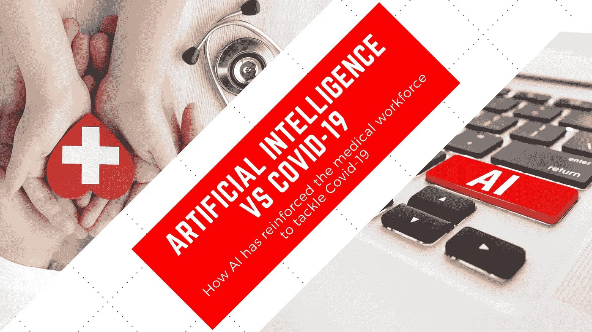

# 人工智能 vs 新冠肺炎

> 原文：<https://medium.com/mlearning-ai/artificial-intelligence-vs-covid-19-faeacbc2f163?source=collection_archive---------6----------------------->

## 人工智能如何加强医疗队伍以应对新冠肺炎！

Image by Author

我们每个人都清楚地知道 [*【新冠肺炎】*](https://en.wikipedia.org/wiki/COVID-19) ，这个疫情，我们在过去的两年里一直试图逃脱。几乎我们每个人都会同意这样一个事实，我们的医疗系统还没有准备好应对这样的疫情。疫情强调了我们医疗体系中的几个令人担忧的缺口，其中一些缺口甚至在疫情之前就已经存在，为了填补这些缺口，我们没有足够的医务人员。因此，医疗机构已经将注意力转移到技术上，更具体地说， [*【人工智能】*](https://en.wikipedia.org/wiki/Artificial_intelligence) 。

在这篇博客中，我们将一起探索人工智能社区的研究人员和开发人员所做的一些最新努力，以缩小这些差距，并确保为更广泛的人群提供更好、更安全、更实惠的医疗保健。但是在我们深入探讨之前，让我强调非常重要的一点。本博客的受众是每一个好奇的人，他们想知道更多关于人工智能在新冠肺炎的困难时期是如何帮助医疗工作者的，人工智能的知识并不是必须的。对于那些想深入了解这些概念的人，我将尽可能地提到额外的资源，对于那些第一次听说“人工智能”这个术语的人，让我给出一个非常简单的人工智能定义供你们参考(*借用自《大英百科全书》*)。

> **人工智能**被定义为数字计算机或计算机控制的机器人执行通常与智能生物相关的任务的能力。

现在，事不宜迟，让我们快速浏览一下我们将在本博客中讨论的各种努力的概要。

*   人工智能在几分钟内诊断出 Covid
*   Moderna 的新冠肺炎疫苗
*   与新冠肺炎相关的蛋白质结构的计算预测
*   NHS 供应链的人工智能项目
*   希腊使用 ML 算法对旅行者进行 Covid 测试
*   新冠肺炎评估机器人
*   预测新冠肺炎病恶化的人工智能
*   NHS 用人工智能和机器人解决新冠肺炎积压的问题
*   ML 预测哪些 Covid 患者会康复

## 人工智能在几分钟内诊断出 Covid

西苏格兰大学的研究人员开发了一种人工智能程序，当与 X 射线结合时，可以在几分钟内诊断出 Covid，而标准的聚合酶链式反应测试需要大约 2 个小时，而且准确率高达 98%！该程序使用 X 射线技术，将扫描结果与属于新冠肺炎患者、健康人和病毒性肺炎患者的约 3000 张图像的数据库进行比较，然后利用一种称为 [*卷积神经网络(CNN)*](https://towardsdatascience.com/a-comprehensive-guide-to-convolutional-neural-networks-the-eli5-way-3bd2b1164a53) 的东西进行诊断。 [*了解更多关于*](https://metro.co.uk/2022/01/20/x-rays-could-replace-pcr-tests-for-covid-detection-research-shows-15951946/) 的内容！

## Moderna 的新冠肺炎疫苗

美国制药和生物技术公司 Moderna 因其新冠肺炎疫苗而成为家喻户晓的名字，但当它在 2010 年成立时，它只是一家诞生在亚马逊网络服务(AWS)云中的生物技术初创公司。Moderna 的数字基础设施利用工作流自动化、数据捕获和人工智能来加速流程并为 it 科学家提供洞察力，此外，Moderna 还将通常按顺序进行的药物开发流程并行化。凭借他们的基础设施，他们能够在短短 65 天内从序列转移到给药，这一过程通常需要几年时间。 [*了解更多关于*](https://www.zdnet.com/article/moderna-leveraging-its-ai-factory-to-revolutionise-the-way-diseases-are-treated/) 的内容！

## 与新冠肺炎相关的蛋白质结构的计算预测

DeepMind 开放了对 AlphaFold 的访问，这是一种发现蛋白质形状的模型，并开放了其迄今为止的输出——这是生物医学研究的一个潜在聚宝盆。它还发布了几个正在研究的与新型冠状病毒病毒有关的蛋白质的结构预测，该病毒导致新冠肺炎。该公司发表了一项研究，描述了如何使用 AlphaFold 来找到一般的 和 [*人类特有的*](https://www.nature.com/articles/s41586-021-03828-1) 蛋白质的形状。这些结构预测尚未得到实验验证，但它们可能有助于科学界对病毒如何发挥作用的质疑，并作为未来开发治疗方法的实验工作的假设生成平台。 [*了解更多关于*](https://deepmind.com/research/open-source/computational-predictions-of-protein-structures-associated-with-COVID-19) 的内容！

## NHS 供应链的人工智能项目

谢菲尔德大学和人工智能医疗市场 Vamstar 之间的合作旨在帮助 NHS 更有效地管理其供应链。研究人员表示，新平台将帮助 NHS 从低风险供应商那里订购个人防护设备(PPE)等基本用品，并将缓解未来的短缺，就像第一波疫情经历的那样。此外，该平台将允许 NHS 买家评估供应商履行订单的信誉和能力。要了解更多这方面的内容， [*请继续阅读*](https://www.yorkshirepost.co.uk/health/coronavirus/sheffield-university-scheme-to-future-proof-nhs-supply-chains-from-national-shortages-3171091) ！

## 希腊使用 ML 算法对旅行者进行 Covid 测试

像许多其他国家一样，希腊没有能力对所有旅行者进行检测，尤其是那些没有出现症状的旅行者。一种选择是测试游客样本，但希腊选择尝试一种植根于人工智能的方法。在南加州大学研究人员的帮助下，政府推出了一个系统，该系统使用 ML 算法来确定进入该国的旅行者应该接受新冠肺炎病毒测试，该系统被发现在识别无症状人群方面比随机测试或基于旅行者原籍国的测试更有效。根据一项分析，在旅游旺季，该系统检测到的受感染游客比随机测试多两到四倍。 [*了解更多关于*](https://www.nature.com/articles/d41586-021-02554-y) 的内容！

## 新冠肺炎评估机器人

美国疾病控制和预防中心(CDC)发布了一款新冠肺炎评估机器人，可以为担心感染的人快速评估症状和风险因素，提供信息并建议下一步行动，例如联系医疗服务提供商，或者对于那些不需要亲自医疗护理的人来说，在家里安全地管理疾病。该机器人利用了微软的医疗机器人服务，可在疾病控制中心网站上获得。这是使用人工智能帮助疾病预防控制中心和其他一线组织响应新冠肺炎相关查询的解决方案之一，使医生、护士、管理人员和其他医疗保健专业人员能够为需要的人提供关键护理。欲知详情， [*读上*](https://blogs.microsoft.com/blog/2020/03/20/delivering-information-and-eliminating-bottlenecks-with-cdcs-covid-19-assessment-bot/) ！

## 预测新冠肺炎病恶化的人工智能

来自纽约大学数据科学中心的一个研究小组开发了一个人工智能系统，该系统可能有助于预测急诊室新冠肺炎患者的病情恶化。该团队利用从 4722 名新冠肺炎病毒检测呈阳性的患者中收集的 19957 次胸部 x 光检查的数据集开发了人工智能系统。该系统利用 [*深度卷积神经网络*](https://towardsdatascience.com/a-comprehensive-guide-to-convolutional-neural-networks-the-eli5-way-3bd2b1164a53) 对胸部 x 光图像进行风险评估。AI 还使用 [*梯度增强*](https://machinelearningmastery.com/gentle-introduction-gradient-boosting-algorithm-machine-learning/) 模型从常规收集的临床变量中学习，并结合来自两个系统的预测，他们预测了每个患者在不同时间范围内的总体恶化风险，范围从 24 小时到 96 小时。 [*了解更多关于*](https://nyudatascience.medium.com/cds-members-continue-evolve-ai-that-predicts-covid-19-patient-deterioration-a0a502686ca9) 的内容！

## NHS 用人工智能和机器人解决新冠肺炎积压的问题

新冠肺炎疫情让许多常规的 NHS 服务面临巨大的积压，为了解决这些漫长的等待名单，英国 NHS 宣布了 1.6 亿英镑的资金。主要计划包括实施使用人工智能来决定谁先接受治疗的系统，为全科医生患者提供一个由人工智能评估的选项，聊天机器人能够推荐人们去看物理治疗师或心理健康治疗师，并向老年患者发放机器人，使用远程控制技术，因此医院的顾问可以在脆弱的患者呆在家里时对他们进行视觉评估。要了解更多这方面的内容， [*请继续阅读*](https://www.telegraph.co.uk/news/2021/05/13/ai-robots-will-used-assess-patients-nhs-plan-tackle-record-waiting/) ！

## ML 预测哪些 Covid 患者会康复

研究人员开发了一种新工具，使用 ML 来更好地预测住院 Covid 患者的健康结果，并帮助医生做出更明智的治疗决定。该工具由柏林的慈善大学医学中心开发，它可以根据血液样本来评估感染者的病情。研究人员得出结论，如果在更大的队列中得到验证，血液蛋白测试可能有助于识别具有最高死亡风险的患者，以及测试给定的治疗是否会改变单个患者的预期轨迹。 [*了解更多关于*](https://scitechdaily.com/machine-learning-ai-can-predict-covid-19-survival-from-single-blood-test/) 的内容！

## 参考

 [## 数据科学内幕

### 获取每周发送到您收件箱的数据科学、人工智能和技术世界的最新新闻和最新动态。

www.superdatascienceacademy.com](https://www.superdatascienceacademy.com/data-science-insider)  [## 批处理|深度学习。人工智能

### 批次:面向工程师、高管和爱好者的每周人工智能新闻。

read.deeplearning.ai](https://read.deeplearning.ai/the-batch/) 

# 关于我的一点点👋

如果你没有兴趣认识作者，或者你已经认识我，你可以安全地跳过这一节。我保证这里没有隐藏的宝藏😆。

我是一个机器学习和深度学习的爱好者，这是我基于相同内容的第三篇文章。如果你喜欢，请把你的手放在一起👏如果你想阅读基于机器学习和深度学习的进一步文章 *#StayTuned。*

 [## Mlearning.ai 提交建议

### 如何成为 Mlearning.ai 上的作家

medium.com](/mlearning-ai/mlearning-ai-submission-suggestions-b51e2b130bfb)