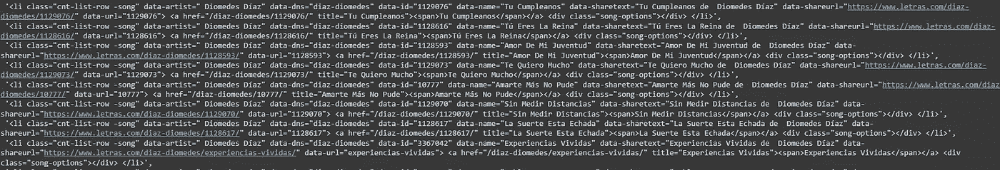
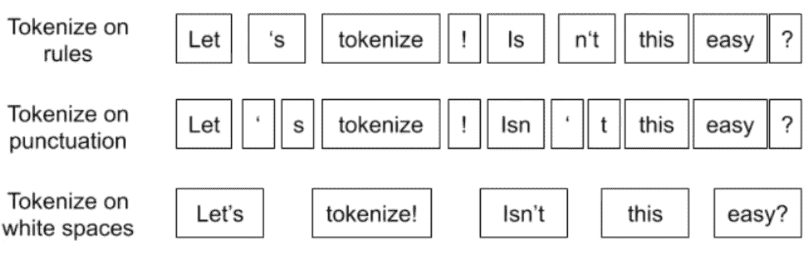
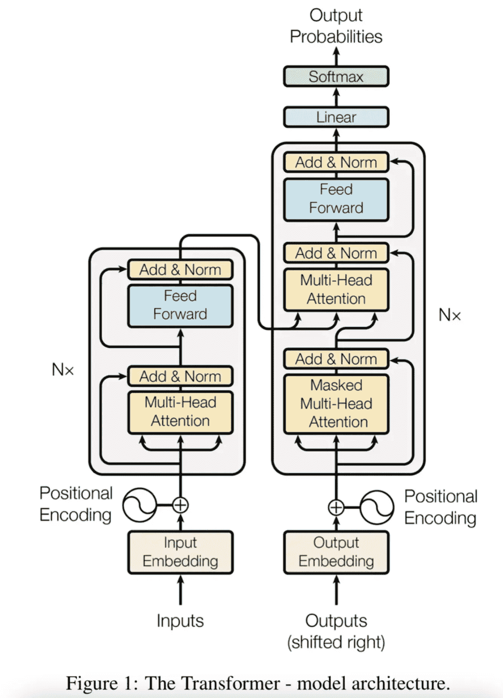
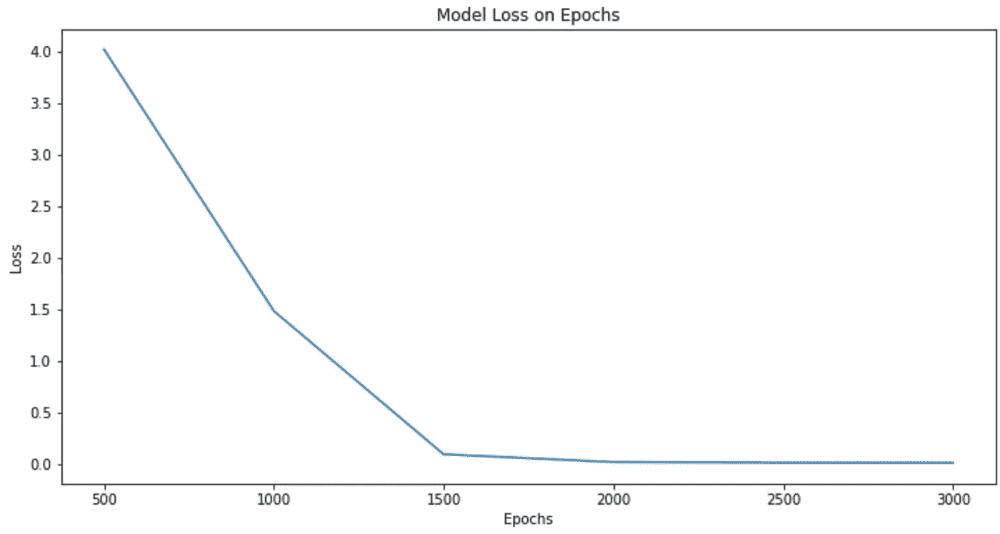

# 使用机器学习的基于艺术家的歌词生成器

> 原文：<https://medium.com/mlearning-ai/artist-based-lyrics-generator-using-machine-learning-eb70dc4fb993?source=collection_archive---------2----------------------->

在这篇文章中，我将向你展示如何使用 [HuggingFace](https://huggingface.co) 微调和训练你自己的变压器。


Photo by [Matt Botsford](https://unsplash.com/@mattbotsford?utm_source=medium&utm_medium=referral) on [Unsplash](https://unsplash.com?utm_source=medium&utm_medium=referral)

作为我的[上一篇关于使用递归神经网络生成音乐的文章](/mlearning-ai/how-to-generate-music-using-machine-learning-72360ba4a085)的续篇，我们将使用 HuggingFace 的变形金刚根据我们训练它的艺术家来生成歌词。在这篇文章中，我们将使用狄俄墨德斯·迪亚兹的歌词，以他的写作风格创作一首新歌。我选择狄俄墨德斯是因为他的遗产和对哥伦比亚加勒比文化的影响。

我鼓励你跟随这篇文章，挑选你最喜欢的艺术家，尝试不同的参数和/或不同的模型，看看你会得到什么样的结果。所有的代码都在 Github repo 中，链接在文章的最后。

在本文中，我们将遵循以下步骤:

*   从网上扒歌词。
*   将歌词处理成. txt 格式。
*   从 HuggingFace 下载标记器和模型。
*   用收集的数据微调模型。
*   用模型的结果生成一首新歌。

# 网页抓取

我们应该寻找一个网站，其中包含我们想要使用的艺术家的歌词，在我们的情况下，狄俄墨德斯。来发现[这个网站](https://www.letras.com/diaz-diomedes/)有一个可访问的(和*可删除的*)形式的所有歌词。

我们应该为这个任务使用 Beautiful Soup，所以让我们导入相关的库:

```
import requests
from bs4 import BeautifulSoup
```

网页抓取是一个非常迭代的过程，建议你在做的时候理解 HTML，这样你就可以对我们正在做的事情有一个大概的了解。

```
page = requests.get('https://www.letras.com/diaz-diomedes/')
soup = BeautifulSoup(page.text,'html.parser')
```

检查网站的代码，我们可以看到歌曲列表是在一个列表标签( [*<【李】>*](https://www.w3schools.com/tags/tag_li.asp) )里面的，所以我们具体来看一下这些标签。

```
listOfSongs = []

for i in soup.find_all('li'):
  listOfSongs.append(i)

listOfSongs = [str(x) for x in listOfSongs]
```

一旦我们看到了它的内容，如果它们包含“https ”,让我们将它们附加到一个列表中，以确保我们得到了特定歌词的链接

```
newSongs = []

for link in listOfSongs:
  if 'https' in link:
    newSongs.append(link)
```

这是我们新名单的样子:



Output for newSongs

现在让我们从歌曲中提取链接:

```
urls = []
for song in newSongs:
  try:
    urls.append(song.split('"')[13])
  except:
    print(song)
```

这是我们新的歌词列表的样子:


Output for newSongs

现在我们有了狄俄墨德斯所有歌曲的链接，我们可以一首接一首地抓取它们，遵循与我们目前所做的相似的模式。

我们应该有一个列表，其中每个元素都是一首歌的歌词字符串。现在我们应该创建一个包含他所有歌曲歌词的. txt 文件，最好用换行符隔开。

说完，歌词刮擦部分就结束了。现在我们应该转向本文的标记器和模型部分。

**令牌化器和变压器**

在开始选择我们的分词器之前，我们必须选择一个模型用于我们的歌词生成。常见的中型变压器是 GPT-2，因此我们将使用该变压器。另一个成功的例子是伯特和罗伯塔，如果你也想试试的话。我测试了上述所有变形金刚，发现 GPT-2 给出了最一致的结果。

请记住，狄俄墨德斯·迪亚兹的所有歌曲都是西班牙语，我们将不得不使用西班牙语分词器。在我们的例子中，我们不会训练一个分词器，因为现在有足够多的西班牙语分词器就足够了。但是记号赋予器具体做什么呢？分词器将句子拆分成单词，然后将单词转换成 id 并存储在查找表中。



How tokenizers work (taken from [Tokenizers: How machines read](https://www.google.com/url?sa=i&url=https%3A%2F%2Fblog.floydhub.com%2Ftokenization-nlp%2F&psig=AOvVaw0vxFQGfZjvh39tgZJ9jZfH&ust=1672515413046000&source=images&cd=vfe&ved=0CBEQjhxqFwoTCNi6v8qLovwCFQAAAAAdAAAAABAk))

在测试了 HuggingFace 网站推荐的几个标记器后，我发现[*flax-community/GPT-2-Spanish*](https://huggingface.co/flax-community/gpt-2-spanish)*是我们用例的一个很好的标记器，因为它是在 [OSCAR](https://oscar-project.org) 数据集上训练的。*

*到目前为止，我们已经刮了我们的歌词，并谈到了记号化，但我们还没有看看什么是变压器。*

*转换器是一种模型架构，由编码器-解码器对组成，使用注意机制将一个序列转换为另一个序列。这是在论文[“注意力是你所需要的一切”](https://arxiv.org/abs/1706.03762)中首次介绍的，这些转换器的一个主要优势是它们可以并行化，而不是像 rnn(LSTM、GRU 等)那样按顺序进行。这有助于减少培训时间。*

*前面提到的注意机制为输入序列中的任何位置提供了上下文。如果输入数据是一个自然语言句子，就像本文中的情况一样，转换器不必一次处理一个单词。*

**

*Figure 1: From ‘Attention Is All You Need’*

*如果你想了解更多关于变形金刚的知识，我建议你看看马克西姆的[什么是变形金刚？](/inside-machine-learning/what-is-a-transformer-d07dd1fbec04)还有 Jay Alammar 的[文章](http://jalammar.github.io/illustrated-transformer/)在上面。*

*变形金刚非常适合翻译、序列生成和情感分析。*

*让我们下载用于文本处理的分词器*

```
*from transformers import AutoTokenizer, AutoModelForCausalLM

tokenizer = AutoTokenizer.from_pretrained("flax-community/gpt-2-spanish")

model = AutoModelForCausalLM.from_pretrained("flax-community/gpt-2-spanish")*
```

*现在让我们将测试加载到我们的笔记本中，并在每一个换行符处将其分开。*

*这样做之后，让我们使用 SciKit Learns*train _ test _ split*将它拆分到我们的训练/测试集中*

```
*train, test = train_test_split(lines,test_size=0.15)

print("Train dataset length: "+str(len(train)))
print("Test dataset length: "+ str(len(test)))

>>> Train dataset length: 4676
>>> Test dataset length: 826*
```

*现在让我们将我们的训练集和测试集保存到单独的。txt 文件供以后参考。我们还将获得它们各自的路径，供我们的模型使用*

```
*with open('traincancionesDiomedes.txt', 'w') as f:
  for t in train:
    f.write(t)
    f.write(' ')

with open('testcancionesDiomedes.txt', 'w') as f:
  for t in test:
    f.write(t)
    f.write(' ')

train_path = 'traincancionesDiomedes.txt'
test_path = 'testcancionesDiomedes.txt'*
```

*我们的转换器要求我们将数据加载到 DataCollator 中以供使用。顺便说一下，数据排序器是通过使用数据集元素列表作为输入来形成批处理的对象。如果输入的长度不同，它们会被动态填充到一个批处理的最大长度。*

```
*from transformers import TextDataset,DataCollatorForLanguageModeling

def load_dataset(train_path,test_path,tokenizer):
    train_dataset = TextDataset(
          tokenizer=tokenizer,
          file_path=train_path,
          block_size=128)

    test_dataset = TextDataset(
          tokenizer=tokenizer,
          file_path=test_path,
          block_size=128)

    data_collator = DataCollatorForLanguageModeling(
        tokenizer=tokenizer, mlm=False,
    )
    return train_dataset,test_dataset,data_collator

train_dataset,test_dataset,data_collator = load_dataset(train_path,test_path,tokenizer)*
```

*当调用 DataCollatorForLanguageModeling 时，我们将使用 mlm = False (mlm 代表屏蔽语言建模)。*

*现在，让我们通过指定输出目录( *output_dir* )、训练时期数( *num_train_epochs* )、训练的批量大小(*per _ device _ train _ batch _ size*)、模型评估的批量大小(*per _ device _ eval _ batch _ size*)、两次评估之间的更新步骤数( *eval_steps* )、用于在 n 个步骤之后保存模型的检查点(【T10*

```
*model = AutoModelWithLMHead.from_pretrained("flax-community/gpt-2-spanish")

training_args = TrainingArguments(
    output_dir="./gpt2-diomedes-2", 
    overwrite_output_dir=True,
    num_train_epochs=300, 
    per_device_train_batch_size=32,
    per_device_eval_batch_size=64,
    eval_steps = 100, 
    save_steps=800, 
    warmup_steps=500
    )

trainer = Trainer(
    model=model,
    args=training_args,
    data_collator=data_collator,
    train_dataset=train_dataset,
    eval_dataset=test_dataset
)*
```

*这部分可能需要一点时间，因为需要下载模型。根据您使用的型号，下载时间可能会有所不同。*

*现在我们已经设置了我们的训练器和数据，让我们开始训练模型。*

```
*trainer.train()*
```

*使用谷歌 Colab Pro 的标准 GPU，大概花了一个小时，经历了 300 个纪元。这是模型训练的结果*

**

*Graph showing how the Loss decreased on every epoch*

*现在，让我们测试一下，如果我们给它一个单词的提示，让它完成，模型的表现如何*

```
*from transformers import pipeline

diomedes = pipeline('text-generation',model='./gpt2-diomedes-2', tokenizer='flax-community/gpt-2-spanish')

results = diomedes('Ay! ')[0]['generated_text']

>>> 'Ay! Soy partidario decidir maldecir Que me perdones todo lo que yo hago Que no te conocí en la playa porque no me gustaba su actitud Que ya te la voy a pasar lista andarán mis canciones que acaban pero'*
```

*生成的文本实际上听起来像一首歌！现在让我们来看看如何生成一首完整的歌曲！*

***生成歌曲***

*如果你一直跟着做，现在你已经成功地用你最喜欢的艺术家训练和微调了你自己的 GPT-2 模型。让我们用他们的风格创作一首歌。*

*从我们的数据集中，让我们挑选几个例子，获取它们的前一个或两个单词，并使用它们作为提示*

```
*import random

prompts = []
for line in lines:
  prompts(' '.join(line.split(' ')[:2]))

random_prompts =  random.sample([x for x in prompts], 20)*
```

*这样，我们就有了一个 20 个随机抽样的两个单词提示的列表，我们将使用它来生成一首 20 行的歌曲。*

*现在让我们调用这个模型并遍历它来生成我们的新歌。我们还可以设置一个 *max_length* 参数来限制模型生成的字符数量。让我们试试 20 到 30 个字符之间的 *max_length* ，这将使用 *random.randint()* 随机选择*

```
*song = []

for line in random_inits:
  song.append(diomedes(f'{line}',max_length=random.randint(20, 30))[0]['generated_text'])*
```

*让我们看看我们的模型生成了什么*

```
*>>> ['con el paso del tiempo Que no crea que todo terminó Y ni se imaginan el mundo se va, yo era el',
 'Y que los cumplas a todos gusto y alegremente deseando que pase un año más más lleno de proyectos que he',
 'Qué triste sería no quererte a ti cerca Para ser un gran victoria También es un compositor que vive d',
 'Al fin : Aleluas No sé por qué será, pero aléjense de la',
 'Dime nada yo tengo el present. Y otra ves maana morirme Pero no tienes que temer, no tienes porque aclarar',
 'Y al que encuentra es al difunto  Con lo más sublime del sentimiento  Dime que hizo mal presentándote con su',
 ...
 'Yo soy un hombre solo Será en este lugar especial Quedar para ninguno Sí, y yo no',
 'Y andabas pensando en mí dijo la malvade, a la luna que respiros (se escuchaban dulces quejas ']*
```

*它肯定需要一些微调！我们可以尝试生成 n 个新行，然后手工挑选出最有意义的行。*

*我们用来生成新歌的方法有一个缺陷；我们从 100 多首歌曲中随机挑选了 20 个两个单词的提示，它们都不是关于同一个主题的，所以模型生成的行可能都是关于不同的主题。*

***结束语***

*学习如何使用 HuggingFace 和它的模型肯定很有趣，我期待着继续使用它们。如果您有兴趣了解如何使用它，他们的网站上有很多很棒的文档和视频，展示了如何使用他们的模型和标记器。*

*再次感谢您抽出时间阅读本文。*

**免责声明:不要用它来创作你自己的歌曲并从中获利。这是一个实验，展示了机器学习可以做什么。请尊重那些花了数小时、数天、数月甚至数年时间来创作这些歌曲的艺术家们的作品。这篇文章仅用于教育目的。**

*[](/mlearning-ai/mlearning-ai-submission-suggestions-b51e2b130bfb) [## Mlearning.ai 提交建议

### 如何成为 Mlearning.ai 上的作家

medium.com](/mlearning-ai/mlearning-ai-submission-suggestions-b51e2b130bfb)*