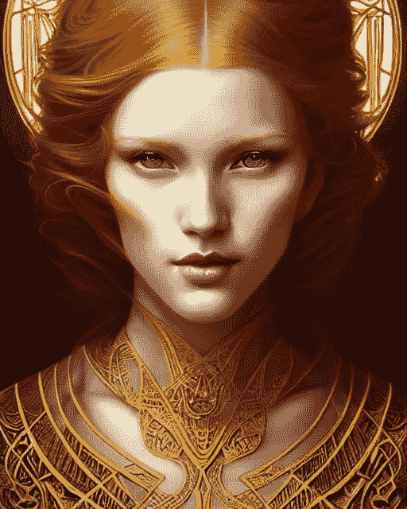
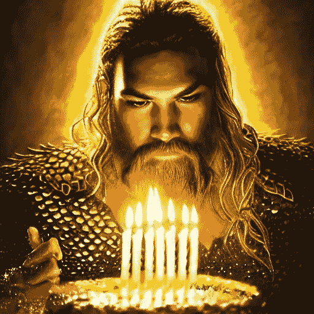
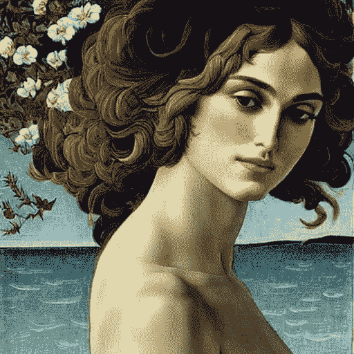
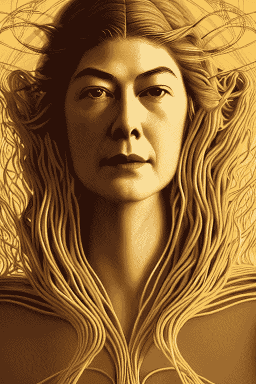

# 艺术家们对可以生成类似作品的新人工智能模型大动干戈

> 原文：<https://medium.com/mlearning-ai/artists-up-in-arms-over-new-ai-model-that-can-generate-similar-works-883b25552636?source=collection_archive---------0----------------------->

稳定扩散是否违反著作权法？

An image generated by Stable Diffusion. Prompt by Aron Brand

艺术界正在酝酿一场新的争议，因为传统艺术家担心一种新的人工智能模型，称为稳定扩散。这个模型由初创公司 Stability AI 开发，在互联网规模的图像数据集上进行训练，能够生成特定艺术家风格的艺术品。这些艺术家中的一些人有理由担心他们的生计，因为人工智能模型能够创作出与他们自己非常相似的作品。

事实上，有一段时间已经很清楚，未来我们的许多工作将被智能机器取代。我们已经看到它发生在其他行业，如制造业和农业。但令人惊讶的是，即使是创造性的艺术也不能幸免于这一趋势。

一些愤怒的艺术家现在声称，稳定传播产生的作品与他们自己的太相似，违反了版权。然而，重要的是要明白版权只是保护艺术家不被他人复制他们的真实作品。这并不能保护他们免受其他人以相同风格创作的作品的影响。所以，从法律上来说，人工智能模型可以检查别人的作品，吸收其中包含的概念，然后将那些相同的概念，技术，颜色和风格应用到类似的主题中，以得出原创作品。

换句话说，作为一名艺术家，你应该知道版权**只保护你不被其他人复制你的真实作品**——而不是被其他人以相同的风格创作出他们自己的作品。

作品是否是复制品，取决于从原作中摘取的东西是否是‘实质部分’。稳定扩散可以复制特定艺术品的大部分吗？

虽然在理论上“过度拟合”是可能的，其中人工智能模型记住了他们训练集的一部分，但常识——由该工具的真实世界经验支持——同意稳定扩散和其他当代人工智能模型，如 DALL-E 和 Midjourny，是**而不是**能够充分记住艺术作品。事实上，稳定扩散模型的大小只有几千兆字节，而它是在数百万亿字节的源图像上训练的。用 Stability AI 首席执行官和创始人艾玛德·莫斯塔克的话说，这是人类的集体图像压缩成几千兆字节大的文件。从源图像到模型的这种极大的有损压缩，将数据量减少了至少四个数量级，这意味着稳定扩散忠实地记忆特定艺术作品的“实质”部分的概率极其微小。

从艺术家的角度来看，这是一个令人担忧的发展。他们的生计取决于他们创造原创作品的能力，如果人工智能能够产生类似的作品，这可能会使他们的工作贬值。如果一位艺术家提出了一种新的独特风格，那么人工智能模型能够学会以这种风格创作作品只是时间问题，如果不是更好的话。

艺术家对社会很重要，因为他们帮助我们以新的和不同的方式看世界。它们帮助我们理解自己的情感，并与他人产生共鸣。如果我们失去了创造原创艺术的经济动力，那将是人类的巨大损失。

从这个角度来看，我们可能需要在未来对版权法进行一些修改，以保护艺术家免受这种新的威胁。然而，这些变化可能是什么仍然有待讨论。

Aquaman’s Birthday. Stable Diffusion, Prompt: Aron Brand

Keira Knightley as Venus in “Birth of Venus”, by Botticelli. Stable Diffusion, Prompt: Aron Brand

Rosamund Pike with Spaghetti Hair. Stable Diffusion, Prompt: Aron Brand

 [## Mlearning.ai 提交建议

### 如何成为 Mlearning.ai 上的作家

medium.com](/mlearning-ai/mlearning-ai-submission-suggestions-b51e2b130bfb)