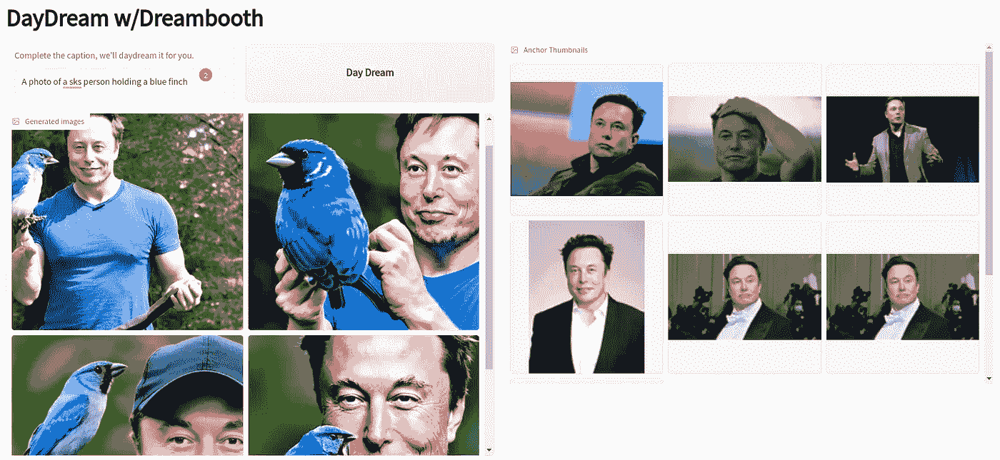

# 骑马的宇航员？去过吗？幻想自己骑独角兽

> 原文：<https://medium.com/mlearning-ai/astronauts-riding-horses-thats-old-daydream-your-way-to-riding-a-unicorn-7d3a81efcc37?source=collection_archive---------7----------------------->

To your right are a few ‘anchor’ images and to your top and left is the text you want rendered but personalized by the anchor image! Click on DayDream to get the Images personalized to your ‘anchor’ image.

当前的文本到图像生成器令人惊叹，但却是通用的，也就是说，你不能将你的个性化插入到生成的图像中。

随着[梦想小屋](https://arxiv.org/pdf/2208.12242.pdf)的出现，一切都变了。

下面是对 [Dreambooth](https://arxiv.org/pdf/2208.12242.pdf) 用法的通俗解释，因此你可以想象出迄今为止不可能的用例。我们用我们的应用程序 [DayDream](https://github.com/aurotripathy/daydream) 做到了这一点，它是 Dreambooth 的一个轻量级包装器。对于 UX，我们使用 [Gradio](https://gradio.app/) ，这是打包交互式演示的最简单方法。

梦幻小屋的食谱再简单不过了。是的，我们掩盖了一些可能会让你犯错的超参数(这需要练习)。无论如何都要投入进去！

1.  收集特定主题的几张(3-5 张)图片。这就是你要讲的故事的中心人物。随便抓拍这些图像，增加变化(见上图我的选择)。不要担心，你想要的这个中心主题的变化将只由*你的文本提示来引导。我们选择了一个在新闻圈里很常见的“主题”。*
2.  对有限数量的步骤执行微调(当然，除了稳定扩散之外还有什么)。请注意，模型很快就会过度拟合，许多人已经提出了调整过度拟合的方法。见下面我的微调脚本。
3.  搞定了。你马上就可以进行推理了。作为参考，在 RTX 3090 系统上进行微调(上述步骤 2)需要 10 分钟！这是我推荐的最低配置。随着微调的进行，为无止境的实验(和乐趣)做好准备。我已经用 Gradio web 接口(如上所示)打包了推理，并使我的基本代码[可用](https://github.com/aurotripathy/daydream/blob/main/gradio/dream-ui.py)。我的样文，`A photo of an sks person holding a blue finch`。你会注意到句子中间有一个奇怪的词，`sks`。为了了解`sks`，代表‘植入’主体的稀有标记标识符，你必须深入研究这篇论文。我会找时间写一个解释的，我保证。

My fine-tuning script; includes prior-preservation loss, fp16 optimizer, and fine-tuning thru the text encoder (pretty much, every tool in the toolbox)

## 观看一分钟的演示

## 参考

[DreamBooth:微调文本到图像扩散模型
用于主题驱动生成](https://arxiv.org/pdf/2208.12242.pdf)

## 行动呼吁

用用例给我打电话。在你的舌尖上有无数的它们！

## 谢谢

👏为这个故事鼓掌，跟我来👉

 [## Mlearning.ai 提交建议

### 如何成为 Mlearning.ai 上的作家

medium.com](/mlearning-ai/mlearning-ai-submission-suggestions-b51e2b130bfb)