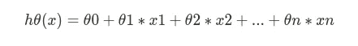
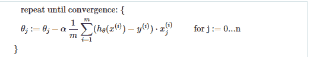
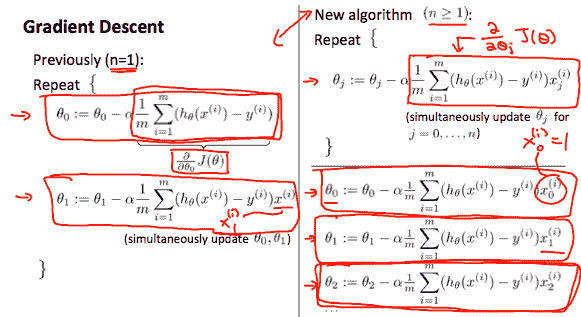
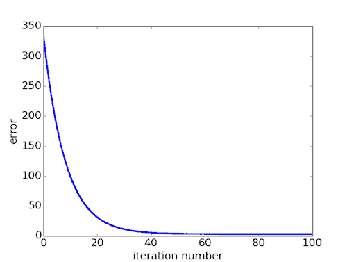
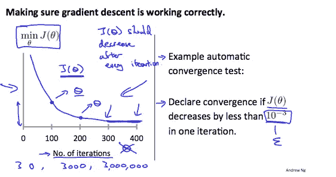
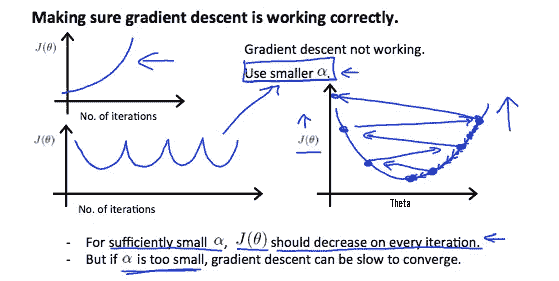
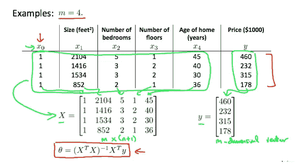
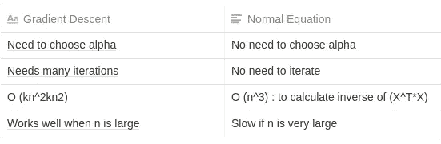

# 你应该以什么价格出售你的房子？—多元线性回归

> 原文：<https://medium.com/mlearning-ai/at-what-price-should-you-sell-your-home-multivariate-linear-regression-a6824ec172b1?source=collection_archive---------4----------------------->

Photo by [Breno Assis](https://unsplash.com/@brenoassis?utm_source=medium&utm_medium=referral) on [Unsplash](https://unsplash.com?utm_source=medium&utm_medium=referral)

# 先决条件

如果你还没有读过我以前的文章，在那篇文章中，我带你一步一步地了解线性回归算法的幕后，在那篇文章中，我们直观地构建了它背后的整个数学本质，[你真的需要看看这个](https://hemanth-kotagiri43.medium.com/introduction-to-machine-learning-30a50cdec18e)。这篇文章是上一篇文章的延伸，我想你已经尝试过了。在本文中，让我们来处理影响我们算法的多个特征/变量的问题。同样，这些是我在 Coursera 上学习吴恩达的机器学习课程时做的个人笔记。如果你感兴趣的话，可以随意学习，最棒的是这门课是免费的。

## 背景

**注意我特意为这篇文章选择的图片——房屋**。很明显，每栋房子都有可能以高价出售。在上一篇文章中，我们已经处理了一个单一的特征——也就是说，我们实际上是基于一个可能影响房屋价格的单一因素来构建我们的整个算法的。让我更清楚地说明我们所说的“特性”指的是什么。

假设你是其中一个家庭的居民。你打算卖掉你的房子。你将如何有效地选择你应该销售的阈值？这就是这个算法可以发挥作用的地方。**特色，在这个问题中，就是你家的特色**。比如:

*   这个家有多老了？
*   你家的卧室总数。
*   你家的浴室数量。
*   你家所占的总面积。
*   它有停车场吗？如果有，可以停多少车？
*   它有一个后院，我可以坐在那里，在季风和阅读浪漫小说吗？
*   它有一个我可以享受夏天的游泳池吗？

您已经看到，特征空间正在扩大，您也可以组合几个特征并创建一个新的特征。这就是特征空间发挥作用的地方，跟踪哪些特征影响最大，以及从长远来看哪些特征对算法的性能有更大的影响，这一点非常重要。

所以，这个想法是，根据具有**相同的多重特征**的“学习范例”来预测你的房子可以卖出的价格。如果你已经明白了以上内容，那么恭喜你！你现在可以开始参加所有初学机器学习的人都参加的最著名的 Kaggle 竞赛了——房屋价格竞赛，这也是我的第一个竞赛。说够了，让我们开始数学吧。

## **假设函数—重新定义**

这里，基于我们在上一篇文章中定义的假设，如果我们有一个函数有多个变量/特征比如 x1，x2，x3…xn；然后，我们将假设函数表示为:

我们可以选择以向量的形式来表示我们的假设函数，在许多编程语言中，如 MATLAB 和 Python，由于向量的设计方式，使用向量表示可以提高计算速度。

## 多变量梯度下降

设 n 表示数据集中给定特征的数量。以前，我们有 n = 1，这只是一个特性，但在这里，我们可能有 2 个以上的特性。所以梯度下降算法有一个小变化，比如:

Photo from Machine Learning course taught by Andrew Ng

下图比较了单变量梯度下降和多变量梯度下降:

Photo from Machine Learning course taught by Andrew Ng

请注意从 0 到 n 的变量“j ”,也就是说，它从偏差项一直迭代到最后一个特征(n)。我们计算每个特征的偏导数，并更新θ值——参数向量。**这里有一个问题，你注意到了吗？**我们正在迭代整个特征空间，计算梯度，一步更新θ值。**和**，我们不可避免地重复这个过程，直到这些θ值之间的变化非常小。这使得梯度下降的速度很慢。就像，真的太慢了，以至于你有停止学习机器学习并回到你的舒适区的冲动。开个玩笑，让我们看看几种可以提高优化算法整体速度的方法。

## 如何能加快梯度下降？

*   我们可以通过使我们的每个输入值处于大致相同的范围内来加速梯度下降，以便高度偏斜的等值线图可以下降到圆形，从而梯度下降会发现更容易达到全局/局部最小值。
*   理想情况下，我们可以将输入值的范围选择在-1 和 1 之间。我们可以修改输入要素值，使它们在整个数据集中大致落在同一范围内。
*   为此，我们可以在众多技术中使用其中的一种。特征缩放或均值归一化。只要迈出这一步，我们就可以着手写一整本书，难怪已经有很多这样的书了。总之，让我们看看这两种技术是做什么的。
*   **特征缩放:**在这种方法中，我们将输入值除以数据集的范围(最大值减去最小值),得到一个新的范围 1。
*   **均值归一化:**在这种方法中，我们可以用输入变量减去输入特征的平均值，然后除以标准差或输入特征的范围。请注意，将其除以标准差与除以范围相比，会产生不同的结果。例如，如果 xi 代表的房价范围为 100 到 2000，平均值为 1000，则 Xi =(Xi-1000)/1900。

现在你已经了解了加速梯度下降的几个步骤，你将如何确定优化的收敛性？它真的学会参数了吗，它达到全局最小值了吗？还是说，它仍在向全球/局部最小值迈着小步？或者它只是把等高线图射向无穷远处？让我们来回答这些问题

## 调试梯度下降

## **可视化方式——绘制图形**

直观检查梯度下降是否正常工作的一个有效方法是绘图。为了调试梯度下降，在 x 轴上绘制迭代次数图。现在绘制梯度下降迭代次数的成本函数 J(θ)。如果 J(θ)增加，那么你可能需要减少α。

## 自动收敛测试

如果 J(θ)在一次迭代中减少的量小于 e，则声明收敛，其中 e 是某个小值，如 10^−3.然而，在实践中，很难选择这个阈值。

Photo from Machine Learning course by Andrew Ng

已经证明，如果学习率α足够小，那么 J(θ)将在每次迭代中减小。这并不意味着选择一个极低的学习率，这将潜在地减缓梯度下降甚至更多。如果α太小:收敛慢。如果α太大:它可能不会在每次迭代中减少，因此可能不会收敛。因此，根据你正在处理的数据集，明智地选择学习率α。修补和绘制成本，您将清楚地看到哪个 alpha 值最适合您的数据集。

## 多项式回归

*   为了合理地拟合数据，我们的假设函数不必总是线性的。事实上，许多数据集遵循多项式趋势而不是线性趋势。我们可以选择在函数中包含多项式项，希望得到一个好的假设。
*   我们可以通过将多个特征组合成一个来改进我们的假设函数。例如，我们可以将 x1 和 x2 特征合并为 x1*x2，并生成一个新特征 x3 = x1*x2。
*   记住，当你包含多项式项时——**特性缩放**变得非常重要。因为一些特征可能会达到非常大的值，使得曲线非常不稳定。比方说包括特征 x3 = x1*(x2)。在这种情况下，如果 x2 的值是 100，x1 是 10，那么 x3 的值将是 100，000，000，这是非常巨大的。在这种情况下，特征缩放可以方便地将该值降低到所需的范围，这样曲线就不会不稳定。

## 一种计算参数的偷偷摸摸的方法——避免梯度下降

*   我们还可以使用分析技术来计算参数向量θ，例如使用这样的方法:θ= inv(x^t * x)*(x^t * y)。这被称为线性回归的**正规方程**。
*   在解析地寻找参数时，不需要**进行特征缩放**。下面显示了 4 个训练示例的示例。

Photo from Machine Learning course by Andrew Ng

# 把所有的放在一起

如果你已经做到了这一步，并且理解了大部分内容，那么恭喜你，给自己一个鼓励——因为这是你应得的！您已经了解了将这些概念实际应用到现实世界数据集并生成预测模型所需的一切。您已经了解了成本函数、优化算法——梯度下降、分析计算参数、有效选择学习速率，还调试了算法的性能。用你最喜欢的编程语言把它们粘在一起——你就有了线性回归。

到目前为止，这是一个伟大的旅程，你只是轻松地通过冰山一角。你还可以学习更多的东西，相信我，有许多研究人员花了一生的时间从每种算法中挤出 0.1%的性能，尝试不同的方法来实现，希望比以前的版本有所改进。所以，不要着急，对这些概念有了基本的了解就可以度过了。

所以，无论如何，永远不要停止学习！

> 对宝贝，用耐心。