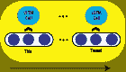
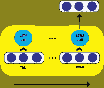
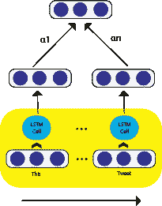
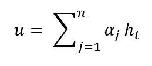
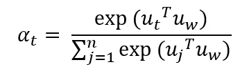
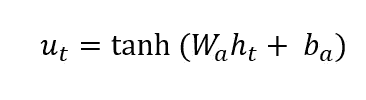
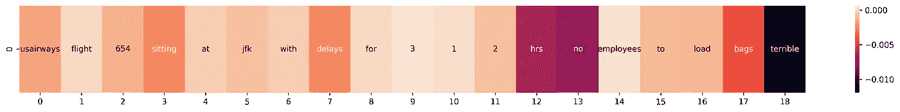

# 自然语言处理领域中的注意力

> 原文：<https://medium.com/mlearning-ai/attention-in-the-natural-language-processing-realm-a124632a8ffd?source=collection_archive---------2----------------------->

注意力是一种机制，在这种机制中，我们根据数据对我们的重要性来关注部分数据。比如我们在做情感分类的时候，要多关注情感词。注意力机制在两个方向上帮助我们；第一，通常会导致更好的性能，
第二，分类决策可以更加清晰和可视化，因此我们有一个更易于解释的模型，这是令人感兴趣的。在这篇文章中，我们首先回顾注意力背后的数学原理，然后运行两个有和没有注意力的模型，以便有更好的直觉。

图 1 示出了随时间展开的传统 LSTM 盒。在每一步，一个单词嵌入(具有 d 维)通过单元进入，并且一个 s 维状态输出。输出是一个 n*d 维的矩阵，其中 n 是句子长度。

Fig 1\. An LSTM cell with its input

对于分类任务，我们如何使用输出？一种不明智的方式是，我们只保留最后一个状态，删除其他状态(回想一下，最后一个状态包含来自最后一个输入和前一个状态的信息)。

Fig 2\. Using the last state of the LSTM

在这里，我们可以更明智地行动，并利用注意机制。本质上，我们使用一个可训练向量α来为每个状态提供一个重要性值，然后状态的加权平均值提供我们的输出。

Fig 3\. Attention

final attention-base representation of a sentence (h is the states matrix provided by LSTM)

但是 alpha 并不是作为一个简单的向量来训练的，因为如果是这样的话，我们将会有一个固定的步长值，这是没有帮助的。我们计算α如下:

alpha calculation

公式相当简单，只是 ut 和 uw 上的一个 SoftMax。这些是什么？

第一个是 ht 的变换，它被计算为神经网络层:

non-linear transformation of the states

它为网络提供了更多的能力。第二个是上下文向量，由其他参数学习。将会了解到，这样可以夸耀更重要的单词，因为每个 utα权重被计算为该和 uw 的归一化相似度(点积)。因此，我们现在有一个可学习的非刚性阿尔法，并计算最终的表现。

现在，我们使用 Keras 实现一个情感分类。该模型由嵌入层、LSTM(和第二层中的注意层)、致密层组成。任务是将每条推文分类为正面、负面、中性。我们训练模型 60 个时期。如果你感兴趣，你可以在下面的笔记本中看到代码:

 [## 谷歌联合实验室

### 编辑描述

colab.research.google.com](https://colab.research.google.com/drive/1yXb3ZqjpFLeeTJ7YzIbkh_sIgLUmxuur?usp=sharing) 

注意的话结果会稍微好一点；0.7831 对 0.7875。

现在，我们可视化一个样本的 alpha 值，看看模型如何处理不同的单词(笔记本包括代码)。

Fig 4\. Visualization of attention alpha for a test sample

我们可以看到，“可怕”这个词的价值是“最低”的。同样，我们可以看到“no”和“hrs”是更多的否定词。最新的是因为这是一个航空公司情绪数据集，这个词指的是航班延误。

在这篇文章中，我发挥了我们对文本分类的注意的本质。我计划发表下一篇关于更受关注的高级主题的帖子，例如 GAT 和 Transformers。

来源:

用于上下文感知情感分析的多线程分层深度模型。信息科学杂志。2021 年 2 月。土井:10.1765865866767

用于文档分类的分层注意网络。计算语言学协会北美分会 2016 年会议论文集:人类语言技术 2016 年 6 月(第 1480–1489 页)。