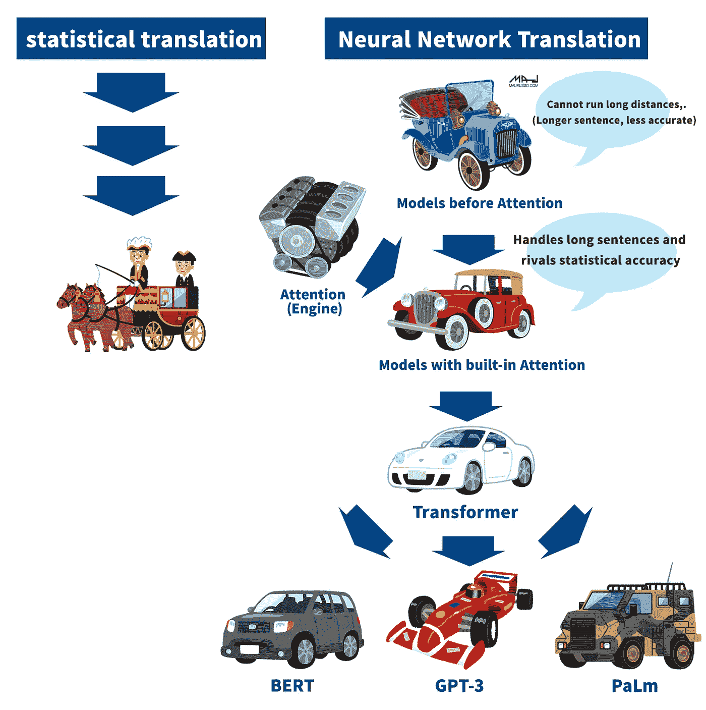
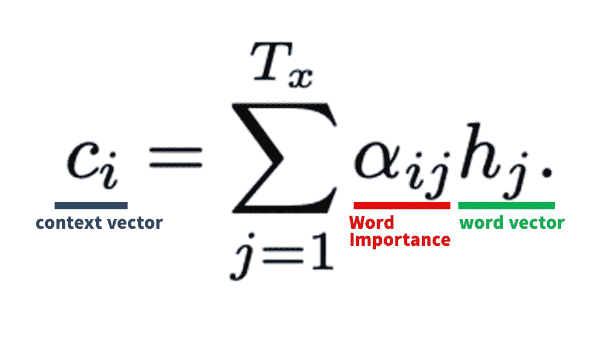

# 清晰深入地解释注意力|自然语言处理(NLP)

> 原文：<https://medium.com/mlearning-ai/attention-to-natural-language-processing-nlp-explained-clearly-and-in-depth-b5c32217ec41?source=collection_archive---------0----------------------->

“注意力”通常用于 NLP 库中，被认为是自然语言处理的突破，对于理解 BERT 和 GPT-3 等前沿技术至关重要。

在这一页，我们想深入浅出地解释“注意”。

## 目录

*   什么是注意力？
*   为什么它被称为自然语言世界的突破
*   对注意力如何与基于原始论文的数学公式一起工作的深刻解释

# 1.1 什么是注意力？

注意力是一种机制，它告诉 AI 句子中的哪些单词对于一项任务来说是必不可少的，以及在执行任务时应该注意(注意)哪些单词。注意力的发展克服了之前模型的致命缺陷，即对于较长的句子不准确。

既然注意力非常接近人类的思维方式，直观上也容易理解，那就用一个具体的例子来理解吧。

例如，假设您有一个将英语翻译成西班牙语的任务，如下面的句子所示。

## 英语句子

> 艾米丽在苹果农场出生长大，所以她每天都吃苹果，当然，艾米丽爱吃苹果。

## 翻译句子

> 埃米莉·娜西奥和她在曼萨纳斯的一个村庄，因为她的名字叫曼萨纳斯。

当然，答案是“恩坎坦”。你在心里是怎么翻译的？

## “艾米丽爱”是要翻译的部分，所以“恩坎坦”是要翻译的词。

你大概就是这样想出“恩坎坦”的。在这个翻译中，“艾米丽喜欢苹果。

如果你觉得，“要翻译，就“艾米丽喜欢苹果”这部分就够了。”那你很明智。这是一个关键的注意点。

注意力是让 AI 理解人类无意识做什么的东西，“这部分对这个翻译很重要”。就像你刚才的感觉一样。

让我们比较一下常规方法和注意力模型，如下图所示。

如图所示，传统方法按原样传递句子。如果句子很短，可以准确翻译，但如果句子很长，就像这种情况，准确性就会下降。该论文指出，常规方法的准确度在 30 个字符之后急剧下降。

另一方面，注意力突出了诸如“艾米丽”和“我喜欢”这样的基本词汇。这使得读者能够集中注意力在关键的单词上，因此即使是长句也能准确翻译。

## 要点总结

*   注意力是一种机制，它告诉人工智能哪些词是重要的，应该在任务中注意哪些词。
*   由于这种机制，即使在长句子中，准确性也不会受到影响。

# 1.2 为什么注意力被认为是自然语言世界的一个突破

注意力之所以被认为是自然语言世界的一个突破，是因为它是一个重要的机制，导致了伯特、GPT-3 和其他最先进的库。

2015 年宣布关注。从那里开始，自然语言处理世界迅速发展起来。

《注意力》出版两年后，《建立在注意力上的变形金刚》出版了。Transformer 的论文标题是“注意力是你所需要的”，并提出了一个只使用注意力的模型。

正如你们中的许多人可能知道的，Transformer 是创建像 BERT 和 GPT-3 这样强大的库的基础。

注意力是近几年 NLP 快速发展的根源。因此，集中被认为是自然语言世界的一个突破。

将自然语言世界的发展与交通工具从马车发展到汽车的过程相比较，就很容易理解了。

前注意模式的缺点是不能处理长句，但这是通过引入一种新的注意机制来克服的。此外，它显示了与统计翻译相同水平的翻译准确性，统计翻译是当时占主导地位的翻译方法。

基于关注，几年后开发了 Transformer。

各种包含变形金刚的强大模型被创造出来。这些强大的模型是我们通常使用的模型，如 BERT、GPT-3 和 PaLm。

第 1 章的要点总结

注意力是一种机制，它告诉人工智能“哪些单词对于这项任务是必不可少的。这种机制的准确性不再妥协，即使是长句子。

注意力之所以被称为自然语言世界的突破，是因为注意力是近年来 NLP 快速发展的根源。

# 2.对注意力如何与基于原始论文的数学公式一起工作的深刻解释

现在你已经理解了注意力的轮廓，让我解释一下注意力是如何工作的。

从这一点开始，我们将在原始论文的基础上解释对理解注意力很重要的公式。当然，这一章有点难懂，但即使没有数学背景的人也能看懂。(那些认为只做一个概述就够了的人到此为止都没问题。别忘了跟着拍。)

如果你能彻底阅读和理解这一章，你应该能理解和解释数学公式中的注意。

如果你打算为了研究或其他目的阅读原始论文，在阅读原始报告之前阅读这一章将使你了解大致内容并顺利阅读原始文章。

本章的流程将解释如下。

2.1 总体流程说明

2.2 针对注意力重要部分的解释

如果你理解了这一章，你就可以用公式来理解和解释注意力。

# 2.1 注意力的整体流动

首先，我们将解释注意力和注意力的整体流动。

原始论文中引入的包含注意力的模型被称为“RNNsearch”该模型基于先前研究的简单编码器-解码器模型“RNN 编码器-解码器”

换句话说，RNNsearch 是对 RNN 编码器-解码器模型的改进，但增加了注意力。

注意力本身不是模型；注意力是一种机制(架构)，RNNsearch 是一种融入注意力的模型。

> **简要回顾:**什么是编码器和解码器？
> 
> **编码器:**转换输入的句子、单词等。变成人工智能可以处理的东西。
> 
> **解码器**:处理并输出转换后的值。

从这里开始，我们将分别解释编码器和解码器的注意模型，并与以前的研究进行比较。(我们将使用与原文相同的翻译任务)

之前的工作:RNN 编码器-解码器

编码器用 RNN 把输入字(x)转换成 a。

解码器输出 RNN 的字(p(yi))，具有输入语义向量、隐藏层(Si)和前一个字(yi-1)

## 编码器

考虑到前一个和下一个上下文，用双向 RNN 将输入(x)转换成单词向量(hi)

原始论文的词向量(hi)称为注释。

## 解码器

使用注意机制将单词向量(hi)转换为上下文向量(ci)。解码器注意机制将单词向量(hi)转换成上下文向量(ci)并加权(α)哪些单词应该被注意(注意)。这就是关注。

改编自原始论文

使用上下文向量(ci)、隐藏层(Si)和先前单词(yi-1)作为输入，RNN 输出单词概率(p(yi))

总之，先前的研究为所有单词创建了相同固定维度的语义向量，并将其直接用于 RNN。

相比之下，注意力模型为每个单词创建一个上下文向量(ci ),考虑要关注哪些单词，并在 RNN 中使用它。

通过将语义向量改为上下文向量(ci)，我们克服了“句子越长，准确率越低”的问题，这个问题在那之前一直是个问题。

下一章将用数学公式解释这个上下文向量(ci)。

# 2.2 注意重要公式:用数学公式理解上下文向量(CI)

正如上一节所解释的，我们将解释获得上下文向量(ci)的公式，这是注意力的关键。

首先，我们将组织每个系数的作用。

ci:上下文向量

它考虑了上下文并包含关于“哪些单词对任务重要”的信息。在翻译的情况下，它包含了“主题”和“喜欢”对于翻译“我喜欢”很重要的信息。"

αij:单词重要性

权重表示单词对任务的重要程度，取值范围从 0 到 1。详见下文。

hj:词向量

使用编码器的双向 RNN，不仅包含单词信息，还包含单词前后的信息的向量。

换句话说，找到上下文向量(ci)

通过单词的重要性(αij)对单词向量(hj)进行加权，并且产生加权值(σ)的和。

就是这个意思。

补充:解释αij(单词重要性)的公式

作为补充，我们也简单解释一下αij。αij 的程序如下。

这是一个 softmax 公式，因此您可以看到 eij 是使用 softmax 计算的。

eij 然后用于计算隐藏层(Si-1)和单词向量(hj ),以给出“单词 j 周围的输入和单词 I 的输出匹配程度的分数”。

如果你想了解更多关于 eij 公式和其他细节，请阅读原文(链接附在底部)。

# 第二章概要

*   我们改进了以前的模型(RNN 编码器-解码器),并添加了注意机制。
*   传统模型对每个单词使用相同的语义向量，而注意力对每个单词使用上下文向量(ci)。
*   上下文向量(ci)是单词加权的重要性向量(α)。

# 结论。

注意力是一种机制，它告诉人工智能“哪些单词对于任务来说是必不可少的。由于这种机制，即使在长句子中，准确率也不会下降。

注意力之所以被称为自然语言世界的突破，是因为注意力是近年来 NLP 快速发展的根源。

传统上，每个单词使用相同的语义向量，而注意力使用上下文向量(ci)。

上下文向量(ci)是每个单词重要性的α加权。

# 感谢您的阅读！请鼓掌并跟我来！我是用通俗易懂，图文并茂的方式写 NLP 的！

# 参考文献和参考资料

原始文件

> 通过联合学习对齐和翻译的神经机器翻译

原创日语博客

 [## 【超図解】自然言語処理(NLP)のAttentionをわかりやすく、そして深く解説 - イラストでわかるNLP｜自然言語処理

### 自然言語処理ライブラリの解説などで度々見かける「Attention」。Attentionは自然言語界のブレイクスルーと言われ、BERTやGPT-3といった最先端技術を理解する上で必須の仕組みです。このページでは「Attention」について…

nlpillustration.tech](http://nlpillustration.tech/?p=185)  [## Mlearning.ai 提交建议

### 如何成为 Mlearning.ai 上的作家

medium.com](/mlearning-ai/mlearning-ai-submission-suggestions-b51e2b130bfb)