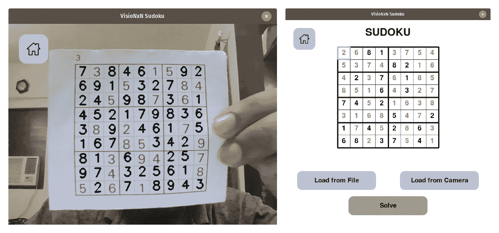
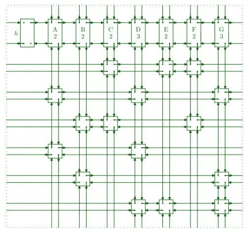
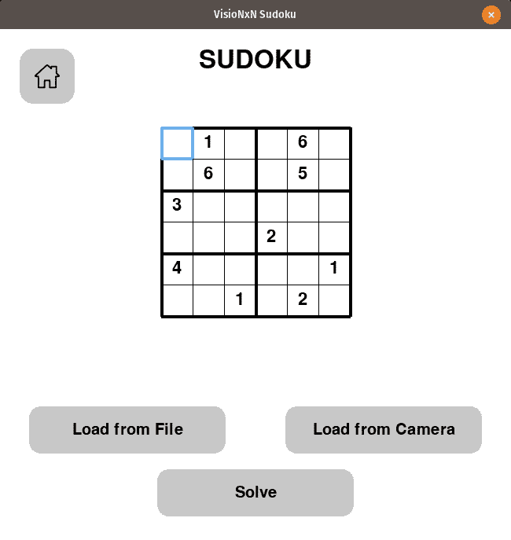
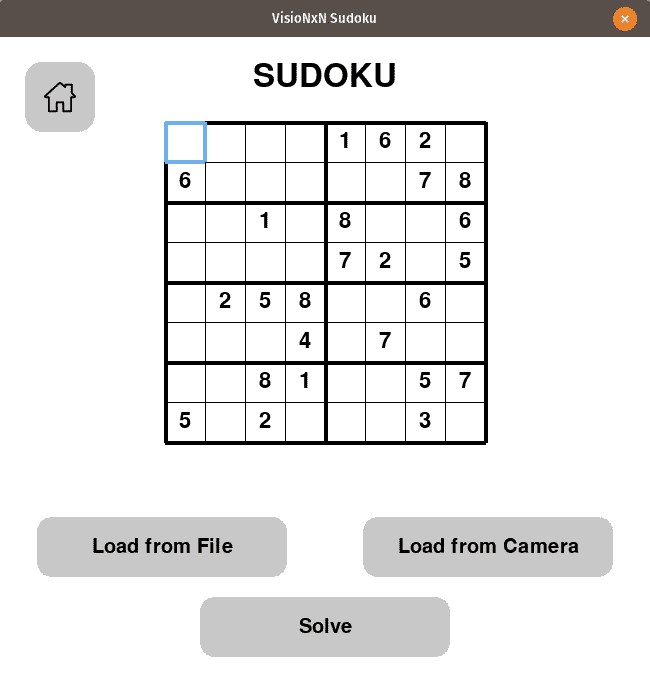
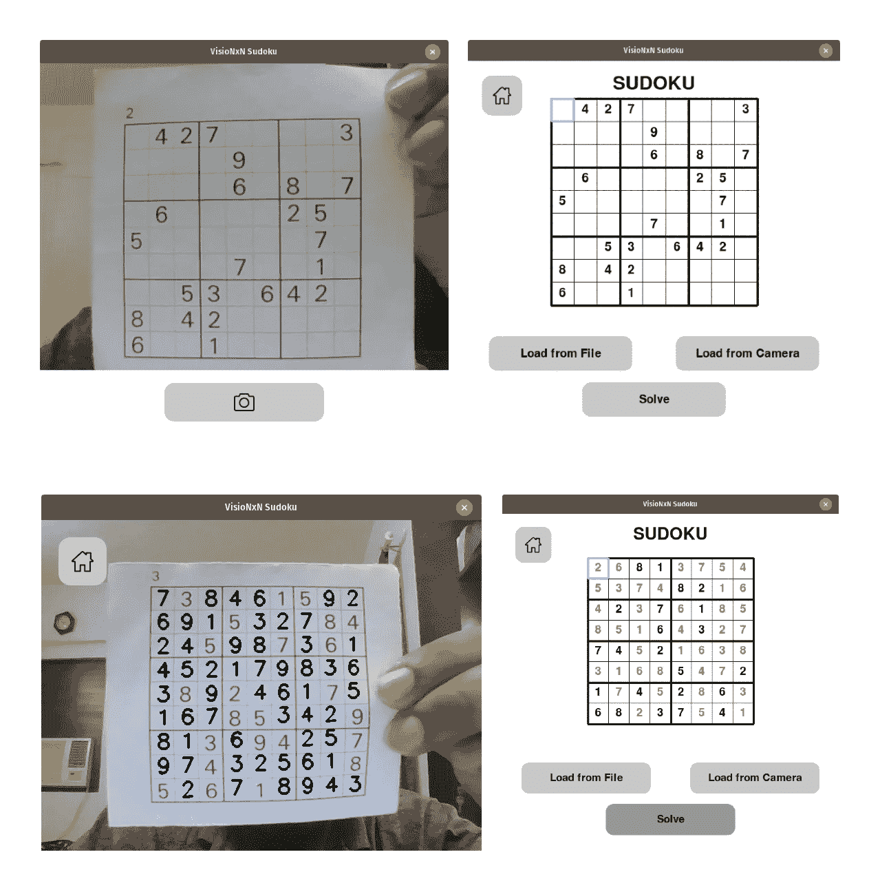

# 增强现实数独解算器:使用 X 算法解谜

> 原文：<https://medium.com/mlearning-ai/augmented-reality-sudoku-solver-part-i-8e29e59cecab?source=collection_archive---------2----------------------->



在本文中，我们将构建一个基于 GUI 的 AR 数独解算器，它可以用来解决增强现实中的数独问题。我们还将围绕它开发一个游戏，使我们能够扫描数独的图像并玩它。

我们的目标是解决任何 N 维的数独，其中 N 是一个非素数。该项目将以两种形式实施-

*   一个选项来加载保存在系统上的图像或使用网络摄像头将图像馈送到程序，然后在系统上玩游戏。
*   一个选项，使用增强现实和解决数独显示的网络摄像头的难题。

项目以 [*算法 X*](https://en.wikipedia.org/wiki/Knuth%27s_Algorithm_X) 的形式使用 [*跳舞环节*](https://en.wikipedia.org/wiki/Dancing_Links) 寻找数独难题的解。数独是一个众所周知的 NP 完全问题，算法 X 是实现一种贪婪的深度优先搜索来找到合适的解决方案的一种手段。该项目将分为 4 个部分

*   第一部分——理解数独解算器，即用于解数独的算法。
*   第二部分— [处理来自相机的图像，以便能够提取数独的网格。](https://shashank-goyal-blogs.medium.com/augmented-reality-sudoku-solver-part-ii-cdfc035a415c)
*   第三部分— [处理图像和相应的模型，以检测每个单元中的数值](https://shashank-goyal-blogs.medium.com/augmented-reality-sudoku-solver-part-iii-d2370a9cbace)。
*   第四部分— [使用 PyGame 构建 GUI。](https://shashank-goyal-blogs.medium.com/augmented-reality-sudoku-solver-part-iv-65afe2231e46)

## 第一部分:解决数独—

为了在尽可能短的时间内解决数独游戏并找到所有可能的解决方案，我们使用算法 X。算法 X 是一种用于解决精确覆盖问题的算法。这是一个简单的递归、不确定、深度优先的回溯算法，Donald Knuth 使用它来演示一个称为 DLX 的高效实现，它使用了跳舞链接技术。

> 有趣的事实:*由于缺乏更好的名字，算法 X 被如此命名。*

让我们先来看看**确切的封面问题**—

给定集合 X 的子集的集合 S，X 的精确覆盖是满足两个条件的 S 的子集 S*

*   S*中任意两个不同子集的交集都是空的。
*   S*中的子集的并集是 X，即 S*中的子集覆盖 X

**例子——**

考虑由论域 U = {1，2，3，4，5，6，7}和集合 S = {A，B，C，D，E，F}指定的精确覆盖问题

```
A = {1, 4, 7};
B = {1, 4};
C = {4, 5, 7};
D = {3, 5, 6};
E = {2, 3, 6, 7};
F = {2, 7};
```

因此，行对应于集合的集合，列对应于宇宙的元素。
**行表示法-**

```
+-----+--------------+
| ROW |   ELEMENTS   |
+-----+--------------+
| A   | {1, 4, 7}    |
| B   | {1, 4}       |
| C   | {4, 5, 7}    |
| D   | {3, 5, 6}    |
| E   | {2, 3, 6, 7} |
| F   | {2, 7}       |
+-----+--------------+
```

**列表示-**

```
+--------+----------------------+
| COLUMN |       ELEMENTS       |
+--------+----------------------+
|      1 | {'A', 'B'},          |
|      2 | {'E', 'F'},          |
|      3 | {'D', 'E'},          |
|      4 | {'A', 'B', 'C'},     |
|      5 | {'C', 'D'},          |
|      6 | {'D', 'E'},          |
|      7 | {'A', 'C', 'E', 'F'} |
+--------+----------------------+
```

## 矩阵表示-

上述行和列可以用 6×7 关联矩阵表示。

```
+-----+---+---+---+---+---+---+---+
|     | 1 | 2 | 3 | 4 | 5 | 6 | 7 |
+-----+---+---+---+---+---+---+---+
| A   | 1 | 0 | 0 | 1 | 0 | 0 | 1 |
+-----+---+---+---+---+---+---+---+
| B   | 1 | 0 | 0 | 1 | 0 | 0 | 0 |
+-----+---+---+---+---+---+---+---+
| C   | 0 | 0 | 0 | 1 | 1 | 0 | 1 |
+-----+---+---+---+---+---+---+---+
| D   | 0 | 0 | 1 | 0 | 1 | 1 | 0 |
+-----+---+---+---+---+---+---+---+
| E   | 0 | 1 | 1 | 0 | 0 | 1 | 1 |
+-----+---+---+---+---+---+---+---+
| F   | 0 | 1 | 0 | 0 | 0 | 0 | 1 |
+-----+---+---+---+---+---+---+---+
```

## 解决方法-

*   第一步:(0 级)

1.  找出数字最少的一栏。
2.  在这种情况下，列`1`有两个 1。[即具有最小值的最小索引。1 的数量]
3.  将行`A`添加到解决方案中。

> 部分解决= [ `A` ]

```
+---+---+---+---+---+---+---+---+
|   | 1 | 2 | 3 | 4 | 5 | 6 | 7 |
+---+---+---+---+---+---+---+---+
| A | [***1***](http://.) | 0 | 0 | 1 | 0 | 0 | 1 |
+---+---+---+---+---+---+---+---+
| B | [***1***](http://.) | 0 | 0 | 1 | 0 | 0 | 0 |
+---+---+---+---+---+---+---+---+
| C | 0 | 0 | 0 | 1 | 1 | 0 | 1 |
+---+---+---+---+---+---+---+---+
| D | 0 | 0 | 1 | 0 | 1 | 1 | 0 |
+---+---+---+---+---+---+---+---+
| E | 0 | 1 | 1 | 0 | 0 | 1 | 1 |
+---+---+---+---+---+---+---+---+
| F | 0 | 1 | 0 | 0 | 0 | 0 | 1 |
+---+---+---+---+---+---+---+---+
```

*   第二步:(第一级)

1.  在第`A`行中，用 1 标记所有列。

```
+---+---+---+---+---+---+---+---+
|   | 1 | 2 | 3 | 4 | 5 | 6 | 7 |
+---+---+---+---+---+---+---+---+
| A | [***1***](http://.) | 0 | 0 | [***1***](http://.) | 0 | 0 | [***1***](http://.) |
+---+---+---+---+---+---+---+---+
| B | [***1***](http://.) | 0 | 0 | [***1***](http://.) | 0 | 0 | 0 |
+---+---+---+---+---+---+---+---+
| C | 0 | 0 | 0 | [***1***](http://.) | 1 | 0 | [***1***](http://.) |
+---+---+---+---+---+---+---+---+
| D | 0 | 0 | 1 | 0 | 1 | 1 | 0 |
+---+---+---+---+---+---+---+---+
| E | 0 | 1 | 1 | 0 | 0 | 1 | [***1***](http://.) |
+---+---+---+---+---+---+---+---+
| F | 0 | 1 | 0 | 0 | 0 | 0 | [***1***](http://.) |
+---+---+---+---+---+---+---+---+
```

2.删除包含标记行和列的所有行和列。

```
+---+---+---+---+---+
|   | 2 | 3 | 5 | 6 |
+---+---+---+---+---+
| D | 0 | 1 | 1 | 1 |
+---+---+---+---+---+
```

*   第三步:(第二级)

1.  重复步骤 1。
2.  从步骤 3–1 开始。，我们将行`D`添加到解决方案中。

> 部分解决= [ `*A, D*` ]

3.但是，现在表是空的，并且解决方案没有生成 cover，这意味着我们需要返回到 0 级。

*   第四步:(0 级)

1.  从溶液中取出`D`和`A`。
2.  从 13 继续。，将`B`添加到溶液中。

> 部分解决方案= [ `*B*` ]

```
+---+---+---+---+---+---+---+---+
|   | 1 | 2 | 3 | 4 | 5 | 6 | 7 |
+---+---+---+---+---+---+---+---+
| A | 1 | 0 | 0 | 1 | 0 | 0 | 1 |
+---+---+---+---+---+---+---+---+
| B | [***1***](http://.) | 0 | 0 | [***1***](http://.) | 0 | 0 | 0 |
+---+---+---+---+---+---+---+---+
| C | 0 | 0 | 0 | 1 | 1 | 0 | 1 |
+---+---+---+---+---+---+---+---+
| D | 0 | 0 | 1 | 0 | 1 | 1 | 0 |
+---+---+---+---+---+---+---+---+
| E | 0 | 1 | 1 | 0 | 0 | 1 | 1 |
+---+---+---+---+---+---+---+---+
| F | 0 | 1 | 0 | 0 | 0 | 0 | 1 |
+---+---+---+---+---+---+---+---+
```

*   第五步:(第一级)

1.  在第`B`行中，用 1 标记所有列。

```
+---+---+---+---+---+---+---+---+
|   | 1 | 2 | 3 | 4 | 5 | 6 | 7 |
+---+---+---+---+---+---+---+---+
| A | [***1***](http://.) | 0 | 0 | [***1***](http://.) | 0 | 0 | 1 |
+---+---+---+---+---+---+---+---+
| B | [***1***](http://.) | 0 | 0 | [***1***](http://.) | 0 | 0 | 0 |
+---+---+---+---+---+---+---+---+
| C | 0 | 0 | 0 | [***1***](http://.) | 1 | 0 | 1 |
+---+---+---+---+---+---+---+---+
| D | 0 | 0 | 1 | 0 | 1 | 1 | 0 |
+---+---+---+---+---+---+---+---+
| E | 0 | 1 | 1 | 0 | 0 | 1 | 1 |
+---+---+---+---+---+---+---+---+
| F | 0 | 1 | 0 | 0 | 0 | 0 | 1 |
+---+---+---+---+---+---+---+---+
```

2.删除包含标记行和列的所有行和列。

```
+---+---+---+---+---+---+
|   | 2 | 3 | 5 | 6 | 7 |
+---+---+---+---+---+---+
| D | 0 | 1 | 1 | 1 | 0 |
+---+---+---+---+---+---+
| E | 1 | 1 | 0 | 1 | 1 |
+---+---+---+---+---+---+
| F | 1 | 0 | 0 | 0 | 1 |
+---+---+---+---+---+---+
```

*   第六步:(第一级)

1.  重复步骤 1。
2.  在这种情况下，列`5`只有一个。
3.  因此，我们现在将`D`添加到解决方案中。

> 部分解决方案=[`*B, D*`]

*   第七步:(第二级)

1.  在行`D`中，用 1 标记所有列。

```
+---+---+---+---+---+---+
|   | 2 | 3 | 5 | 6 | 7 |
+---+---+---+---+---+---+
| D | 0 | [***1***](http://.) | [***1***](http://.) | [***1***](http://.) | 0 |
+---+---+---+---+---+---+
| E | 1 | [***1***](http://.) | 0 | [***1***](http://.) | 1 |
+---+---+---+---+---+---+
| F | 1 | 0 | 0 | 0 | 1 |
+---+---+---+---+---+---+
```

2.删除包含标记行和列的所有行和列。

```
+---+---+---+
|   | 2 | 7 |
+---+---+---+
| F | 1 | 1 |
+---+---+---+
```

*   第八步:(第三级)

1.  重复步骤 1。
2.  从步骤 8–1 开始。，我们将行`F`添加到解决方案中。

> 部分解决方案= [ `*B, D, F*` ]

3.同样，表是空的，但是现在解决方案生成了一个封面。所以我们以这个解决方案结束。

最后，解决方案是-

```
+---+---+---+---+---+---+---+---+
|   | 1 | 2 | 3 | 4 | 5 | 6 | 7 |
+---+---+---+---+---+---+---+---+
| B | 1 | 0 | 0 | 1 | 0 | 0 | 0 |
+---+---+---+---+---+---+---+---+
| D | 0 | 0 | 1 | 0 | 1 | 1 | 0 |
+---+---+---+---+---+---+---+---+
| F | 0 | 1 | 0 | 0 | 0 | 0 | 1 |
+---+---+---+---+---+---+---+---+
```

# 跳舞链接-

跳舞链接是一种恢复从循环双向链表中删除节点的操作的技术。这对于有效地实现回溯算法特别有用。

## 删除节点-

考虑删除节点`x`的情况，右指针指向`x`右边的节点，类似地，左指针指向左节点。删除可通过以下方式进行-

```
x.left.right ← x.right;
x.right.left ← x.left;
```

## 正在添加节点-

节点`x`可以通过实现这个来添加回去

```
x.left.right ← x;
x.right.left ← x;
```

## 舞步-

实现算法 X 的一个好方法是将矩阵 A 中的每个 1 表示为一个数据对象 X，它有五个字段 L[x]，R[x]，U [x]，D[x]，C[x]。矩阵的行通过 L 和 R 字段(“左”和“右”)被双重链接为循环列表；列通过 U 和 D 字段(“向上”和“向下”)被双重链接为循环列表。每个列列表还包括一个称为列表头的特殊数据对象。



要阅读更多关于舞蹈链接的内容，请查看此 [PDF](https://github.com/shashank3199/VisioNxN-Sudoku/blob/master/Sudoku/DancingLinks.pdf) 。
那么，我们就从代码开始吧。

**数独班-**

在这里，我们首先用以下变量初始化这个类-

*   ***矩阵:*** NxN 矩阵，用数独值“0”代替空格。
*   ***Init_Matrix:*** 由于解决方案修改发生在适当的位置，因此它用作备份副本。
*   ***Box_Row:*** 这是数独一个盒子里的行数。
*   ***Box_Col:*** 这是数独一个盒子里的列数。
*   ***N:*** 这是数独中一行或一列的细胞总数。

要了解 Box_Row 和 Box_Col，请参见下图-



Here, the Box_Row = 2 and Box_Col = 3



Here, the Box_Row = 2 and Box_Col = 4

**初始化行和列指针-**

这里的行和列就像双重链表，这一点我们在上面已经了解了。
行由每个可能的单元格位置值-列表对组成，即

```
rows => {
    (0,0,1) : [
        ("row-col", (0, 0)), ("row-num", (0, 1)), 
        ("col-num", (0, 1)), ("box-num", (0, 1))],
    (0,0,2) : [
        ("row-col", (0, 0)), ("row-num", (0, 2)), 
        ("col-num", (0, 2)), ("box-num", (0, 2))], 
                          .
                          .
                          .
    (4,6,3) : [
        ("row-col", (4, 6)), ("row-num", (4, 3)), 
        ("col-num", (6, 3)), ("box-num", (6, 3))],
                          .
                          .
                          .    
    (8,8,8) : [
        ("row-col", (8, 8)), ("row-num", (8, 8)), 
        ("col-num", (8, 8)), ("box-num", (9, 8))]
    (8,8,9) : [
        ("row-col", (8, 8)), ("row-num", (8, 9)), 
        ("col-num", (8, 9)), ("box-num", (9, 9))]
}
```

同样，列字典是-

```
columns = {
    ("row-col", (0, 0)): {(0,0,0), (0,0,1), ..... (0,0,9)},
    ("row-num", (0, 1)): {(0,0,1), (0,1,1), ..... (0,8,1)},
    ("col-num", (0, 1)): {(0,0,1), (1,0,1), ..... (8,0,1)},
    ("box-num", (0, 1)): {(0,0,1), (0,1,1), ..... (2,2,1)},
                                .
                                .
                                .
    ("row-col", (8, 8)): {(8,8,0), (8,8,1), ..... (8,8,9)},
    ("row-num", (8, 9)): {(8,0,9), (8,1,9), ..... (8,8,9)},
    ("col-num", (8, 9)): {(0,8,9), (1,8,9), ..... (8,8,9)},
    ("box-num", (8, 9)): {(6,6,9), (6,7,9), ..... (8,8,9)}
}
```

**求解-**

所以，就像上面的封面例子一样，首先，我们找到链接数量最少的列。然后，我们遍历该列的单元格值，并将其包含在解决方案中(“partial_solution.append(values)”)。然后，我们“覆盖”该列中的值(覆盖将在下一步中解释)。然后，我们用现有的部分解再次递归调用相同的函数，以进一步前进。这种递归调用一直继续，直到列字典为空，这就是问题所在。然后，我们将“揭开”该专栏，并进入另一个专栏，寻找更多解决方案。

**盖柱-**

覆盖一列的基本思想是用当前列值迭代所有行，然后用当前行迭代所有有值的列，最后用最新的列迭代所有有共同值的行。这与上面的步骤 5、6 和 7 相同。这比蛮力更快，因为它遵循与删除舞蹈链接中的节点相同的原则，即操作是恒定时间的。

**揭开柱-**

这与 cover column 操作完全相反，其工作原理是从跳舞链接添加一个节点。

**获取解决方案-**

这是类的驱动程序方法。它首先覆盖了 sudoku 中已经存在值的所有列。然后，它遍历来自“self.solve”方法的解。然后，它将解决方案值复制到矩阵中，并将它们附加到解决方案列表中。

**元素可能-**

这是一个辅助方法，在寻找数独的解时没有用处。但是它用于检查一个值对于数独中的某个位置是否有效。

**主-**

这是我们调用数独类并找到解决方案的主要函数。总的来说，这个解决方案一开始看起来有点复杂，但是它比回溯方法要好，原因有二

*   由于恒定的时间包含和排除操作，它更快。
*   与回溯不同，它给出了所有可能的解决方案。

**输出-**

```
Solution Number 1 -9 8 7 | 6 5 4 | 3 2 1
2 4 6 | 1 7 3 | 9 8 5
3 5 1 | 9 2 8 | 7 4 6
----------------------
1 2 8 | 5 3 7 | 6 9 4
6 3 4 | 8 9 2 | 1 5 7
7 9 5 | 4 6 1 | 8 3 2
----------------------
5 1 9 | 2 8 6 | 4 7 3
4 7 2 | 3 1 9 | 5 6 8
8 6 3 | 7 4 5 | 2 1 9Solved in 0.0046 s
```



*你可以在这里* *找到完整的 python 实现* [*。如果你觉得这篇文章很有帮助，请跟我上*](https://github.com/shashank3199/VisioNxN-Sudoku/blob/master/Sudoku/sudoku.py) [*中*](https://shashank-goyal-blogs.medium.com/) *和*[*GitHub*](https://github.com/shashank3199/)*和 star*[*项目库*](https://github.com/shashank3199/VisioNxN-Sudoku) *。*

请查看本系列文章的其他部分

*   [增强现实数独解算器——第二部分](https://shashank-goyal-blogs.medium.com/augmented-reality-sudoku-solver-part-ii-cdfc035a415c)。
*   [增强现实数独解算器——第三部分](https://shashank-goyal-blogs.medium.com/augmented-reality-sudoku-solver-part-iii-d2370a9cbace)。
*   [增强现实数独解算器——第四部分](https://shashank-goyal-blogs.medium.com/augmented-reality-sudoku-solver-part-iv-65afe2231e46)。