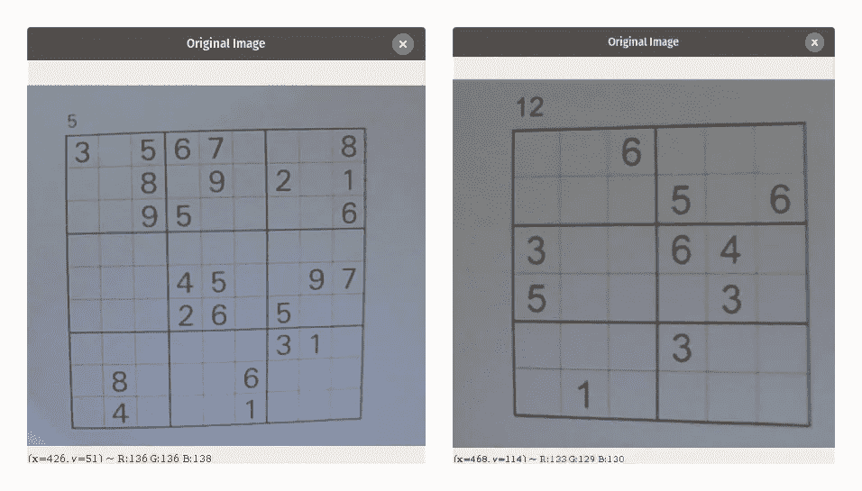
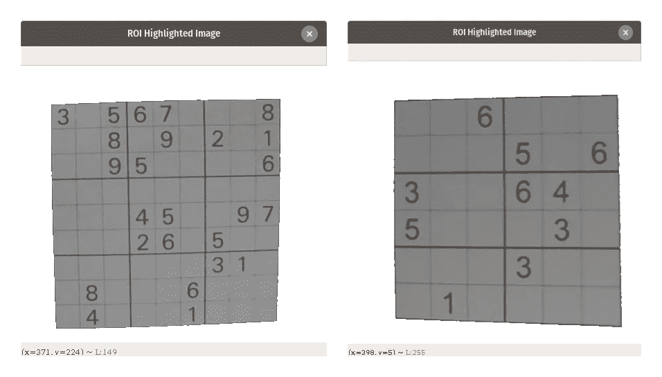
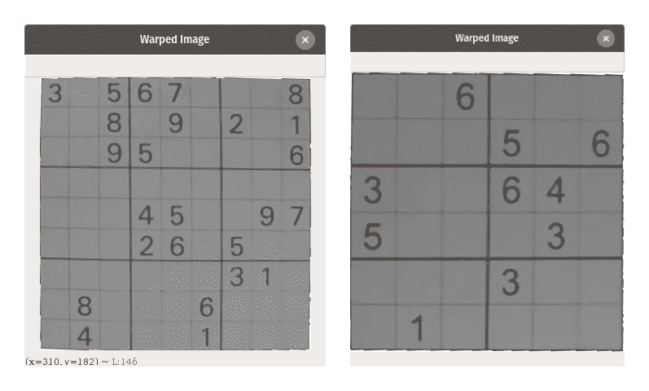
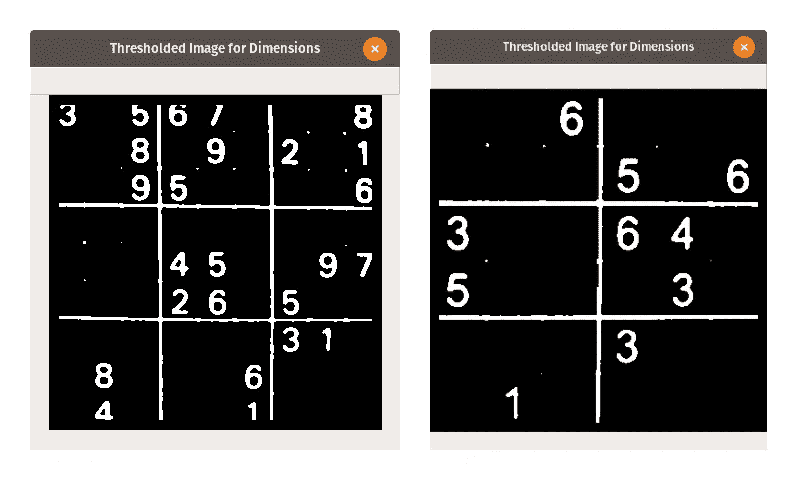
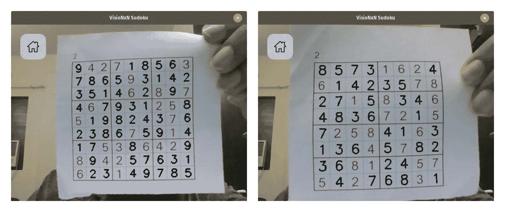
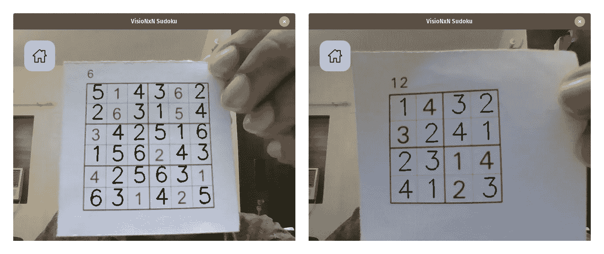

# 增强现实数独求解器:从图像中提取数独

> 原文：<https://medium.com/mlearning-ai/augmented-reality-sudoku-solver-part-ii-cdfc035a415c?source=collection_archive---------1----------------------->


这篇文章是增强现实数独解算器的延续，我们将构建一个基于 GUI 的增强现实数独解算器。在本文中，我们将讨论该项目的图像处理管道，以及如何使用 OpenCV 在 Python 中实现我们的方法。我们在不同的步骤中讨论管道，以简化我们对代码的理解。

我们的目标是解决任何 N 维的数独，其中 N 是一个非素数。该项目将以两种形式实施-

*   一个选项来加载保存在系统上的图像或使用网络摄像头将图像馈送到程序，然后在系统上玩游戏。
*   一个选项，使用增强现实和解决数独显示的网络摄像头的难题。

项目以 [*算法 X*](https://en.wikipedia.org/wiki/Knuth%27s_Algorithm_X) 的形式使用 [*跳舞环节*](https://en.wikipedia.org/wiki/Dancing_Links) 寻找数独难题的解。数独是一个众所周知的 NP 完全问题，算法 X 是实现一种贪婪的深度优先搜索来找到合适的解决方案的一种手段。该项目将分为 4 个部分

*   第一部分 ***—*** [了解数独解算器，即用于解数独的算法。](/mlearning-ai/augmented-reality-sudoku-solver-part-i-8e29e59cecab)
*   第二部分——处理来自相机的图像，以便能够提取数独的网格。
*   第三部分— [处理图像和相应的模型，以检测每个单元中的数值。](https://shashank-goyal-blogs.medium.com/augmented-reality-sudoku-solver-part-iii-d2370a9cbace)
*   第四部分— [使用 PyGame 构建 GUI。](https://shashank-goyal-blogs.medium.com/augmented-reality-sudoku-solver-part-iv-65afe2231e46)

## 第二部分:处理来自相机的图像—

为了处理图像，我们使用 python OpenCV 库。这是一个简单的循序渐进的方法

*   检测数独的外部网格，并返回该网格内的面积。
*   通过查找轮廓的角来应用扭曲透视变换，以将数独从图像的一部分转换为完整的图像本身。
*   获取数独的尺寸，即提取拼图子框中的行数和列数。
*   通过对每个单元应用卷积神经网络模型来提取数字值，得到最终矩阵。

**数独图像处理课件-**

这里，我们首先用以下变量初始化该类-

*   ***图像:*** Numpy 包含图像数据的 N 维数组正在从相机加载。
*   ***Fname:*** 图像的文件名，如果是从文件加载的话。
*   ***Game_Size:*** 这是数独游戏的一行或一列中单元格的总数。
*   ***Box_Row:*** 这是数独一个盒子中的行数。
*   ***Box_Col:*** 这是数独的一个盒子中的列数。



**第一步:检测外部数独网格-**

方法" **get_grid** "找到最大的轮廓，并用白色像素遮蔽图像周围的区域。在这里，我们做了以下事情-

我们首先将图像转换成灰度。然后，我们使用在 x 轴方向上具有零偏差的(5，5)核来应用高斯模糊。然后，我们应用自适应阈值处理，该阈值处理用于为图像的每个局部区域寻找阈值因子，并相应地应用阈值处理。你可以在这里了解更多关于自适应阈值[的知识。](https://www.pyimagesearch.com/2021/05/12/adaptive-thresholding-with-opencv-cv2-adaptivethreshold/)

为了找到图像中的外部边缘，我们需要找到图像中的轮廓。轮廓是指物体的轮廓或剪影，在我们的例子中是数独游戏的轮廓。

我们使用 OpenCV 库的 findContours 方法，这里我们首先传递图像，然后传递 cv2。RETR 树用于计算图像轮廓之间的层次关系。cv2。CV_CHAIN_APPROX_SIMPLE 用于压缩轮廓以节省空间。从这些轮廓中，我们使用 cv2.contourArea 作为关键字找到具有最大面积的轮廓。

找到最大轮廓后，我们执行健全性检查，以确保最大轮廓的面积大于 250x250 像素。接下来，我们生成两个蒙版，一个是黑色蒙版*，白色的 ***作为所选轮廓的内侧*** 区域，另一个是白色蒙版*，白色的 ***作为所选轮廓的外侧*** 。然后，我们将原始灰度图像的白色值位置复制到带有外部白色区域的白色蒙版上，得到下面的图像。这个区域是我们的**感兴趣区域**或 **ROI** 。**

****

**我们注意到 ROI 图像稍微有点倾斜，不适合完整的图像框架，即屏幕的视角没有超出平面视角。理想情况下，我们会希望有一个自上而下的，鸟瞰的拼图。**

****第二步:应用扭曲透视变换-****

**方法“ **get_warped** ”利用 cv2.getPerspectiveTransform 和 cv2.warpPerspective 来完成这些转换。**

**我们首先执行健全性检查，以确保前面的步骤是成功的，并且我们有一个包含 ROI 的图像。然后，我们使用 cv2.arcLength 找到拼图周围轮廓的周长。由于我们知道盒子将是一个矩形，我们知道它将有四个使用 cv2.approxPolyDP 找到的顶点。为了近似轮廓，我们使用轮廓周长的 1.5%近似精度。**

**在找到这个图像的角坐标之后，我们近似输出扭曲图像的角坐标的位置。为了执行透视变换，我们需要一个变换矩阵，它是使用 cv2.getPerspective 变换计算的，传递来自原始图像的谜题框的坐标，后跟我们为输出图像指定的四个点。然后，我们使用 cv2.warpPerspective 应用转换。**

****

****第三步:获取数独的维度-****

**为了使用“ **get_dimensions** ”方法获得尺寸，我们首先使用 Otsu 的二值化对图像进行阈值处理。二值化后，我们只剩下由 0 和 1 组成的图像。现在我们应用简单的矩阵运算来推导子网格维数。**

****

**为了获得尺寸，考虑如下所示的 22x22 像素的二值化后的图像。
这里，`⬛`表示值为 0 的像素，`⬜`表示值为 1 的像素。**

```
**⬛⬛⬛⬛⬛⬛🔲🔲⬛⬛⬛⬛⬛⬛🔲🔲⬛⬛⬛⬛⬛⬛
⬛🔲⬛⬛🔲⬛🔲🔲⬛🔲⬛⬛⬛⬛⬛🔲⬛⬛⬛⬛⬛⬛
⬛⬛🔲⬛🔲⬛🔲🔲⬛⬛⬛⬛⬛⬛🔲🔲⬛🔲⬛⬛⬛⬛
⬛⬛⬛⬛⬛⬛🔲⬛⬛⬛⬛🔲🔲⬛🔲⬛⬛⬛🔲⬛⬛⬛
🔲⬛🔲⬛⬛🔲🔲🔲⬛🔲⬛⬛⬛⬛🔲🔲⬛⬛⬛⬛⬛⬛
⬛⬛⬛⬛⬛⬛⬛🔲⬛⬛⬛⬛⬛⬛🔲🔲⬛⬛⬛⬛⬛⬛
🔲🔲🔲🔲🔲🔲🔲🔲🔲🔲🔲🔲⬛🔲🔲🔲🔲🔲🔲🔲🔲🔲
🔲🔲⬛🔲🔲🔲🔲⬛🔲🔲🔲🔲🔲🔲⬛🔲⬛🔲🔲⬛🔲🔲
⬛⬛⬛⬛⬛⬛🔲🔲⬛⬛⬛⬛⬛⬛🔲🔲⬛⬛⬛⬛⬛⬛
⬛⬛⬛⬛⬛⬛🔲🔲⬛⬛⬛⬛🔲⬛🔲🔲⬛⬛⬛⬛⬛⬛
⬛🔲⬛⬛⬛⬛🔲🔲⬛⬛🔲⬛⬛⬛🔲🔲⬛🔲⬛⬛⬛⬛
⬛⬛⬛⬛🔲⬛🔲🔲⬛⬛⬛⬛⬛⬛🔲⬛⬛⬛⬛🔲⬛⬛
⬛⬛⬛⬛⬛⬛⬛🔲⬛⬛⬛🔲⬛⬛🔲🔲⬛⬛⬛⬛⬛🔲
⬛⬛⬛⬛⬛⬛🔲🔲⬛⬛⬛⬛⬛⬛⬛🔲⬛⬛⬛⬛⬛⬛
🔲🔲🔲🔲🔲🔲🔲🔲🔲🔲⬛🔲🔲🔲🔲🔲🔲🔲🔲🔲🔲🔲
🔲🔲⬛🔲🔲🔲🔲⬛🔲🔲🔲🔲🔲🔲🔲🔲🔲🔲🔲🔲🔲🔲
⬛⬛⬛⬛⬛⬛🔲🔲⬛⬛⬛⬛⬛⬛🔲🔲⬛⬛⬛⬛⬛⬛
⬛🔲⬛⬛⬛⬛🔲🔲⬛🔲⬛⬛⬛⬛⬛🔲⬛⬛⬛⬛⬛🔲
⬛⬛⬛⬛🔲⬛🔲🔲⬛⬛⬛⬛⬛⬛🔲🔲⬛⬛⬛⬛⬛⬛
⬛⬛⬛⬛⬛🔲⬛🔲⬛⬛⬛🔲⬛⬛🔲⬛⬛🔲🔲⬛⬛⬛
⬛⬛⬛⬛⬛⬛🔲🔲⬛⬛⬛⬛⬛⬛🔲🔲⬛⬛⬛⬛⬛⬛
⬛⬛⬛⬛⬛⬛🔲🔲⬛⬛⬛⬛⬛⬛🔲🔲⬛⬛⬛⬛⬛⬛**
```

**每个子网格中的白色像素或白色网格线中的黑色像素可以被视为噪声。然后，我们求出图像矩阵在纵轴和横轴上的总和。**

```
**⬛⬛⬛⬛⬛⬛ 🔲🔲 ⬛⬛⬛⬛⬛⬛ 🔲🔲 ⬛⬛⬛⬛⬛⬛ 4
⬛🔲⬛⬛🔲⬛ 🔲🔲 ⬛🔲⬛⬛⬛⬛ ⬛🔲 ⬛⬛⬛⬛⬛⬛ 6
⬛⬛🔲⬛🔲⬛ 🔲🔲 ⬛⬛⬛⬛⬛⬛ 🔲🔲 ⬛🔲⬛⬛⬛⬛ 7
⬛⬛⬛⬛⬛⬛ 🔲⬛ ⬛⬛⬛🔲🔲⬛ 🔲⬛ ⬛⬛🔲⬛⬛⬛ 5    H
🔲⬛🔲⬛⬛🔲 🔲🔲 ⬛🔲⬛⬛⬛⬛ 🔲🔲 ⬛⬛⬛⬛⬛⬛ 8    o
⬛⬛⬛⬛⬛⬛ ⬛🔲 ⬛⬛⬛⬛⬛⬛ 🔲🔲 ⬛⬛⬛⬛⬛⬛ 3    r
🔲🔲🔲🔲🔲🔲 🔲🔲 🔲🔲🔲🔲⬛🔲 🔲🔲 🔲🔲🔲🔲🔲🔲 21   i
🔲🔲⬛🔲🔲🔲 🔲⬛ 🔲🔲🔲🔲🔲🔲 ⬛🔲 ⬛🔲🔲⬛🔲🔲 17   z
⬛⬛⬛⬛⬛⬛ 🔲🔲 ⬛⬛⬛⬛⬛⬛ 🔲🔲 ⬛⬛⬛⬛⬛⬛ 4    o
⬛⬛⬛⬛⬛⬛ 🔲🔲 ⬛⬛⬛⬛🔲⬛ 🔲🔲 ⬛⬛⬛⬛⬛⬛ 5    n
⬛🔲⬛⬛⬛⬛ 🔲🔲 ⬛⬛🔲⬛⬛⬛ 🔲🔲 ⬛🔲⬛⬛⬛⬛ 7    t
⬛⬛⬛⬛🔲⬛ 🔲🔲 ⬛⬛⬛⬛⬛⬛ 🔲⬛ ⬛⬛⬛🔲⬛⬛ 5    a
⬛⬛⬛⬛⬛⬛ ⬛🔲 ⬛⬛⬛🔲⬛⬛ 🔲🔲 ⬛⬛⬛⬛⬛🔲 5    l
⬛⬛⬛⬛⬛⬛ 🔲🔲 ⬛⬛⬛⬛⬛⬛ ⬛🔲 ⬛⬛⬛⬛⬛⬛ 3
🔲🔲🔲🔲🔲🔲 🔲🔲 🔲🔲⬛🔲🔲🔲 🔲🔲 🔲🔲🔲🔲🔲🔲 21   S
🔲🔲⬛🔲🔲🔲 🔲⬛ 🔲🔲🔲🔲🔲🔲 🔲🔲 🔲🔲🔲🔲🔲🔲 20   u
⬛⬛⬛⬛⬛⬛ 🔲🔲 ⬛⬛⬛⬛⬛⬛ 🔲🔲 ⬛⬛⬛⬛⬛⬛ 4    m
⬛🔲⬛⬛⬛⬛ 🔲🔲 ⬛🔲⬛⬛⬛⬛ ⬛🔲 ⬛⬛⬛⬛⬛🔲 6
⬛⬛⬛⬛🔲⬛ 🔲🔲 ⬛⬛⬛⬛⬛⬛ 🔲🔲 ⬛⬛⬛⬛⬛⬛ 5
⬛⬛⬛⬛⬛🔲 ⬛🔲 ⬛⬛⬛🔲⬛⬛ 🔲⬛ ⬛🔲🔲⬛⬛⬛ 6
⬛⬛⬛⬛⬛⬛ 🔲🔲 ⬛⬛⬛⬛⬛⬛ 🔲🔲 ⬛⬛⬛⬛⬛⬛ 4
⬛⬛⬛⬛⬛⬛ 🔲🔲 ⬛⬛⬛⬛⬛⬛ 🔲🔲 ⬛⬛⬛⬛⬛⬛ 4
5  7 4 4 8 6 19 19 4 7 4 7 5 4  18 19 3 7 6 4 4 6
                Vertical  Sum**
```

**如果任何行或列的总和分别大于宽度或高度的 2/3，则检查轴的总和。然后在一个新的数组中，标记为 1，否则为 0。**

```
**Height of Image = 22 
Width of Image = 22
66% of Height = 15 
66% of Width = 15 
Vertical Sum = [5 7 4 4 8 6 19 19 4 7 4 7 5 4 18 19 3 7 6 4 4 6] Horizontal Sum = [4 6 7 5 8 3 21 17 4 5 7 5 5 3 21 20 4 6 5 6 4 4] Vertical Bool = [0 0 0 0 0 0 1 1 0 0 0 0 0 0 1 1 0 0 0 0 0 0]
Horizontal Bool = [0 0 0 0 0 0 1 1 0 0 0 0 0 0 1 1 0 0 0 0 0 0] Total number of 0 to 1 Transitions in Vertical Bool = 2 
Total number of 0 to 1 Transitions in Horizontal Bool = 2**
```

****步骤 4a):预处理数字单元格-****

**“ **preprocess_digit** ”方法用于预处理难题中的每个单元，以便使用卷积神经网络进行进一步检测。我们首先将图像的大小调整为 112x112 像素。然后，我们应用高斯模糊和阈值图像转换值为 0 或 1。然后，我们清除边界，以确保从边缘去除噪声。我们再次将图像大小调整回 28x28，使其适合我们的数字识别模型。**

**接下来，我们检查单元格图像中白色像素的数量是否小于 10，如果是，我们假设单元格为空，并返回 None。然后，我们将值小于 150 的像素缩放至其值的 75%,将其余像素的值加倍。**

****步骤 4b):获得最终矩阵-****

**在这里，我们首先得到扭曲的图像和数独谜题的尺寸。接下来，我们初始化一个空矩阵并加载我们训练好的模型文件。然后，我们确定每个单元格的宽度和高度，并对每个单元格进行迭代。一旦我们完成了细胞的预处理，我们就将它输入到我们的模型中，以找到细胞的数字值。**

**然后，我们执行健全性检查，以确保同一行、列或框中没有其他单元格具有相同的值。如果出现这种情况，我们还会找出该单元格的预测得分。具有较高预测得分的一个获得该值，另一个获得其第二高的预测得分值。**

****在图像上绘图-****

**“ **plot_on_image** ”方法用于在图像上绘制解决方案。我们执行所有前面提到的步骤，以达到扭曲的图像阶段。然后我们迭代每个单元格图像，并使用 cv2.putText 绘制单元格中的值。**

****注意:**我们已经在扭曲的图像上绘制了我们的解决方案，因此要将该图像转换回原始图像，我们首先计算从 cv2.getPerspective 获得的扭曲转换矩阵的逆矩阵，并使用 cv2.warpPerspective 应用初始转换的逆矩阵，以将其恢复到原始图像位置。**

********

***这里* *可以找到完整的 python 实现* [*。如果你觉得这篇文章很有帮助，请跟我上*](https://github.com/shashank3199/VisioNxN-Sudoku/blob/master/Image_Processing/process_image.py) [*中*](https://shashank-goyal-blogs.medium.com/) *和*[*GitHub*](https://github.com/shashank3199/)*和 star*[*项目库*](https://github.com/shashank3199/VisioNxN-Sudoku) *。***

**您可以在此处找到此项目[的完整详细实施说明。](/mlearning-ai/augmented-reality-sudoku-solver-part-i-8e29e59cecab)**

**请查看本系列文章的其他部分**

*   **[增强现实数独解算器——第一部分](/mlearning-ai/augmented-reality-sudoku-solver-part-i-8e29e59cecab)。**
*   **[增强现实数独解算器——第三部分。](https://shashank-goyal-blogs.medium.com/augmented-reality-sudoku-solver-part-iii-d2370a9cbace)**
*   **[增强现实数独解算器——第四部分。](https://shashank-goyal-blogs.medium.com/augmented-reality-sudoku-solver-part-iv-65afe2231e46)**