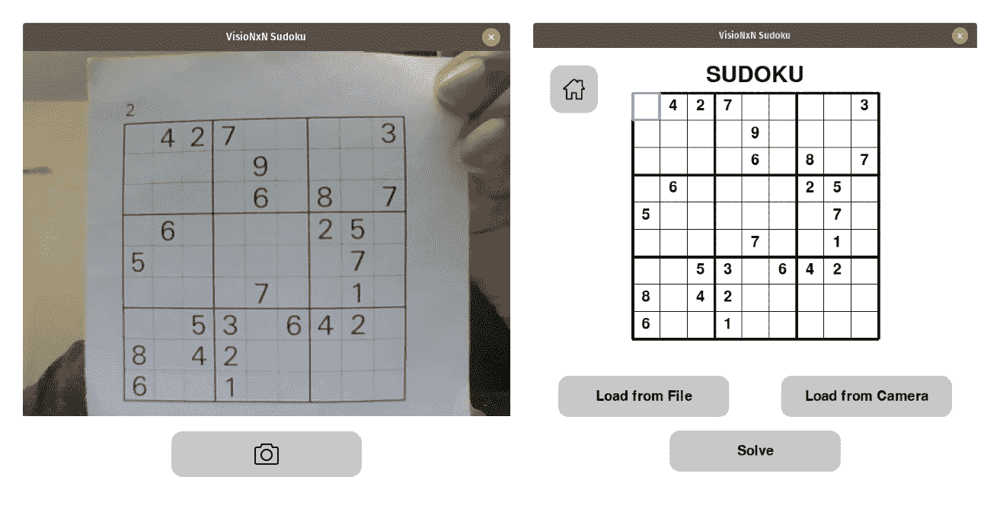
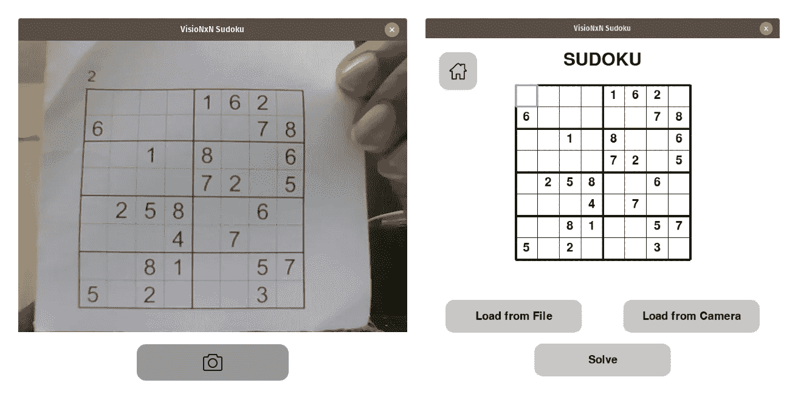
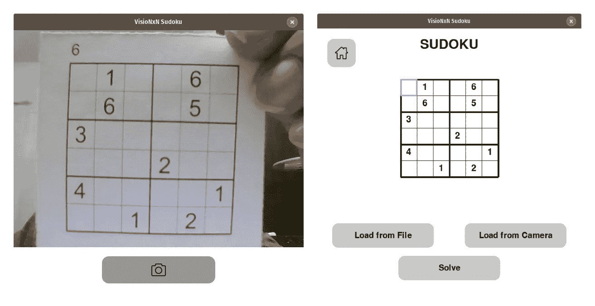
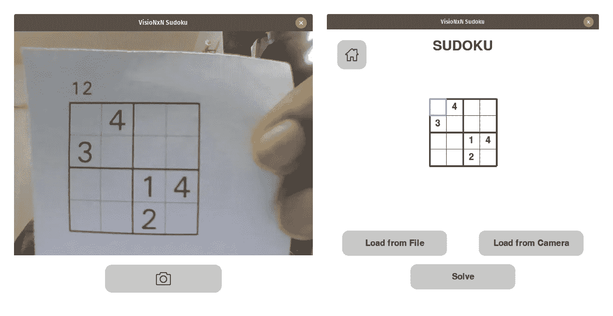

# 增强现实数独解算器:从图像中读取谜题值

> 原文：<https://medium.com/mlearning-ai/augmented-reality-sudoku-solver-part-iii-d2370a9cbace?source=collection_archive---------2----------------------->



这篇文章是增强现实数独解算器的延续，我们将构建一个基于 GUI 的增强现实数独解算器。在本文中，我们了解了如何从处理过的拼图图像中提取数字。我们实现了在 Char74k 数据集上训练的卷积神经网络，以使用 PyTorch 识别来自每个方块的数字。

我们的目标是解决任何 N 维的数独，其中 N 是一个非素数。该项目将以两种形式实施-

*   一个选项来加载保存在系统上的图像或使用网络摄像头将图像馈送到程序，然后在系统上玩游戏。
*   一个选项，使用增强现实和解决数独显示的网络摄像头的难题。

项目以 [*算法 X*](https://en.wikipedia.org/wiki/Knuth%27s_Algorithm_X) 的形式使用 [*跳舞环节*](https://en.wikipedia.org/wiki/Dancing_Links) 寻找数独难题的解。数独是一个众所周知的 NP 完全问题，算法 X 是实现一种贪婪的深度优先搜索来找到合适的解决方案的一种手段。该项目将分为 4 个部分

*   第一部分 ***—*** [了解数独解算器，即用于解数独的算法。](/mlearning-ai/augmented-reality-sudoku-solver-part-i-8e29e59cecab)
*   第二部分— [处理来自相机的图像，以便能够提取数独的网格。](/mlearning-ai/augmented-reality-sudoku-solver-part-ii-cdfc035a415c)
*   第三部分—处理图像和相应的模型，以检测每个单元中的数值。
*   第四部分— [使用 PyGame 构建 GUI。](https://shashank-goyal-blogs.medium.com/augmented-reality-sudoku-solver-part-iv-65afe2231e46)

## 第三部分:识别数字单元格值-

为了检测单元格中的数值，我们将使用 PyTorch 库。我们将实现一个基于卷积神经网络(CNN)的模型，在 [char74k 数据集](http://www.ee.surrey.ac.uk/CVSSP/demos/chars74k/)上训练我们的网络。我在这里使用的架构给了我 **99.61%** 的精度，并且受到了这个[模型](https://www.kaggle.com/juiyangchang/cnn-with-pytorch-0-995-accuracy)的启发。

首先让我们了解卷积神经网络的基础知识

在一个简单的前馈神经网络中，我们通常将图像展平为一个线性向量，然后我们用一些权重和偏差进行点积，以获得输出数组的一个元素。在收敛到最终输出层之前，该输出数组遵循几个隐藏层的相同模式。

这种方法的主要限制是它不能捕捉像素位置之间的空间关系，因此在 2-D 平面中的局部区域上展开的图案可以表示也可以位于图像平面中任何其他地方的特征。例如，可以在图像的左上角或右下角找到代表鼻子的区域。这种特性被称为空间不变性，即表示特征的图像的小区域可以在图像平面中的任何地方移动。现在让我们理解卷积运算的真正含义


简单地说，我们运行一个更小的矩阵，称为图像平面上的核心。内核本质上是一个二维权重矩阵。从上面的图像中可以明显看出，我们将核与矩阵上每个核位置的图像部分进行点积。
在继续讨论一些与卷积相关的术语之前-

*   **步幅:**是内核移动的像素数。在每次迭代的内核上方的图像中，内核向右移动一个像素，类似地向下移动一个像素，这被称为步幅。
*   **填充:**在上面的图片中我们可以看到内核在矩阵内部元素上运行的次数比在最外层元素上运行的次数多。这导致图像从 5x5 缩小到 3x3。我们可以通过在原始矩阵周围提供零元素的边界来补充原始矩阵，以避免尺寸减小。
*   **膨胀:**这是内核内点距离，即从内核乘法矩阵中提取的元素之间的距离。

为了更好地理解上述术语，我建议看一下这个[自述文件](https://github.com/vdumoulin/conv_arithmetic/blob/master/README.md#convolution-animations)，它为这些解释提供了很好的可视化效果。

现在让我们来看看神经网络的架构，我们将使用我们的解决方案-

```
+----------+--------------------------------------------+----------+
|  Input   |                 Operation                  |  Output  |   
|   Size   |                                            |   Size   |
+----------+--------------------------------------------+----------+
|                         Feature Extraction                       |
+----------+--------------------------------------------+----------+
| 1x28x28  | Conv2d(1, 32, kernel_size=3, stride=1,     | 32x28x28 |
|          |               padding=1),                  |          |
|          | BatchNorm2d(32),                           |          |
|          | ReLU(inplace=True)                         |          |
+----------+--------------------------------------------+----------+
| 32x28x28 | nn.Conv2d(32, 32, kernel_size=3, stride=1, | 32x14x14 |
|          |                   padding=1),              |          |
|          | BatchNorm2d(32),                           |          |
|          | ReLU(inplace=True),                        |          |
|          | MaxPool2d(kernel_size=2, stride=2)         |          |
+----------+--------------------------------------------+----------+
| 32x14x14 | Conv2d(32, 64, kernel_size=3, padding=1),  | 64x14x14 |
|          | BatchNorm2d(64),                           |          |
|          | ReLU(inplace=True)                         |          |
+----------+--------------------------------------------+----------+
| 64x14x14 | Conv2d(64, 64, kernel_size=3, padding=1),  |  64x7x7  |
|          | BatchNorm2d(64),                           |          |
|          | ReLU(inplace=True),                        |          |
|          | MaxPool2d(kernel_size=2, stride=2)         |          |
+----------+--------------------------------------------+----------+
|                          Classification                          |
+----------+--------------------------------------------+----------+
|  64x7x7  | Dropout(p=0.5),                            |    512   |
|          | Linear(64 * 7 * 7, 512),                   |          |
|          | BatchNorm1d(512),                          |          |
|          | ReLU(inplace=True),                        |          |
|          | Dropout(p=0.5)                             |          |
+----------+--------------------------------------------+----------+
|    512   | Linear(512, 512),                          |    512   |
|          | BatchNorm1d(512),                          |          |
|          | ReLU(inplace=True)                         |          |
+----------+--------------------------------------------+----------+
|    512   | Dropout(p=0.5),                            |    10    |  
|          | Linear(512, 10)                            |          |
+----------+--------------------------------------------+----------+
```

尽管上面的架构看起来令人望而生畏，但在代码中实现起来并不困难。
没有任何进一步的延迟，现在让我们看看代码-

**PyTorch GPU 实用函数-**

“ **get_default_device** ”方法用于检查系统上是否有支持 Cuda 的 GPU。因此，它将返回“ **torch.device('cuda')** ”或“ **torch.device('cpu')** ”，这将返回一个对象，该对象表示将在其上分配张量变量以进行计算的设备。
**to _ device**方法用于在可用设备上分配对象。

**PyTorch GPU 实用设备数据加载器类-**

该类用于补充“**torch . utils . data . data loader**”类。它用于将整个 DataLoader 对象转移到可用设备。但是分配给设备操作仅在产生元素时发生。

**准确度方法-**

“**准确性**方法用于确定正确预测的百分比。" **torch.max** "方法从输出数组中返回具有最高值的索引。示例-

```
X = [
      [0.42, 0.72, 0.86, 0.87, 0.29, 0.19, 0.59, 0.99, 0.65, 0.94],
      [0.49, 0.76, 0.77, 0.66, 0.35, 0.41, 0.79, 0.72, 0.04, 0.31]
    ]torch.max(X) => [7, 6]
```

然后，我们将正确预测的总数除以预测的总数，得到正确率。

**Char74k 模型初始化-**

这是类的初始化方法。这里我们从“ **torch.nn.Module** 继承了我们的类，并定义了特征提取和分类器序列。然后，我们初始化特征提取网络的权重，如下一个函数中所解释的。

**层权重初始化-**

这里，我们对卷积层的核值进行归一化，并对批归一化层分别将权重和偏差设置为 1 和 0。

**前馈计算-**

" **forward** "方法是" **torch.nn.module** "类的一个特殊方法，它定义了从一层(或者在我们的例子中，一系列层)到另一层的向前传递步骤。定义这个方法使我们能够在正向传递中执行必要的步骤。这里，我们将“1×28×28”图像，即 28×28 图像矩阵输入特征提取层。注意，这里的 1 表示单通道图像，即灰度图像。“ **x.view** 用于将矢量展平为二维矢量。示例-

```
a = torch.random.torch.randint(size=(2,5,2), low=0, high=10)
a =>
tensor([[[9, 2],
         [2, 8],
         [2, 2],
         [3, 4],
         [5, 8]],

        [[0, 3],
         [3, 5],
         [3, 1],
         [8, 7],
         [5, 6]]])a.view(a.size(0), -1) =>
tensor([[9, 2, 2, 8, 2, 2, 3, 4, 5, 8],
        [0, 3, 3, 5, 3, 1, 8, 7, 5, 6]])
```

然后，我们将这个二维向量提供给分类器，分类器返回图像的预测分数。这个预测分数是一个一维向量，包含每个类别的百分比可能性(在我们的例子中是 0-9 位数)。

**训练步骤-**

“ **training_step** ”方法定义了训练周期单次迭代的过程。每个迭代或步骤接受一批图像以及相关联的标签。然后将图像传递给模型。然后，我们计算批量预测的交叉熵损失。交叉熵损失是一种结合了对数软最大损失和负对数似然损失的度量，用于 N 类分类问题。然后，在将损失函数对象移动到可用的计算设备并将其返回之后，我们计算损失。

**验证步骤-**

“**验证 _ 步骤**”方法与“**训练 _ 步骤**”相同，不同之处在于前者额外计算精度并返回损耗和精度，仅用于显示，而后者仅返回损耗，用于将其反向传播到网络。

**验证时期结束-**

“ **validation_epoch_end** ”方法在训练时期结束时运行，结合所有验证步骤的数据，计算该时期的平均验证精度和验证损失。

**历元结束-**

此方法用于打印一个时期的平均验证损失和准确度。

## 模型训练和评估方法-

**评估模型-**

此方法用于在验证或测试数据集(以 Dataloader 对象的形式)上运行模型，并在训练期间确定模型指标。

**根据训练数据拟合模型-**

这里，我们在指定的时期数的训练数据上拟合模型。我们使用 Adam 优化器进行一阶梯度优化。我们还使用了一个学习率调度器，特别是 StepLR 调度器。这里，step_size=7，gamma 为 0.1，这意味着每 7 个历元学习率将是当前值的 0.1 倍。
然后，我们通过迭代每个时期的成批训练数据来开始模型拟合。

**培训模式-**

此方法是为数据集定型的驱动程序方法。我们首先创建一个转换序列。这个序列首先将图像转换为灰度，然后将它们的大小调整为 28x28，最后将它们转换为张量。我们使用“**torch vision . datasets . image folder**”方法加载数据目录，该方法输入目录路径和加载数据时运行的转换。然后，我们指定批量大小，将数据集分成 80-20 个训练验证比率，并将它们加载到各自的“ **DeviceDataLoaders** ”中。

然后，我们将模型移动到可用的计算设备，并为 20 个时期拟合模型。然后，我们评估模型并将模型权重保存到一个文件中。

> 我在这个模型上实现的最终损失和精度是-
> 模型结果= val_loss: 0.0076，val_acc: 0.9961

**评估加载的模型-**

该方法帮助我们加载保存的模型文件，并确定整个数据集的准确性和损失。

**负荷模型-**

该方法有助于从保存的文件中加载模型。



*你可以在这里* *找到完整的 python 实现* [*。如果你觉得这篇文章很有帮助，请跟我上*](https://github.com/shashank3199/VisioNxN-Sudoku/blob/master/Image_Processing/classifier.py) [*中*](https://shashank-goyal-blogs.medium.com/) *和*[*GitHub*](https://github.com/shashank3199/)*和 star*[*项目库*](https://github.com/shashank3199/VisioNxN-Sudoku) *。*

您可以在此处找到此项目[的完整详细实施说明。](/mlearning-ai/augmented-reality-sudoku-solver-part-i-8e29e59cecab)

请查看本系列文章的其他部分

*   [增强现实数独解算器——第一部分](/mlearning-ai/augmented-reality-sudoku-solver-part-i-8e29e59cecab)。
*   [增强现实数独解算器——第二部分。](/mlearning-ai/augmented-reality-sudoku-solver-part-ii-cdfc035a415c)
*   [增强现实数独解算器——第四部分。](https://shashank-goyal-blogs.medium.com/augmented-reality-sudoku-solver-part-iv-65afe2231e46)