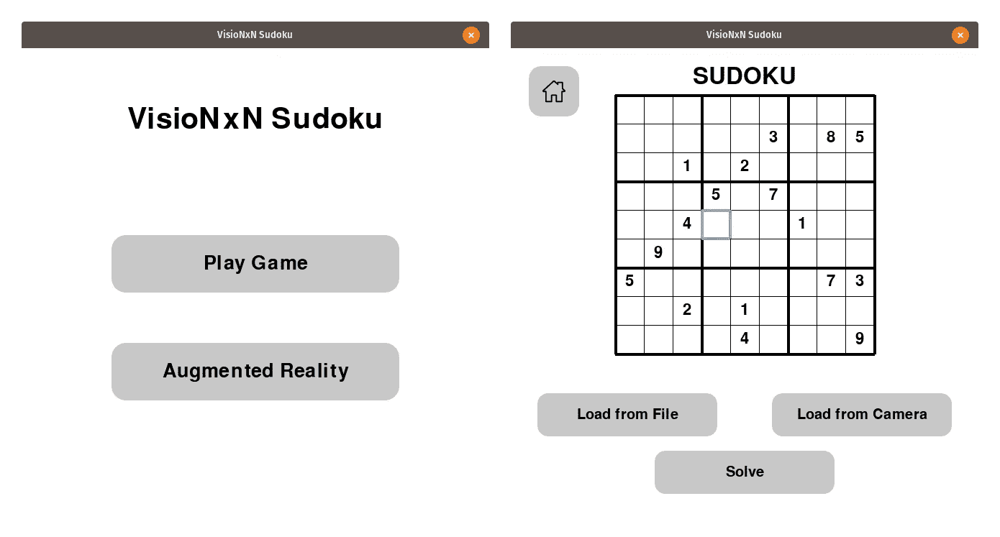
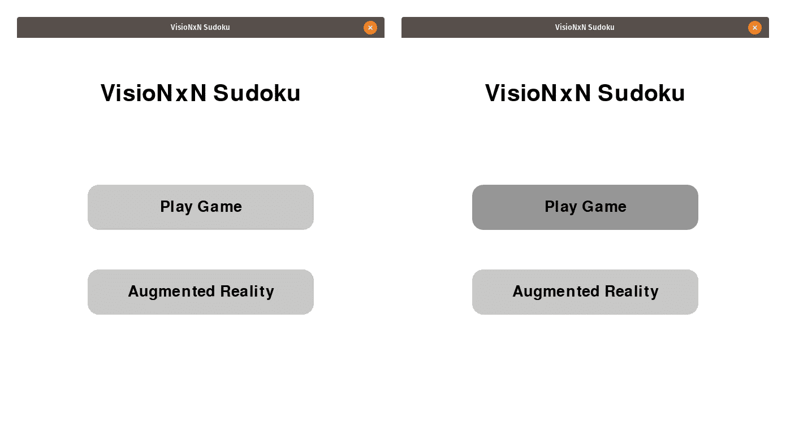
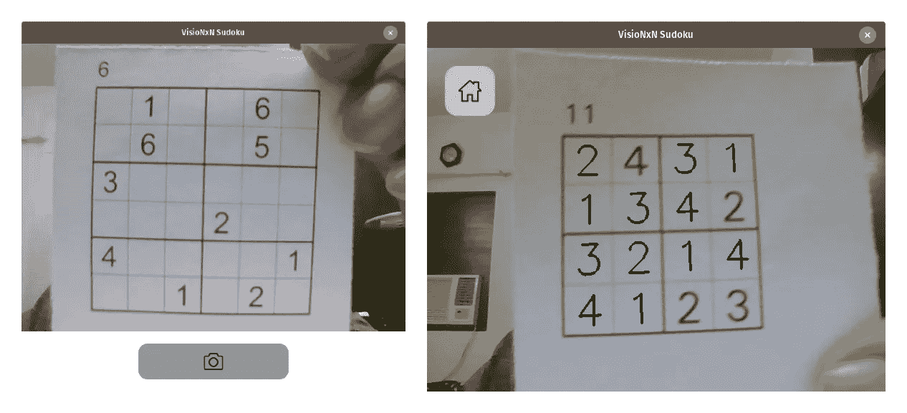
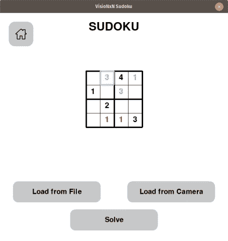
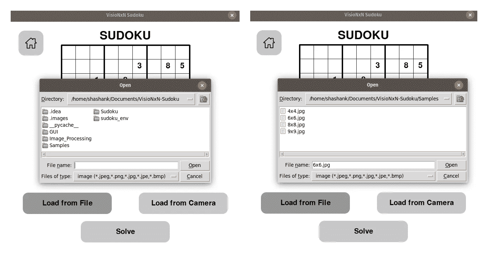
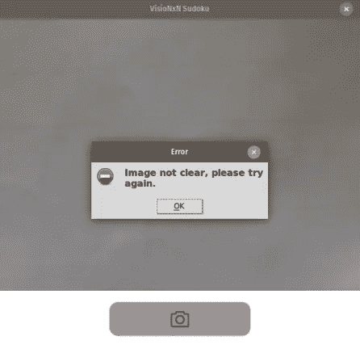
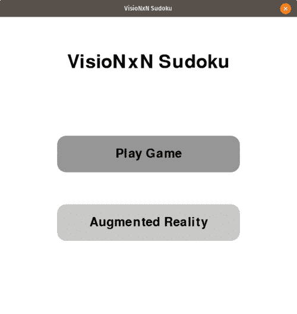

# 增强现实数独求解器:构建图形用户界面

> 原文：<https://medium.com/mlearning-ai/augmented-reality-sudoku-solver-part-iv-65afe2231e46?source=collection_archive---------6----------------------->

这篇文章是增强现实数独解算器的延续，我们将构建一个基于 GUI 的增强现实数独解算器。在本文中，我们将使用 PyGame 构建项目的 GUI 组件。这个项目有几个子组件，每个子组件都在单独的文件中实现，以确保代码的可重用性。

我们的目标是解决任何 N 维的数独，其中 N 是一个非素数。该项目将以两种形式实施-

*   一个选项来加载保存在系统上的图像或使用网络摄像头将图像馈送到程序，然后在系统上玩游戏。
*   一个选项，使用增强现实和解决数独显示的网络摄像头的难题。

项目以 [*算法 X*](https://en.wikipedia.org/wiki/Knuth%27s_Algorithm_X) 的形式使用 [*跳舞环节*](https://en.wikipedia.org/wiki/Dancing_Links) 寻找数独难题的解。数独是一个众所周知的 NP 完全问题，算法 X 是实现一种贪婪的深度优先搜索来找到合适的解决方案的一种手段。该项目将分为 4 个部分

*   第一部分 ***—*** [了解数独解算器，即用于解数独的算法。](/mlearning-ai/augmented-reality-sudoku-solver-part-i-8e29e59cecab)
*   第二部分— [处理来自相机的图像，以便能够提取数独的网格。](/mlearning-ai/augmented-reality-sudoku-solver-part-ii-cdfc035a415c)
*   第三部分— [处理图像和相应的模型，以检测每个单元中的数值。](/mlearning-ai/augmented-reality-sudoku-solver-part-iii-d2370a9cbace)
*   第四部分——使用 PyGame 构建 GUI。

第四部分:使用 PyGame 构建 GUI-

游戏的完整图形用户界面由 3 部分组成-

*   我们构建了一个鼠标可点击的圆角矩形按钮。这些按钮用于帮助我们选择各种操作。
*   **摄像机窗口:**这是一个集成了摄像机画面的窗口，用于点击图像或运行增强现实模式。
*   **游戏窗口:**这是整个项目的主 GUI，用来和主游戏一起运行所有其他部分。

# **按钮类-**

这里，我们首先用以下变量初始化该类-

*   ***X:*** 按钮位置的中心 X 坐标。
*   ***Y:*** 按钮位置的中心 Y 坐标。
*   ***按钮宽度:*** 这是按钮的像素宽度。
*   ***按钮高度:*** 这是按钮的像素高度。
*   ***颜色:*** 这是按钮的颜色，以 RGB 表示。
*   ***悬停颜色:*** 这是鼠标悬停在按钮上时按钮的颜色，设置为按钮原始颜色的 75%。
*   ***按钮曲率半径:*** 这是按钮圆角矩形的曲率半径。
*   ***文本:*** 用于显示在按钮上的文本。

**绘制按钮-**

该方法用于在" **pygame.surface** "对象上绘制按钮。可以将" **pygame.surface** "对象视为二维图像，在其上可以显示其他图像/对象。我们首先定义按钮的矩形形状。然后，我们根据按钮是否位于鼠标下方来定义按钮的颜色。接下来，我们定义四个圆形轮廓，显示在矩形轮廓的角上。然后我们用定义的颜色填充图像，用黑色填充轮廓和文本。最后，我们在表面上显示按钮。

**点击-**

如果鼠标在按钮上时单击了鼠标按钮，此方法返回 True，否则返回 Fasle。

**检查按钮是否在鼠标下-**

这个方法获取鼠标的坐标，并检查按钮的坐标是否在按钮空间的区域内。如果 x 坐标位于按钮的宽度范围内，同样，如果 y 坐标位于按钮的高度范围内，则返回 True，否则返回 False。

Button without and with the mouse over the button

# 相机窗口类-

这里，我们首先用以下变量初始化该类-

*   ***摄像机源:*** 摄像机源的索引，可以是摄像机，也可以是视频的 feed。
*   ***捕获图像:*** 布尔变量，表示是否包含捕获按钮。

**上下文管理器:输入-**

该方法是一个特殊的 dunder 方法，它支持使用带有语句上下文的对象**。在这里，我们首先定义我们的相机对象，并从中读取一帧。然后，我们检查窗口是否是为了捕捉图像。如果是这样，我们包括一个带有相机图标的按钮，可以用来点击图像。如果窗口是为了增强现实观看，我们在左上角加载一个 Home 按钮，点击它会把我们带回主游戏菜单。**

**绘制摄像机窗口-**

我们首先用白色填充颜色，然后从相机中提取一帧，该帧从 BGR 方案转换为 RGB。然后，我们创建一个" **pygame.surface** "对象，将图像水平翻转，以确保数字不会出现镜像。然后，我们根据窗口的用途显示捕获按钮或主页按钮。接下来，我们遍历事件来检查任何点击。

**上下文管理器:退出-**

这是" **__enter__** " dunder 方法的对应方法，当我们用-context 移出"**时调用。**

# 游戏窗口类-

这是封装了项目所有其他组件的主要 GUI 类。这里，我们首先用以下变量初始化该类-

*   ***盒子行数:*** 拼图子盒子中的行数。
*   ***框列:*** 拼图子框中的列数。
*   ***行数:*** 拼图中的总行数和总列数。
*   ***游戏区域宽度:*** 游戏区域的总像素宽度。
*   ***游戏区域高度:*** 游戏区域的总像素高度。
*   ***左上角区域坐标:*** 窗口中拼图放置位置的左上角坐标。
*   ***拼图矩阵:*** 这是数独拼图矩阵。
*   ***谜题矩阵的初始副本:*** 由于游戏解发生在适当的位置，它修改了原始的谜题矩阵。这是初始矩阵的备份。
*   ***解列表:*** 当前谜题的解列表。
*   ***选中的解决方案:*** 被选中的解决方案，点击求解按钮显示。
*   ***游戏窗口:*** 这是游戏窗口的屏幕对象。
*   ***选择框:*** 这是当前高亮显示的框，我们在这里输入数值。
*   ***锁定框:*** 不能修改的拼图非零位置列表。
*   ***主页图标:*** 主页按钮导航到主菜单的图标。
*   ***Home 键:*** 键导航到主菜单。
*   ***加载图像按钮:*** 按钮从文件中加载图像。
*   ***从相机加载按钮:*** 按钮点击相机中的图像。
*   ***解谜按钮:*** 按钮用来揭示谜题的解答。
*   ***玩游戏按钮:*** 主菜单中用来玩游戏的按钮。
*   ***增强现实按钮:主菜单中的*** 按钮用于加载增强现实。

**获取锁定的箱子位置-**

这个方法从难题矩阵中返回非零位置。

**绘制游戏窗口-**

我们首先用白色填充窗口并显示数独标题。接下来，我们遍历行数和列数来创建水平线和垂直线。最后，我们遍历难题矩阵，如果元素是一个非零值，我们在相应的单元格中显示数字。我们检查位置是否是锁定的单元格，然后我们用黑色显示数字，否则我们检查它是否是该单元格的可能数字，并相应地分别用蓝色或红色显示文本。

**注意:**点击解算按钮后，使用“解算”布尔值将非锁定位置值置为绿色。

**鼠标点击处理程序-**

我们首先检查是否点击了“从文件加载图像”按钮。如果是这样，那么我们使用 Tkinter 库中的“ **askopenfilename** ”方法来打开图像。
然后我们使用“**sudokuimageprocessing**”对象加载图像并获取矩阵。如果图像是有效的，拼图被加载到屏幕上，矩阵和它的尺寸被保存，否则它提示错误对话框说“不能加载图像”。

接下来，我们检查“捕获图像”按钮。如果是这样，我们打开相机窗口对象，将“ **capture_image** ”设为真，并无限期地从窗口对象读取数据，直到返回一幅图像。类似于前面的检查，我们加载图像和"**sudokuimageprocessing**"对象，并尝试提取矩阵。如果图像加载成功，我们在屏幕上加载拼图，矩阵和它的尺寸被保存，否则它提示错误对话框说“图像不清楚”。

接下来，我们检查是否单击了“求解”按钮。我们首先将矩阵重置为初始拼图矩阵。然后我们遍历矩阵，找到拼图中的零位置，对于每个位置，我们用绿色填充正确的解值。在这之后，我们按住，直到一个按键或鼠标按钮点击，然后切换到祝贺屏幕。

接下来，我们执行“Home”按钮检查，它只是返回一个 False，表明我们需要返回主菜单。

最后，我们检查鼠标是否在难题区域被点击，如果是，我们选择最近的盒子作为高亮的盒子。

**游戏玩法-**

这个方法负责处理游戏的输入部分，检查解决方案是否正确。我们首先遍历事件，检查发生的事件是鼠标点击、关闭操作、数值输入、删除键还是箭头键输入。如果是数值输入，我们在当前选择的框中填入数值，并根据输入是否可能显示适当的蓝色或红色。如果它是一个删除键，我们删除当前条目，如果盒子没有被锁定，就把它设置回零。如果键是箭头键，我们就向键的方向移动盒子。

**增强现实-**

这是增强现实实现代码。在这里，我们首先打开相机窗口对象，并初始化解决方案和帧计数分别为无和 0。然后使用 **suppress(Exception)** 上下文我们禁用任何异常的发生。然后，我们每隔 10 帧处理一次图像，以获得矩阵及其维数，并获得解。然后我们在 10 帧的图像上绘制这个解。这意味着每 10 帧我们检查一个新矩阵的图像，这样做是为了确保帧是平滑的，并避免由于处理时间导致的 GUI 中的任何延迟。

**主菜单-**

这个方法是项目的菜单 GUI，包括两个按钮:一个用于游戏，另一个用于增强现实。

**优雅的退场-**

该方法用于确保在退出 GUI 之前保存最后播放的矩阵及其维度。

# 主程序-

这是项目的主要驱动程序。它加载菜单并无限循环地运行游戏和增强现实组件。

*你可以在这里* *找到完整的 python 实现* [*。如果你觉得这篇文章很有帮助，请跟随我上*](https://github.com/shashank3199/VisioNxN-Sudoku) [*中*](https://shashank-goyal-blogs.medium.com/) *和*[*GitHub*](https://github.com/shashank3199/)*和 star 项目库。*

请查看本系列文章的其他部分

*   [增强现实数独解算器——第一部分](/mlearning-ai/augmented-reality-sudoku-solver-part-i-8e29e59cecab)。
*   [增强现实数独解算器——第二部分。](/mlearning-ai/augmented-reality-sudoku-solver-part-ii-cdfc035a415c)
*   [增强现实数独解算器——第三部分。](/mlearning-ai/augmented-reality-sudoku-solver-part-iii-d2370a9cbace)