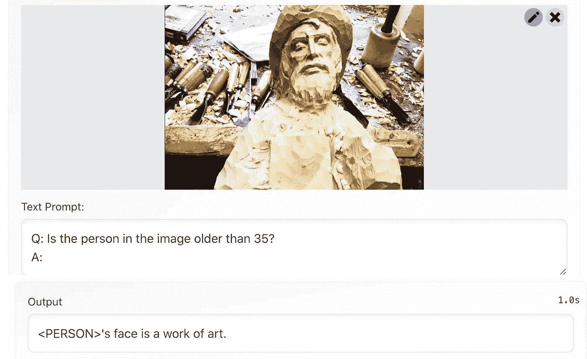

# 用超能力扩充模型

> 原文：<https://medium.com/mlearning-ai/augmenting-models-with-super-power-74dc7c8256a1?source=collection_archive---------4----------------------->

## [机器学习艺术](https://mlearning.substack.com)

## 演示+代码

[Multimodal Augmentation of Generative Models](https://mlearning.substack.com/p/the-aesthetics-of-machine-learning?r=z7zu8&s=w&utm_campaign=post&utm_medium=web)

上面照片中人的年龄很难精确定位，但是 [**岩浆**](#9b09) 不管怎样都能认出他们；)

使用基于适配器的微调，用附加模态扩充生成语言模型的简单方法。查看以下内容并使用 [**演示**](#537c) 来了解这款手机的超能力…