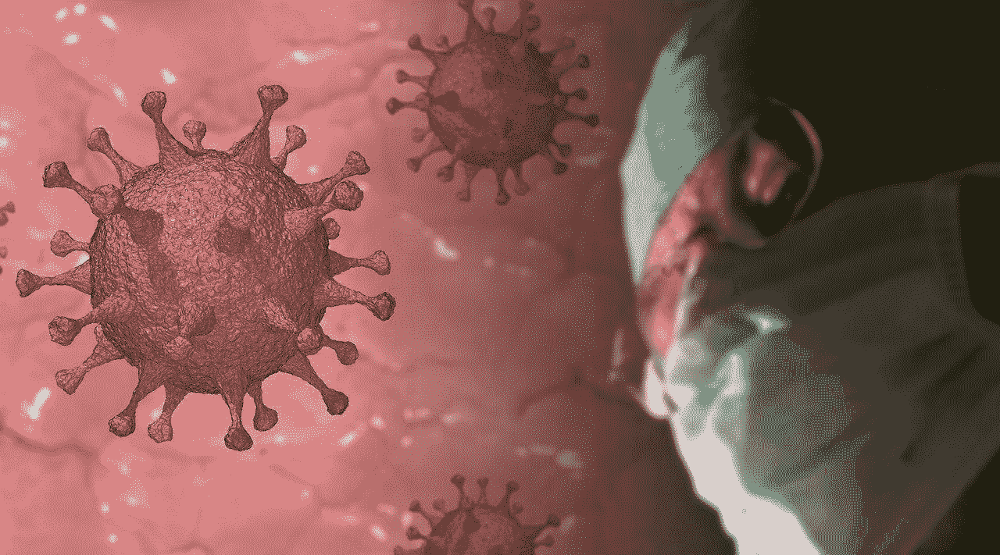

# 奥地利正在对未接种疫苗者实施封锁

> 原文：<https://medium.com/mlearning-ai/austria-is-exercising-a-lockdown-for-the-unvaccinated-788720f6abf8?source=collection_archive---------3----------------------->

由于在撰写本文时，西欧似乎是冠状病毒流行的中心，奥地利已做出果断决定，对未接种疫苗的个人实施封锁。

奥地利完全接种疫苗的人口比例约为 63%，是欧洲最低的比例之一。如此低的疫苗接种率在某种程度上归因于…