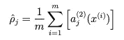
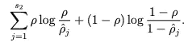

# 自动编码器…一个可怕的名字？

> 原文：<https://medium.com/mlearning-ai/autoencoders-a-scary-name-d961bbc9dcea?source=collection_archive---------0----------------------->

当我自己开始学习机器学习时，我意识到了自动编码器及其存在。但从它的名字来看，我认为这是我以后获得足够经验后才会学到的东西。然而，我遇到了他们，忍不住想了解他们。但是它们是什么呢？

在监督学习中，我们训练网络来分类或预测数据，但标签可用于训练和测试部分。自动编码器也是应用反向传播的神经网络，其中输出值与输入值相同。这是一种无人监督的学习，如你所见，我们没有标签。

一开始可能会觉得奇怪，为什么我们要用这个。所以我们先来讨论一下这类网络的动机。

## **自动编码器的动机**

通常情况下，我们使用的数据，例如在通常的神经网络中，是非常嘈杂的。这就是用低维表示法表示数据的技术非常有用的地方。此外，拥有一种试图捕获数据最重要方面的方法是非常有用的。自动编码器就是为此而生的，用于降维和特征学习。

## **建筑**

自动编码器是全连接的前馈网络，其内部有一个隐藏层，代表一个代表输入数据的**码**。自动编码器有 3 个结构组件:

1.  编码器
2.  密码
3.  解码器

在网络中造成瓶颈迫使自动编码器学习如何压缩数据。这种限制允许他们只复制类似于训练数据的输入。此外，通过这种方式，它可以对要复制的输入中最能描述它的方面进行优先排序。

我们希望自动编码器对输入足够敏感，以便准确地重建它。此外，我们希望他们足够不敏感，不只是记忆和过度拟合训练数据。

然而，如果我们试图重建的数据是随机的，自动编码器的任务将很难完成。瓶颈限制有助于算法找到并了解输入的哪些部分是相关的，以及数据中是否有某种结构。

## **自动编码器的类型**

自动编码器的类型:

*   降噪自动编码器
*   稀疏自动编码器
*   收缩自动编码器
*   欠完整自动编码器
*   卷积自动编码器
*   可变自动编码器

我将简短地讨论所有这些类型，它们的差异和应用

**欠完整自动编码器**

欠完整自动编码器是指编码层的维数小于输入数据的编码器。在代码层，我们有输入数据的欠完整表示，这迫使该网络以存储其潜在特征的方式压缩数据。

在训练欠完整自动编码器时，目标是减少所谓的**重建损失**。没有正则项，因此充分限制隐层中神经元的数量对于网络不过度拟合和记忆是很重要的。重构损失是一个因网络输出与输入不相似而惩罚网络输出的函数。

**稀疏自动编码器**

在重建损失中加入惩罚参数或稀疏惩罚给出了一种新的自动编码器-稀疏自动编码器。此外，它们不需要对隐藏层的尺寸进行限制。这里，我们只关心层内神经元的特定激活。这里要注意的是，我们不惩罚网络中的权重，而是激活。

不同的输入数据激活不同的网络区域。欠完整自动编码器对每个数据样本使用整个网络，但是稀疏自动编码器仅对每个数据样本选择性地使用网络区域。通过这种方式，我们正在学习使用数据的潜在状态表示。

因此，目标是惩罚神经元在训练数据上的过多活动(神经元在接近 1 时被认为是活跃的，而在其值接近 0 时被认为是不活跃的)。目标是在神经元上有非常小的平均激活。为此，我们引入稀疏度参数，它是一个接近于零的小值，通常约为 0.05，并惩罚特定神经元的平均激活与该值的数据偏差。

the average activation of the neuron j over data samples

添加以下内容:

penalty term based on KL-divergence

其中 s2 是隐藏层中神经元的数量，j 是该层中神经元的指数，鼓励网络只激发观察子集的神经元。稀疏罚项还取决于网络中的权重和偏差，因为它们定义了每个神经元的激活值。

在下列情况下，该项的值为零(也是该函数的最小值):

the average activation equals the parameter set usually 0.05

并且随着平均值偏离设定的稀疏度参数的值而单调增加。

**收缩自动编码器**

当制作特征提取函数时，我们希望我们的模型能够抵抗输入的小扰动。这可以通过惩罚隐藏层激活相对于输入的大导数来实现。这是因为对于输入中的小变化，我们希望有相似的编码状态。

为此，除了常规损失函数之外，我们还在所有训练样本上添加了一项，该项实际上是隐藏层激活相对于输入 x 的所有一阶偏导数之和的平方。

**去噪自动编码器**

去噪自动编码器指的是扰动输入并将其设置为我们网络的目标的方法。这样，由于目标与输入略有不同，该模型不能开发仅记忆和过度拟合训练数据的映射。

除了原始损失函数之外，不需要额外的项，只需要输入的损坏版本的样本。

重要的是要知道，这种方法在培训期间所覆盖的区域中效果很好。当数据远离自然数据分布时，重建误差较大，输出可能非常错误。

**卷积自动编码器**

结合卷积神经网络方法和自动编码器的思想，我们得到卷积自动编码器。自动编码器的目标是学习图像重建的最佳滤波器。

典型的架构如图所示:

**变型自动编码器**

这个和我们看到的有点不同。尽管如此，我们有一个编码器和解码器，以最小化重建误差为目标来训练它们，但我们不是将输入编码为单个点，而是将其编码为潜在空间的分布。

这是一种描述和观察潜在空间的概率方式。给定输入的每个潜在属性将以概率分布的形式呈现。

这是通过使用损失的附加项来实现的，该附加项鼓励学习的分布类似于先验分布，对于潜在空间的每个维度，先验分布通常被假设为标准正态分布。

**应用**

使用自动编码器的动机是降维，并且自动编码器在这方面非常成功。低维表征可以改善和巩固许多任务。

自动编码器学习如何将数据压缩成有意义的表示。自动编码器的通常应用是异常检测、信息检索、数据去噪等。

 [## Mlearning.ai 提交建议

### 如何成为 Mlearning.ai 上的作家

medium.com](/mlearning-ai/mlearning-ai-submission-suggestions-b51e2b130bfb)