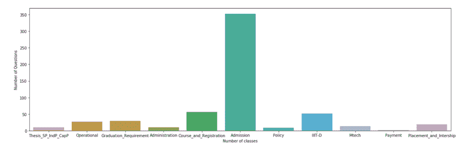
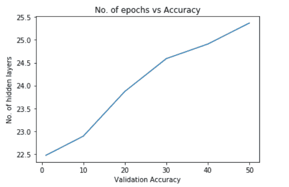
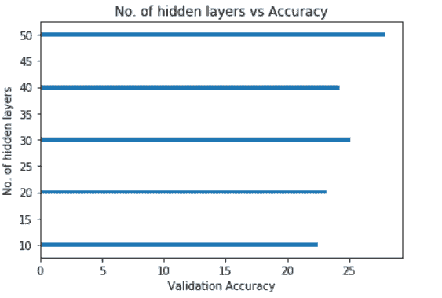
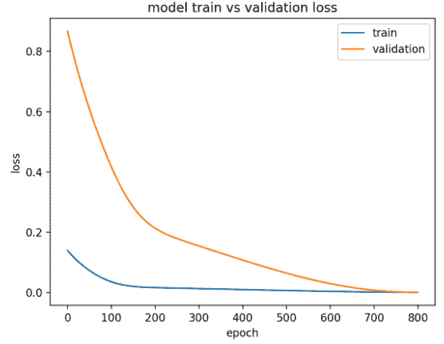
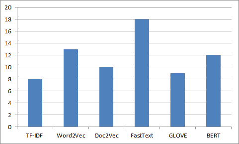

# 用于大学查询的自动聊天机器人

> 原文：<https://medium.com/mlearning-ai/automated-chatbot-for-college-queries-19b03d72e3c8?source=collection_archive---------3----------------------->

# 什么是聊天机器人？

聊天机器人是一种人工智能软件，可以通过消息应用程序、网站、移动应用程序或电话模拟与用户用自然语言进行的对话。
为什么聊天机器人很重要？聊天机器人经常被描述为最先进和最有前途的人机交互方式之一。然而，从技术的角度来看，聊天机器人只代表了利用自然语言处理(NLP)的问答系统的自然演变。用自然语言表达对问题的回答是自然语言处理在各种企业的终端应用中应用的最典型的例子之一。

# 目录

1.  什么是大学查询自动化聊天机器人？
2.  聊天机器人的历史
3.  关于数据集
4.  应用模型
5.  结果和分析
6.  结论

# 什么是大学查询自动化聊天机器人？

我们的目标是建立一个自动聊天机器人来回答学生经常问的与大学相关的问题。学生们有很多疑问，而且这些疑问是多种多样的。他们需要快速得到问题的答案，但这是不可能的，因为他们需要浏览整个网站或联系管理员，这既费时又麻烦。因此，为了促进这一进程，我们需要自动化这一进程。我们的聊天机器人将有效地服务于这一目的，在眨眼之间给出最合适的查询答案。

# 聊天机器人的历史

创建聊天机器人的过程从最基本的“关键词搜索”机制开始，答案只是基于数据集中匹配的单词。 [**Levy**](https://www.researchgate.net/publication/235664166_A_Survey_of_Chatbot_Systems_through_a_Loebner_Prize_Competition) 在 1997 年改进了基于关键字搜索的基本方法，使用加权模块的模式匹配来生成对查询的响应。

[**k . Bala**](https://www.irjet.net/archives/V4/i11/IRJET-V4I11367.pdf)教授在 2014 年引入了本体和知识图方法来回答特定领域聊天机器人的查询。知识库将数据集与单个实体进行映射，聊天机器人可以从创建的关系中直接获得答案。

[**吉里什·瓦德瓦**](https://ieeexplore.ieee.org/document/8473172) 教授在 2017 年将人工智能标记语言(AIML)与大学特定领域的问答系统结合在一起。AIML 是一种上下文相关的多功能语言，可以从之前的对话中学习。

2018 年，使用 SQL 查询来回答来自结构化数据库的查询。一个基于网络的模型是由 [**萨加尔·潘瓦尔**](https://agupubs.onlinelibrary.wiley.com/doi/full/10.1029/2007GL030692) 使用各种常见的相似性度量开发的。关系数据库是人类最常见和最容易理解的方式。他们提出的算法是将查询转换成 SQL 格式，然后根据数据检索结果。

# 关于数据集

由于我们的目标是为大学查询建立一个自动聊天机器人，数据集不是公开可用的，所以我们收集了数据集(w.r.t IIITD College)。以下是数据集收集的步骤。

## **数据集采集**

该数据集是通过废弃各种网站和页面(如 IIITD 的招生页面、专门用于 IIITD 的 Reddit 页面以及 Quora 中与 IIITD 相关的所有问题)并将它们组装起来而获得的。此外，段落涉及所有领域，如招生，费用，教员等。数据集以这种格式构建，用于应用生成模型，生成模型要求这种格式的数据集以文本问答的形式存在，即针对每个问题；我们从流行的社交网站——脸书、Quora 和 Reddit 上找到了最相关的答案。我们还从学院网站上删除了一些数据，以获取一些事实性的答案，如教师和课程的详细信息。在训练数据集中，有 3400 个问题和答案使用工具 FacePager、OctoParser 和 ScrapeStorm 废弃。此外，我们还为问题添加了标签，以及我们获取所有数据集的网站链接。

## **数据清理**

从不同的社交网站获得的数据非常反常，使用起来也不一致。因此，为了使数据适合于训练，我们在以下步骤中处理数据—
1。我们从数据集中删除了“nan”值，用适当的答案填充它。
2。我们用原来的词代替俚语词，否则相似度分数会大大降低。
3。我们删除了非字母数字字符，如表情符号和模糊的符号，以消除不一致。

## **数据预处理**

应用以下步骤来预处理文本

1.  文本的大小写折叠。
2.  文本的标记化。
3.  从文本中删除停用词。
4.  文本的词条化。

# 应用模型

我们尝试对查询搜索应用不同的模型。

## **TF-IDF**

我们从最基本的模型“Tf-Idf”开始，它考虑了单词的重要性，并给出了答案，其中术语的重要性与查询的重要性相似。接下来，在查询和数据集中的问题之间的余弦相似性的基础上进行比较。给出的答案是基于问题中术语之间的相似性。然而，这种模型不能完美地处理文本的语义。

## **Word2Vec**

接下来，我们在 Word2Vec(单词嵌入无监督模型)上建立了我们的模型，该模型通过计算单词在句子中的出现和共现来创建单词的向量，而 Tf-Idf 产生一个分数来测量相关性，而不是频率。Word2vec 是一组用于产生单词嵌入的相关模型。这些模型是浅层的两层神经网络，被训练来重建单词的语言上下文。该模型给出了比余弦相似性更好的结果，但是仍然远离准确的实际结果，因为该模型没有定义次线性关系。Word2Vec 没有考虑模型的理论方面。

## **快速文本**

因此，为了提高所获得结果的准确性，我们尝试了来自脸书“FastText”的更好的单词嵌入模型来训练我们的模型。FastText 将语料库中的每个单词视为由 n 元语法组成的字符，而 Word2Vec 将每个单词视为一个原子实体。在 FastText 的情况下，每个向量都是字符 n-grams 的总和。在 FastText 上训练的模型提供了更好的结果，但是它相对较慢，并且需要更多的存储空间来保存 n 元语法。它是通过使用脸书文本文档语料库建立的。这是一个真实世界的数据集，因此它是真实世界文本语料库的良好表示。FastText 通过跨语言和多种俚语进行训练。它将单词的内部结构与单词嵌入进行映射，并生成上下文值。

## **Doc2Vec**

Doc2Vec 使用 word2vec 作为底层模型创建文档向量。它以这样一种方式来表示特征，即它考虑单词集合中单词的顺序，并且它以比 Word2Vec 更好的方式来度量文档的表示。Doc2Vec 为文档创建特征向量，记住每个术语相对于该文档的上下文，而不管其长度。它被称为段落向量的**分布式内存**版本。它记得上下文是段落的主题。但是，doc2vec 高度依赖于根据所使用的数据集进行的参数调整。doc2vec 模型创建文档的数字表示。它学习一个随机初始化的向量来捕获段落的上下文。当有很多文档时，随机初始化会产生很多问题，并且对于某些迭代，结果可能是任意的。 **WM 距离**是将单词的语义及其在句子中的含义考虑在内的相似性度量。它计算查询和数据集中的句子之间的相似度。然后对相似性得分进行排序，并找出具有最大相似性的句子。主要优点是，即使句子之间没有共同的单词，它也能很好地执行。

## **手套**

glove 是“矢量嵌入的全局表示”的缩写。gloVe 是一种无监督学习算法，用于获取单词的矢量表示。在来自语料库的聚集的全局单词-单词共现统计上执行训练，并且所得的表示展示了单词向量空间的有趣的线性子结构。这种手套可用于查找同义词、公司-产品关系、邮政编码和城市等词之间的关系。手套被应用于创建单词嵌入，但是我们的聊天机器人的结果没有改进，因为手套模型不具有用于计算两个单词向量之间的距离的 wmdistance 函数。

## **谷歌伯特**

没有记忆就像一个对象，一个除了捕获单词的语义之外，还跟踪所有导致特定单词的单词的对象。BERT 模型代表来自变压器的双向编码器表示，这在机器学习领域引起了不小的轰动。BERT 的关键警告是它非常关注语言建模。相似性函数我们实现了我们自己的相似性度量，取查询中每个词的权重，乘以嵌入词的平均值，使其成为加权平均模型。

## **RNN+LSTM**

使用具有最健壮的递归神经网络的 LSTM 来创建生成模型，因为它将单词嵌入的世代保存在它自身内部的存储器中，这有助于它们记住输入和答案。LSTM(长短期记忆)与 RNN 一起使用，当它被反馈机制结合时，使得对顺序数据的预测更好。就文本数据而言，它取得了良好的效果。

# 结果和分析

## 数据集可视化

Figure shows that most of the queries are admission related.

Figure shows that Admission has higher TF-IDF among all the words.

## RNN+LSTM 模型的观察结果

它解释了在增加时段数以正确拟合模型时，验证准确性会增加。

随着隐藏层数的增加，验证精度增加，隐藏层的最佳计数为 50。

图中显示了随着历元数的增加而发生的损失的比较。由于训练和测试精度在一段时间后收敛，因此训练的模型非常适合我们的数据集。

## 应用不同模型的比较。

*   这表明 FastText 在所有模型中表现最好，紧随其后的是 Word2Vec。其余两个模型的性能对于我们的数据集来说不是很好。
*   为一组 25 个问题绘制图表，并由人类注释者进行评估。

# 结论

*   对于与数据集中的查询具有最小相似度的查询，FastText 模型表现良好。
*   当其他类型的查询被提供给我们的模型时，我们的模型不能给出适当的答案。
*   BERT 和 Glove 预计会比其他模型表现更好，因为他们更好地理解了单词的语义，但他们在我们的小数据集上表现不佳。
*   在 50，000 个词汇的情况下，生成模型(RNN + LSTM)收敛到 5–6%的精度，当我们为数据集加载全部词汇时，收敛到大约 24%的精度。
*   随着数据集大小的增加，BERT、Glove 和生成模型将给出更好的结果。

代码可在[**g**](https://github.com/Devashi-Choudhary/Automated-ChatBot-for-College-Queries)**ithub.com/Devashi-Choudhary/Automated 聊天机器人进行学院查询**。如有任何问题或疑问，请直接联系我，电话:[**github.com/Devashi-Choudhary**。](https://github.com/Devashi-Choudhary)