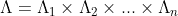
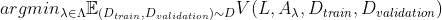

# 自动机器学习和超参数优化

> 原文：<https://medium.com/mlearning-ai/automated-machine-learning-and-hyperparameter-optimisation-f33be5eb6901?source=collection_archive---------5----------------------->

构建和应用机器学习模型可以成为现代商业的推动者，并被广泛使用。然而，建立这种模型的过程通常是一个漫长的过程，需要专家、时间和计算资源。

自动机器学习(AutoML)变得越来越流行，并且近年来已经发布了许多不同的框架(例如基于流行的库 scikit-learn 构建的)来支持工程师(尤其是非专家)构建成功的 ML 模型。

这种库包括例如以下。

*   https://github.com/automl/autoweka
*   https://epistasislab.github.io/tpot/[TPOT](https://epistasislab.github.io/tpot/)
*   https://automl.github.io/auto-sklearn/master/index.html#[autosklearn⁴:](https://automl.github.io/auto-sklearn/master/index.html#)
*   https://autokeras.com/的 AutoKeras⁵:

请注意，以下部分的大部分内容都是从[6]中提到的那本书转述而来的。这些信息可以在这本书的第一章找到。这是一本开放存取的书，可以在以下网站下载:[https://www.automl.org/book/](https://www.automl.org/book/)。

# 使用 AutoML 的原因

*   (至少)半自动化 ML 的可能性→这不仅节省了时间，还允许以不同的方式使用节省的资源。
*   让非专家也可以访问 ML。时至今日，选择 ML 模型要么取决于(1)专家根据过去的经验选择模型，要么取决于(2)大量的反复试验。类似地，超参数使用网格或随机搜索等技术进行优化，或者在深度学习的情况下，主要由专家进行优化。最近的研究表明，AutoML 有能力胜过这些方法。
*   创造一种更结构化的方法来进行机器学习。(!)

当然，你可以使用 AutoML 的原因还有很多。尽管如此，我相信(至少对我来说)上面提到的三点是最重要的。

# 问题的定义

下文概述了超参数优化(HPO)，这是 AutoML 中最基本的任务之一。在 HPO，目标是找到给定机器学习模型的最佳超参数。

## 模型和超参数

在 AutoML 中，我们通常看一个给定的 ML 算法及其超参数。一个特定的算法被表示为 **A** ，其第 I 个超参数的域被表示为**λᵢ**。因此，具有 **n** 个超参数的算法的超参数的总向量是所有超参数的叉积，如下所示。

Vector of hyper-parameters of an algorithm A

不同的域类型可以从分类(例如支持向量机的*核*超参数)到整数(例如随机森林中的树的数量)或完全实值变化。在实践中，它们的值通常有一些限制。例如，如果你观察 SVM 的超参数 *C* ，除了 10，你几乎看不到任何其他值。

关于超参数空间要考虑的最后一件事是不同超参数之间的依赖性。为 ML 算法的一个特定超参数选择某个值可能会使包含另一个超参数变得完全没有必要。
在图论中，这样的条件使得超参数空间成为有向无环图。一个例子是，SVM 的*次*超参数仅在选择了*多项式*核时相关。

## 问题陈述

根据上面的定义，我们可以定义要最小化的函数如下。我们搜索在给定数据集 **D** 上最小化损失的一组超参数(表示为函数 **V** )。

Minimisation Problem

**V** 是一个以损失函数 **L** (如 F-1 得分或 RMSE)和算法 **A** 为输入的函数，带有一个超参数矢量 **λ** 。此外，训练和验证测试集也被传递给该函数。

函数 V 可以使用保持方法或交叉验证来计算损耗。

## 使用 Argmin 的替代方法

上面的定义显示了进行优化的基本方法。在实践中，只返回一个“最佳”配置可能不是最佳的，尤其是当有多个不同的和非常多样化的解决方案时。

因此，可以使用类似于随机森林的方法，返回多个配置。这些可以再次用于生成一个整体学习器。这种方法在过去取得了可喜的成果。要了解更多信息，我推荐你阅读[7]中提到的论文。

## 其他需要考虑的事情

尽管返回性能最佳的模型是有意义的，但是在进行 AutoML 时还有其他的目标要考虑。通常(几乎总是在 ML 中)在模型的预测性能和其他性能因素(例如，时间、内存)之间有一个折衷。您可能更喜欢速度更快、预测性能略低的模型，而不是计算时间更长的模型。

多目标优化(MPO)试图找到具有多个待优化因素的优化问题的解决方案。很多时候，没有一个理想的解决方案(尤其是在处理大量目标时)。

因此，在 MPO，返回多个解决方案并不罕见，每个解决方案对于不同目标之间的某种平衡都是最优的。这被称为帕累托前沿，如果不可能构建另一个配置来增强一个目标而不损害另一个目标，则解决方案属于该集合。

想了解更多关于 MPO 的信息，我推荐阅读[8]，它对这个主题有一个很好的概述。

[1]: *Pedregosa* *等*[Scikit-learn:Python 中的机器学习](http://jmlr.csail.mit.edu/papers/v12/pedregosa11a.html)。JMLR 12。第 2825-2830 页。2011.

[2]: *科特霍夫等人*。[Auto-WEKA 2.0:WEKA 中的自动模型选择和超参数优化。JMLR 18(25):15。2017.](https://www.cs.ubc.ca/labs/beta/Projects/autoweka/papers/16-599.pdf)

[3]: *乐等* [用特征集选择器将基于树的自动机器学习扩展到生物医学大数据](https://academic.oup.com/bioinformatics/article/36/1/250/5511404)。生物信息学 36(1):250–256。2020.

[4]: *福雷尔等人* [高效健壮的自动化机器学习](https://papers.neurips.cc/paper/5872-efficient-and-robust-automated-machine-learning)。神经信息处理系统进展 28 (NIPS 2015)。2015.

[5]: *金等* Auto-keras: [一个高效的神经架构搜索系统。](https://dl.acm.org/doi/pdf/10.1145/3292500.3330648)第 25 届 ACM SIGKDD 知识发现国际会议论文集&数据挖掘。ACM。2019.

[6]: *赫特等人*。[自动化机器学习。方法，系统，挑战。](https://link.springer.com/book/10.1007/978-3-030-05318-5)斯普林格。2019

[7]: *Momma et al.* [一种支持向量回归模型选择的模式搜索方法](http://doi.org/10.1137/1.9781611972726.16)。SIAM 数据挖掘国际会议论文集。暹罗。2002.

[8]: *Ngatchou 等* [帕累托多目标优化。](http://doi.org/10.1109/ISAP.2005.1599245)第 13 届电力系统智能系统应用国际会议论文集:84–91。2005.

 [## Mlearning.ai 提交建议

### 如何成为 Mlearning.ai 上的作家

medium.com](/mlearning-ai/mlearning-ai-submission-suggestions-b51e2b130bfb)