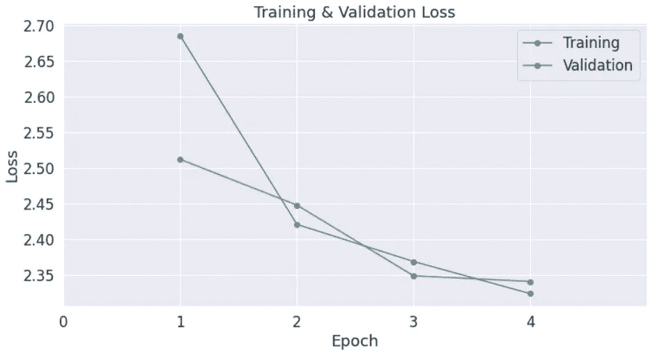

# 通过使用 Pytorch 微调 GPT-2 自动生成表达情感的诗歌

> 原文：<https://medium.com/mlearning-ai/automatic-generation-of-emotionally-expressive-poetry-by-fine-tuning-gpt-2-using-pytorch-68dace59fca0?source=collection_archive---------2----------------------->

## 方便的指南

## 使用 Huggingface 库创作嵌入您选择的情感的原创诗歌


Photo by [Ksenia Makagonova](https://unsplash.com/@dearseymour?utm_source=medium&utm_medium=referral) on [Unsplash](https://unsplash.com?utm_source=medium&utm_medium=referral)

自过去几年以来，NLP 世界经历了一场大繁荣，类似于 2012 年的计算机视觉繁荣。这一成功在很大程度上归功于 [transformer 架构](https://jalammar.github.io/illustrated-transformer/)和对下游任务使用[迁移学习](https://lena-voita.github.io/nlp_course/transfer_learning.html)。

> [“关注是你所需要的一切”](https://arxiv.org/abs/1706.03762)是谷歌员工发表的一篇研究论文。阿希什·瓦斯瓦尼等人。艾尔。发表了这篇革新了 NLP 产业的论文。这是第一次提到*变形金刚*的概念。

2020 年，OpenAI 推出了 GPT-3，这是一个具有 1750 亿个参数的自回归语言模型，比以前的任何非稀疏语言模型都多 10 倍。该模型在文本生成方面表现出惊人的性能。然而，从头开始训练这样的大型模型需要仔细的超参数调整，数千个计算小时和数百万个 AWS 信用。而不是这样，我们将从 [Huggingface](https://huggingface.co/) 模型中心微调一个预训练的 GPT-2 模型。

[](https://colab.research.google.com/drive/1_8UUlOjd_KnSIxlSdsF72MeSK3lprnbo?usp=sharing) [## 谷歌联合实验室

### 包含用于微调模型的整个工作流的笔记本

colab.research.google.com](https://colab.research.google.com/drive/1_8UUlOjd_KnSIxlSdsF72MeSK3lprnbo?usp=sharing) 

在这个项目中，我们将开发 GPT-2 模型，每个模型都能够产生带有特定情感基调的原创诗歌。整个项目的代码可以在这个 [GitHub 存储库中找到。](https://github.com/prajwalcr/AutoCompose)所有模特都托管在 [HuggingFace](https://huggingface.co/prajwalcr) 上。您还可以在资源库中找到一个 [Flask App](http://autocompose.herokuapp.com/) 的代码，它提供了一个与模型交互的 API。Flask 应用程序已经使用 Heroku 部署并上线。部署的应用程序利用[算法 ia](https://algorithmia.com/) 来运行 **GPU** 中的模型，这对于**也是免费的！**如果您有兴趣了解这是如何实现的(GPU 通常非常昂贵)，可以在本文的[第 2 部分](http://example.com/)中找到整个部署过程。类似的策略也可以用于部署其他人工智能应用程序。

# 方法学

## 古腾塔格

[古腾堡工具](http://www.cs.toronto.edu/~jbrooke/gutentag/)用于从[古腾堡项目](https://www.gutenberg.org/)网站建立所需的诗歌语料库，这是一个包含超过 59，000 本电子书的大型在线数据库。

## Emolex

EmoLex 是一个众包式的词汇和情绪关联数据集。它用于根据诗歌的情感对诗歌语料进行分类。通过使用对应于每种情绪的诗歌，为该情绪建立语言模型。

## 拥抱脸

从 HuggingFace 的模型中心获得预训练的 GPT-2 模型，该模型稍后将针对每种情绪在相应的诗歌语料库上进行微调。

# 资料组

这些数据是从古腾堡项目网站上获得的。[古腾堡工具](http://www.cs.toronto.edu/~jbrooke/gutentag/)是古腾堡项目数据库的一个很好的语料库阅读器。它提供了一个简单的界面，您可以逐步添加过滤器来分离和获取所需的文本。在应用了所有必要的过滤器之后，我们得到了一个大约三百万行的诗歌语料库。你也可以看看这个很酷的 [github 知识库](https://github.com/aparrish/gutenberg-poetry-corpus)，作者是 *Allison Parrish* ，可以很容易地从古登堡计划数据库中获得一个大型诗歌语料库。

# 对数据集进行分区

一旦获得数据，下一步就是根据诗歌所表达的情感对诗歌进行分类。我们将它们分为 9 个不同的类别:*愤怒、期待、厌恶、恐惧、喜悦、中立、悲伤、惊讶和信任*。中性诗歌将用于训练所有的模型。然后，剩下的每一类诗歌将被用来训练相应情感的模型。可以使用各种技术来分割数据，但是 [Emolex](https://saifmohammad.com/WebPages/NRC-Emotion-Lexicon.htm) 似乎是一个简单方便的工具。

使用 [NRCLex](https://pypi.org/project/NRCLex/) python 库可以很容易地将 Emolex 集成到您的代码中。我们遍历每首诗，分别记录这首诗所表达的 8 种情绪的强度。如果一首诗明显属于八种情绪之一，即其中一种情绪比其他任何情绪都要高，我们就用这种情绪来标记这首诗。如果一首诗没有表现出任何情绪或者属于大量情绪，我们就给它贴上缺失/中性的标签。

# 为模型准备数据

我们将使用 Pytorch 加载数据并微调模型。我们将使用来自 Huggingface 的 GPT-2 标记器和适当的 bos、eos 和 pad 标记来标记诗歌。这个记号赋予器基于 [BPE(字节对编码)](https://leimao.github.io/blog/Byte-Pair-Encoding/)。

为了优化数据生成过程，防止训练过程中出现瓶颈，我们创建了 pytorch 数据集和数据加载器。对于每首诗，数据集创建包含编码诗和注意力屏蔽(用于填充标记)的张量。DataLoader 用于将数据输入到模型中，并定义某些参数，如批量大小和采样技术。

# 微调模型

对于基于变压器的模型，AdamW 是首选的优化器。我们将使用 Huggingface 的实现以及所有默认参数。我们还创建了一个具有线性预热的调度器，它在预热阶段线性增加学习速率，之后学习速率变得恒定。这有助于减少早期培训阶段的波动性。

接下来，我们从 Huggingface 加载 GPT-2 模型及其配置类，并用预训练的权重实例化该模型。我们从配置类中设置模型的参数。该模型被训练大约 4 个时期。不需要大量的历元，因为我们只是微调预训练的模型。训练加载模型的完整代码可以在这个 [colab 笔记本](https://colab.research.google.com/drive/1_8UUlOjd_KnSIxlSdsF72MeSK3lprnbo?usp=sharing)中找到。

通过查看训练和验证的损失曲线，您可以很好地了解何时停止训练。在最后一个时期之后，最好使训练损失刚好低于验证损失，以确保它不会下降得太低，从而避免过度拟合。下图显示了一个停止训练的好点。



Image by Author

# 将一切缝合在一起

使用上面提到的技术，我们为每一类诗歌创建一个单独的 GPT-2 模型，也就是说，我们对每个模型重复相同的过程，数据是唯一的区别。

首先，我们通过微调预先训练好的中性诗歌 GPT-2 模型，建立了一个生成中性情感诗歌的模型。让我们称之为**基础模型**。这个模型已经学习了诗歌的句法、语义、风格和各种特征。因此，我们将使用基础模型来创建其他情绪的模型，而不是使用来自 Huggingface 的预训练 GPT-2 模型。对于其余 8 种情绪中的每一种，我们在相应的数据集上微调基础模型。这给了我们更有希望的结果。

# 结果

现在是激动人心的部分。让我们看看模型生成的一些诗歌，看看它是否能跟上实际诗人创作的作品。下面列出了模型为每种情绪创作的一些最佳诗歌。

## 愤怒

*愤怒的想法*

```
I am not jealous; but this does vex
My heart so full of misery that I cannot stop
From angry thoughts.  This brings me relief,
And a painful torment; and I
Am content to part from thee alone.
```

## 希望

*神秘中的上帝*

```
Thence down the river to the mountain-side
I travelled with my boats and my oarsmen,
To seek a haven near the southern cape
Where dwelt some mighty god in mystery,
Unknowing I wandered therefrom, so
Unconscious I lay, and rested there.
```

## 厌恶

*雏菊和污秽*

```
The little pool, by the house-wall,
Is covered with daisies and filth;
The fountains are withered and dim,
And the lizards writhe in rags.
```

## 害怕

我看见你在遥远的角落

```
I see thee in a far corner,
With a stealthy stride, and a trembling soul
I know thou, Dear, who should'st not fear
That I should come near thee!
I know thee.
```

## 高兴

*温柔的喉咙*

```
Thy soul has joy, and thy soul is free,
And all the things it loves can live
In thy love for me and thee!
O gentle-throat, why sing so low,
Or do thy music too loudly?
Whence are all thy numbers fit?
If that thy mind is fix'd upon one,
It joys not to hear thee speak.
```

## 中立的

*月亮*

```
He took them home, and soon set them down
In a chest at the door of his room,
And asked them if they knew
What the moon was about.
```

## 悲哀

*亲爱的心*

```
For you, dear heart, so lone and worn and weary,
Hear me, and the silence dies,
That still I think you must come near me,
And not so be blest.
```

## 惊喜

*自然自有*

```
He is a wild magician,
Who takes up the air and vanishes
As though his name were Nature's own,
And that it were Nature's own prompting,
That he should leave school in such a way.
```

## 信任

*乔装打扮的少女*

```
He sees the aged damsels in disguise,
And how the princely damsels are dressed;
The queen of Sariola, as she stands,
Is clad in rich embroidery;
And every thing that she does wear
Is a royal dame in finest form,
And a queen in fairest posture too.
```

这些模型有点粗糙，但是考虑到我们只需要对它们进行 4 个时期的训练，它们显示出了非常有希望的结果。有些诗写得非常好，就好像是一个真正的诗人写的一样，这给人印象非常深刻。

# 结论

我希望我已经能够通过这篇文章来说明变压器的力量。这些深度语言模型能够轻松地针对下游任务进行微调，而不需要庞大的数据集，这是它们背后所有宣传的主要原因。

我还展示了一个简单的微调生成器模型的工作流程，这篇关于为*万智牌*生成风味文本的[文章给了我很大的启发。](/swlh/fine-tuning-gpt-2-for-magic-the-gathering-flavour-text-generation-3bafd0f9bb93)

# 未来的工作

*   这种方法最大的缺陷之一是我们最终得到了 9 种不同的模型。理想情况下，我们需要一个端到端的模型来执行某项任务。当然可以构建一个单一的模型来生成各种情绪的诗歌，用户可以在其中指定所需的情绪，但我将让读者对此进行进一步的探索(也许我们可以在生成欢乐的诗歌时，在开始生成之前，在输入中添加一个特殊的标记，如<joy>)。</joy>
*   更好的超参数调整肯定会改善结果，我在这里为我的模型留了很多空间。
*   更大的模型肯定会给出更好的结果，尽管你需要更多的计算和时间。
*   对生成的诗歌进行统计评估有助于优化模型。困惑是文本生成的一个常用度量。您还可以执行[图灵测试](https://searchenterpriseai.techtarget.com/definition/Turing-test)来评估您的模型。

# 参考文献和致谢

1.  A.瓦斯瓦尼、n .沙泽尔、n .帕尔马等。、[注意力是你所需要的全部](https://arxiv.org/abs/1706.03762) (2017)，第 31 届神经信息处理系统会议
2.  布伦丹·李炳然，朱加尔·卡利塔，[介绍自动诗歌生成的创造性方面](https://arxiv.org/abs/2002.02511) (2020)
3.  杰伊·阿拉姆马的插图版 GPT-2。这是了解 GPT 新协议的极好资源，我强烈推荐你阅读它。
4.  [微调 GPT-2 为幻世拢味文生成](/swlh/fine-tuning-gpt-2-for-magic-the-gathering-flavour-text-generation-3bafd0f9bb93)。这个项目的工作流程在很大程度上受到了这篇文章的启发。
5.  [迁移学习简介](https://lena-voita.github.io/nlp_course/transfer_learning.html)。深入了解迁移学习和使用预训练模型完成下游任务。

[](/mlearning-ai/mlearning-ai-submission-suggestions-b51e2b130bfb) [## Mlearning.ai 提交建议

### 如何成为 Mlearning.ai 上的作家

medium.com](/mlearning-ai/mlearning-ai-submission-suggestions-b51e2b130bfb)