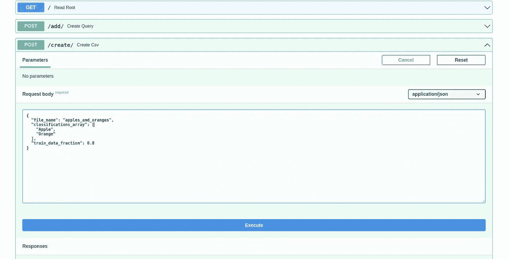
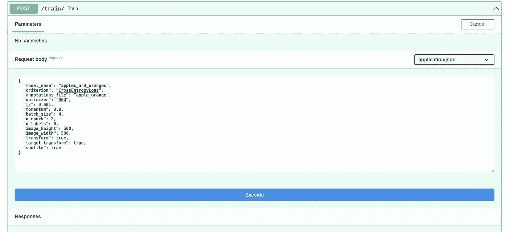
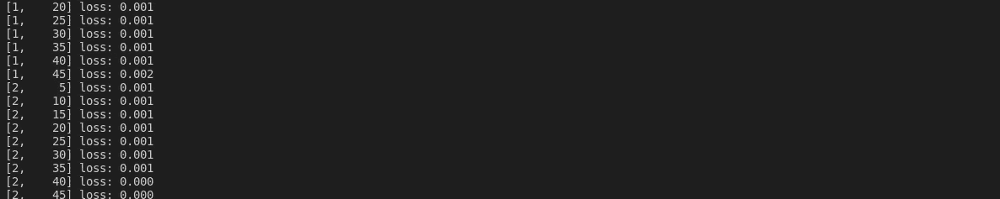
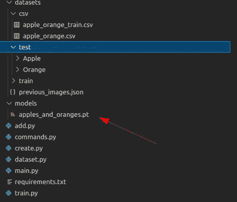

# 使用 FastAPI、Pytorch 和 SerpApi 进行自动训练

> 原文：<https://medium.com/mlearning-ai/automatic-training-using-fastapi-pytorch-and-serpapi-7d052ab3ac23?source=collection_archive---------1----------------------->

这是与人工智能实现相关的系列博文的一部分。如果你对故事的背景或情节感兴趣:

在前几周，我们探索了如何使用 SerpApi 的 Google Images Scraper API 自动创建自己的图像数据集。本周，我们将使用这些图像来自动训练一个使用简单命令对象传递给 FastAPI 的网络。

# 自定义 CSV

我们需要创建一个自定义的 CSV 文件，其中包含我们需要的图像。我们将使用熊猫图书馆。以下是要求:

我们需要创建一个从 SerpApi 的 Google Image Scraper API 收集的项目列表，设置要创建的 csv 文档的名称，并为训练数据定义一个分数。分数在这里的意思很简单。测试数据包含了我们收集的所有图像，而训练数据只占其中的一小部分。为此，我们需要创建一个可以传递给端点的对象:

这里提到的分数有一个简单的解释。测试数据集将包含所有图像，而训练数据集将只取其中的一小部分。这是为了在我们使用尚未训练的图像(即测试数据集的差异)对模型进行训练后测试模型。
现在我们已经定义了负责命令的对象，让我们定义 CSVCreator 类:

它接受我们给出的参数列表，这些参数是我们对 SerpApi 的 Google Images Scraper API 进行的查询，并在相应的文件夹中为每个图像创建一个 CSV。一旦所有的图像都完成了，它会随机抽取一小部分样本，并创建一个训练 CSV。
让我们在`main.py`中定义一个函数来调用这样的动作:

这些类有必要在`main.py`中调用它
负责动作的函数是:

举个直观的例子，如果你去`http://localhost:8000/docs`用以下参数测试`/create/`:

您将在`datasets/csv`中创建两个名为`apples_and_oranges.csv`和`apples_and_oranges_train.csv`的 csv 文件

`apples_and_oranges.csv`将是测试 CSV，将是有序的，将有所有的图像，并将看起来像这样:

`apples_and_oranges_train.csv`将会是火车 CSV，将会被打乱，将会有 80%的图片，并且将会是这样的:

这两个将用于创建数据集项。

# 自定义训练命令

我们需要一个对象来指定训练操作的细节，并在多个类之间共享使用以避免循环导入:

让我们来分解这个对象中的项目:

这里固定的图像高度和宽度本身有时是不够的。图像可能会失真。本周，我们将不应用任何变换来减少噪声。这种行为的原因来自批量装载。成批的张量图像应该具有相同的大小。

# 自定义数据集和自定义数据加载器

现在我们已经有了所需的命令，让我们来看看创建数据集和数据加载器的要求:

然后，让我们初始化数据集类:

我们使用`type`参数来定义我们是否正在用以下部分初始化`train`数据库或`test`数据库:

要定义在模型成形中使用的标签列表，我们使用以下行:

这为我们提供了一个要分类的项目字典，每个项目都有自己唯一的整数:

我们必须为输入和标签定义特定的转换。这些变换定义了它们将如何被转换成用于训练的张量，以及在它们的变换之后应该应用哪些操作:

让我们定义一个函数，它给出给定数据集中的图像数量:

最后，我们需要定义给出什么，一个图像张量和一个标签张量:

让我们一部分一部分地分解它。
下面一行将获得具有给定索引的图像路径:

假设数据集是训练数据集，索引为 0:

这将是我们的`self.img_labels.iloc[0,0]`。
路径中有`test`的原因是因为我们暂时将所有文件保存在`test`目录中。图像取自`apples_and_oranges_train.csv`的数据帧。所以它不会引起问题。
下面几行将从有问题的标签索引中创建一个热点向量:

我之所以注释`[0., 0.]`是因为在我们的例子中有 2 个标签，分别是`Apple`和`Orange`，所以向量的大小将由此定义。我们把它转换成 numpy 数组，以便转换成张量。
以下代码行将使用 PIL 库读取图像并将其调整到所需的大小:

我们将图像转换成 RGB，得到一个三维向量，第三个是颜色。然后，我们使用抗锯齿方法调整它的大小，使它仍然可以被眼睛识别。就像我之前说的，这通常是不够的。但是我们现在就这样做。

现在是定制数据加载器:

我们使用前面提到的`type`参数初始化其中的`self.train_dataloader`和`self.test_dataloader`。然后，我们使用 Pytorch 的 DataLoader 函数来声明一个加载器。批处理大小定义了调用 dataloader 时要获取的图像数量。
在迭代中，我们在`self.train_dataloader`上迭代，使用我们在初始化中定义的定制图像数据集给出一个图像及其相应的标签。
`train_features`将是我们从数据集中取出的一批图像的张量，`train_labels`将是这些图像对应的一批标签。

# 自动训练

现在我们有了一个定制的图像数据集，一个从数据集加载图像的定制数据加载器，让我们通过使用`TrainCommands`对象来利用自动训练。培训课程和模型的要求是:

让我们也声明我们想要使用的 CNN 模型:

这里需要注意的一点是，在我们的例子中，输出大小 n_labels 是 2，因为我们只在`Apple`和`Orange`之间进行分类。还有一个计算要做，这是从我手动计算的嵌入大小和图像的高度和宽度。总的来说，这是一个非常通用的图像分类函数。在接下来的几周里，我们将讨论如何自动计算我手动计算的尺寸，以及如何从`TrainCommands`添加更多的层来进一步自动化这个过程。
现在让我们定义使用自定义数据集和自定义数据加载器的训练函数:

让我们一部分一部分地分解它。以下代码行使用训练命令，用自定义数据集初始化自定义训练数据加载器。：

下一行使用训练命令声明模型(卷积神经网络):

以下行负责创建标准:

在我们的例子中，这等同于`torch.nn.CrossEntropyLoss()`。

下一行用于创建具有所需参数的优化器:

这相当于`torch.optim.SGD(CNN.parameters(), lr=0.001, momentum=0.9)`
在接下来的几周中，我们将有一种方法给出带有可选名称的可选参数，以无限制地填充优化器和标准。但是现在，这已经足够了。

最后，我们初始化要运行的 epochs 的数量以及要保存的模型的名称:

在以下部分中，我们迭代历元，消除损失，并使用`enumerate`函数从数据集中调用图像和标签:

数据将以元组的形式出现:

然后，我们将优化器中的梯度归零:

运行预测:

然后将预测值与实际标签进行比较，使用我们的标准计算损失:

标签在这里被压缩以匹配在标准函数中计算的输入的形状。

然后，我们运行反向传播来自动重新累积梯度:

我们逐步优化:

然后更新`running_loss`:

以下各行是流程每 5 步的输出:

最后，我们将模型保存到所需的位置:

现在我们已经准备好了一切，让我们在`main.py`中声明一个可以获取训练命令的端点。`main.py`的最终形式将是:

`/train/` endpoint 将接受我们的命令，并自动为我们训练一个模型。

现在，如果你前往`localhost:8000/docs`，用以下参数试试我们的`/train/`:

您可以从终端观察训练过程，因为我们为 epochs 声明了打印功能:

培训结束后，您将在`models`文件夹中保存一个模型，并使用您指定的名称:

# 结论

我感谢 SerpApi 的[聪明人让这篇博文成为可能，我也感谢读者的关注。在接下来的几周，我们将讨论如何使这里提到的一些部分更有效，更可定制。我们还将讨论更多关于 FastAPI 对所有进程的异步处理，以及对 SerpApi 的 Google Images Scraper API 的调用。](https://serpapi.com/team)

*原载于 2022 年 6 月 2 日 https://serpapi.com***。**

* [## Mlearning.ai 提交建议

### 如何成为 Mlearning.ai 上的作家

medium.com](/mlearning-ai/mlearning-ai-submission-suggestions-b51e2b130bfb)*