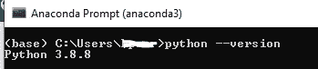
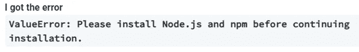
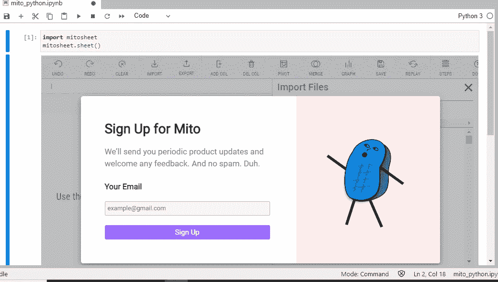
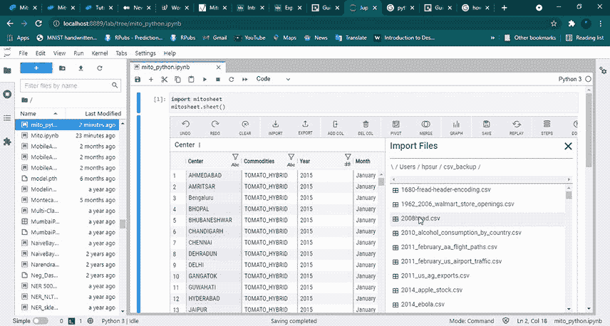
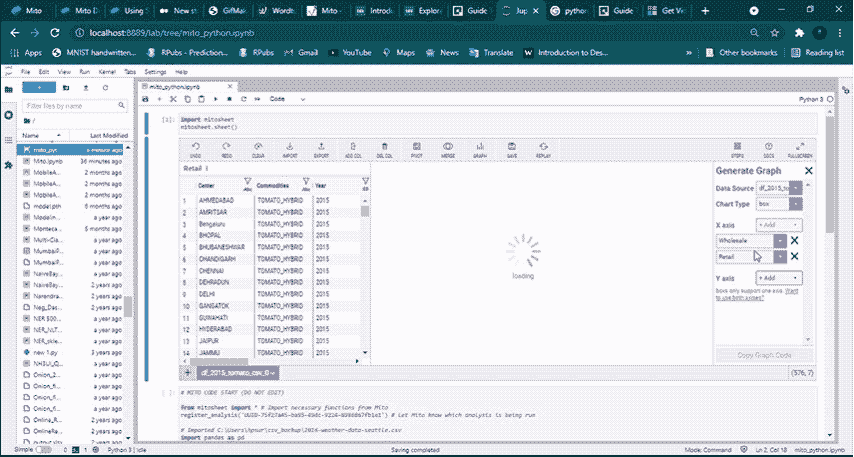
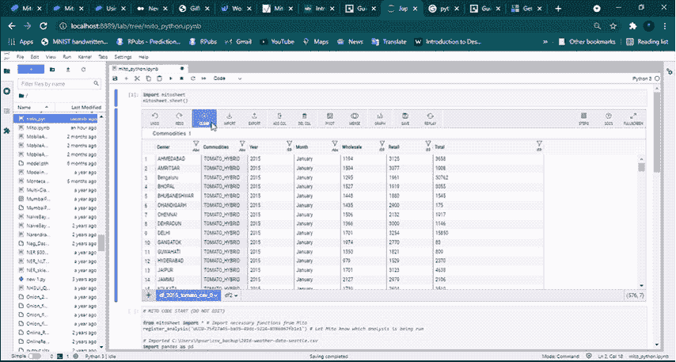
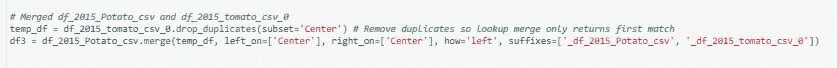

# 使用米托包自动化 Python 数据分析

> 原文：<https://medium.com/mlearning-ai/automating-python-data-analysis-with-the-mito-package-11582c11c282?source=collection_archive---------0----------------------->


Mito . Ref: [https://trymito.io/](https://trymito.io/)

**Excel 赋予您探索、转换和展示数据的能力。所有这一切都离不开朱庇特。**

米托是一个旨在将 Python 分析速度提高 10 倍的电子表格。当您编辑 Mitosheet 时，会为您生成 Python 代码。以下是 Python 中米托包的优点:

1.  **Python 中类似 Excel 的数据透视表**

使用直观的类似 Excel 的界面对您的数据进行分组并计算汇总统计数据。米托还可以让你合并，过滤，图表，等等！

2.**快速分析您的数据**

不要谷歌。没有堆栈溢出。米托为每次编辑生成代码，让您专注于您的分析。

3.**跟踪并交流您的分析**

米托生成自动记录的代码。您可以轻松地跟踪编辑内容、与团队交流以及在单独的数据集上重放您的分析。

以下是借助 Python 中的米托可以完成的数据分析操作类型:

*   探索性制图
*   数据透视表
*   数据帧合并
*   电子表格公式
*   数据探索
*   列过滤

让我们来看看 python 中米托的介绍视频

**Python 中的米托安装:**

1.  通过打开终端并运行`python --version. and also need node.js`，检查您是否拥有 **Python 3.6** 或更高版本

****

**checking python version in command prompt terminal**

**2.首先，打开新的终端或命令提示符。然后，下载米托安装程序:**

****python -m pip 安装 mitoinstaller****

**3.然后，运行安装程序。此命令可能需要一些时间来运行:**

****python -m mitoinstaller 安装****

**4.最后，启动 JupyterLab:**

****python -m jupyter 实验室****

**快速解决方案:当你打开 Jupyterlab 时出现任何错误**

****

**error due node.js**

**要解决这个问题:**

1.  **在这里下载 Node.js 安装程序[，按照提示安装 Node。](https://nodejs.org/en/download/)**
2.  **重启你的终端。**
3.  **重新运行安装命令，它们应该可以正常工作。**

# **MitoSheets 界面**

**在 Jupyter 实验室中，创建一个新笔记本并初始化 Mitosheet:**

```
**import mitosheet
mitosheet.sheet()**
```

**系统将首次提示您输入电子邮件地址进行注册:**

****

**first time signup — mitosheets**

**当您填写完电子邮件和其他详细信息后，GUI 电子表格将会启动。让我们探索这个接口的所有特性，并讨论如何将这些变化转换成 Python 代码。**

# **加载数据集**

**要在 MitoSheets 中加载数据集，只需单击 Import。那么你将有两个选择:**

1.  ****从当前文件夹添加文件:**这将列出当前目录中的所有 CSV 文件，您可以从下拉菜单中选择它们。**
2.  ****通过文件路径添加文件:**这将只添加特定的文件。**

**请参见下面短片中导入 csv 文件的操作**

****

**Importing CSV files and it’s python code created by mito automatically**

**让我们根据米托功能尝试不同的操作:**

****探索性绘图:****

**有许多用于可视化分析数据的内置选项—条形图、直方图、箱线图、散点图**

****

**Different graphs using the data imported**

****透视表:****

**数据透视表是一个重要的 excel 函数，它根据一个或多个分类特征汇总数字变量。要使用米托创建这样一个表，**

1.  **单击“Pivot”并选择源数据集(默认情况下，CSV 已加载)**
2.  **选择数据透视表的行、列和值列。您还可以为值列选择聚合函数。总和、平均值、中值、最小值、最大值、计数和标准差等所有选项都可用。**
3.  **在选择了所有必需的字段之后，您将得到一个包含数据透视表实现的单独的表。**

****

**Pivot table**

****数据帧合并:**确保导入了 2 个数据帧。**

**合并数据集是数据科学项目的重要组成部分。通常，数据集被划分到不同的表中，以提高信息的可访问性和可读性。在 Mitosheets 中合并很容易。**

1.  **点击“合并”并选择数据源。**
2.  **您需要指定合并应该使用的键。**
3.  **您还可以从数据源中选择合并后要保留的列。默认情况下，所有列都将保留在合并的数据集中。**

****

**Dataframe merging**

****

****电子表格公式:**您可以像在 excel 表中一样在列中添加公式。下面的视频演示了如何在 mito 中添加电子表格公式**

****数据浏览:**可以选择列，选择汇总统计量，将显示该列的统计量**

****列过滤:**我们可以在每一列中进行过滤，并执行必要的操作**

# **结论**

**已经向您介绍了一个新工具“米托”，它允许您在 Python 环境中轻松实现类似电子表格的功能，并接收等效的 Python 代码。该教程解释了如何安装米托，如何调试其安装，以及如何使用其功能。**

**如有任何问题或疑问，请随时联系我**

**参考:**

 **[## 米托

### 编辑描述

trymito.io](https://trymito.io/)** **[](https://www.analyticsvidhya.com/blog/2021/06/exploring-mito-automatic-python-code-for-spreadsheet-operations/) [## 米托-用于电子表格操作的自动 Python 代码

### 米托是一个 Jupyter-Lab 扩展和 Python 库，使得在电子表格中操作数据变得非常容易…

www.analyticsvidhya.com](https://www.analyticsvidhya.com/blog/2021/06/exploring-mito-automatic-python-code-for-spreadsheet-operations/) 

通过 [Linkedin](https://www.linkedin.com/in/sureshhp/) 和 [Medium](https://hpsuresh12345.medium.com/about) 与我联系，获取新文章和博客。

— — — * — — — * — — — * — — — * — — — * — — — * — — — * —

*“培养学习的热情。如果你这样做了，你将永远不会停止成长*

— — — * — — — * — — — * — — — * — — — * — — — * — — — * —**