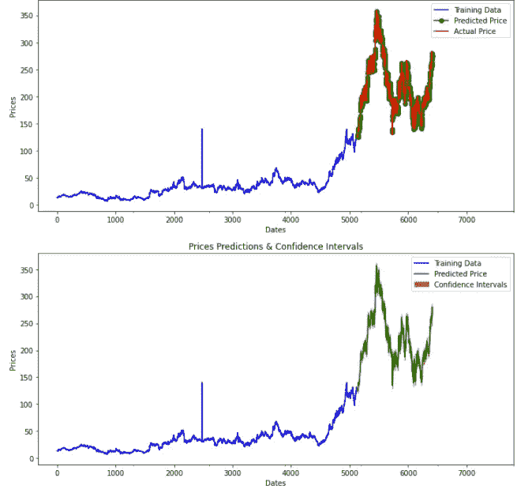

# 自动化时间序列预测

> 原文：<https://medium.com/mlearning-ai/automating-time-series-forecasting-ae74190408be?source=collection_archive---------0----------------------->

使用 PMDArima 进行时间序列预测

PMDArima(Source: By Author)

时间序列预测是机器学习和深度学习的重要应用之一。有多种模型可用于时间序列预测，如 Arima、Prophet、Holt-Winters 等。可以使用多个 Python 库来加载和使用这些模型，但是它们不是用户友好的，并且难以使用。