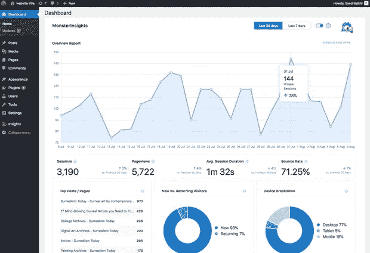
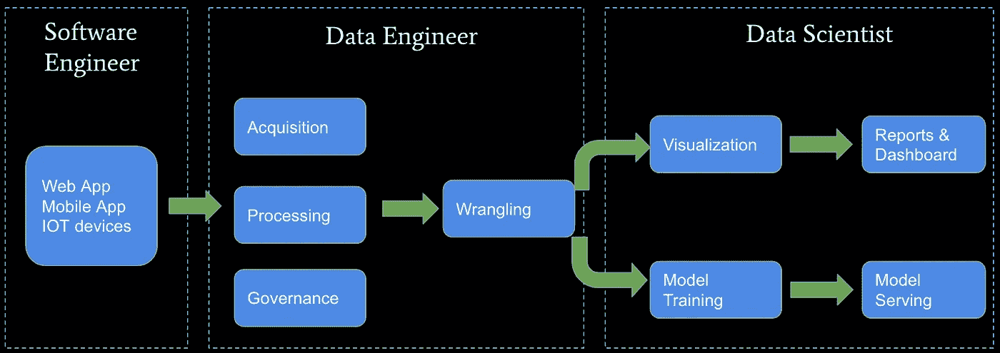
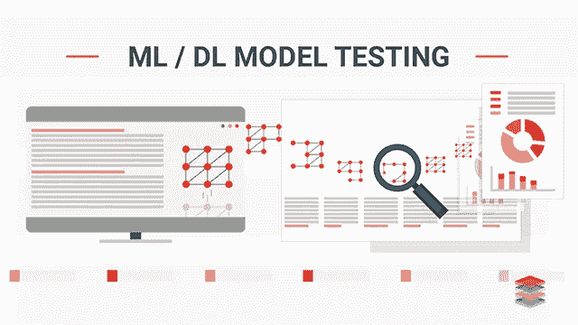

# 自动化可能会部分吞噬数据科学——以下是您可能应该做的事情

> 原文：<https://medium.com/mlearning-ai/automation-may-swallow-data-science-partially-heres-what-you-should-probably-do-d8865f028d23?source=collection_archive---------1----------------------->

自动化对全球所有行业都有重大影响。从制造业到 IT 行业，任务的自动化让公司以更少的投资创造更多的利润，这让人们失业。在过去的几年里，即使是最热门、最受关注的话题“机器学习”也被自动化所取代。像 [AutoML](https://cloud.google.com/automl) 、 [H20.ai](https://www.h2o.ai/) 这样的服务，只需要你的基本配置和数据，给你一个优化的 ML 模型。虽然 ML 不会像我们想象的那样灭绝，但是大公司会投资这些服务来获得最大收益，不像相对较小的公司。但是机器学习只是数据科学的一部分——这些是你可以关注并留在该领域的东西。

**分析学**

Visualization dashboards are generated by Data Analysts and are the key to understanding data and business problems.

分析需要分析师执行分析，生成仪表板和报告。所有的业务决策都是基于这些报告进一步做出的。这里的问题是，转换和分析完全取决于问题、数据集和数据类型。因此，它没有特定的“算法”来实现自动化。新手经常忽略分析，直接跳到生成 ML 代码。首要的事情是理解业务问题和所提供的数据。您可能需要执行数据处理、清理等操作，以便从原始数据中获取更有意义的数据集。请记住，ML 只是一种算法，没有魔力——这意味着更好的数据会给出更好的预测。

**数据工程**

Data Transformations is one of the prime factors in the Analytics process. Generating new features and ensuring the quality of available data is essential at all times.

数据工程是之前讨论的分析的一部分，在实际的机器学习过程之前，您需要执行数据集的准备。这包括特征工程、数据清理、数据处理等。与分析类似，这需要了解业务问题和所提供的数据，以了解要执行的操作。同样，这完全取决于数据集。这是生成精确 ML 模型的重要因素之一。

**整合**

Software Products often contains ML integrated into them or on the server-side.

产品公司往往要求既有 ML 知识又有软件工程知识的人。原因是他们将 ML 集成到他们的产品中，因此需要人们知道 ML 模型集成到用户应用程序或服务器中。再次如前所述，很少有巨头会转向自动 ML 模型生成，而在其他情况下，你将有机会在实践中处理 ML。这里的问题是，这样的组织期望人们除了数据科学之外，还拥有部署/集成技能和软件工程技能。

**测试**

The “High-Accuracy” model is just a technical term — The performance of the model in the real world data is the case to be handled.

模型生成后，需要进行大量的测试，以确保模型在现实生活中的表现符合预期。这需要测试工程师研究业务问题并生成测试用例。测试用例的生成对于每个业务问题来说都是独一无二的，不能那么容易地自动化。测试框架使用所有用例场景测试模型，包括现成的案例，以观察模型在这种场景下的表现，并修复任何异常(如果有的话)。

**研究**

Research in AI focuses on improving existing algorithms or developing new efficient ones for various tasks.

研究在数据科学领域有足够好的范围。随着每天都有创新出现，从事研究实际上会帮助你留在这个领域，学到比全职工作更深的东西。由于它的趋势性和对算法发展的关注，这一领域的研究有很大的潜力。

感谢您的阅读！！！

**有用链接**

在 LinkedIn 上找我:【https://linkedin.com/in/vishnuu0399 

更多地了解我:https://bit.ly/vishnu-u