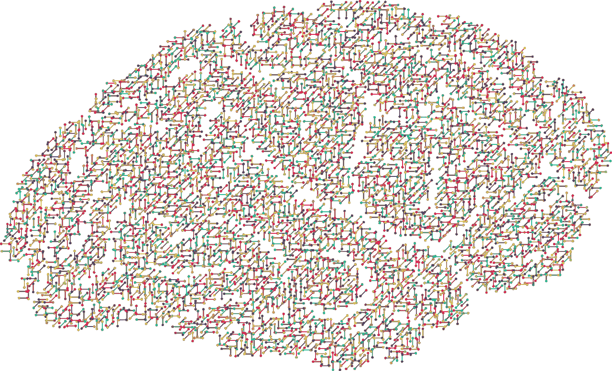
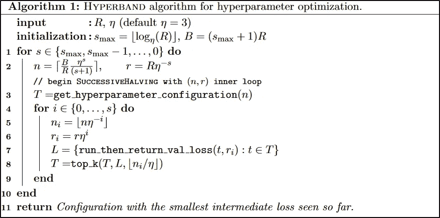

# 具有连续半调和超带的 AutoML

> 原文：<https://medium.com/mlearning-ai/automl-with-successive-halfing-and-hyperband-e130a05dded9?source=collection_archive---------3----------------------->

[pixabay.com](https://pixabay.com/de/vectors/sch%c3%a4del-kopf-mensch-m%c3%a4nnlich-mann-2099083/)

在我的上两篇中型文章(参见[自动机器学习和超参数优化](/mlearning-ai/automated-machine-learning-and-hyperparameter-optimisation-f33be5eb6901)和[黑盒和贝叶斯优化](/@sabrinaherbst/blackbox-and-bayesian-optimisation-d651295199de))中对自动机器学习(AutoML)进行了简短介绍后，我想继续讨论由李等人[1]开发并于 2017 年发表的超波段算法。

根据他们的说法，高效的自动化机器学习可以通过两个主要目标来实现:

1.  **配置选择**。在配置选择方法中，我们试图通过找到一种在非常早期阶段预测配置的估计性能的方法来加速 AutoML 算法，并投资于测试更有希望的配置(与例如网格搜索相反，在网格搜索中测试所有配置)。配置选择方法的一个非常常见的例子是贝叶斯优化。
2.  **配置评测**。在配置评估方法中，为模型评估分配了一定量的资源。因此，更多的资源将被给予有希望的解决方案，而不太有希望的解决方案将只能获得更少的资源，并将尽快被删除。连续半化[2]和超带算法[1]就是这种方法的例子。

# 连续半减

连续半化是由 Jamieson 等人[2]在 2016 年提出的。该算法代表了用于调整超参数的相对简单和鲁棒的方法。下面的信息摘自各自的论文，要了解关于连续半化的更多信息，我会将您重定向到该论文。

在连续半化中，一定量的资源被给予一组模型配置。然后对这些进行训练和评估，最差的一半(因此，连续的*半化*)被丢弃。在下一轮中，分配更多的资源来训练和评估剩余的模型。重复这一过程，直到只剩下一个配置。

作者用类似的超参数优化方法测试了他们的方法，包括统一分配策略(例如网格搜索)。尽管统一分配策略训练的模型只有连续半化的一半，但他们能够证明连续半化在更短的时间内返回可比较的结果。

## 改进的潜力

虽然连续的半化已经产生了好的结果，但是仍然有一些改进的空间。

根据给定的最大似然问题(以及所使用的算法)，应该考虑测试哪一个更好

*   *更多的配置，花费更少的资源来培训它们*或者
*   *更少的配置，但在培训模型上花费更多的资源* [1]。

这就是超波段算法试图解决的问题。

# 超波段

超波段算法是一种相对容易理解和简单的算法。它类似于随机搜索的更高级版本。以下资料可在李等[1]中找到。

下面的截图显示了 Hyperband 算法的伪代码。

Screenshot taken from Li et al. [1], p.8

该算法采用以下两个输入，并返回单个(到目前为止)最佳配置。

*   **R** 是用于一个单一配置的最大资源量
*   **η** 控制在每一轮连续半化中将移除多少模型(作者建议使用 3 或 4，因此*半化*在这里不一定适用)

可以看出，该算法由两个嵌套的 for 循环组成。**内**执行连续半模。在 Hyperband 中，连续半化算法基本上作为一个子程序调用，除了在每一轮中丢弃的配置数量之外，没有重大调整。

**外层**迭代不同值的 **n** (每轮连续半化中评估的配置数量)和 **r** (用于训练模型的资源数量)。这正是解决在连续对半中描述的问题，即在用很少的资源训练许多模型之间找到平衡，反之亦然。

此外，可以看出，该算法实现了三个附加功能。

*   **get _ hyperparameter _ configuration s**:返回 *n* 模型和超参数配置(可以随机选择，也可以遵循一定的分布)。
*   **run _ then _ return _ val _ loss**:使用一些训练数据训练给定的模型，并在验证集上评估模型的性能。然后返回验证损失(一些任意的性能度量)。
*   **top_k** :根据验证损失返回给定配置集的前 *k* 个配置。

可以观察到的是，hyperband 的优势之一是停止将资源投入到没有前景的配置中，而是使用它们来探索更有前景的配置。因此，Hyperband 实现了一种提前停止的方法，从而提高了性能。

李等人[1]进行了一些实验，并观察到，当将 Hyperband 与流行的贝叶斯优化技术进行比较时，Hyperband 通常快 5 到 30 倍。这些观察是对深度学习和基于内核的技术进行的。

很容易看出，该算法可以并行运行，因为不同配置的训练和评估可以彼此独立地进行。

此外，除了随机抽样，还可以采用有利于更有希望的解决方案的技术。例如，这包括元学习。元学习试图通过例如比较数据集的属性来整合关于以前的数据集及其高性能解决方案的信息，以“热启动”对最佳模型和超参数的搜索。

[1]李等 [Hyperband:一种新的基于 bandit 的超参数优化方法。](https://dl.acm.org/doi/abs/10.5555/3122009.3242042) *J .马赫。学习。18，1:6765–6816。2017.*

[2] Jamieson 等[非随机最佳臂识别和超参数优化。](https://proceedings.mlr.press/v51/jamieson16.html) *第 19 届人工智能与统计国际会议论文集*，PMLR 51:240–248，2016。

 [## Mlearning.ai 提交建议

### 如何成为 Mlearning.ai 上的作家

medium.com](/mlearning-ai/mlearning-ai-submission-suggestions-b51e2b130bfb)