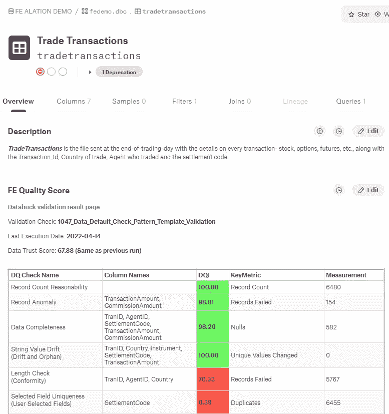

# 数据目录的自主数据信任分数

> 原文：<https://medium.com/mlearning-ai/autonomous-data-trust-score-for-data-catalogs-cc647776f586?source=collection_archive---------8----------------------->

自动为数据目录中的每个数据资产分配数据信任分数

Photo by [Sara Kurfeß](https://unsplash.com/@stereophototyp?utm_source=medium&utm_medium=referral) on [Unsplash](https://unsplash.com?utm_source=medium&utm_medium=referral)

随着数据目录作为企业数据治理的核心组件被越来越多地采用，提供关于数据资产的健康和可用性的信息的需求变得至关重要。随着数据目录中标准化数据信任分数的可用性，用户可以轻松确定数据集在其特定用例中的可用性和相关性。

# 为什么数据治理团队应该关心数据信任分数？

当处理数据时，想到的一个关键问题是，“数据的质量是否符合我的目的？”从事高级用例工作的数据科学家需要对他们使用的数据充满信心。关于数据质量、数据血统和负责人(例如，数据管理员或数据所有者)的信息是有助于在数据集中获得信任的三种信息。有了这些信息，更有可能使用合适的数据源，而可能产生错误结果的不合适的数据源可以被避免。

数据质量和信任是最有效利用数据的关键。数据越准确，结果越好。衡量数据的准确性至关重要，以保证利益相关者和自动化系统根据可靠的信息做出决策。

数据信任分数是在任何数据使用或交换过程中表示信任程度的单一数字。数据信任分数可以作为现代目录中存在的信息不对称问题的解决方案。数据的消费者和生产者并不拥有与数据有用性相关的相同信息。

数据信任分数通常根据应用于数据集中各个列的某些数据质量维度来计算。然后将这些分数组合起来，计算整个数据集的总质量分数。综合得分是所有列得分的平均值。

数据质量是在任何组织中实现大规模和更好地使用数据的必备要素。通过在目录中添加数据质量信息，用户无需切换上下文就可以获得关于数据的见解。数据目录用户经常发现需要数据质量信息和数据资产的其他元数据[1]。

虽然不是数据质量工具，但是数据目录可以帮助企业提供数据质量信息[2]。大多数目录提供与专用数据质量平台的供应商中立集成，因此允许数据目录搜索功能首先显示更高质量的数据。具有高分数的数据资产被提升，这表示良好的数据质量。使用和公司认证等其他指标也可以引导目录用户获得最高质量的数据资产。

# 如何计算数据信任分数？

可以基于数据质量规则上的加权平均数据质量分数来计算数据信任分数。进步的组织沿着数据质量维度对数据质量规则进行分类。然后为每个维度计算信任分数，然后使用加权平均方法对数据集进行汇总。

●完整性:它决定了上下文重要字段的完整性。

●一致性:数据集应包含相关数据，并遵循一定的规则或模式。这个数据质量维度决定了符合上下文重要字段的模式、长度和格式。

●唯一性:这个维度决定了单个记录的唯一性。主键对于区分不同的数据值和记录以避免重复非常重要。

●一致性:确定列间关系的一致性(如任职日期必须在退休日期之前)。

●漂移:从历史信息中确定关键分类和连续字段的漂移。

●异常:可以确定关键列的量和值异常。

# 将数据信任分数纳入数据目录的挑战

首席数据官(CDO)推动整个组织的数据战略。他们负责维护数据质量。数据资产的数量正在快速增长，数据团队正在努力跟上，因为现有的数据验证方法是资源密集型的、耗时的、昂贵的，并且对于数千个数据资产来说是不可扩展的。业务涉众经常在他们的报告和仪表板中反复发现错误，这导致了对数据的不信任。

通常，数据团队在将数据质量集成到数据目录中时会遇到以下操作挑战:

●分析数据并咨询主题专家以确定需要实施哪些数据质量规则非常耗时。数据质量分析师不熟悉从公共或私人第三方获得的数据资产。他们需要与主题专家广泛接触，以建立数据质量标准

●规则的实施具体到每个数据集/表。因此，工作量与数据目录中的表/桶/文件夹的数量成线性比例。

●现有开源工具/方法的审计跟踪能力有限。为法规遵从性需求生成规则执行结果的审计跟踪通常需要数据工程团队花费时间和精力。

●维护已实现的规则很麻烦。

# **为什么利用机器学习？**

ML 模型可以从海量数据中学习，发现隐藏的数据模式。此外，随着新数据的变化，他们会加班加点地对其进行培训。使用 ML 计算数据信任分数有几个优点:

●机器学习有助于客观地确定数据模式或数据指纹，并将这些模式转化为数据质量规则。

●然后，机器学习可以使用数据指纹来检测不遵守规则的交易。

●实施 ML 方法有助于快速评估数据健康状况。

● ML 通常比人工驱动的数据质量分析更全面、更准确。

更重要的是，当信任分数由数据的消费者分配时，该分数变得容易受到与底层数据资产的生产者相同的隐藏甚至伪造信息的诱惑。基于机器学习的数据信任分数消除了人为偏见，并提供了生产者和消费者都同意的客观分数[3，4]。

# 数据目录的自主数据信任分数—示例

在以下示例中，使用基于机器学习的方法来计算数据目录中注册的每个数据资产的数据信任分数。然后，使用如下所示的标准化数据质量维度呈现分析结果，并使用标准 API 将其嵌入数据目录中。

数据质量分析摘要中显示的数据信任分数显示了最近两次分析之间质量分数的变化。发现的每个违规都可以双击查看更多信息:

●展开维度以查看哪些列在数据资产级别受到影响。单击列名可查看该列的维度详细信息。

●在列级别，单击维度名称了解更多详细信息。

这为目录用户提供了关于数据集在其用例环境中的适用性/可用性的足够信息。

 [## Mlearning.ai 提交建议

### 如何成为 Mlearning.ai 上的作家

medium.com](/mlearning-ai/mlearning-ai-submission-suggestions-b51e2b130bfb)