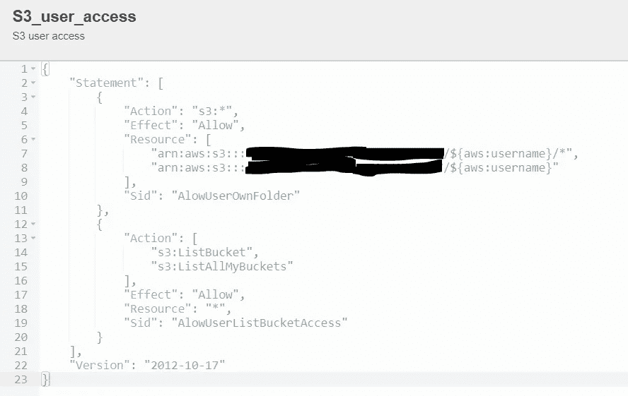
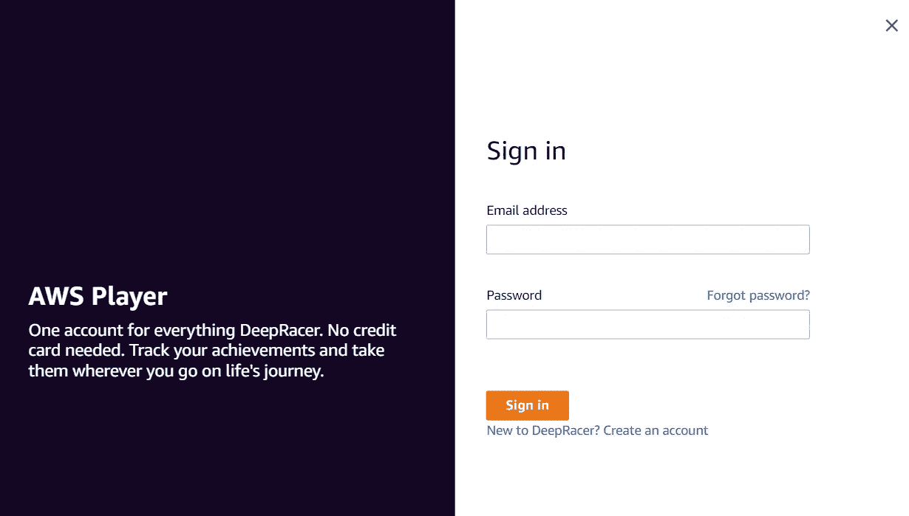

# AWS Deep Racer 活动主办—设置

> 原文：<https://medium.com/mlearning-ai/aws-deep-racer-event-hosting-setup-7995b325ed3b?source=collection_archive---------3----------------------->

AWS Deep Racer cars on a physical track

我是 Mark Ross， [Atos](https://atos.net/en/) 的首席云架构师，专门研究 AWS。我从 2021 年开始担任 [AWS 大使](https://aws.amazon.com/partners/ambassadors/?cards-body.sort-by=item.additionalFields.ambassadorName&cards-body.sort-order=asc&awsf.apn-ambassadors-location=*all)，并于 2022 年加入 [AWS 社区建设者](https://aws.amazon.com/developer/community/community-builders/community-builders-directory)计划。我已经建立了一个关注 AWS 的社区，对培训、认证以及与我们的客户合作使用 AWS 技术感兴趣，这是我们的 Atos AWS 培训中心。我们最近的活动是 AWS [Deep Racer](https://aws.amazon.com/deepracer/) 竞赛，让同事们能够以有趣和游戏化的方式动手学习一些[强化学习](https://en.wikipedia.org/wiki/Reinforcement_learning)。

AWS Deep Racer 提供了在 AWS 云中训练增强模型绕赛道比赛的机会。你开发了一个基于[奖励函数](https://docs.aws.amazon.com/deepracer/latest/developerguide/deepracer-reward-function-reference.html)的模型，它鼓励汽车做出能给它更多奖励的行为，并阻止它做出能给它更少/没有奖励的行为。您不是在定义输出，而是在定义模型应该使用的指导原则。因此，奖励保持在赛道上，开得更快，不要转得太快可能都是有用的策略。我相信任何有宠物或小孩的人都会有同感。影响模型的另一个主要方面是[超参数](https://docs.aws.amazon.com/deepracer/latest/developerguide/deepracer-console-train-evaluate-models.html#deepracer-iteratively-adjust-hyperparameters)。超参数影响模型训练的速度，这与模型的准确性存在争议，因为在优化和探索之间往往存在权衡。模型优化与“精益”原则的工作方式没有什么不同，你可能会获得增量收益来优化现有流程，但它不会带来惊人的新发现，从而可能从根本上改变你的工作方式或行业。

为了举办您自己的深度赛车活动，您需要提供一个供人们使用的环境。幸运的是，随着 [AWS Deep Racer 多用户模式](https://docs.aws.amazon.com/deepracer/latest/developerguide/multi-user-mode.html)的发布，举办活动的能力得到了极大的提高，这消除了向人们发放个人 AWS 帐户的需要，以及随后设置和关闭的所有令人头痛的问题，因为即使在 AWS 组织内，对一个月内可以关闭的帐户百分比的限制也是一种痛苦。

要使用多用户模式，只需要一个 AWS 帐户。在该帐户中，每个用户都需要能够访问该帐户，并具有适当的权限。选项包括该帐户中的 IAM 用户，或者如果您在企业环境中运行该功能，您可以承担该帐户中的角色，例如通过使用 [AWS Identity Centre](https://aws.amazon.com/iam/identity-center/) (以前称为单点登录)。使用 AWS Deep Racer 所需的权限通过 AWS 托管策略(awsdeepracerdefaultmultiuseracess)提供，但如果您使用的是 [IAM 用户](https://aws.amazon.com/iam/)，您可能还需要添加另一个 AWS 托管策略来允许用户管理他们的密码(IAMUserChangePassword)。由于我们的活动是一个混合活动，有一轮虚拟使用，然后是现场活动，我还想让人们提前向我们提供他们的模型，以便在当天更容易安排每个人的圈数。为此，我创建了另一个策略，向我创建的共享的 [S3 桶](https://aws.amazon.com/s3/)授予权限，但仅限于用户的 IAM 用户名的子文件夹。该策略使用${aws:username}，因此不需要为每个用户创建它们。

S3 Bucket policy for users to be able to upload models — S3 bucket name has been obfuscated

要启用多用户模式，您需要导航到 us-east-1 中的 AWS Deep Racer 控制台(该服务仅在撰写本文时存在)，在右侧有一个“多用户管理”部分。您必须使用具有足够 AWS 权限的帐户来设置此功能，AWS 管理的策略可以提供此功能(AWSDeepRacerAccountAdminAccess)。如果您打开设置，会有一个直观的屏幕，引导您在 AWS 帐户中启用该功能，以及您可以与参与者共享的示例电子邮件邀请。启用后，您还可以在“监控使用情况”部分查看已使用的培训时间和花费的时间。在这一部分，您还可以控制向参与者提供的“赞助”水平，包括他们可以接受多少小时的培训(目前费用为 3.5 美元/小时)以及他们可以存储多少模型(目前费用为 0.023 美元/GB 月)。需要注意的一点是，在有人注册之前，您不能设置赞助级别，也不能设置您自己的客户默认级别。每个参与者从 5 个小时和 3 个模型开始，周期性地你会想要进去并设置你想要提供的任何东西，因为 Deep Racer 没有 API，所以你不能基于事件自动完成。

我认为尽可能自动化设置是明智的。由于缺乏 API，深层的赛车元素无法自动化，但其他一切都可以。我使用了一个微软表格(我们是 Office365 用户)来获取感兴趣的参与者的电子邮件地址。然后，我在我的 [GitHub 仓库](https://github.com/markjamesross/deep-racer-event-setup)中创建了代码形式的基础设施并将其开源，以自动创建除深度赛车配置之外的所有内容。我使用电子邮件地址作为 IAM 用户名(将它们添加到 repo 中的变量文件将允许您部署它们)。运行代码会创建所有需要的权限和模型存储的 S3 存储桶，然后转储 IAM 用户名和密码，供您分发给参与者。我使用 CSV 输出，将其转换为 Excel 表格，然后最终可以用作邮件合并的数据源(我尝试使用 [AWS SES](https://aws.amazon.com/ses/) ，但我的参与者不在我的帐户已验证的域中),以发布这些详细信息以及我们活动的说明，以及一些计费警报，这样您的活动就不会在成本方面失控。

一旦您的参与者获得了他们的证书，或者您允许他们在您的帐户中担任角色，用户体验就非常简单了。他们应该登录到 AWS 帐户(或者承担角色，如果不使用我提供的代码)并导航到 us-east-1 中的 Deep Racer 控制台。因为启用了多用户，并且为他们分配了 awsdeepracerdefaultmultiuser access 策略，所以他们会看到登录 Deep Racer 的提示。注意—这是一组与他们的 IAM 凭据不同的权限，并且特定于 Deep Racer(他们可以在其他地方获得，并在以后的其他 AWS 帐户中使用)。由于上述 API 的缺乏，这些帐户无法预先创建，因此您需要让参与者通过“登录”按钮下方的链接创建他们自己的帐户。快速注册过程和代码发送到他们的电子邮件地址进行验证，应该会导致访问被授予。

一旦登录，参与者将能够使用 Deep Racer，但是他们的权限将限制他们只能看到自己的模型，并阻止他们更改多用户设置，如更改赞助使用量。他们将能够创建汽车，模型，运行评估和提交模型到虚拟比赛。

下次请加入我，我将概述如何建立一个虚拟比赛，并详细介绍我们的比赛进展情况！这个系列的第二部可以在这里 查看 [*。*](https://markrosscloud.medium.com/aws-deep-racer-event-hosting-virtual-racing-5a5cd312d90d)

 [## Mlearning.ai 提交建议

### 如何成为 Mlearning.ai 上的作家

medium.com](/mlearning-ai/mlearning-ai-submission-suggestions-b51e2b130bfb)