# AWS 深度赛车活动主办-虚拟赛车

> 原文：<https://medium.com/mlearning-ai/aws-deep-racer-event-hosting-virtual-racing-5a5cd312d90d?source=collection_archive---------3----------------------->

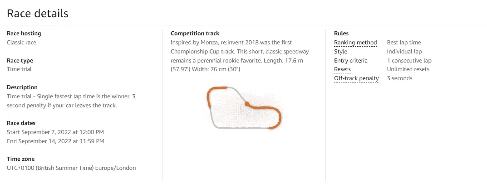

Details of our recent virtual race

这是我关于 AWS Deep Racer 的三部分系列的第二部分。如果你已经直接到达这里，这个系列的第一部分可以在这里查看，主要包括使用多用户模式在单个 AWS 帐户中设置 AWS Deep Racer。我建议你先读一下，然后再回来读虚拟赛车。

一旦你的参与者有机会进入 AWS Deep Racer，你就会想为他们创建一个比赛，让他们进入游戏化的一面。要举办一场虚拟比赛，你需要一个有管理员权限的人进入深度赛车控制台，导航到左侧的“赛车联盟”，然后是“社区比赛”。然后你应该可以在右边选择“创建种族”,这将为你提供虚拟种族格式的各种选项。

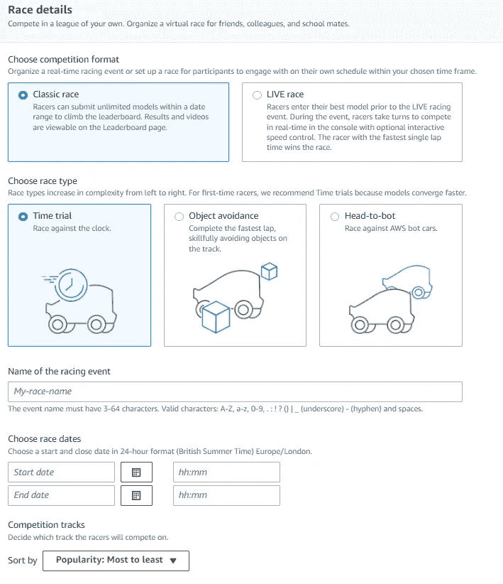

Options for a virtual race

在现有的选项中，我建议考虑一下这是否是一个系列赛的一部分，是否会包括一场面对面的比赛，以及你的选手以前在 Deep Racer 中的经验水平。例如，我们的虚拟比赛是为大多数从未使用过 Deep Racer 的参与者设计的，是一场面对面决赛的“资格赛”。我们选择举办一场“经典比赛”,因为人们可以设定时间，然后调整模型以设定最快圈速，让他们有机会为现场活动找到一些真正优秀的模型。如果你的比赛是一次性的，没有后续行动，你可能更喜欢“现场比赛”，允许你安排一个视频会议，所有人一起观看比赛。我们选择“计时赛”作为新参赛者最简单的比赛，因为它符合我们的个人比赛计划，但如果你为有丰富经验的人举办比赛，你可能需要选择一个替代方案。然后你可以选择你的虚拟事件运行的时间段，尽管值得注意的是人们不能在比赛开始前提前加入比赛，他们只允许在比赛时间段开始后加入。

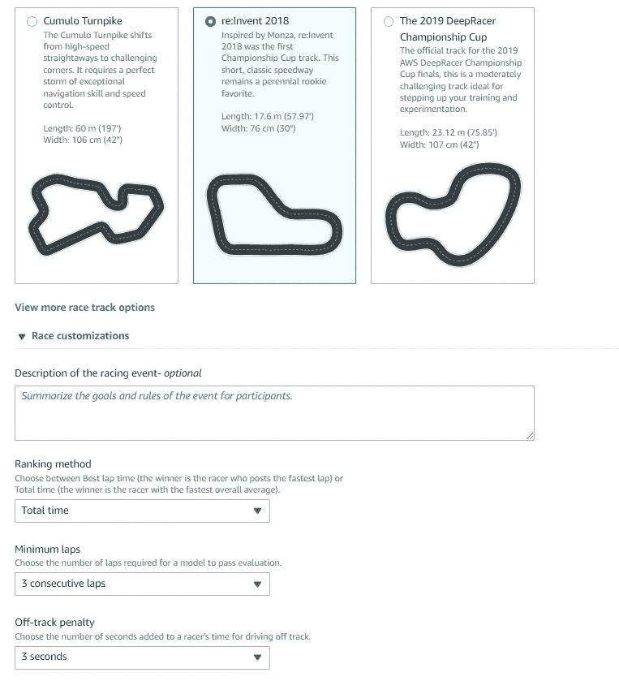

Further options for a virtual race

选择您的赛道，如果您计划进行一次面对面的跟进活动，该赛道应该与将在那里使用的赛道相同，然后选择您将如何对时间、圈数和偏离赛道的处罚进行排名。一旦你创建了它，你应该有一个超链接，你可以用来与你的参与者分享，加入你的虚拟比赛。

我强烈建议举行一次活动启动会。对于新手来说，机器学习和强化学习的介绍对于帮助理解概念是必不可少的，一旦用简单的术语和一些类比来表达，强化学习的高级概念很快就会被理解。我们的参与者从 AWS 获得了关于一般机器学习、强化学习、奖励函数和 Deep Racer 中超参数的概述。作为一个养狗的人，我认为这是我最喜欢的幻灯片。

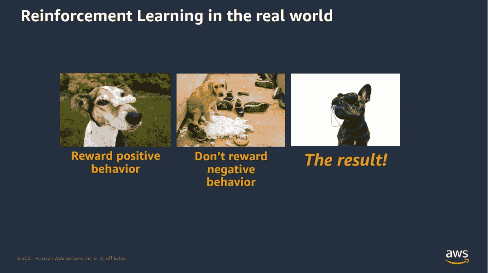

AWS slide on reinforcement learning in the real world

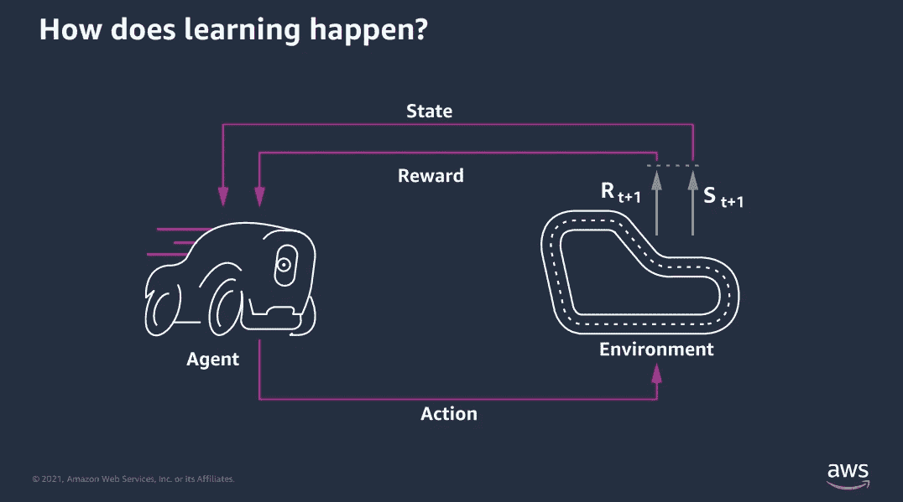

AWS conceptual overview of model training

AWS 深度赛车模型行为受奖励函数和超参数的影响。

奖励函数是用 python 写的，例子可以在[这里](https://docs.aws.amazon.com/deepracer/latest/developerguide/deepracer-reward-function-examples.html)找到。奖励函数可以从汽车中获取一些输入参数，它们可以在[这里找到](https://docs.aws.amazon.com/deepracer/latest/developerguide/deepracer-reward-function-input.html)。这些参数包括车辆的当前速度、它在赛道上的位置、赛道周围的进度等等。这些可以通过导入 python 模块来补充，例如时间、数学等可能对更复杂的模型有用。我见过一些极其复杂的模型做得很差，一些极其简单的(就代码行数而言)做得极好，反之亦然！需要注意的重要一点是，你是在编码奖励某个结果的东西，而不是编码一个精确的动作，这样模型就能够解决像驾驶这样的复杂问题，而不需要成千上万行代码。

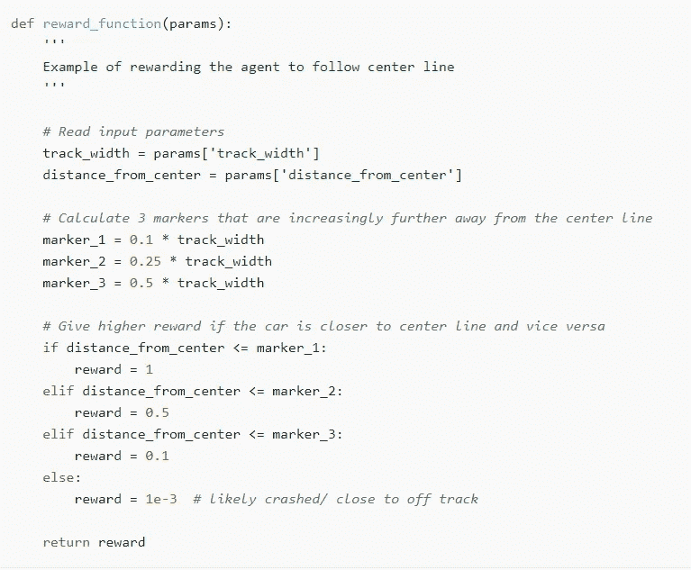

Simple reward function from AWS examples

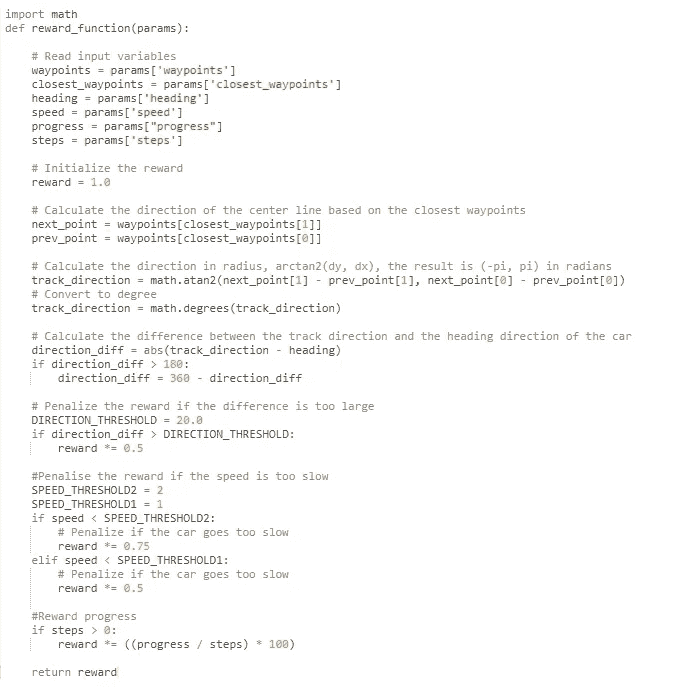

More complex reward function importing math and calculating direction in relation to the track using waypoints and progress

超参数会影响模型的训练方式。这篇文章不应该教你机器学习的内部工作原理，我也不是数学家博士，所以如果你想真正理解内部工作原理，我建议你参加一门课程。一个以 AWS 为重点的例子是[云专家 AWS 机器学习专业](https://acloudguru.com/course/aws-certified-machine-learning-specialty)课程，因为认证课程涵盖了机器学习理论以及 AWS 服务实现，所以该课程提供了一个很好的概述。一般来说，你正在调整这些超参数，以支持探索(在我们的例子中，探索轨道，尝试并找到一种方法来最大化回报)，或开发(完善并在工作轨道周围的路径上获得增量收益)。在页面的“信息”部分有配置它们的说明。

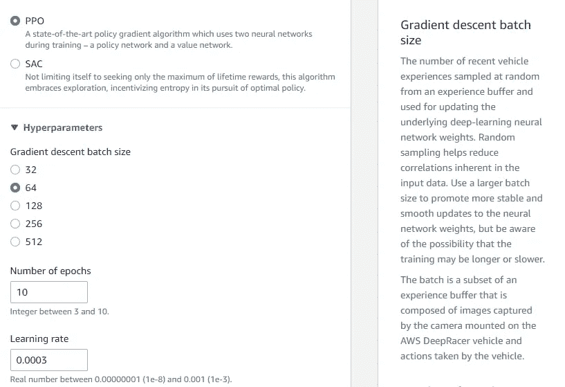

Sample of hyperparameter options and associated explanation in the AWS console

沟通你想让参与者用什么样的车和赛道来训练是很重要的，特别是如果你想接着进行一场面对面的比赛。由于赛车在训练中正在学习一条赛道，如果你在比赛中把它移到另一条赛道上，它的表现不会很好。同样，如果你的赛车是单摄像头/无激光雷达，那么用双摄像头/激光雷达车进行训练是没有好处的。

告诉人们如何在你的虚拟比赛中加入一个模型也很重要。虽然你已经提供了一个超链接给参与者，正如我之前描述的，他们可以用来注册，他们仍然需要提交他们的个人模型到你的比赛中。不幸的是，目前深赛车控制台不提供最直观的方式做到这一点，在两个不同的地方！首先，当创建模型本身时，用户有机会“自动提交到深度赛车联盟”，这是参与者可以提交他们的模型到错误比赛的第一个地方，你会希望他们取消选择该选项，否则他们将进入一个完全不同的赛道上最有可能的公共比赛！

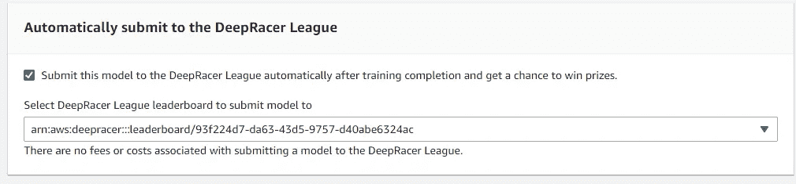

First place to submit to an AWS public race, rather than your private race!

参与者可能进入错误比赛的第二个地方是在模型训练之后。有一个很好的按钮，名为“提交到虚拟比赛”，不幸的是，这又一次让参赛者走上了一条进入公共比赛的道路，很可能是在一条完全不同的赛道上！

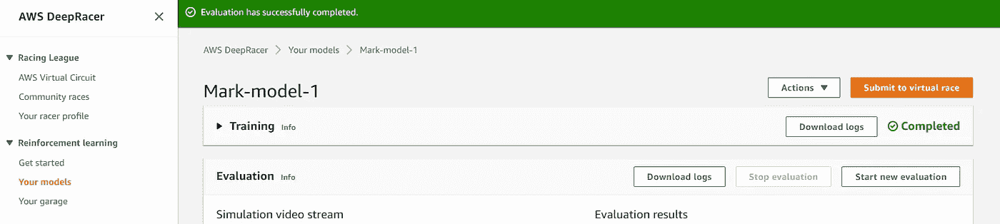

Second place to submit to an AWS public race, rather than your private race!

为了确保参与者参加您的比赛，最好建议他们在通过您提供的超链接注册后，导航到比赛联盟->社区比赛，然后向下滚动找到正确的比赛。

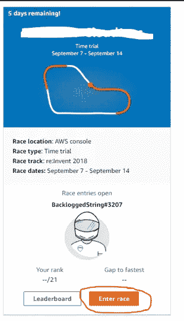

Entering your private virtual race

然后，屏幕应该显示事件，并带有一个下拉列表，供他们选择合适的型号。

Enter race screen with drop down list for model selection

在虚拟比赛中，思考如何与参与者交流和互动是非常重要的。由于我们是 Office 365 用户，我安排了一个微软团队，他们有发布公告和问答的渠道，所以参与者可以去某个地方获取参考信息或我们像启动活动一样进行的电话录音。为了保持兴趣，我一直在更新。还有几天，还有一天的总结和当前领先圈的视频，可以从领先板屏幕下载(视频运行时右键单击并保存)是我经常发的帖子。我在虚拟比赛期间的不同时间点安排了一些“手术”,这样参与者可以在开始时获得帮助，解决问题或就如何调整他们的模型提出建议。正是在这些手术中，我上面描述的问题，比如提交一个模型给公众竞赛，暴露了出来。此外，人们在大约一个小时后遇到了权限问题，这与会话超时有关。通过“你的赛车手档案”或完全退出 AWS 控制台注销和重新登录通常可以做到这一点，尽管一个不幸的参与者丢失了他们当时在控制台创作的复杂奖励功能，所以如果你正在创建一些复杂的东西，可能值得在 Deep Racer 奖励功能屏幕外创建并粘贴它。

总的来说，我们的虚拟比赛是成功的，为我们的现场比赛做好了准备。我们对 85 名参与者进行了超过 1，100 小时的培训，我们得到了很好的反馈，参与者学到了一些东西，并从中获得了乐趣。3 个人用了 9 秒，15 个人用了 10 秒。只有 2.2 秒的差距，我们的前 30 名资格被邀请到我们的现场活动。我们最快的资格赛选手跑出了 8.394 秒的成绩，视频如下！

Fastest lap from our virtual qualifying event

我们现在进入物理竞赛，我写的关于如何设置和如何进行的文章将结束这个深度竞赛三部曲的博客帖子…这个系列的第三部分可以在这里*查看。*

* [## Mlearning.ai 提交建议

### 如何成为 Mlearning.ai 上的作家

medium.com](/mlearning-ai/mlearning-ai-submission-suggestions-b51e2b130bfb)*