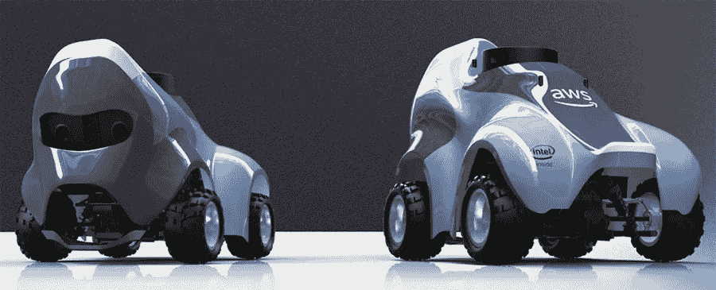
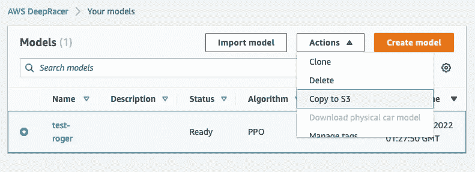
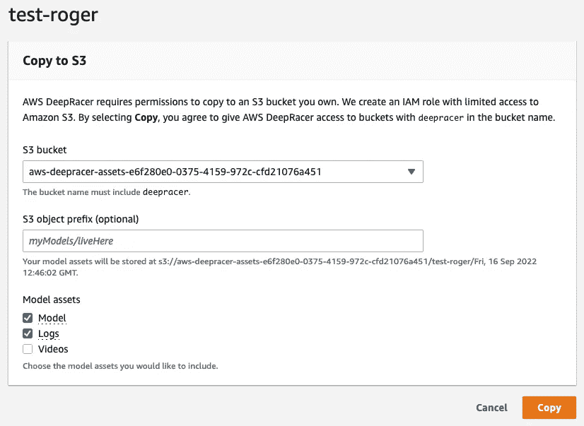
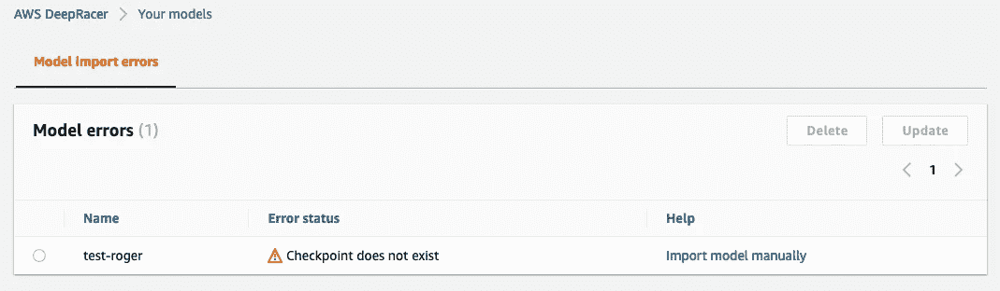
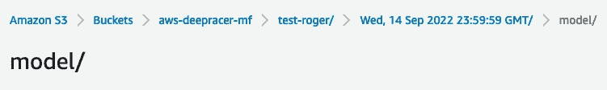

# AWS DeepRacer 提示:模型管理

> 原文：<https://medium.com/mlearning-ai/aws-deepracer-tips-model-management-c37cb74ca329?source=collection_archive---------2----------------------->

AWS DeepRacer Car

如果你打开这篇文章，你对 AWS DeepRacer 很熟悉，或者可能已经尝试过并被它所吸引。

我不会讨论 AWS DeepRacer 是什么。这篇文章是关于你如何管理有限的空间来存储我们的模型。AWS DeepRacer 有很多赛道(或者我们称之为一个世界)，我们可能需要为每个赛道设计一个特定的模型。我们的型号越多，需要支付的仓储费就越多。虽然免费层可用，但仅在前 30 天提供。

# 在 S3 出口

每个型号都有 300–500 MB 的大小，不算小。我们需要为 2 个型号平均每月支付 0.023 美元。如果我们有 100 个模型，那么我们需要每月支付大约 1.15 美元。如果我们将这些模型存储在 S3 不经常访问的地方，如 glacier，我们只需为每 2 个模型每月支付 0.005 美元。这意味着我们每月每 100 台机型只需支付大约 0.25 美元。

在 S3 存储模型的另一个优点是组织性。您可以根据自己的喜好来构建存储文件夹，这样您可以更轻松地找到、分析或进行进一步的培训。让我快速向您展示如何导出到您的模型:

选择您的型号，然后单击复制到 S3

然后，您可以创建一个新的存储桶或选择现有的存储桶。需要复制的重要部分是模型和日志。单击复制，然后导出过程将开始。之后，您可以从 AWS DeepRacer 控制台删除您的模型。

# 进口技术

模特培训可能很贵。完善一个模型需要大量的训练时间。AWS DeepRacer 的培训和评估价格为每小时 3.5 美元。如果模型需要 50 个小时，那么一个模型就是 175 美元。有很多开发商花了几百甚至几千美元。

这个问题的答案之一是在 [deepracer-for-cloud](https://aws-deepracer-community.github.io/deepracer-for-cloud/) 上本地运行培训。您的问题可能是如何将本地训练的模型导入 AWS。答案是相同的模型出口到 S3，然后进口到 DeepRacer。这是同样的技术进口模型，我们出口到 S3。

从 S3 进口相当简单。但是，我想强调一些容易被忽略的东西。

正如您在上面看到的，当您选择了错误的文件夹时，将会返回这个错误。因此，**不选择模型文件夹。**

选择文件夹 Wed，14 sep 2022 23:59:59 GMT 否则将返回检查点不存在错误。

一旦模型成功导入，您就可以运行评估并提交给比赛。一路平安！

那都是我送的。如果你正在寻找另一个话题，比如 android 开发，请访问 [amaysim 博客](https://www.amaysim.technology/blog/a4fog8tyd88jlnymkl8jc43r49dqrq)。下一场见。

 [## Mlearning.ai 提交建议

### 如何成为 Mlearning.ai 上的作家

medium.com](/mlearning-ai/mlearning-ai-submission-suggestions-b51e2b130bfb)