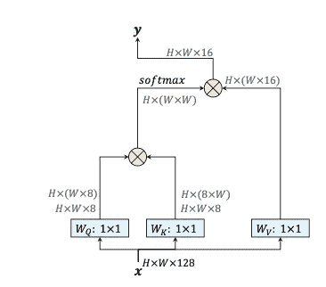
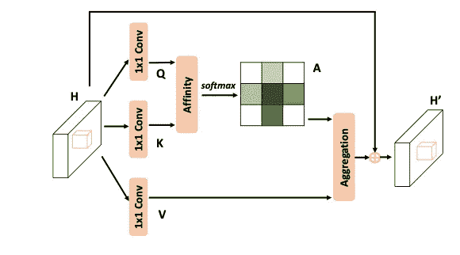

# CNN 中的轴向自我关注——高效而优雅

> 原文：<https://medium.com/mlearning-ai/axial-self-attention-in-cnn-efficient-and-elegant-85d8ce2ca8eb?source=collection_archive---------0----------------------->

Photo by [Atle Mo](https://unsplash.com/@atlemo?utm_source=medium&utm_medium=referral) on [Unsplash](https://unsplash.com?utm_source=medium&utm_medium=referral)

注意:这篇文章试图通过忽略一些细节，用最少的精力让你直观地理解这个主题。

# 目录

🔥[CNN](#97a2)中的自我关注
🔥[轴向注意块](#16cf)🔥[总结](#1a2a)
∘ [奖金:官方 PyTorch 实施](#3a6a)
[引用](#8340)

# 🔥CNN 中的自我关注

卷积神经网络(**CNN**)非常适合利用局部特征。然而，他们通常**不能探索长范围的特征**。然而，**自我关注**机制**无法探索局部特征**却非常适合探索长期特征。因此，自我关注模块被广泛地**与**CNN 模块相结合，以探索**短距离和长距离信息。**

Fig. 1: Standard self-attention module in CNN [H. Wang et al.] “Circled X” denotes matrix multiplication, and “Circled +” denotes element-wise sum.

最近，已经提出了纯粹的**堆叠**自我注意模块以探索长范围特征，并且将局部约束应用于自我注意模块以探索短范围特征，并且显示了有希望的结果。

然而，将局部约束应用于自我注意**会限制感受野**，这在图像分割任务中是不可接受的，因为它需要高分辨率输入。

❗️Therefore，提出了轴向注意，它允许**高效的计算和丰富的感受域**，解决了普通自注意模块的缺点。

# 🔥轴向注意阻滞

用一句话概括

> **轴向注意将 2D 注意分解为沿高度轴和宽度轴的两个 1D 注意。**

具体来说，轴向注意不是像大多数自我注意块那样首先展平多维输入，而是一次沿着特征图的单个轴应用自我注意**，然后**组合多个轴的注意图**以实现全局感受野。这样做也可能导致输出维度与输入维度相同。**

因此，它比传统的自我注意模块在计算上更有效，但仍能保持全局感受野。

Fig. 2: Types of Axial Attention layers used in the Axial Transformer. **Blue is the receptive field of the output red.** By combining row-wise and column-wise, and potentially channel-wise, self-attention, the output could retain the original input dimension.

在轴向变压器中，轴向注意层有**三种主要类型**(*两种类型及其各自的子类型如图 3* 所示)，即**行向注意、列向注意、**和**通道向注意。**

实际上，如上所述，它们经常被堆叠在一起以获得一个全局感受野。

Fig. 3: Axial self-attention module illustrated in the CCNet paper [Z. Huang et al.].

轴向自我关注模块的流水线如图 3 所示。 **H** 是特征图。 **A** 是轴向关注块。**H’**是施加轴向注意后的特征图。**亲和**操作是一种特殊类型的转化(*不是三言两语能解释清楚的，不知道的请随意看* [*本视频*](https://www.youtube.com/watch?v=E3Phj6J287o) )。**聚合**就是简单的元素求和。

# 🔥摘要

通过提出轴向注意，基于注意的 CNN 现在可以更有效地处理图像，同时仍然保留全局感受野，这解决了传统自我注意模块的问题。通过应用轴向注意力，出现了某些架构，例如 CCNet、轴向变压器和轴向深度实验室。他们都表现出了卓越的性能和当时接近最先进的结果(*然而，这些在本文中不会展开*)。

## 谢谢你！❤️

## 如果你觉得这篇文章对你有帮助，请考虑给我们投赞成票！❤️

## 奖励:PyTorch 官方实现

 [## GitHub-luci drains/Axial-attention:实现轴向注意力-关注…

### Pytorch 中轴向注意的实现。处理多维数据的简单而强大的技术…

github.com](https://github.com/lucidrains/axial-attention) 

# 引用

[1] [多维变形金刚中的轴向注意力](https://arxiv.org/pdf/1912.12180.pdf)

 [## Mlearning.ai 提交建议

### 如何成为 Mlearning.ai 上的作家

medium.com](/mlearning-ai/mlearning-ai-submission-suggestions-b51e2b130bfb)